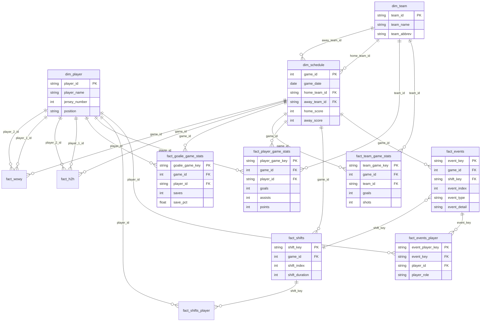

# BenchSight Database Schema & ERD

## Entity Relationship Diagram (Text Format)

```
┌─────────────────────────────────────────────────────────────────────────────────┐
│                           BENCHSIGHT DATA MODEL                                  │
│                              Star Schema Design                                  │
└─────────────────────────────────────────────────────────────────────────────────┘

                              DIMENSION TABLES
    ┌──────────────────┐    ┌──────────────────┐    ┌──────────────────┐
    │    dim_player    │    │    dim_team      │    │  dim_schedule    │
    ├──────────────────┤    ├──────────────────┤    ├──────────────────┤
    │ PK: player_id    │    │ PK: team_id      │    │ PK: game_id      │
    │    player_name   │    │    team_name     │    │    game_date     │
    │    jersey_number │    │    team_abbrev   │    │ FK: home_team_id │
    │    position      │    │    division      │    │ FK: away_team_id │
    │    shoots        │    │    conference    │    │    home_score    │
    └────────┬─────────┘    └────────┬─────────┘    │    away_score    │
             │                       │              │    venue         │
             │                       │              └────────┬─────────┘
             │                       │                       │
             ▼                       ▼                       ▼
┌────────────────────────────────────────────────────────────────────────────────┐
│                              FACT TABLES                                        │
└────────────────────────────────────────────────────────────────────────────────┘

┌─────────────────────────┐          ┌─────────────────────────┐
│     fact_events         │          │   fact_events_player    │
│     (Wide Format)       │          │    (Long Format)        │
├─────────────────────────┤          ├─────────────────────────┤
│ PK: event_key           │◄────────►│ PK: event_player_key    │
│ FK: game_id             │          │ FK: event_key           │
│ FK: shift_key           │          │ FK: game_id             │
│    event_index          │          │ FK: player_id           │
│    period               │          │    player_role          │
│    event_start_seconds  │          │    event_type           │
│    event_type           │          │    event_detail         │
│    event_detail         │          │    play_detail1         │
│    event_detail_2       │          │    linked_event_index   │
│    event_successful     │          └─────────────────────────┘
│    event_team_player_1  │
│    opp_team_player_1    │
│    linked_event_index   │
│    empty_net_goal       │
└─────────────────────────┘

┌─────────────────────────┐          ┌─────────────────────────┐
│     fact_shifts         │          │  fact_shifts_player     │
├─────────────────────────┤          ├─────────────────────────┤
│ PK: shift_key           │◄────────►│ PK: shift_player_key    │
│ FK: game_id             │          │ FK: shift_key           │
│    shift_index          │          │ FK: game_id             │
│    period               │          │ FK: player_id           │
│    shift_start_seconds  │          │    position_slot        │
│    shift_end_seconds    │          │    is_goalie            │
│    shift_duration       │          └─────────────────────────┘
│    home_team_en         │
│    away_team_en         │
│    home_1..home_6       │
│    away_1..away_6       │
│    situation            │
│    strength             │
└─────────────────────────┘

┌─────────────────────────┐          ┌─────────────────────────┐
│ fact_player_game_stats  │          │  fact_team_game_stats   │
├─────────────────────────┤          ├─────────────────────────┤
│ PK: player_game_key     │          │ PK: team_game_key       │
│ FK: game_id             │          │ FK: game_id             │
│ FK: player_id           │          │ FK: team_id             │
│ FK: team_id             │          │    team_name            │
│    player_name          │          │    venue (Home/Away)    │
│    goals                │          │    goals                │
│    assists              │          │    shots                │
│    points               │          │    sog                  │
│    shots                │          │    fo_wins              │
│    sog                  │          │    fo_losses            │
│    shooting_pct         │          │    fo_pct               │
│    fo_wins              │          │    pass_attempts        │
│    fo_losses            │          │    pass_completed       │
│    fo_pct               │          │    pass_pct             │
│    zone_entries         │          │    giveaways            │
│    zone_entry_control%  │          │    takeaways            │
│    pass_attempts        │          │    shooting_pct         │
│    pass_completed       │          └─────────────────────────┘
│    pass_pct             │
│    giveaways            │
│    takeaways            │
│    shift_count          │
│    logical_shifts       │
│    toi_seconds          │
│    avg_shift_seconds    │
└─────────────────────────┘

┌─────────────────────────┐
│ fact_goalie_game_stats  │
├─────────────────────────┤
│ PK: goalie_game_key     │
│ FK: game_id             │
│ FK: player_id           │
│    player_name          │
│    team_name            │
│    saves                │
│    goals_against        │
│    shots_against        │
│    save_pct             │
│    toi_seconds          │
│    empty_net_ga         │
│    saves_rebound        │
│    saves_freeze         │
│    saves_glove          │
│    saves_blocker        │
│    saves_left_pad       │
│    saves_right_pad      │
│    rebound_control_pct  │
└─────────────────────────┘

┌─────────────────────────┐          ┌─────────────────────────┐
│      fact_h2h           │          │      fact_wowy          │
│  (Head-to-Head)         │          │ (With Or Without You)   │
├─────────────────────────┤          ├─────────────────────────┤
│ PK: h2h_key             │          │ PK: wowy_key            │
│ FK: game_id             │          │ FK: game_id             │
│ FK: player_1_id         │          │ FK: player_1_id         │
│ FK: player_2_id         │          │ FK: player_2_id         │
│    player_1_team        │          │    (same team)          │
│    player_2_team        │          │    shifts_with          │
│    (opposite teams)     │          │    shifts_without       │
│    shifts_together      │          │    cf_with              │
│    toi_together         │          │    ca_with              │
│    gf                   │          │    cf_without           │
│    ga                   │          │    ca_without           │
│    cf                   │          │    cf_pct_with          │
│    ca                   │          │    cf_pct_without       │
│    cf_pct               │          │    cf_pct_diff          │
│    xgf                  │          └─────────────────────────┘
│    xga                  │
└─────────────────────────┘
```

## Primary Key Formats

All primary keys follow standardized formats:

| Table | Key Format | Example |
|-------|------------|---------|
| fact_events | `E{game_id}{event_index:05d}` | `E1896900001` |
| fact_events_player | `EP{game_id}{event_index:05d}` | `EP1896900001` |
| fact_shifts | `S{game_id}{shift_index:05d}` | `S1896900001` |
| fact_shifts_player | `SP{game_id}{shift_index:05d}` | `SP1896900001` |
| fact_player_game_stats | `PG{game_id}{player_id}` | `PG18969P100192` |
| fact_team_game_stats | `TG{game_id}{team_abbrev}` | `TG18969PLA` |
| fact_goalie_game_stats | `GG{game_id}{player_id}` | `GG18969P100099` |
| fact_h2h | `H2H{game_id}{p1_id}{p2_id}` | `H2H18969P100192P100001` |
| fact_wowy | `WOWY{game_id}{p1_id}{p2_id}` | `WOWY18969P100192P100025` |

## Foreign Key Relationships

```
fact_events.game_id ──────────────► dim_schedule.game_id
fact_events.shift_key ────────────► fact_shifts.shift_key
fact_events_player.event_key ─────► fact_events.event_key
fact_events_player.player_id ─────► dim_player.player_id
fact_shifts.game_id ──────────────► dim_schedule.game_id
fact_shifts_player.shift_key ─────► fact_shifts.shift_key
fact_shifts_player.player_id ─────► dim_player.player_id
fact_player_game_stats.game_id ───► dim_schedule.game_id
fact_player_game_stats.player_id ─► dim_player.player_id
fact_player_game_stats.team_id ───► dim_team.team_id
fact_team_game_stats.game_id ─────► dim_schedule.game_id
fact_team_game_stats.team_id ─────► dim_team.team_id
fact_goalie_game_stats.game_id ───► dim_schedule.game_id
fact_goalie_game_stats.player_id ─► dim_player.player_id
fact_h2h.game_id ─────────────────► dim_schedule.game_id
fact_h2h.player_1_id ─────────────► dim_player.player_id
fact_h2h.player_2_id ─────────────► dim_player.player_id
fact_wowy.game_id ────────────────► dim_schedule.game_id
fact_wowy.player_1_id ────────────► dim_player.player_id
fact_wowy.player_2_id ────────────► dim_player.player_id
```

## Table Row Counts (Typical Game)

| Table | Rows per Game | Notes |
|-------|---------------|-------|
| dim_player | ~30 | Both teams' rosters |
| dim_team | 2 | Home + Away |
| dim_schedule | 1 | One row per game |
| fact_events | ~400-600 | All events (deduplicated) |
| fact_events_player | ~1,200-1,800 | Multiple players per event |
| fact_shifts | ~140-180 | Shift segments |
| fact_shifts_player | ~1,400-1,800 | 10 players per shift |
| fact_player_game_stats | ~30 | One per player |
| fact_team_game_stats | 2 | One per team |
| fact_goalie_game_stats | 2 | One per goalie |
| fact_h2h | ~200-400 | Opponent pairs |
| fact_wowy | ~100-200 | Teammate pairs |

## Data Types

### Common Column Types

| Column Pattern | Data Type | Example |
|----------------|-----------|---------|
| `*_key` | VARCHAR(20) | `E1896900001` |
| `*_id` | VARCHAR(10) | `P100192` |
| `game_id` | INTEGER | `18969` |
| `*_index` | INTEGER | `1001` |
| `*_seconds` | INTEGER | `1080` |
| `*_pct` | DECIMAL(5,2) | `55.50` |
| `*_name` | VARCHAR(100) | `John Smith` |
| `event_type` | VARCHAR(50) | `Shot` |
| `event_detail` | VARCHAR(100) | `Shot_OnNetSaved` |
| `event_successful` | CHAR(1) | `s` or `u` |

## Indexes (Recommended)

```sql
-- Primary indexes (automatic on PKs)
CREATE INDEX idx_events_game ON fact_events(game_id);
CREATE INDEX idx_events_type ON fact_events(event_type);
CREATE INDEX idx_events_player ON fact_events_player(player_id);
CREATE INDEX idx_shifts_game ON fact_shifts(game_id);
CREATE INDEX idx_player_stats_game ON fact_player_game_stats(game_id);
CREATE INDEX idx_player_stats_player ON fact_player_game_stats(player_id);
CREATE INDEX idx_team_stats_game ON fact_team_game_stats(game_id);
CREATE INDEX idx_goalie_stats_game ON fact_goalie_game_stats(game_id);
```

## Mermaid ERD (for rendering)



---

*Document Version: 1.0 | Last Updated: December 2024*
