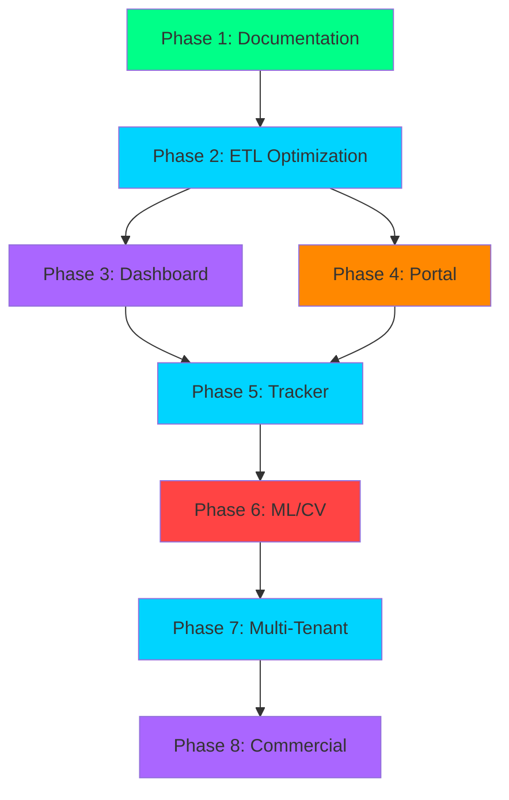

# BenchSight Master Implementation Plan

**Detailed phased implementation plan with PR/commit structure for all components**

Last Updated: 2026-01-21
Version: 2.00

---

## Overview

This document provides a comprehensive, phase-by-phase implementation plan for the complete BenchSight project, from MVP to commercial launch. Each phase includes:

- Objectives and goals
- Detailed task breakdown
- PR/commit structure
- Dependencies
- Acceptance criteria
- Timeline estimates

**Total Timeline:** 48 weeks (MVP: 16 weeks, Commercial: 32 weeks)

---

## Table of Contents

1. [Phase 1: Foundation & Documentation (Weeks 1-4)](#phase-1-foundation--documentation-weeks-1-4)
2. [Phase 2: ETL Optimization (Weeks 5-8)](#phase-2-etl-optimization-weeks-5-8)
3. [Phase 3: Dashboard Enhancement (Weeks 9-12)](#phase-3-dashboard-enhancement-weeks-9-12)
4. [Phase 4: Portal Development (Weeks 13-16)](#phase-4-portal-development-weeks-13-16)
5. [Phase 5: Tracker Conversion (Weeks 17-24)](#phase-5-tracker-conversion-weeks-17-24)
6. [Phase 6: ML/CV Integration (Weeks 25-32)](#phase-6-mlcv-integration-weeks-25-32)
7. [Phase 7: Multi-Tenancy & Scalability (Weeks 33-40)](#phase-7-multi-tenancy--scalability-weeks-33-40)
8. [Phase 8: Commercial Launch Prep (Weeks 41-48)](#phase-8-commercial-launch-prep-weeks-41-48)

---

## Phase 1: Foundation & Documentation (Weeks 1-4)

**Status:** ✅ COMPLETE  
**Timeline:** Weeks 1-4  
**Objectives:** Establish foundation, consolidate documentation, create data dictionary

### Week 1: Documentation Consolidation

**Objectives:**
- Clean up and organize all documentation
- Create reference structure
- Archive outdated content

**Tasks:**

1. **Review and Organize Documentation**
   - [x] Review `docs/Review/` folder
   - [x] Identify unique content
   - [x] Archive outdated files
   - [x] Organize reference materials

2. **Create Reference Structure**
   - [x] Create `docs/reference/` structure
   - [x] Move inspiration materials
   - [x] Create wireframe documentation
   - [x] Organize research papers

**PRs:**
- `docs/cleanup-review-folder` - Archive Review folder content
- `docs/create-reference-structure` - Create reference documentation structure

**Commits:**
```
[DOCS] Archive Review folder content
[DOCS] Create reference/inspiration structure
[DOCS] Convert inspiration materials to markdown
[DOCS] Create wireframe documentation
```

### Week 2: Data Dictionary Creation

**Objectives:**
- Create comprehensive data dictionary
- Document all tables and columns
- Extract calculation formulas

**Tasks:**

1. **Create Data Dictionary Structure**
   - [x] Create `docs/data/DATA_DICTIONARY.md`
   - [x] Define table-level metadata format
   - [x] Define column-level metadata format

2. **Extract Calculation Formulas**
   - [x] Document xG calculations
   - [x] Document WAR/GAR calculations
   - [x] Document Corsi/Fenwick calculations
   - [x] Document Game Score calculations

**PRs:**
- `docs/create-data-dictionary` - Create comprehensive data dictionary

**Commits:**
```
[DOCS] Create data dictionary structure
[DOCS] Document BLB tables metadata
[DOCS] Document tracking tables metadata
[DOCS] Document calculated tables metadata
[DOCS] Extract and document xG calculation formulas
[DOCS] Extract and document WAR/GAR calculation formulas
[DOCS] Extract and document Corsi/Fenwick formulas
[DOCS] Document business rules and filter contexts
```

### Week 3: Master Roadmap Enhancement

**Objectives:**
- Add commercial context to roadmap
- Create roadmap visuals
- Update project vision

**Tasks:**

1. **Add Commercial Context**
   - [x] Add project vision section
   - [x] Add market context
   - [x] Add commercial roadmap
   - [x] Add success metrics

2. **Create Roadmap Visuals**
   - [x] Create timeline Gantt chart
   - [x] Create component dependency graph
   - [x] Create feature roadmap diagram
   - [x] Create critical path visualization

**PRs:**
- `docs/enhance-master-roadmap` - Add commercial context and visuals

**Commits:**
```
[DOCS] Add commercial context to master roadmap
[DOCS] Add project vision and market context
[DOCS] Create roadmap visual diagrams
[DOCS] Add commercial success metrics
```

### Week 4: Implementation Plan Creation

**Objectives:**
- Create detailed implementation plan
- Define PR/commit structure
- Document tech stack roadmap

**Tasks:**

1. **Create Implementation Plan**
   - [x] Create `docs/MASTER_IMPLEMENTATION_PLAN.md`
   - [x] Break down all phases
   - [x] Define PR/commit structure
   - [x] Document dependencies

**PRs:**
- `docs/create-implementation-plan` - Create master implementation plan

**Commits:**
```
[DOCS] Create master implementation plan structure
[DOCS] Document Phase 1-4 implementation details
[DOCS] Document Phase 5-8 implementation details
[DOCS] Define PR and commit structure templates
```

**Acceptance Criteria:**
- [x] All documentation consolidated
- [x] Data dictionary complete
- [x] Master roadmap includes commercial context
- [x] Implementation plan created
- [x] All visuals created

---

## Phase 2: ETL Optimization (Weeks 5-8)

**Status:** 🚧 IN PROGRESS  
**Timeline:** Weeks 5-8  
**Objectives:** Clean up ETL code, optimize performance, verify tables

### Week 5: Code Cleanup and Refactoring

**Objectives:**
- Modularize `base_etl.py` (4,400 lines → smaller modules)
- Improve code organization
- Enhance error handling

**Tasks:**

1. **Analyze Current Structure**
   - [ ] Review `src/core/base_etl.py` structure
   - [ ] Identify logical modules
   - [ ] Document dependencies

2. **Create Module Structure**
   - [ ] Create `src/core/etl_phases/` directory
   - [ ] Extract Phase 1 logic → `phase1_blb_loader.py`
   - [ ] Extract Phase 3 logic → `phase3_tracking_processor.py`
   - [ ] Extract derived columns → `derived_columns.py`
   - [ ] Extract validation → `validation.py`

**PRs:**
- `refactor/modularize-base-etl` - Split base_etl.py into modules

**Commits:**
```
[REFACTOR] Analyze base_etl.py structure
[REFACTOR] Create etl_phases directory structure
[REFACTOR] Extract Phase 1 BLB loading logic
[REFACTOR] Extract Phase 3 tracking processing logic
[REFACTOR] Extract derived columns calculation
[REFACTOR] Extract validation logic
[REFACTOR] Update imports and dependencies
[TEST] Add tests for refactored modules
```

**Acceptance Criteria:**
- `base_etl.py` reduced to < 500 lines
- All functionality preserved
- Tests pass
- ETL still generates 139 tables

### Week 6: Performance Optimization

**Objectives:**
- Vectorize pandas operations
- Remove all `.iterrows()` usage
- Optimize table creation

**Tasks:**

1. **Identify Performance Bottlenecks**
   - [ ] Profile ETL execution
   - [ ] Identify slow operations
   - [ ] Find `.iterrows()` usage

2. **Vectorize Operations**
   - [ ] Replace `.iterrows()` with vectorized operations
   - [ ] Optimize groupby operations
   - [ ] Optimize merge operations
   - [ ] Add caching where appropriate

**PRs:**
- `perf/vectorize-pandas-operations` - Remove iterrows, vectorize operations
- `perf/optimize-table-creation` - Optimize table creation performance

**Commits:**
```
[PERF] Profile ETL execution to identify bottlenecks
[PERF] Replace iterrows with vectorized operations in core_facts.py
[PERF] Optimize groupby operations in shift_analytics.py
[PERF] Optimize merge operations in remaining_facts.py
[PERF] Add caching for dimension table lookups
[PERF] Optimize memory usage in large table operations
[TEST] Verify performance improvements (target: < 60s for 4 games)
```

**Acceptance Criteria:**
- No `.iterrows()` usage in codebase
- ETL completes in < 60 seconds for 4 games
- All tests pass
- Data integrity maintained

### Week 7: Table Verification

**Objectives:**
- Verify all 139 tables have data
- Identify unused tables
- Validate table relationships

**Tasks:**

1. **Table Verification**
   - [ ] Create verification script
   - [ ] Check all tables have data
   - [ ] Verify foreign key relationships
   - [ ] Identify empty/unused tables

2. **Documentation Update**
   - [ ] Update table manifest
   - [ ] Document unused tables
   - [ ] Update data dictionary

**PRs:**
- `etl/verify-all-tables` - Verify all tables and relationships

**Commits:**
```
[ETL] Create table verification script
[ETL] Verify all 139 tables have data
[ETL] Verify foreign key relationships
[ETL] Identify and document unused tables
[DOCS] Update table manifest with verification results
```

**Acceptance Criteria:**
- All active tables verified
- Foreign keys validated
- Unused tables documented
- Verification script added to CI

### Week 8: Calculation Validation

**Objectives:**
- Validate all calculations
- Verify goal counting accuracy
- Test edge cases

**Tasks:**

1. **Calculation Validation**
   - [ ] Validate xG calculations
   - [ ] Validate WAR/GAR calculations
   - [ ] Validate Corsi/Fenwick calculations
   - [ ] Validate Game Score calculations

2. **Goal Counting Verification**
   - [ ] Verify goal counts match official
   - [ ] Test goal counting edge cases
   - [ ] Document goal counting rules

**PRs:**
- `etl/validate-calculations` - Validate all calculation formulas

**Commits:**
```
[ETL] Add calculation validation tests
[ETL] Validate xG calculation accuracy
[ETL] Validate WAR/GAR calculation accuracy
[ETL] Validate Corsi/Fenwick calculation accuracy
[ETL] Verify goal counting matches official counts
[ETL] Test calculation edge cases
[DOCS] Document calculation validation results
```

**Acceptance Criteria:**
- All calculations validated
- Goal counts match official
- Edge cases handled
- Validation tests added

---

## Phase 3: Dashboard Enhancement (Weeks 9-12)

**Status:** 📋 PLANNED  
**Timeline:** Weeks 9-12  
**Objectives:** Enhance UI/UX, add advanced analytics pages, optimize performance

### Week 9: UI/UX Improvements

**Objectives:**
- Enhance visualizations
- Improve mobile responsiveness
- Polish user interface

**Tasks:**

1. **Enhanced Visualizations**
   - [ ] Add more chart types
   - [ ] Improve shot maps
   - [ ] Add trend visualizations
   - [ ] Enhance leaderboards

2. **Mobile Optimization**
   - [ ] Test mobile responsiveness
   - [ ] Fix mobile layout issues
   - [ ] Optimize mobile performance
   - [ ] Add mobile-specific features

**PRs:**
- `dashboard/enhance-visualizations` - Add new chart types and visualizations
- `dashboard/mobile-optimization` - Improve mobile responsiveness

**Commits:**
```
[FEAT] Add trend line charts to player pages
[FEAT] Enhance shot map visualization
[FEAT] Add heatmap visualizations
[FEAT] Improve leaderboard design
[FEAT] Add mobile-responsive navigation
[FEAT] Optimize mobile table layouts
[PERF] Optimize chart rendering for mobile
[FEAT] Add mobile-specific filters
```

**Acceptance Criteria:**
- All pages mobile-responsive
- New visualizations added
- Performance acceptable on mobile
- User testing feedback positive

### Week 10: Advanced Analytics Pages

**Objectives:**
- Complete xG analysis page
- Complete WAR/GAR analysis page
- Add RAPM analysis

**Tasks:**

1. **xG Analysis Page**
   - [ ] Create xG analysis page
   - [ ] Add xG visualizations
   - [ ] Add xG breakdowns
   - [ ] Add finishing skill metrics

2. **WAR/GAR Analysis Page**
   - [ ] Create WAR/GAR analysis page
   - [ ] Add component breakdowns
   - [ ] Add WAR rankings
   - [ ] Add WAR trends

**PRs:**
- `dashboard/xg-analysis-page` - Complete xG analysis page
- `dashboard/war-gar-analysis-page` - Complete WAR/GAR analysis page

**Commits:**
```
[FEAT] Create xG analysis page component
[FEAT] Add xG shot quality visualization
[FEAT] Add xG vs goals comparison charts
[FEAT] Add finishing skill metrics display
[FEAT] Create WAR/GAR analysis page component
[FEAT] Add GAR component breakdown charts
[FEAT] Add WAR rankings table
[FEAT] Add WAR trend visualizations
[FEAT] Add RAPM analysis section
```

**Acceptance Criteria:**
- xG analysis page complete
- WAR/GAR analysis page complete
- All visualizations working
- Data loads correctly

### Week 11: Search and Filter Integration

**Objectives:**
- Expand search/filter to all pages
- Improve filter UX
- Add advanced filtering

**Tasks:**

1. **Universal Search/Filter**
   - [ ] Add search to all pages
   - [ ] Standardize filter components
   - [ ] Add filter persistence
   - [ ] Add filter combinations

2. **Advanced Filtering**
   - [ ] Add date range filters
   - [ ] Add stat range filters
   - [ ] Add multi-select filters
   - [ ] Add saved filter presets

**PRs:**
- `dashboard/universal-search-filter` - Expand search/filter to all pages
- `dashboard/advanced-filtering` - Add advanced filtering options

**Commits:**
```
[FEAT] Create reusable search component
[FEAT] Create reusable filter component
[FEAT] Add search to all player pages
[FEAT] Add search to all team pages
[FEAT] Add filter persistence (localStorage)
[FEAT] Add date range filter
[FEAT] Add stat range filters
[FEAT] Add multi-select filters
[FEAT] Add saved filter presets
```

**Acceptance Criteria:**
- Search on all pages
- Filters standardized
- Filter persistence working
- Advanced filters functional

### Week 12: Export Functionality Expansion

**Objectives:**
- Add export to more pages
- Support multiple formats
- Add batch export

**Tasks:**

1. **Export Expansion**
   - [ ] Add CSV export to all tables
   - [ ] Add Excel export option
   - [ ] Add PDF export for reports
   - [ ] Add export to all pages

2. **Batch Export**
   - [ ] Add multi-table export
   - [ ] Add scheduled exports
   - [ ] Add export history

**PRs:**
- `dashboard/export-expansion` - Add export to all pages
- `dashboard/batch-export` - Add batch export functionality

**Commits:**
```
[FEAT] Add CSV export to player pages
[FEAT] Add CSV export to team pages
[FEAT] Add Excel export option
[FEAT] Add PDF export for reports
[FEAT] Create reusable export component
[FEAT] Add multi-table export
[FEAT] Add export history tracking
[FEAT] Add export scheduling
```

**Acceptance Criteria:**
- Export on all pages
- Multiple formats supported
- Batch export working
- Export history functional

---

## Phase 4: Portal Development (Weeks 13-16)

**Status:** 📋 PLANNED  
**Timeline:** Weeks 13-16  
**Objectives:** Complete portal API integration, add game management, data browser

### Week 13: API Integration

**Objectives:**
- Replace placeholder functions with real API calls
- Implement ETL trigger functionality
- Add status polling

**Tasks:**

1. **ETL Control Integration**
   - [ ] Connect ETL trigger button
   - [ ] Implement status polling
   - [ ] Add progress display
   - [ ] Add error handling

2. **Upload Integration**
   - [ ] Connect upload functionality
   - [ ] Add upload progress
   - [ ] Add upload status

**PRs:**
- `portal/etl-api-integration` - Connect ETL controls to API
- `portal/upload-api-integration` - Connect upload to API

**Commits:**
```
[FEAT] Replace placeholder ETL trigger function
[FEAT] Implement ETL status polling
[FEAT] Add ETL progress bar
[FEAT] Add ETL error handling
[FEAT] Connect upload to Supabase API
[FEAT] Add upload progress tracking
[FEAT] Add upload status display
[FEAT] Add upload error handling
```

**Acceptance Criteria:**
- ETL can be triggered from portal
- Status updates in real-time
- Upload functionality working
- Error handling robust

### Week 14: Game Management

**Objectives:**
- Add game list display
- Add game creation
- Add game editing

**Tasks:**

1. **Game List**
   - [ ] Connect to Supabase
   - [ ] Display game list
   - [ ] Add filters
   - [ ] Add search

2. **Game CRUD**
   - [ ] Add create game form
   - [ ] Add edit game form
   - [ ] Add delete game
   - [ ] Add validation

**PRs:**
- `portal/game-list-display` - Display games from Supabase
- `portal/game-crud` - Add game create/edit/delete

**Commits:**
```
[FEAT] Connect game list to Supabase
[FEAT] Display game list in portal
[FEAT] Add game filters
[FEAT] Add game search
[FEAT] Create game creation form
[FEAT] Create game edit form
[FEAT] Add game deletion with confirmation
[FEAT] Add game form validation
[FEAT] Add game status display
```

**Acceptance Criteria:**
- Game list displays correctly
- Can create games
- Can edit games
- Can delete games
- Validation working

### Week 15: Data Browser

**Objectives:**
- Add table list display
- Add table data browser
- Add table schema viewer

**Tasks:**

1. **Table List**
   - [ ] List all tables
   - [ ] Show table metadata
   - [ ] Add table filters

2. **Data Browser**
   - [ ] Browse table data
   - [ ] Add pagination
   - [ ] Add search/filter
   - [ ] Add export

**PRs:**
- `portal/table-list` - Display table list
- `portal/data-browser` - Add table data browser

**Commits:**
```
[FEAT] Create table list component
[FEAT] Display table metadata (row count, columns)
[FEAT] Add table filters
[FEAT] Create data browser component
[FEAT] Add table data pagination
[FEAT] Add table data search/filter
[FEAT] Add table schema viewer
[FEAT] Add table data export
```

**Acceptance Criteria:**
- Table list displays
- Can browse table data
- Pagination working
- Search/filter functional

### Week 16: Settings and Polish

**Objectives:**
- Add settings management
- Polish UI
- Add notifications

**Tasks:**

1. **Settings**
   - [ ] Add settings page
   - [ ] Save settings to localStorage/Supabase
   - [ ] Add user preferences
   - [ ] Add API configuration

2. **UI Polish**
   - [ ] Add loading states
   - [ ] Add error states
   - [ ] Add empty states
   - [ ] Add toast notifications

**PRs:**
- `portal/settings-management` - Add settings page
- `portal/ui-polish` - Polish UI and add notifications

**Commits:**
```
[FEAT] Create settings page
[FEAT] Add settings persistence
[FEAT] Add user preferences
[FEAT] Add API configuration
[FEAT] Add loading states to all actions
[FEAT] Add error state displays
[FEAT] Add empty state displays
[FEAT] Add toast notification system
[FEAT] Polish UI styling
```

**Acceptance Criteria:**
- Settings page functional
- Settings persist
- UI polished
- Notifications working

---

## Phase 5: Tracker Conversion (Weeks 17-24)

**Status:** 📋 PLANNED  
**Timeline:** Weeks 17-24 (8 weeks)  
**Objectives:** Convert HTML tracker to Rust/Next.js, maintain feature parity

### Week 17-18: Rust Backend Foundation

**Objectives:**
- Set up Rust project structure
- Implement core data models
- Create API endpoints

**Tasks:**

1. **Project Setup**
   - [ ] Initialize Rust project
   - [ ] Set up dependencies (Actix, SQLx, etc.)
   - [ ] Create project structure
   - [ ] Set up database connection

2. **Core Models**
   - [ ] Create Event model
   - [ ] Create Shift model
   - [ ] Create Game model
   - [ ] Create Player model

**PRs:**
- `tracker/rust-project-setup` - Initialize Rust backend project
- `tracker/rust-core-models` - Create core data models

**Commits:**
```
[FEAT] Initialize Rust backend project
[FEAT] Set up Actix web framework
[FEAT] Set up SQLx for database
[FEAT] Create project structure
[FEAT] Create Event data model
[FEAT] Create Shift data model
[FEAT] Create Game data model
[FEAT] Create Player data model
[FEAT] Set up database connection pool
```

### Week 19-20: Rust Backend Implementation

**Objectives:**
- Implement event tracking API
- Implement shift tracking API
- Implement state management

**Tasks:**

1. **Event Tracking**
   - [ ] Create event endpoints
   - [ ] Implement event validation
   - [ ] Implement event storage
   - [ ] Add event queries

2. **Shift Tracking**
   - [ ] Create shift endpoints
   - [ ] Implement shift validation
   - [ ] Implement shift storage
   - [ ] Add shift queries

**PRs:**
- `tracker/rust-event-api` - Implement event tracking API
- `tracker/rust-shift-api` - Implement shift tracking API

**Commits:**
```
[FEAT] Create POST /api/events endpoint
[FEAT] Create GET /api/events endpoint
[FEAT] Implement event validation
[FEAT] Implement event storage
[FEAT] Create POST /api/shifts endpoint
[FEAT] Create GET /api/shifts endpoint
[FEAT] Implement shift validation
[FEAT] Implement shift storage
[FEAT] Add event/shift queries with filters
```

### Week 21-22: Next.js Frontend

**Objectives:**
- Set up Next.js project
- Implement UI components
- Connect to Rust backend

**Tasks:**

1. **Project Setup**
   - [ ] Initialize Next.js project
   - [ ] Set up TypeScript
   - [ ] Set up Tailwind CSS
   - [ ] Set up API client

2. **UI Components**
   - [ ] Create event capture UI
   - [ ] Create shift tracking UI
   - [ ] Create video sync UI
   - [ ] Create rink visualization

**PRs:**
- `tracker/nextjs-project-setup` - Initialize Next.js frontend
- `tracker/nextjs-ui-components` - Create UI components

**Commits:**
```
[FEAT] Initialize Next.js project
[FEAT] Set up TypeScript configuration
[FEAT] Set up Tailwind CSS
[FEAT] Create API client for Rust backend
[FEAT] Create event capture component
[FEAT] Create shift tracking component
[FEAT] Create video sync component
[FEAT] Create rink visualization component
[FEAT] Implement state management (Zustand)
```

### Week 23: Feature Parity Testing

**Objectives:**
- Test all HTML tracker features
- Ensure feature parity
- Fix any gaps

**Tasks:**

1. **Feature Testing**
   - [ ] Test all event types
   - [ ] Test shift tracking
   - [ ] Test video integration
   - [ ] Test XY positioning
   - [ ] Test export functionality

2. **Bug Fixes**
   - [ ] Fix any feature gaps
   - [ ] Fix performance issues
   - [ ] Fix UI/UX issues

**PRs:**
- `tracker/feature-parity-testing` - Test and fix feature parity

**Commits:**
```
[TEST] Test all event types in new tracker
[TEST] Test shift tracking functionality
[TEST] Test video integration
[TEST] Test XY positioning
[TEST] Test export functionality
[FIX] Fix event type X not working
[FIX] Fix shift duration calculation
[FIX] Fix video sync timing
[PERF] Optimize event capture performance
```

### Week 24: Performance Optimization

**Objectives:**
- Optimize backend performance
- Optimize frontend performance
- Add caching

**Tasks:**

1. **Backend Optimization**
   - [ ] Optimize database queries
   - [ ] Add connection pooling
   - [ ] Add response caching
   - [ ] Optimize serialization

2. **Frontend Optimization**
   - [ ] Optimize component rendering
   - [ ] Add code splitting
   - [ ] Optimize bundle size
   - [ ] Add service worker

**PRs:**
- `tracker/performance-optimization` - Optimize tracker performance

**Commits:**
```
[PERF] Optimize database queries
[PERF] Add connection pooling
[PERF] Add response caching (Redis)
[PERF] Optimize JSON serialization
[PERF] Optimize React component rendering
[PERF] Add code splitting
[PERF] Optimize bundle size
[FEAT] Add service worker for offline support
```

**Acceptance Criteria:**
- All HTML tracker features working
- Performance better than HTML version
- No regressions
- Ready for production

---

## Phase 6: ML/CV Integration (Weeks 25-32)

**Status:** 📋 PLANNED  
**Timeline:** Weeks 25-32 (8 weeks)  
**Objectives:** Integrate ML/CV for automated goal detection, player tracking, event classification

### Week 25-26: Video Processing Pipeline

**Objectives:**
- Set up video processing infrastructure
- Implement video ingestion
- Create video storage

**Tasks:**

1. **Infrastructure Setup**
   - [ ] Set up video processing service
   - [ ] Set up video storage (S3/Cloudflare)
   - [ ] Set up video transcoding
   - [ ] Create video API endpoints

2. **Video Ingestion**
   - [ ] Create video upload endpoint
   - [ ] Implement video validation
   - [ ] Implement video processing queue
   - [ ] Add video metadata storage

**PRs:**
- `ml/video-processing-setup` - Set up video processing infrastructure
- `ml/video-ingestion` - Implement video upload and processing

**Commits:**
```
[FEAT] Set up video processing service (FFmpeg)
[FEAT] Set up video storage (S3)
[FEAT] Create video upload API endpoint
[FEAT] Implement video validation
[FEAT] Create video processing queue (Celery)
[FEAT] Add video metadata storage
[FEAT] Implement video transcoding
[FEAT] Add video thumbnail generation
```

### Week 27-28: Goal Detection Model

**Objectives:**
- Train goal detection model
- Integrate with tracker
- Test accuracy

**Tasks:**

1. **Model Development**
   - [ ] Collect training data
   - [ ] Train goal detection model (YOLO/ResNet)
   - [ ] Validate model accuracy
   - [ ] Optimize model performance

2. **Integration**
   - [ ] Create goal detection API
   - [ ] Integrate with tracker
   - [ ] Add manual override
   - [ ] Add confidence scoring

**PRs:**
- `ml/goal-detection-model` - Train and integrate goal detection
- `ml/goal-detection-api` - Create goal detection API

**Commits:**
```
[FEAT] Collect goal detection training data
[FEAT] Train YOLO goal detection model
[FEAT] Validate model accuracy (>90%)
[FEAT] Optimize model inference speed
[FEAT] Create goal detection API endpoint
[FEAT] Integrate goal detection with tracker
[FEAT] Add manual goal override
[FEAT] Add confidence score display
[FEAT] Add goal detection accuracy metrics
```

### Week 29-30: Player Tracking

**Objectives:**
- Implement player identification
- Track player positions
- Analyze player movement

**Tasks:**

1. **Player Identification**
   - [ ] Train player identification model
   - [ ] Implement jersey number detection
   - [ ] Add player tracking
   - [ ] Handle occlusions

2. **Position Tracking**
   - [ ] Track player positions (XY)
   - [ ] Calculate player speeds
   - [ ] Analyze player movement patterns
   - [ ] Generate heat maps

**PRs:**
- `ml/player-identification` - Implement player identification
- `ml/player-tracking` - Implement player position tracking

**Commits:**
```
[FEAT] Train player identification model
[FEAT] Implement jersey number detection
[FEAT] Add player tracking across frames
[FEAT] Handle player occlusions
[FEAT] Track player XY positions
[FEAT] Calculate player speeds
[FEAT] Analyze player movement patterns
[FEAT] Generate player heat maps
[FEAT] Add player tracking accuracy metrics
```

### Week 31-32: Event Classification

**Objectives:**
- Automatically detect events
- Classify event types
- Integrate with tracker

**Tasks:**

1. **Event Detection**
   - [ ] Train event detection model
   - [ ] Detect shots, passes, faceoffs
   - [ ] Detect zone entries/exits
   - [ ] Add event confidence scoring

2. **Integration**
   - [ ] Integrate with tracker
   - [ ] Add manual event correction
   - [ ] Add event validation
   - [ ] Add event quality scoring

**PRs:**
- `ml/event-detection` - Implement automatic event detection
- `ml/event-classification` - Classify detected events

**Commits:**
```
[FEAT] Train event detection model
[FEAT] Detect shots automatically
[FEAT] Detect passes automatically
[FEAT] Detect faceoffs automatically
[FEAT] Detect zone entries/exits
[FEAT] Add event confidence scoring
[FEAT] Integrate event detection with tracker
[FEAT] Add manual event correction UI
[FEAT] Add event validation rules
[FEAT] Add event quality scoring
```

**Acceptance Criteria:**
- Goal detection accuracy > 90%
- Player tracking functional
- Event detection working
- Integration with tracker complete

### Parallel Track (Weeks 29-32): Advanced Analytics Parity

**Objectives:**
- Achieve NHL Edge / Sportlogiq / MoneyPuck parity on xG, microstats, and player value models
- Ship spatially aware xG, WDBE, gap control, and RAPM/WAR foundations

**Tasks:**

1. **Spatial & xG Upgrade**
   - [ ] Normalize XY (period flip, offensive standard) and persist shot/puck/player speed
   - [ ] Implement GBM xG (distance/angle/shot type/rush/rebound/royal road/speed), calibrate vs lookup
   - [ ] Add flurry-adjusted xG aggregation to shot chains/scoring chances
   - [ ] Add shooting talent adjustment (Bayesian shrinkage on Goals - xG)

2. **RAPM/WAR Rebuild**
   - [ ] Generate stint table (player on-ice intervals), design sparse matrix encoding
   - [ ] Train RidgeCV for 6 components (EV off/def, PP off, PK def, Penalties, Finishing)
   - [ ] Define replacement level (outside top 13F/7D by TOI) and apply daisy-chain priors across seasons
   - [ ] Recompute WAR with NHL goals-per-win (≈6) and surface per-60 rates

3. **Microstat Value (WDBE, Gap, Entry/Exit EV)**
   - [ ] Implement WDBE: clean vs scrum, directional buckets, expected next-event value
   - [ ] Compute gap control (static/effective) on entries; correlate with entry outcomes
   - [ ] Build entry/exit value models (shot/goal probability uplift) and expose in player/team tables
   - [ ] Draft xT grid spec (16×12) with transition matrix estimation for possession value

**PRs:**
- `ml/xg-gbm-upgrade` - Spatial xG model + flurry/shooter talent
- `analytics/rapm-war-rebuild` - Stints, RidgeCV components, replacement level
- `analytics/microstats-wdbe-gap` - WDBE, gap control, entry/exit value

**Commits:**
```
[FEAT] Normalize XY coordinates and add speed features
[FEAT] Train LightGBM xG with royal road and flurry adjustment
[FEAT] Add shooting talent adjustment to xG outputs
[FEAT] Build stint table and sparse design matrix for RAPM
[FEAT] Train RidgeCV for 6 WAR components with replacement level
[FEAT] Implement WDBE faceoff direction/value model
[FEAT] Add gap control metrics on zone entries
[FEAT] Add entry/exit expected value and draft xT grid spec
```

---

## Phase 7: Multi-Tenancy & Scalability (Weeks 33-40)

**Status:** 📋 PLANNED  
**Timeline:** Weeks 33-40 (8 weeks)  
**Objectives:** Redesign schema for multi-tenant, implement authentication, ensure scalability

### Week 33-34: Schema Redesign

**Objectives:**
- Design multi-tenant schema
- Implement tenant isolation
- Migrate existing data

**Tasks:**

1. **Schema Design**
   - [ ] Design tenant isolation strategy
   - [ ] Add tenant_id to all tables
   - [ ] Design row-level security (RLS)
   - [ ] Update foreign keys

2. **Migration**
   - [ ] Create migration scripts
   - [ ] Test migration on dev
   - [ ] Migrate production data
   - [ ] Verify data integrity

**PRs:**
- `schema/multi-tenant-design` - Design multi-tenant schema
- `schema/multi-tenant-migration` - Migrate to multi-tenant schema

**Commits:**
```
[FEAT] Design multi-tenant schema strategy
[FEAT] Add tenant_id column to all tables
[FEAT] Update foreign key relationships
[FEAT] Design row-level security policies
[FEAT] Create migration scripts
[FEAT] Add tenant_id to ETL pipeline
[FEAT] Update all queries to include tenant_id
[TEST] Test migration on dev environment
[FEAT] Migrate production data
[TEST] Verify data integrity after migration
```

**Acceptance Criteria:**
- Schema supports multi-tenant
- Data isolated per tenant
- Migration successful
- No data loss

### Week 35-36: Authentication & Authorization

**Objectives:**
- Implement user authentication
- Add role-based access control
- Secure all endpoints

**Tasks:**

1. **Authentication**
   - [ ] Set up Supabase Auth
   - [ ] Create login/signup pages
   - [ ] Implement JWT tokens
   - [ ] Add session management

2. **Authorization**
   - [ ] Implement RBAC
   - [ ] Add role definitions
   - [ ] Secure API endpoints
   - [ ] Secure dashboard routes

**PRs:**
- `auth/supabase-authentication` - Implement Supabase Auth
- `auth/role-based-access-control` - Implement RBAC

**Commits:**
```
[FEAT] Set up Supabase Auth configuration
[FEAT] Create login page
[FEAT] Create signup page
[FEAT] Implement JWT token handling
[FEAT] Add session management
[FEAT] Create role definitions (admin, coach, player, viewer)
[FEAT] Implement RBAC middleware
[FEAT] Secure API endpoints with auth
[FEAT] Secure dashboard routes with auth
[FEAT] Add user profile management
```

**Acceptance Criteria:**
- Users can sign up/login
- Roles enforced
- Endpoints secured
- Dashboard routes protected

### Week 37-38: Performance at Scale

**Objectives:**
- Optimize for 100+ teams
- Implement caching
- Add read replicas

**Tasks:**

1. **Database Optimization**
   - [ ] Add indexes for multi-tenant queries
   - [ ] Optimize queries with tenant_id
   - [ ] Set up read replicas
   - [ ] Implement connection pooling

2. **Caching Strategy**
   - [ ] Set up Redis
   - [ ] Cache frequently accessed data
   - [ ] Cache query results
   - [ ] Implement cache invalidation

**PRs:**
- `perf/database-optimization` - Optimize database for scale
- `perf/caching-strategy` - Implement Redis caching

**Commits:**
```
[PERF] Add indexes for tenant_id queries
[PERF] Optimize queries with tenant filtering
[PERF] Set up Supabase read replicas
[PERF] Implement connection pooling
[FEAT] Set up Redis cache
[FEAT] Cache player stats queries
[FEAT] Cache team stats queries
[FEAT] Implement cache invalidation
[PERF] Add CDN for static assets
[PERF] Optimize API response times
```

**Acceptance Criteria:**
- Supports 100+ teams
- Response times < 200ms
- Caching working
- Read replicas configured

### Week 39-40: Monitoring & Alerting

**Objectives:**
- Set up monitoring
- Add alerting
- Create dashboards

**Tasks:**

1. **Monitoring Setup**
   - [ ] Set up Prometheus
   - [ ] Set up Grafana
   - [ ] Add application metrics
   - [ ] Add infrastructure metrics

2. **Alerting**
   - [ ] Configure alerts
   - [ ] Set up notifications
   - [ ] Add error tracking (Sentry)
   - [ ] Add performance monitoring

**PRs:**
- `infra/monitoring-setup` - Set up monitoring infrastructure
- `infra/alerting-configuration` - Configure alerts

**Commits:**
```
[FEAT] Set up Prometheus metrics collection
[FEAT] Set up Grafana dashboards
[FEAT] Add application performance metrics
[FEAT] Add database performance metrics
[FEAT] Add API endpoint metrics
[FEAT] Configure alert rules
[FEAT] Set up alert notifications (email, Slack)
[FEAT] Integrate Sentry for error tracking
[FEAT] Add performance monitoring
[FEAT] Create monitoring dashboards
```

**Acceptance Criteria:**
- Monitoring operational
- Alerts configured
- Dashboards created
- Error tracking working

---

## Phase 8: Commercial Launch Prep (Weeks 41-48)

**Status:** 📋 PLANNED  
**Timeline:** Weeks 41-48 (8 weeks)  
**Objectives:** Payment integration, subscription management, onboarding, marketing site

### Week 41-42: Payment Integration

**Objectives:**
- Integrate Stripe payments
- Implement subscription management
- Add billing portal

**Tasks:**

1. **Stripe Integration**
   - [ ] Set up Stripe account
   - [ ] Integrate Stripe API
   - [ ] Create subscription plans
   - [ ] Implement payment processing

2. **Subscription Management**
   - [ ] Create subscription service
   - [ ] Add subscription status tracking
   - [ ] Add subscription renewal
   - [ ] Add cancellation handling

**PRs:**
- `commercial/stripe-integration` - Integrate Stripe payments
- `commercial/subscription-management` - Implement subscription service

**Commits:**
```
[FEAT] Set up Stripe account and API keys
[FEAT] Integrate Stripe payment processing
[FEAT] Create subscription plan definitions
[FEAT] Implement checkout flow
[FEAT] Create subscription service
[FEAT] Add subscription status tracking
[FEAT] Implement subscription renewal
[FEAT] Add subscription cancellation
[FEAT] Add billing portal integration
[FEAT] Add invoice generation
```

**Acceptance Criteria:**
- Payments processing
- Subscriptions working
- Billing portal functional
- Test payments successful

### Week 43-44: Onboarding Flows

**Objectives:**
- Create onboarding wizard
- Add team setup
- Add user invitations

**Tasks:**

1. **Onboarding Wizard**
   - [ ] Create onboarding flow
   - [ ] Add team creation
   - [ ] Add initial setup
   - [ ] Add tutorial

2. **Team Management**
   - [ ] Add team creation
   - [ ] Add user invitations
   - [ ] Add role assignment
   - [ ] Add team settings

**PRs:**
- `commercial/onboarding-wizard` - Create onboarding flow
- `commercial/team-management` - Add team management features

**Commits:**
```
[FEAT] Create onboarding wizard component
[FEAT] Add team creation step
[FEAT] Add initial setup step
[FEAT] Add tutorial/help step
[FEAT] Create team management page
[FEAT] Add user invitation system
[FEAT] Add role assignment UI
[FEAT] Add team settings page
[FEAT] Add team member management
[FEAT] Add team deletion
```

**Acceptance Criteria:**
- Onboarding flow complete
- Teams can be created
- Users can be invited
- Roles can be assigned

### Week 45-46: Marketing Site

**Objectives:**
- Create marketing website
- Add pricing page
- Add feature showcase

**Tasks:**

1. **Marketing Site**
   - [ ] Create landing page
   - [ ] Add features page
   - [ ] Add pricing page
   - [ ] Add about page

2. **Content**
   - [ ] Write marketing copy
   - [ ] Add screenshots/demos
   - [ ] Add testimonials section
   - [ ] Add FAQ section

**PRs:**
- `marketing/create-marketing-site` - Create marketing website
- `marketing/add-content` - Add marketing content

**Commits:**
```
[FEAT] Create marketing site (Next.js)
[FEAT] Create landing page
[FEAT] Create features page
[FEAT] Create pricing page
[FEAT] Create about page
[FEAT] Add marketing copy
[FEAT] Add screenshots and demos
[FEAT] Add testimonials section
[FEAT] Add FAQ section
[FEAT] Add contact form
[FEAT] Add signup CTA buttons
```

**Acceptance Criteria:**
- Marketing site live
- All pages complete
- Content polished
- CTAs working

### Week 47-48: Launch Preparation

**Objectives:**
- Final testing
- Documentation completion
- Launch checklist
- Go-live

**Tasks:**

1. **Final Testing**
   - [ ] End-to-end testing
   - [ ] Load testing
   - [ ] Security testing
   - [ ] User acceptance testing

2. **Launch Preparation**
   - [ ] Complete launch checklist
   - [ ] Prepare support materials
   - [ ] Set up customer support
   - [ ] Announce launch

**PRs:**
- `launch/final-testing` - Complete final testing
- `launch/launch-preparation` - Prepare for launch

**Commits:**
```
[TEST] Complete end-to-end testing
[TEST] Perform load testing (100+ teams)
[TEST] Perform security audit
[TEST] Complete user acceptance testing
[DOCS] Complete user documentation
[DOCS] Create support materials
[FEAT] Set up customer support system
[FEAT] Create help center
[FEAT] Add in-app help/tooltips
[CHORE] Complete launch checklist
```

**Acceptance Criteria:**
- All tests passing
- Documentation complete
- Support system ready
- Launch successful

---

## PR/Commit Structure Templates

### PR Template Structure

**For Features:**
```markdown
## Description
[Clear description of feature]

## Type of Change
- [x] New feature

## Related Issues
Closes #issue-number

## PRD Reference
- [x] PRD exists: docs/prds/features/feature-name.md

## Component
- [x] [ETL/Dashboard/API/Tracker/Portal]

## Testing Performed
- [x] Manual testing completed
- [x] No regressions introduced

## Checklist
- [x] Code follows MASTER_RULES.md
- [x] Documentation updated
- [x] Commit messages follow format
```

**For Refactors:**
```markdown
## Description
[Clear description of refactor]

## Type of Change
- [x] Refactoring

## PRD Reference
- [x] PRD exists: docs/prds/refactors/refactor-name.md

## Component
- [x] [ETL/Dashboard/API/Tracker/Portal]

## Testing Performed
- [x] All tests pass
- [x] Functionality preserved
- [x] Performance maintained or improved
```

### Commit Message Format by Phase

**Phase 1 (Documentation):**
```
[DOCS] Brief description

- Detail 1
- Detail 2
```

**Phase 2 (ETL):**
```
[ETL] Brief description

- Detail 1
- Detail 2
```

**Phase 3 (Dashboard):**
```
[FEAT] Brief description

- Detail 1
- Detail 2
```

**Phase 4 (Portal):**
```
[FEAT] Brief description

- Detail 1
- Detail 2
```

**Phase 5 (Tracker):**
```
[FEAT] Brief description

- Detail 1
- Detail 2
```

**Phase 6 (ML/CV):**
```
[FEAT] Brief description

- Detail 1
- Detail 2
```

**Phase 7 (Multi-Tenant):**
```
[FEAT] Brief description

- Detail 1
- Detail 2
```

**Phase 8 (Commercial):**
```
[FEAT] Brief description

- Detail 1
- Detail 2
```

### Branch Naming Conventions

**Format:** `{type}/{component}-{description}`

**Examples:**
- `feature/dashboard-xg-analysis`
- `refactor/etl-modularization`
- `fix/portal-etl-trigger`
- `perf/etl-vectorization`
- `docs/data-dictionary`

---

## Dependencies

### Critical Path Dependencies



### Parallel Work Opportunities

- **Phase 3 (Dashboard)** and **Phase 4 (Portal)** can run in parallel
- **Phase 6 (ML/CV)** can start in parallel with **Phase 7 (Multi-Tenant)**
- **Phase 8 (Commercial)** prep can start during **Phase 7**

---

## Success Criteria by Phase

### Phase 1: Foundation & Documentation
- [x] All documentation consolidated
- [x] Data dictionary complete
- [x] Master roadmap enhanced
- [x] Implementation plan created

### Phase 2: ETL Optimization
- [ ] ETL code modularized
- [ ] Performance < 60s for 4 games
- [ ] All tables verified
- [ ] All calculations validated

### Phase 3: Dashboard Enhancement
- [ ] All pages mobile-responsive
- [ ] Advanced analytics pages complete
- [ ] Search/filter on all pages
- [ ] Export on all pages

### Phase 4: Portal Development
- [ ] Portal fully functional
- [ ] ETL can be triggered
- [ ] Game management working
- [ ] Data browser functional

### Phase 5: Tracker Conversion
- [ ] Rust backend complete
- [ ] Next.js frontend complete
- [ ] Feature parity achieved
- [ ] Performance optimized

### Phase 6: ML/CV Integration
- [ ] Goal detection working (>90% accuracy)
- [ ] Player tracking functional
- [ ] Event detection working
- [ ] Integration complete

### Phase 7: Multi-Tenancy & Scalability
- [ ] Multi-tenant schema implemented
- [ ] Authentication working
- [ ] Supports 100+ teams
- [ ] Monitoring operational

### Phase 8: Commercial Launch Prep
- [ ] Payments processing
- [ ] Subscriptions working
- [ ] Onboarding complete
- [ ] Marketing site live
- [ ] Launch successful

---

## Related Documentation

- [MASTER_ROADMAP.md](MASTER_ROADMAP.md) - High-level roadmap
- [PROJECT_STATUS.md](PROJECT_STATUS.md) - Current project status
- [WORKFLOW.md](workflows/WORKFLOW.md) - Development workflows
- [TECH_STACK_ROADMAP.md](TECH_STACK_ROADMAP.md) - Future tech stack

---

*Last Updated: 2026-01-15*
