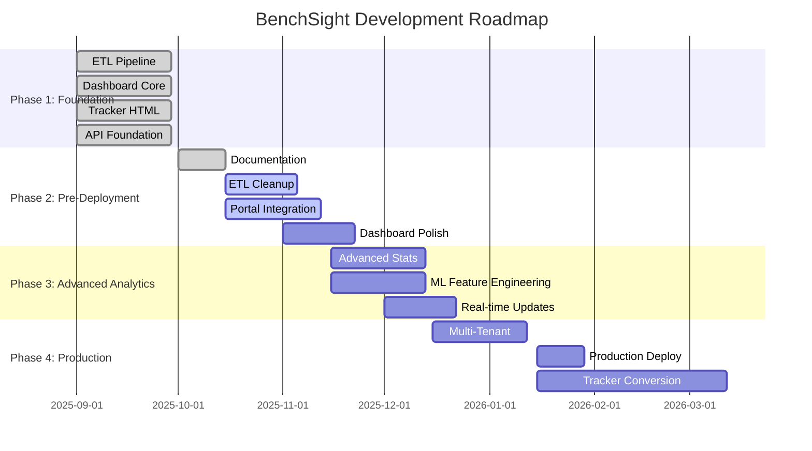
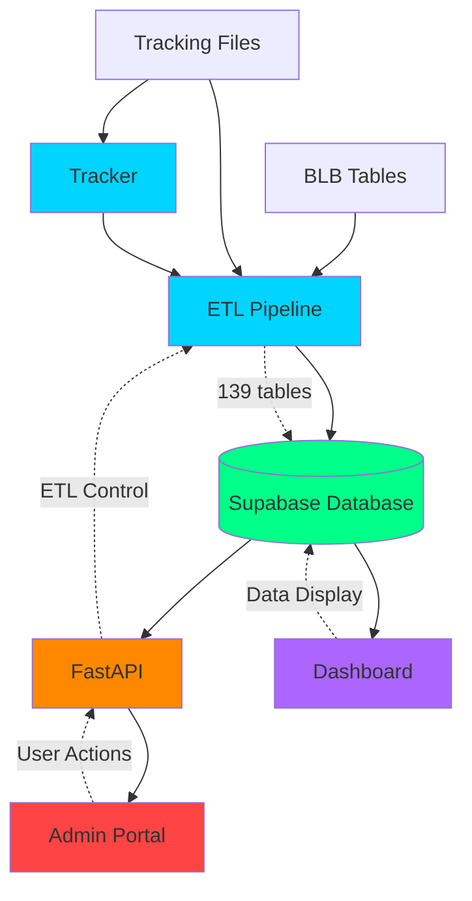
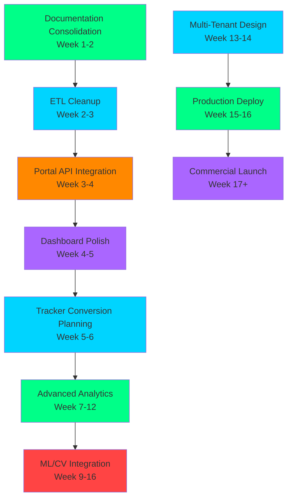

# BenchSight Master Roadmap

**Unified roadmap for all components: ETL, Dashboard, Tracker, Portal, and ML/CV**

Last Updated: 2026-01-15  
Version: 29.0

---

## Overview

This document consolidates all roadmaps into a single, unified view. It covers ETL, Dashboard, Tracker, Portal, and future ML/CV integration.

**Timeline:** 16-week strategic roadmap (MVP) → 48-week commercial roadmap  
**Current Phase:** Pre-Deployment & Data Collection  
**Next Phase:** Advanced Analytics & ML Integration  
**Commercial Goal:** SaaS platform for high-level youth, junior, and college hockey

---

## Project Vision

### End Goal

**Commercial SaaS Platform** for hockey analytics and game tracking, targeting:

- **Primary Market:** High-level youth hockey teams and leagues
- **Secondary Market:** Junior hockey programs
- **Tertiary Market:** College club hockey teams
- **Value Proposition:** Affordable, comprehensive alternative to expensive professional platforms (Sportlogiq, InStat, Synergy Sports)

### MVP Definition

**MVP = Better Working Version of Current Prototype**

The MVP is a polished, production-ready version of the current functional prototype, including:

- ✅ All current ETL functionality (139 tables, advanced metrics)
- ✅ All current Dashboard functionality (50+ pages, analytics)
- ✅ All current Tracker functionality (event/shift tracking, video sync)
- ✅ Portal with full API integration
- ✅ Multi-tenant architecture (single-tenant → multi-tenant)
- ✅ User authentication and authorization
- ✅ Production deployment and monitoring
- ✅ Performance optimization and scalability

**MVP Success Criteria:**
- Can support 10+ teams simultaneously
- Can process 100+ games per season
- Dashboard loads in < 2 seconds
- ETL completes in < 90 seconds for 4 games
- 99.9% uptime
- User-friendly onboarding

### Market Context

**Target Customer Segments:**

1. **Teams & Coaches:**
   - Need game tracking and analytics
   - Want affordable alternative to pro platforms
   - Value ease of use and comprehensive stats

2. **Players:**
   - Want to see their performance data
   - Track progress over time
   - Compare to teammates/league

3. **League Administrators:**
   - Need league-wide analytics
   - Standings and leaderboards
   - Player/team management

**Competitive Positioning:**
- **Lower price point** than professional platforms
- **Easier to use** than complex analytics tools
- **More comprehensive** than basic stat trackers
- **Better value** for youth/junior/college market

**Pricing Strategy Overview:**
- Free tier (limited features)
- Team tier ($X/month per team)
- Pro tier ($Y/month per team, advanced features)
- Enterprise tier (custom pricing, multi-league)

*Detailed pricing in [MONETIZATION_STRATEGY.md](commercial/MONETIZATION_STRATEGY.md)*

**Related Documentation:**
- [MASTER_IMPLEMENTATION_PLAN.md](MASTER_IMPLEMENTATION_PLAN.md) - Detailed phased implementation plan
- [TECH_STACK_ROADMAP.md](TECH_STACK_ROADMAP.md) - Tech stack requirements and migration paths
- [commercial/COMPETITOR_ANALYSIS.md](commercial/COMPETITOR_ANALYSIS.md) - Competitor research
- [commercial/GAP_ANALYSIS.md](commercial/GAP_ANALYSIS.md) - Gap analysis
- [commercial/MONETIZATION_STRATEGY.md](commercial/MONETIZATION_STRATEGY.md) - Monetization strategy
- [commercial/COMMERCIAL_ROADMAP_VISUALS.md](commercial/COMMERCIAL_ROADMAP_VISUALS.md) - Commercial roadmap visuals

### Commercial Roadmap

**MVP to Commercial Timeline:**

**Phase 1-4 (Weeks 1-16): MVP Development**
- Complete all MVP features
- Multi-tenant architecture
- Production deployment
- Beta testing with 3-5 teams

**Phase 5-6 (Weeks 17-32): Commercial Preparation**
- Payment integration
- Subscription management
- Onboarding flows
- Marketing site
- Customer support system

**Phase 7-8 (Weeks 33-48): Commercial Launch**
- Public launch
- Customer acquisition
- Feature expansion based on feedback
- Multi-league support

**Feature Prioritization for Market Readiness:**

**Must-Have for MVP:**
- Core analytics (current functionality)
- Game tracking (current tracker)
- Multi-tenant support
- User authentication
- Payment processing

**Should-Have for Launch:**
- Mobile optimization
- Advanced analytics (xG, WAR/GAR)
- Export functionality
- Custom reports

**Nice-to-Have for Future:**
- ML/CV integration
- Mobile apps
- Real-time collaboration
- Advanced predictive analytics

**Multi-Tenant Architecture Requirements:**
- Schema redesign for tenant isolation
- Row-level security (RLS)
- Data isolation per tenant
- Performance at scale (100+ teams)
- Billing and subscription management

**Scalability Considerations:**
- Horizontal scaling (read replicas)
- Caching strategies (Redis)
- CDN for static assets
- Database optimization (indexing, partitioning)
- API rate limiting

---

## Current State Summary

### ETL Pipeline
- **Status:** ✅ Functional (139 tables)
- **Completion:** ~90%
- **Remaining:** Cleanup, refactoring, optimization

### Dashboard
- **Status:** ✅ Functional (50+ pages)
- **Completion:** ~85%
- **Remaining:** Polish, enhanced visualizations, mobile optimization

### Tracker
- **Status:** ✅ Functional (HTML/JS)
- **Completion:** 100% (current version)
- **Remaining:** Rust/Next.js conversion (planned)

### Portal
- **Status:** 🚧 UI mockup only
- **Completion:** ~10%
- **Remaining:** API integration, full functionality

### API
- **Status:** ✅ Functional
- **Completion:** ~80%
- **Remaining:** Game management endpoints, data browser endpoints

---

## Unified Roadmap

### Phase 1: Foundation (COMPLETE ✅)

**Timeline:** Weeks 1-4  
**Status:** ✅ Complete

**ETL:**
- ✅ Core ETL pipeline (139 tables)
- ✅ Data validation
- ✅ Supabase integration

**Dashboard:**
- ✅ Core pages (players, teams, games, goalies)
- ✅ Basic analytics
- ✅ Data visualization

**Tracker:**
- ✅ HTML tracker functional
- ✅ Event/shift tracking
- ✅ Video integration
- ✅ Export functionality

**API:**
- ✅ ETL endpoints
- ✅ Upload endpoints
- ✅ Staging endpoints

---

### Phase 2: Pre-Deployment & Data Collection (CURRENT 🚧)

**Timeline:** Weeks 5-8  
**Status:** 🚧 In Progress

**ETL:**
- 🚧 Code cleanup and refactoring
- 🚧 Table verification
- 🚧 Performance optimization
- ✅ Documentation consolidation (Review folder cleaned, reference materials organized)

**Dashboard:**
- 🚧 Enhanced visualizations
- 🚧 Search and filter integration
- 🚧 Export functionality expansion
- 📋 Mobile optimization

**Portal:**
- 🚧 API integration
- 🚧 ETL control functionality
- 🚧 Data display
- 📋 Game management

**API:**
- 🚧 Game management endpoints
- 🚧 Data browser endpoints
- 📋 Authentication

---

### Phase 3: Advanced Analytics (PLANNED 📋)

**Timeline:** Weeks 9-12  
**Status:** 📋 Planned

**ETL:**
- 📋 Advanced stat calculations
- 📋 ML feature engineering
- 📋 Real-time data processing

**Dashboard:**
- 📋 Complete xG analysis
- 📋 Complete WAR/GAR analysis
- 📋 RAPM analysis
- 📋 Predictive analytics

**Portal:**
- 📋 Advanced data management
- 📋 Batch operations
- 📋 Data quality monitoring

**ML/CV:**
- 📋 Goal detection
- 📋 Player tracking
- 📋 Event classification

---

### Phase 4: Production & Scale (PLANNED 📋)

**Timeline:** Weeks 13-16  
**Status:** 📋 Planned

**All Components:**
- 📋 Production deployment
- 📋 Performance optimization
- 📋 Scalability improvements
- 📋 Monitoring and alerting

**Tracker:**
- 📋 Rust/Next.js conversion
- 📋 Real-time collaboration
- 📋 Mobile app

---

## Component-Specific Roadmaps

### ETL Roadmap

**Current State:** ✅ Functional, needs cleanup

**Immediate (Weeks 1-2):**
- [ ] Code cleanup and refactoring
- [ ] Table verification
- [ ] Performance optimization
- [ ] Documentation consolidation

**Short-term (Weeks 3-4):**
- [ ] Module refactoring (split base_etl.py)
- [ ] Vectorization improvements
- [ ] Parallel processing
- [ ] Enhanced validation

**Medium-term (Weeks 5-8):**
- [ ] Advanced stat calculations
- [ ] ML feature engineering
- [ ] Real-time processing support

**Long-term (Weeks 9-16):**
- [ ] ML integration
- [ ] Computer vision integration
- [ ] Automated data quality

---

### Dashboard Roadmap

**Current State:** ✅ Functional, needs polish

**Immediate (Weeks 1-2):**
- [ ] Enhanced visualizations
- [ ] Search and filter integration
- [ ] Export expansion
- [ ] Mobile optimization

**Short-term (Weeks 3-4):**
- [ ] Complete xG analysis page
- [ ] Complete WAR/GAR analysis page
- [ ] Enhanced player comparison
- [ ] UI polish

**Medium-term (Weeks 5-8):**
- [ ] RAPM analysis
- [ ] Predictive analytics
- [ ] Real-time updates
- [ ] User preferences

**Long-term (Weeks 9-16):**
- [ ] AI-powered insights
- [ ] Custom report builder
- [ ] Advanced visualizations

---

### Tracker Roadmap

**Current State:** ✅ Functional (HTML/JS)

**Immediate (Weeks 1-2):**
- [ ] Complete logic documentation ✅
- [ ] Conversion planning ✅

**Short-term (Weeks 3-6):**
- [ ] Rust backend development
- [ ] Next.js frontend development
- [ ] Feature parity testing

**Medium-term (Weeks 7-10):**
- [ ] Performance optimization
- [ ] Real-time collaboration
- [ ] Mobile support

**Long-term (Weeks 11-16):**
- [ ] Mobile app
- [ ] Advanced features
- [ ] ML integration

---

### Portal Roadmap

**Current State:** 🚧 UI mockup only

**Immediate (Weeks 1-2):**
- [ ] API integration
- [ ] ETL trigger functionality
- [ ] Status polling

**Short-term (Weeks 3-4):**
- [ ] Upload functionality
- [ ] Game list display
- [ ] Data browser

**Medium-term (Weeks 5-8):**
- [ ] Game management
- [ ] Staging data upload
- [ ] Settings management

**Long-term (Weeks 9-16):**
- [ ] Advanced features
- [ ] User management
- [ ] Role-based access

---

### API Roadmap

**Current State:** ✅ Functional, needs expansion

**Immediate (Weeks 1-2):**
- [ ] Game management endpoints
- [ ] Data browser endpoints
- [ ] Error handling improvements

**Short-term (Weeks 3-4):**
- [ ] Authentication
- [ ] Rate limiting
- [ ] API documentation

**Medium-term (Weeks 5-8):**
- [ ] WebSocket support
- [ ] Real-time updates
- [ ] Job queue (Redis)

**Long-term (Weeks 9-16):**
- [ ] ML endpoints
- [ ] Advanced features
- [ ] Performance optimization

---

## ML/CV Roadmap (Future)

**Timeline:** Weeks 9-16+  
**Status:** 📋 Planned

**Phase 1: Goal Detection**
- 📋 Computer vision model
- 📋 Goal detection API
- 📋 Integration with tracker

**Phase 2: Player Tracking**
- 📋 Player identification
- 📋 Position tracking
- 📋 Movement analysis

**Phase 3: Event Classification**
- 📋 Automatic event detection
- 📋 Event type classification
- 📋 Quality scoring

---

## Roadmap Visualizations

### Timeline Gantt Chart

### Component Dependency Graph

### Feature Roadmap

```mermaid
graph LR
    subgraph MVP["MVP Features (Weeks 1-16)"]
        MVP1[Core Analytics]
        MVP2[Game Tracking]
        MVP3[Multi-Tenant]
        MVP4[Authentication]
        MVP5[Payment]
    end
    
    subgraph Commercial["Commercial Features (Weeks 17-32)"]
        COM1[Mobile Optimization]
        COM2[Advanced Analytics]
        COM3[Export/Reports]
        COM4[Onboarding]
        COM5[Support System]
    end
    
    subgraph Future["Future Features (Weeks 33+)"]
        FUT1[ML/CV Integration]
        FUT2[Mobile Apps]
        FUT3[Real-time Collab]
        FUT4[Predictive Analytics]
        FUT5[Multi-League]
    end
    
    MVP --> Commercial
    Commercial --> Future
    
    style MVP fill:#00ff88
    style Commercial fill:#00d4ff
    style Future fill:#aa66ff
```

## Dependencies

### Critical Path

### Parallel Work

- **Dashboard polish** can happen in parallel with **ETL cleanup**
- **Portal development** can happen in parallel with **Tracker conversion planning**
- **API expansion** can happen in parallel with all other work
- **Multi-tenant design** can start in parallel with **Advanced Analytics**

---

## Success Metrics

### Phase 2 (Current)

**Technical:**
- [ ] All documentation consolidated
- [ ] ETL code cleaned and refactored
- [ ] Portal fully functional
- [ ] Dashboard polished
- [ ] Tracker conversion plan complete

**Commercial:**
- [ ] MVP feature list finalized
- [ ] Multi-tenant architecture designed
- [ ] Pricing strategy defined

### Phase 3

**Technical:**
- [ ] Advanced analytics complete
- [ ] ML features integrated
- [ ] Real-time updates working
- [ ] Performance optimized

**Commercial:**
- [ ] Beta program launched (3-5 teams)
- [ ] User feedback collected
- [ ] Feature prioritization updated

### Phase 4

**Technical:**
- [ ] Production deployment
- [ ] Scalability proven
- [ ] Monitoring in place
- [ ] User feedback positive

**Commercial:**
- [ ] MVP launched
- [ ] 10+ teams onboarded
- [ ] Payment processing working
- [ ] Customer support operational

### Commercial Metrics (Post-MVP)

**User Acquisition:**
- Target: 50 teams in first 6 months
- Target: 200 teams in first year
- Customer acquisition cost (CAC) < $X
- Conversion rate (free → paid) > Y%

**Retention:**
- Monthly churn rate < 5%
- Annual retention rate > 80%
- Net Promoter Score (NPS) > 50

**Revenue:**
- Monthly Recurring Revenue (MRR) growth > 20% month-over-month
- Average Revenue Per User (ARPU) > $X
- Lifetime Value (LTV) > 3x CAC

**Product:**
- Feature adoption rate > 60%
- Daily Active Users (DAU) / Monthly Active Users (MAU) > 30%
- User satisfaction score > 4.0/5.0

---

## Related Documentation

- [DASHBOARD_ROADMAP.md](DASHBOARD_ROADMAP.md) - Dashboard-specific roadmap
- [TRACKER_CONVERSION_SPEC.md](TRACKER_CONVERSION_SPEC.md) - Tracker conversion plan
- [PORTAL_DEVELOPMENT_PLAN.md](PORTAL_DEVELOPMENT_PLAN.md) - Portal development plan
- [STRATEGIC_ASSESSMENT.md](STRATEGIC_ASSESSMENT.md) - Strategic assessment
- [COMPREHENSIVE_FUTURE_ROADMAP.md](COMPREHENSIVE_FUTURE_ROADMAP.md) - Future roadmap

---

*Last Updated: 2026-01-15*
