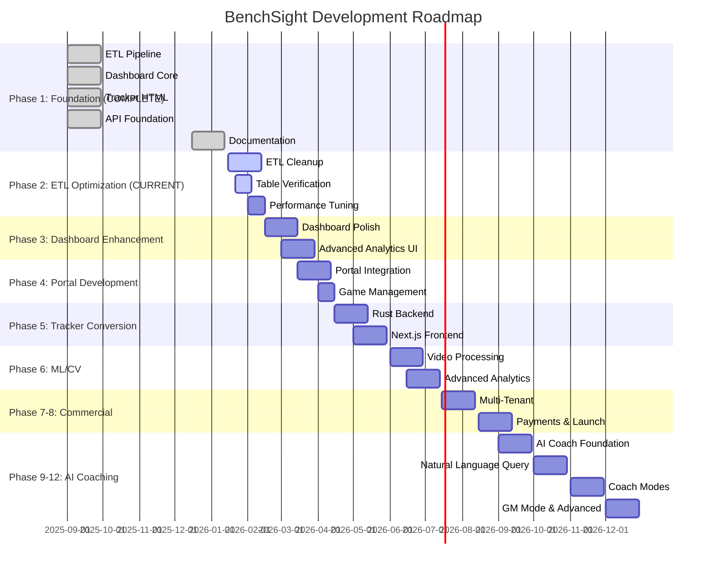
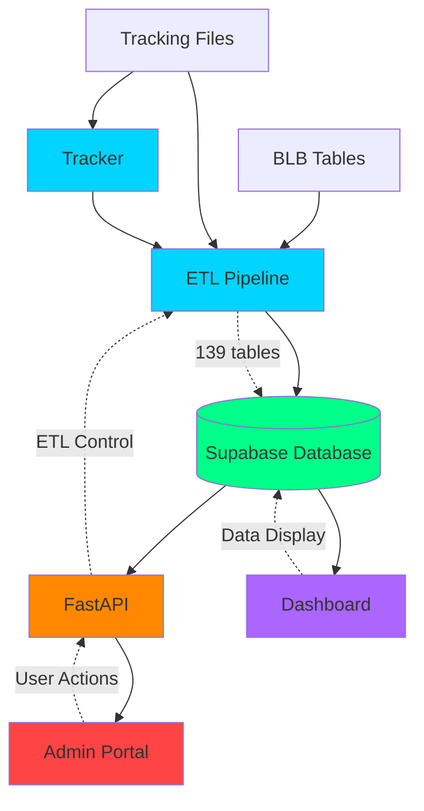
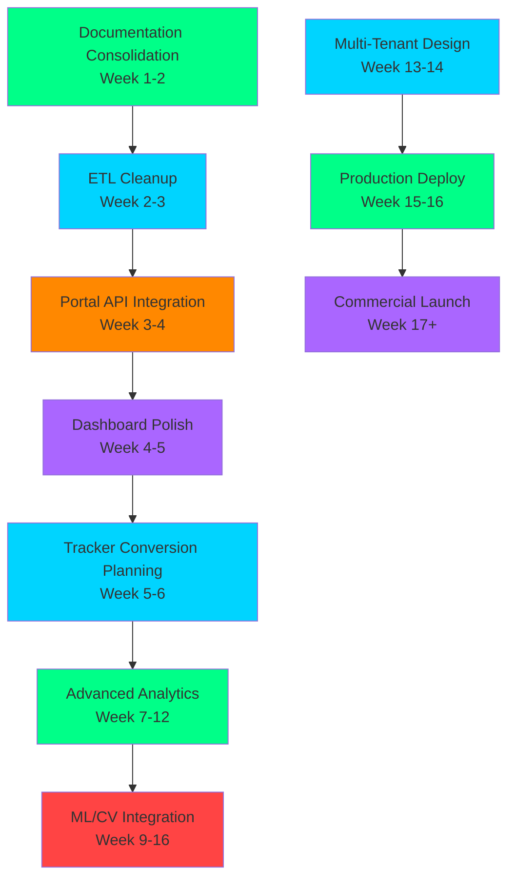

# BenchSight Master Roadmap

**Unified roadmap for all components: ETL, Dashboard, Tracker, Portal, and ML/CV**

Last Updated: 2026-01-21
Version: 2.00

---

## Overview

This document consolidates all roadmaps into a single, unified view. It covers ETL, Dashboard, Tracker, Portal, and future ML/CV integration.

**Timeline:** 16-week strategic roadmap (MVP) → 48-week commercial roadmap  
**Current Phase:** Pre-Deployment & Data Collection  
**Next Phase:** Advanced Analytics & ML Integration  
**Commercial Goal:** SaaS platform for high-level youth, junior, and college hockey (rec league is the prototype/pilot)

---

## Project Vision

### End Goal

**Commercial SaaS Platform** for hockey analytics and game tracking, targeting:

- **Primary Market:** High-level youth hockey teams and leagues
- **Secondary Market:** Junior hockey programs
- **Tertiary Market:** College club hockey teams
- **Prototype/Pilot:** Personal rec league (initial data source and validation cohort)
- **Value Proposition:** Affordable, comprehensive alternative to expensive professional platforms (Sportlogiq, InStat, Synergy Sports)

### MVP Definition

**MVP = Better Working Version of Current Prototype**

The MVP is a polished, production-ready version of the current functional prototype, including:

- [YES] All current ETL functionality (139 tables, advanced metrics)
- [YES] All current Dashboard functionality (50+ pages, analytics)
- [YES] All current Tracker functionality (event/shift tracking, video sync)
- [YES] Portal with full API integration
- [YES] Multi-tenant architecture (single-tenant → multi-tenant)
- [YES] User authentication and authorization
- [YES] Production deployment and monitoring
- [YES] Performance optimization and scalability

**MVP Success Criteria:**
- Can support 10+ teams simultaneously
- Can process 100+ games per season
- Dashboard loads in < 2 seconds
- ETL completes in < 90 seconds for 4 games
- 99.9% uptime
- User-friendly onboarding

### Market Context

**Target Customer Segments:**

1. **Teams & Coaches:**
   - Need game tracking and analytics
   - Want affordable alternative to pro platforms
   - Value ease of use and comprehensive stats

2. **Players:**
   - Want to see their performance data
   - Track progress over time
   - Compare to teammates/league

3. **League Administrators:**
   - Need league-wide analytics
   - Standings and leaderboards
   - Player/team management

**Pilot Cohort (Prototype):**
- Personal rec league to validate workflows, tracking, and pricing sensitivity before junior/college rollout

**Competitive Positioning:**
- **Lower price point** than professional platforms
- **Easier to use** than complex analytics tools
- **More comprehensive** than basic stat trackers
- **Better value** for youth/junior/college market

**Pricing Strategy Overview:**
- Free tier (limited features)
- Team tier ($X/month per team)
- Pro tier ($Y/month per team, advanced features)
- Enterprise tier (custom pricing, multi-league)

*Detailed pricing in [MONETIZATION_STRATEGY.md](commercial/MONETIZATION_STRATEGY.md)*

**Related Documentation:**
- [MASTER_IMPLEMENTATION_PLAN.md](MASTER_IMPLEMENTATION_PLAN.md) - Detailed phased implementation plan
- [TECH_STACK_ROADMAP.md](TECH_STACK_ROADMAP.md) - Tech stack requirements and migration paths
- [commercial/COMPETITOR_ANALYSIS.md](commercial/COMPETITOR_ANALYSIS.md) - Competitor research
- [commercial/GAP_ANALYSIS.md](commercial/GAP_ANALYSIS.md) - Gap analysis
- [commercial/MONETIZATION_STRATEGY.md](commercial/MONETIZATION_STRATEGY.md) - Monetization strategy
- [commercial/COMMERCIAL_ROADMAP_VISUALS.md](commercial/COMMERCIAL_ROADMAP_VISUALS.md) - Commercial roadmap visuals

### Commercial Roadmap

**MVP to Commercial Timeline:**

**Phase 1-4 (Weeks 1-16): MVP Development**
- Complete all MVP features
- Multi-tenant architecture
- Production deployment
- Beta testing with 3-5 teams

**Phase 5-6 (Weeks 17-32): Commercial Preparation**
- Payment integration
- Subscription management
- Onboarding flows
- Marketing site
- Customer support system

**Phase 7-8 (Weeks 33-48): Commercial Launch**
- Public launch
- Customer acquisition
- Feature expansion based on feedback
- Multi-league support

**Feature Prioritization for Market Readiness:**

**Must-Have for MVP:**
- Core analytics (current functionality)
- Game tracking (current tracker)
- Multi-tenant support
- User authentication
- Payment processing

**Should-Have for Launch:**
- Mobile optimization
- Advanced analytics (xG, WAR/GAR)
- Export functionality
- Custom reports

**Nice-to-Have for Future:**
- ML/CV integration
- Mobile apps
- Real-time collaboration
- Advanced predictive analytics

**Multi-Tenant Architecture Requirements:**
- Schema redesign for tenant isolation
- Row-level security (RLS)
- Data isolation per tenant
- Performance at scale (100+ teams)
- Billing and subscription management

**Scalability Considerations:**
- Horizontal scaling (read replicas)
- Caching strategies (Redis)
- CDN for static assets
- Database optimization (indexing, partitioning)
- API rate limiting

---

## Current State Summary

### ETL Pipeline
- **Status:** [YES] Functional (139 tables)
- **Completion:** ~90%
- **Remaining:** Cleanup, refactoring, optimization

### Dashboard
- **Status:** [YES] Functional (50+ pages)
- **Completion:** ~85%
- **Remaining:** Polish, enhanced visualizations, mobile optimization

### Tracker
- **Status:** [YES] Functional (HTML/JS)
- **Completion:** 100% (current version)
- **Remaining:** Rust/Next.js conversion (planned)

### Portal
- **Status:** [IN_PROGRESS] UI mockup only
- **Completion:** ~10%
- **Remaining:** API integration, full functionality

### API
- **Status:** [YES] Functional
- **Completion:** ~80%
- **Remaining:** Game management endpoints, data browser endpoints

---

## Unified Roadmap

### Phase 1: Foundation (COMPLETE [YES])

**Timeline:** Weeks 1-4  
**Status:** [YES] Complete

**ETL:**
- [YES] Core ETL pipeline (139 tables)
- [YES] Data validation
- [YES] Supabase integration

**Dashboard:**
- [YES] Core pages (players, teams, games, goalies)
- [YES] Basic analytics
- [YES] Data visualization

**Tracker:**
- [YES] HTML tracker functional
- [YES] Event/shift tracking
- [YES] Video integration
- [YES] Export functionality

**API:**
- [YES] ETL endpoints
- [YES] Upload endpoints
- [YES] Staging endpoints

---

### Phase 2: Pre-Deployment & Data Collection (CURRENT [IN_PROGRESS])

**Timeline:** Weeks 5-8
**Status:** [IN_PROGRESS] In Progress

**ETL:**
- [IN_PROGRESS] Code cleanup and refactoring
- [IN_PROGRESS] Table verification
- [IN_PROGRESS] Performance optimization
- [YES] Documentation consolidation (Review folder cleaned, reference materials organized)

**Schema Optimization (NEW):**
- [PLANNED] Remove 20 empty/duplicate tables (see [COMMERCIAL_SCHEMA_DESIGN.md](data/COMMERCIAL_SCHEMA_DESIGN.md))
- [PLANNED] Remove 8 null columns from fact_events
- [PLANNED] Archive 7 development-only tables
- [PLANNED] Document schema changes in CHANGELOG

**Dashboard:**
- [IN_PROGRESS] Enhanced visualizations
- [IN_PROGRESS] Search and filter integration
- [IN_PROGRESS] Export functionality expansion
- [PLANNED] Mobile optimization

**Portal:**
- [IN_PROGRESS] API integration
- [IN_PROGRESS] ETL control functionality
- [IN_PROGRESS] Data display
- [PLANNED] Game management

**API:**
- [IN_PROGRESS] Game management endpoints
- [IN_PROGRESS] Data browser endpoints
- [PLANNED] Authentication

---

### Phase 3: Advanced Analytics (PLANNED [PLANNED])

**Timeline:** Weeks 9-12
**Status:** [PLANNED] Planned

**Schema Consolidation:**
- [PLANNED] Consolidate 6 H2H/matchup tables → 2 tables
- [PLANNED] Consolidate 6 zone entry/exit tables → 2 tables
- [PLANNED] Consolidate 6 shot/scoring tables → 2 tables
- [PLANNED] Update ETL builders for consolidated tables
- [PLANNED] Update dashboard queries

**Schema Normalization:**
- [PLANNED] Normalize fact_events (200 → 25 columns)
- [PLANNED] Create fact_event_participants junction table
- [PLANNED] Create backward-compatible views
- [PLANNED] Update all queries to use normalized schema
- [PLANNED] Performance testing and optimization

**ETL:**
- [PLANNED] Spatial xG (GBM with distance/angle/royal-road/rush/rebound/flurry/shooter-talent)
- [PLANNED] RAPM/WAR rebuild (stints, RidgeCV, replacement level, daisy-chain priors)
- [PLANNED] Microstats: WDBE faceoffs, gap control, entry/exit value, xT grid spec
- [PLANNED] ML feature engineering
- [PLANNED] Real-time data processing

**Dashboard:**
- [PLANNED] xG layers (shot maps, flurry view, shooter talent)
- [PLANNED] WAR/RAPM components and leaderboards
- [PLANNED] Microstat surfaces (WDBE, gap, entry/exit value, rush vs cycle)
- [PLANNED] Predictive analytics

**Portal:**
- [PLANNED] Advanced data management
- [PLANNED] Batch operations
- [PLANNED] Data quality monitoring

**ML/CV:**
- [PLANNED] Goal detection
- [PLANNED] Player tracking
- [PLANNED] Event classification

---

### Phase 4: Production & Scale (PLANNED [PLANNED])

**Timeline:** Weeks 13-16
**Status:** [PLANNED] Planned

**Multi-Tenant Schema:**
- [PLANNED] Add tenant_id to all tables (see [SCHEMA_SCALABILITY_DESIGN.md](data/SCHEMA_SCALABILITY_DESIGN.md))
- [PLANNED] Implement Row-Level Security (RLS)
- [PLANNED] Update foreign keys to include tenant_id
- [PLANNED] Create composite indexes for tenant queries
- [PLANNED] Test tenant isolation

**All Components:**
- [PLANNED] Production deployment
- [PLANNED] Performance optimization
- [PLANNED] Scalability improvements
- [PLANNED] Monitoring and alerting

**Tracker:**
- [PLANNED] Rust/Next.js conversion
- [PLANNED] Real-time collaboration
- [PLANNED] Mobile app

---

## Component-Specific Roadmaps

### ETL Roadmap

**Current State:** [YES] Functional, needs cleanup

**Immediate (Weeks 1-2):**
- [ ] Code cleanup and refactoring
- [ ] Table verification
- [ ] Performance optimization
- [ ] Documentation consolidation
- [ ] **Schema Cleanup:** Remove 20 empty/duplicate tables
- [ ] **Schema Cleanup:** Remove 8 null columns from fact tables
- [ ] **Schema Cleanup:** Archive 7 development-only tables

**Short-term (Weeks 3-4):**
- [ ] Module refactoring (split base_etl.py)
- [ ] Vectorization improvements
- [ ] Parallel processing
- [ ] Enhanced validation
- [ ] **Schema Consolidation:** Merge H2H tables (6 → 2)
- [ ] **Schema Consolidation:** Merge zone tables (6 → 2)
- [ ] **Schema Consolidation:** Merge shot tables (6 → 2)

**Medium-term (Weeks 5-8):**
- [ ] **Schema Normalization:** Normalize fact_events (200 → 25 cols)
- [ ] **Schema Normalization:** Create fact_event_participants
- [ ] **Schema Normalization:** Create backward-compatible views
- [ ] Advanced stat calculations (GBM xG, flurry, shooter talent)
- [ ] ML feature engineering
- [ ] Real-time processing support

**Long-term (Weeks 9-16):**
- [ ] **Multi-Tenant:** Add tenant_id to all tables
- [ ] **Multi-Tenant:** Implement Row-Level Security
- [ ] RAPM/WAR rebuild with replacement level
- [ ] xT / possession value, WDBE, gap control
- [ ] ML / computer vision integration
- [ ] Automated data quality

---

### Dashboard Roadmap

**Current State:** [YES] Functional, needs polish

**Immediate (Weeks 1-2):**
- [ ] Enhanced visualizations
- [ ] Search and filter integration
- [ ] Export expansion
- [ ] Mobile optimization

**Short-term (Weeks 3-4):**
- [ ] Complete xG analysis page
- [ ] Complete WAR/GAR analysis page
- [ ] Enhanced player comparison
- [ ] UI polish

**Medium-term (Weeks 5-8):**
- [ ] RAPM analysis
- [ ] Predictive analytics
- [ ] Real-time updates
- [ ] User preferences

**Long-term (Weeks 9-16):**
- [ ] AI-powered insights
- [ ] Custom report builder
- [ ] Advanced visualizations

---

### Tracker Roadmap

**Current State:** [YES] Functional (HTML/JS)

**Immediate (Weeks 1-2):**
- [ ] Complete logic documentation [YES]
- [ ] Conversion planning [YES]

**Short-term (Weeks 3-6):**
- [ ] Rust backend development
- [ ] Next.js frontend development
- [ ] Feature parity testing

**Medium-term (Weeks 7-10):**
- [ ] Performance optimization
- [ ] Real-time collaboration
- [ ] Mobile support

**Long-term (Weeks 11-16):**
- [ ] Mobile app
- [ ] Advanced features
- [ ] ML integration

---

### Portal Roadmap

**Current State:** [IN_PROGRESS] UI mockup only

**Immediate (Weeks 1-2):**
- [ ] API integration
- [ ] ETL trigger functionality
- [ ] Status polling

**Short-term (Weeks 3-4):**
- [ ] Upload functionality
- [ ] Game list display
- [ ] Data browser

**Medium-term (Weeks 5-8):**
- [ ] Game management
- [ ] Staging data upload
- [ ] Settings management

**Long-term (Weeks 9-16):**
- [ ] Advanced features
- [ ] User management
- [ ] Role-based access

---

### API Roadmap

**Current State:** [YES] Functional, needs expansion

**Immediate (Weeks 1-2):**
- [ ] Game management endpoints
- [ ] Data browser endpoints
- [ ] Error handling improvements

**Short-term (Weeks 3-4):**
- [ ] Authentication
- [ ] Rate limiting
- [ ] API documentation

**Medium-term (Weeks 5-8):**
- [ ] WebSocket support
- [ ] Real-time updates
- [ ] Job queue (Redis)

**Long-term (Weeks 9-16):**
- [ ] ML endpoints
- [ ] Advanced features
- [ ] Performance optimization

---

## ML/CV Roadmap (Future)

**Timeline:** Weeks 9-16+  
**Status:** [PLANNED] Planned

**Phase 1: Goal Detection**
- [PLANNED] Computer vision model
- [PLANNED] Goal detection API
- [PLANNED] Integration with tracker

**Phase 2: Player Tracking**
- [PLANNED] Player identification
- [PLANNED] Position tracking
- [PLANNED] Movement analysis

**Phase 3: Event Classification**
- [PLANNED] Automatic event detection
- [PLANNED] Event type classification
- [PLANNED] Quality scoring

---

## AI Coaching & Analysis Roadmap (Commercial Features)

**Timeline:** Weeks 33-48+  
**Status:** [PLANNED] Planned  
**Priority:** High (differentiator for commercial launch)

**Overview:** Transform BenchSight into an intelligent coaching assistant with AI-powered video analysis, natural language queries, and specialized coaching modes.

**Related PRD:** [AI_COACHING_FEATURES.md](prds/AI_COACHING_FEATURES.md)

### Phase 9: AI Coach Foundation (Weeks 33-36)

**Goal:** Basic AI coach functionality with video review

**Features:**
- Video upload and storage infrastructure
- Video player component with AI annotations
- Basic Q&A system (LLM integration)
- Video-event synchronization
- Simple text-based queries

**Dependencies:**
- Multi-tenant architecture (Phase 7)
- Video upload infrastructure
- ML/CV models (Phase 6)

### Phase 10: Natural Language Queries (Weeks 37-40)

**Goal:** Full natural language query system

**Features:**
- Natural language understanding system
- SQL query generation from natural language
- Response visualization engine
- Query caching and optimization
- Voice input (future enhancement)

**Dependencies:**
- Phase 9 completion
- LLM integration (OpenAI/Anthropic)

### Phase 11: Coach Modes (Weeks 41-44)

**Goal:** Complete coach mode features

**Features:**
- **Game Plan Generator:** AI-powered game plan creation based on opponent analysis
- **Practice Planner:** AI-suggested practice drills based on game performance
- **Scout Mode:** Player comparison, talent identification, scouting reports
- **Game Prep Mode:** Pre-game analysis and preparation tools

**Dependencies:**
- Phase 10 completion
- Advanced analytics models
- Recommendation engine

### Phase 12: GM Mode & Advanced Features (Weeks 45-48)

**Goal:** GM mode and advanced analytics

**Features:**
- **Team Builder:** AI-powered roster optimization and player acquisition
- **Advanced Analytics Dashboard:** GM-focused analytics with AI insights
- **Trade Evaluation:** AI-powered trade analysis
- **Draft Analysis:** Prospect evaluation and draft strategy

**Dependencies:**
- Phase 11 completion
- Player valuation models
- Roster optimization algorithms

---

## Roadmap Visualizations

### Timeline Gantt Chart

### Component Dependency Graph

### Feature Roadmap

```mermaid
graph LR
    subgraph MVP["MVP Features (Weeks 1-16)"]
        MVP1[Core Analytics]
        MVP2[Game Tracking]
        MVP3[Multi-Tenant]
        MVP4[Authentication]
        MVP5[Payment]
    end
    
    subgraph Commercial["Commercial Features (Weeks 17-32)"]
        COM1[Mobile Optimization]
        COM2[Advanced Analytics]
        COM3[Export/Reports]
        COM4[Onboarding]
        COM5[Support System]
    end
    
    subgraph Future["Future Features (Weeks 33+)"]
        FUT1[ML/CV Integration]
        FUT2[Mobile Apps]
        FUT3[Real-time Collab]
        FUT4[Predictive Analytics]
        FUT5[Multi-League]
    end
    
    MVP --> Commercial
    Commercial --> Future
    
    style MVP fill:#00ff88
    style Commercial fill:#00d4ff
    style Future fill:#aa66ff
```

## Dependencies

### Critical Path

### Parallel Work

- **Dashboard polish** can happen in parallel with **ETL cleanup**
- **Portal development** can happen in parallel with **Tracker conversion planning**
- **API expansion** can happen in parallel with all other work
- **Multi-tenant design** can start in parallel with **Advanced Analytics**

---

## Success Metrics

### Phase 2 (Current)

**Technical:**
- [ ] All documentation consolidated
- [ ] ETL code cleaned and refactored
- [ ] Portal fully functional
- [ ] Dashboard polished
- [ ] Tracker conversion plan complete

**Commercial:**
- [ ] MVP feature list finalized
- [ ] Multi-tenant architecture designed
- [ ] Pricing strategy defined

### Phase 3

**Technical:**
- [ ] Advanced analytics complete
- [ ] ML features integrated
- [ ] Real-time updates working
- [ ] Performance optimized

**Commercial:**
- [ ] Beta program launched (3-5 teams)
- [ ] User feedback collected
- [ ] Feature prioritization updated

### Phase 4

**Technical:**
- [ ] Production deployment
- [ ] Scalability proven
- [ ] Monitoring in place
- [ ] User feedback positive

**Commercial:**
- [ ] MVP launched
- [ ] 10+ teams onboarded
- [ ] Payment processing working
- [ ] Customer support operational

### Commercial Metrics (Post-MVP)

**User Acquisition:**
- Target: 50 teams in first 6 months
- Target: 200 teams in first year
- Customer acquisition cost (CAC) < $X
- Conversion rate (free → paid) > Y%

**Retention:**
- Monthly churn rate < 5%
- Annual retention rate > 80%
- Net Promoter Score (NPS) > 50

**Revenue:**
- Monthly Recurring Revenue (MRR) growth > 20% month-over-month
- Average Revenue Per User (ARPU) > $X
- Lifetime Value (LTV) > 3x CAC

**Product:**
- Feature adoption rate > 60%
- Daily Active Users (DAU) / Monthly Active Users (MAU) > 30%
- User satisfaction score > 4.0/5.0

---

## Related Documentation

- [dashboard/DASHBOARD_ROADMAP.md](dashboard/DASHBOARD_ROADMAP.md) - Dashboard-specific roadmap
- [tracker/TRACKER_CONVERSION.md](tracker/TRACKER_CONVERSION.md) - Tracker conversion plan
- [portal/PORTAL.md](portal/PORTAL.md) - Portal development plan
- [commercial/GAP_ANALYSIS.md](commercial/GAP_ANALYSIS.md) - Strategic assessment (gap analysis)
- [archive/COMPREHENSIVE_FUTURE_ROADMAP.md](archive/COMPREHENSIVE_FUTURE_ROADMAP.md) - Future roadmap (archived)

---

*Last Updated: 2026-01-15*
