# PostgreSQL Schema Diagram - Hockey Analytics

## Visual Schema Diagram

```mermaid
erDiagram
    %% ========================================
    %% STAGE LAYER (stg_*)
    %% ========================================
    
    stg_dim_player {
        varchar player_id PK
        varchar player_full_name
        varchar random_player_full_name
        varchar player_primary_position
        decimal current_skill_rating
        varchar player_hand
        integer birth_year
        timestamp _load_timestamp
    }
    
    stg_dim_team {
        varchar team_id PK
        varchar team_name
        varchar team_cd
        varchar long_team_name
        varchar league
        varchar team_color1
        varchar team_color2
        timestamp _load_timestamp
    }
    
    stg_dim_schedule {
        integer game_id PK
        varchar home_team_name
        varchar away_team_name
        varchar home_team_id FK
        varchar away_team_id FK
        date date
        varchar season_id
        varchar game_type
        varchar playoff_round
        integer home_total_goals
        integer away_total_goals
        varchar video_id
        varchar video_url
        timestamp _load_timestamp
    }
    
    stg_dim_dates {
        integer datekey PK
        date date
        integer day
        varchar daysuffix
        integer weekday
        varchar weekdayname
        integer month
        varchar monthname
        integer quarter
        integer year
        boolean isweekend
        boolean isholiday
        timestamp _load_timestamp
    }
    
    stg_dim_seconds {
        integer time_key PK
        integer period
        varchar period_name
        varchar period_type
        integer minute_in_period
        integer second_in_minute
        integer total_seconds_in_period
        varchar time_elapsed_period_formatted
        integer time_remaining_period_seconds
        varchar time_remaining_period_formatted
        integer time_elapsed_game_seconds
        boolean is_regulation
        boolean is_overtime
        timestamp _load_timestamp
    }
    
    stg_fact_gameroster {
        integer game_id FK
        varchar player_id FK
        integer player_game_number
        varchar player_full_name
        varchar team_name
        varchar opp_team_name
        varchar team_venue
        varchar player_position
        integer goals
        integer assist
        integer pim
        integer goals_against
        timestamp _load_timestamp
    }
    
    stg_events {
        integer event_index PK
        integer shift_index FK
        varchar Type
        varchar event_detail
        integer period
        integer time_start_total_seconds
        varchar player_role
        integer player_game_number
        varchar player_id
        integer linked_event_index
        timestamp _load_timestamp
    }
    
    stg_shifts {
        integer shift_index PK
        integer Period
        integer shift_start_total_seconds
        integer shift_end_total_seconds
        integer shift_duration
        varchar situation
        varchar strength
        integer home_forward_1
        integer home_forward_2
        integer home_forward_3
        integer home_defense_1
        integer home_defense_2
        integer home_goalie
        integer away_forward_1
        integer away_forward_2
        integer away_forward_3
        integer away_defense_1
        integer away_defense_2
        integer away_goalie
        timestamp _load_timestamp
    }

    %% Stage relationships
    stg_dim_schedule ||--o{ stg_fact_gameroster : "game_id"
    stg_dim_player ||--o{ stg_fact_gameroster : "player_id"
    stg_dim_team ||--o{ stg_dim_schedule : "home_team_id"
    stg_dim_team ||--o{ stg_dim_schedule : "away_team_id"
    stg_shifts ||--o{ stg_events : "shift_index"

    %% ========================================
    %% INTERMEDIATE LAYER (int_*)
    %% ========================================
    
    int_dim_player {
        varchar player_id PK
        varchar player_full_name
        varchar display_name
        varchar primary_position
        decimal skill_rating
        varchar player_hand
        integer birth_year
        timestamp _processed_timestamp
        timestamp _updated_timestamp
    }
    
    int_dim_team {
        varchar team_id PK
        varchar team_name
        varchar team_abbr
        varchar long_team_name
        varchar league
        varchar team_color1
        varchar team_color2
        timestamp _processed_timestamp
        timestamp _updated_timestamp
    }
    
    int_dim_schedule {
        integer game_id PK
        varchar home_team
        varchar away_team
        varchar home_team_id FK
        varchar away_team_id FK
        date game_date
        varchar season_id
        varchar game_type
        varchar playoff_round
        integer home_score
        integer away_score
        varchar winner
        varchar video_id
        varchar video_url
        timestamp _processed_timestamp
        timestamp _updated_timestamp
    }
    
    int_dim_dates {
        integer date_key PK
        date full_date
        integer day_of_month
        varchar day_name
        integer week_of_year
        integer month_num
        varchar month_name
        integer quarter_num
        integer year_num
        boolean is_weekend
        boolean is_holiday
        timestamp _processed_timestamp
        timestamp _updated_timestamp
    }
    
    int_dim_seconds {
        integer time_key PK
        integer period
        varchar period_name
        varchar period_type
        integer minute_in_period
        integer second_in_minute
        integer total_seconds_in_period
        varchar time_elapsed_period_formatted
        integer time_remaining_period_seconds
        varchar time_remaining_period_formatted
        integer time_elapsed_game_seconds
        varchar time_elapsed_game_formatted
        boolean is_regulation
        boolean is_overtime
        timestamp _processed_timestamp
        timestamp _updated_timestamp
    }
    
    int_fact_gameroster {
        integer game_id FK
        varchar player_id FK
        integer player_game_number
        varchar player_full_name
        varchar display_name
        varchar team_name
        varchar opp_team_name
        varchar team_venue
        varchar player_position
        integer goals
        integer assists
        integer points
        integer penalty_minutes
        decimal skill_rating
        varchar player_game_key PK
        timestamp _processed_timestamp
        timestamp _updated_timestamp
    }
    
    int_events {
        integer event_index
        varchar event_key PK
        integer shift_index
        varchar shift_key FK
        varchar event_type
        varchar event_detail
        integer period
        integer time_total_seconds
        integer game_id FK
        timestamp _processed_timestamp
    }
    
    int_event_players {
        integer event_index FK
        varchar event_key FK
        integer player_game_number
        varchar player_id FK
        varchar player_role
        boolean is_primary_player
        boolean is_event_team
        varchar event_player_key PK
        integer game_id FK
        timestamp _processed_timestamp
    }
    
    int_shifts {
        integer shift_index
        varchar shift_key PK
        integer period
        integer shift_start_total_seconds
        integer shift_end_total_seconds
        integer shift_duration
        varchar situation
        varchar strength
        integer home_strength
        integer away_strength
        integer home_goals
        integer away_goals
        integer game_id FK
        timestamp _processed_timestamp
    }

    %% Intermediate relationships
    int_dim_schedule ||--o{ int_fact_gameroster : "game_id"
    int_dim_player ||--o{ int_fact_gameroster : "player_id"
    int_dim_team ||--o{ int_dim_schedule : "home_team_id"
    int_shifts ||--o{ int_events : "shift_key"
    int_events ||--o{ int_event_players : "event_key"

    %% ========================================
    %% DATAMART LAYER (dim_*, fact_*)
    %% ========================================
    
    dim_player {
        varchar player_id PK
        varchar player_full_name
        varchar display_name
        varchar primary_position
        decimal skill_rating
        varchar player_hand
        integer birth_year
        timestamp _processed_timestamp
        timestamp _updated_timestamp
    }
    
    dim_team {
        varchar team_id PK
        varchar team_name
        varchar team_abbr
        varchar long_team_name
        varchar league
        varchar team_color1
        varchar team_color2
        timestamp _updated_timestamp
    }
    
    dim_schedule {
        integer game_id PK
        varchar home_team
        varchar away_team
        varchar home_team_id FK
        varchar away_team_id FK
        date game_date
        varchar season_id
        varchar game_type
        integer home_score
        integer away_score
        varchar winner
        timestamp _updated_timestamp
    }
    
    dim_dates {
        integer date_key PK
        date full_date
        integer day_of_month
        varchar day_suffix
        integer day_of_week_num
        varchar day_name
        varchar day_name_short
        integer day_of_year
        integer week_of_month
        integer week_of_year
        date week_start_date
        date week_end_date
        integer month_num
        varchar month_name
        varchar month_name_short
        varchar month_year_key
        varchar month_year_label
        integer quarter_num
        varchar quarter_name
        integer year_num
        boolean is_weekend
        boolean is_holiday
        timestamp _updated_timestamp
    }
    
    dim_seconds {
        integer time_key PK
        integer period
        varchar period_name
        varchar period_type
        integer minute_in_period
        integer second_in_minute
        integer total_seconds_in_period
        varchar time_elapsed_period_formatted
        integer time_remaining_period_seconds
        varchar time_remaining_period_formatted
        integer minute_remaining_period
        integer second_remaining_minute
        integer time_elapsed_game_seconds
        varchar time_elapsed_game_formatted
        integer time_remaining_regulation_seconds
        boolean is_first_minute
        boolean is_last_minute
        boolean is_regulation
        boolean is_overtime
        timestamp _updated_timestamp
    }
    
    dim_period {
        integer period_id PK
        varchar period_name
        varchar period_abbr
        boolean is_overtime
        boolean is_shootout
        integer sort_order
        timestamp _updated_timestamp
    }
    
    dim_event_type {
        varchar event_type PK
        varchar event_category
        boolean is_shot
        boolean is_possession
        boolean is_turnover
        boolean is_penalty
        integer sort_order
        timestamp _updated_timestamp
    }
    
    dim_strength {
        varchar strength PK
        integer home_players
        integer away_players
        boolean is_even
        boolean is_powerplay
        boolean is_shorthanded
        varchar description
        timestamp _updated_timestamp
    }
    
    dim_position {
        varchar position_code PK
        varchar position_name
        varchar position_type
        boolean is_forward
        boolean is_defense
        boolean is_goalie
        timestamp _updated_timestamp
    }
    
    dim_skill_tier {
        integer tier_id PK
        varchar tier_name
        decimal min_rating
        decimal max_rating
        varchar description
        timestamp _updated_timestamp
    }
    
    dim_venue {
        varchar venue_code PK
        varchar venue_name
        boolean is_home
        boolean is_away
        timestamp _updated_timestamp
    }
    
    dim_zone {
        varchar zone_code PK
        varchar zone_name
        boolean is_offensive
        boolean is_defensive
        boolean is_neutral
        timestamp _updated_timestamp
    }
    
    fact_gameroster {
        varchar player_game_key PK
        integer game_id FK
        varchar player_id FK
        integer player_game_number
        varchar player_full_name
        varchar display_name
        varchar team_name
        varchar opp_team_name
        varchar team_venue
        varchar player_position
        integer goals
        integer assists
        integer points
        integer penalty_minutes
        integer goals_against
        decimal skill_rating
        timestamp _updated_timestamp
    }
    
    fact_box_score {
        varchar player_game_key PK
        integer player_game_number
        varchar player_id FK
        varchar player_full_name
        varchar display_name
        varchar player_team
        varchar player_venue
        varchar position
        decimal skill_rating
        integer game_id FK
        integer goals
        integer assists_primary
        integer assists_secondary
        integer assists
        integer points
        integer shots
        integer shots_on_goal
        integer passes
        integer passes_completed
        integer giveaways
        integer takeaways
        integer faceoffs
        integer faceoff_wins
        integer stick_checks
        integer poke_checks
        integer blocked_shots
        integer backchecks
        integer dekes
        integer puck_recoveries
        boolean is_tracked
        timestamp _processed_timestamp
    }
    
    fact_events {
        varchar event_key PK
        integer event_index
        integer game_id FK
        integer shift_index
        varchar shift_key FK
        integer linked_event_index
        varchar event_type
        varchar event_detail
        varchar event_detail_2
        varchar event_successful
        integer period
        integer time_total_seconds FK
        varchar event_team_zone
        timestamp _processed_timestamp
    }

    %% Datamart relationships (star schema)
    dim_player ||--o{ fact_box_score : "player_id"
    dim_player ||--o{ fact_gameroster : "player_id"
    dim_schedule ||--o{ fact_box_score : "game_id"
    dim_schedule ||--o{ fact_gameroster : "game_id"
    dim_schedule ||--o{ fact_events : "game_id"
    dim_team ||--o{ dim_schedule : "home_team_id"
    dim_team ||--o{ dim_schedule : "away_team_id"
    dim_seconds ||--o{ fact_events : "time_total_seconds"
    dim_period ||--o{ fact_events : "period"
    dim_event_type ||--o{ fact_events : "event_type"
    dim_strength ||--o{ fact_events : "strength"
    dim_position ||--o{ dim_player : "primary_position"
    dim_venue ||--o{ fact_box_score : "player_venue"
```



## Layer Summary

### Stage Layer (18 tables)
Raw data loaded from source files with minimal transformation.

| Table | Rows | Description |
|-------|------|-------------|
| stg_dim_randomnames | 486 | Anonymous name mapping |
| stg_dim_playerurlref | 543 | Player URL references |
| stg_dim_rinkboxcoord | 50 | Rink box coordinates |
| stg_dim_rinkcoordzones | 297 | Rink zone coordinates |
| stg_dim_player | 335 | Player master data |
| stg_dim_team | 26 | Team reference |
| stg_dim_league | 2 | League reference |
| stg_dim_season | 9 | Season reference |
| stg_dim_schedule | 552 | Game schedule |
| stg_dim_dates | 4,747 | Calendar dates |
| stg_dim_seconds | 4,800 | Time dimension |
| stg_fact_gameroster | 14,239 | Player game stats |
| stg_fact_leadership | 28 | Team leadership |
| stg_fact_registration | 191 | Player registrations |
| stg_fact_draft | 160 | Draft picks |
| stg_fact_playergames | 3,010 | Player game summary |
| stg_events_{game_id} | varies | Game events (per game) |
| stg_shifts_{game_id} | varies | Game shifts (per game) |

### Intermediate Layer (10+ tables)
Cleaned, enriched, and transformed data.

| Table | Rows | Description |
|-------|------|-------------|
| int_dim_player | 335 | Enriched player data |
| int_dim_team | 26 | Enriched team data |
| int_dim_schedule | 552 | Enriched schedule with winner |
| int_dim_dates | 4,747 | Standardized dates |
| int_dim_seconds | 4,800 | Standardized time |
| int_fact_gameroster | 13,960 | Enriched roster with points |
| int_events_{game_id} | varies | Deduplicated events |
| int_event_players_{game_id} | varies | Player-event bridge |
| int_shifts_{game_id} | varies | Enriched shifts |
| int_game_players_{game_id} | varies | Game player list |

### Datamart Layer (15 tables)
Final analytical tables for Power BI.

| Table | Rows | Description |
|-------|------|-------------|
| dim_player | 335 | Player dimension |
| dim_team | 26 | Team dimension |
| dim_schedule | 552 | Schedule dimension |
| dim_dates | 4,747 | Date dimension |
| dim_seconds | 4,800 | Time dimension (20 min periods) |
| dim_period | 5 | Period reference |
| dim_event_type | 7 | Event type reference |
| dim_strength | 9 | Strength situation reference |
| dim_position | 8 | Position reference |
| dim_skill_tier | 5 | Skill tier reference |
| dim_venue | 2 | Home/Away reference |
| dim_zone | 3 | Rink zone reference |
| fact_gameroster | 13,960 | Base player game stats |
| fact_box_score | varies | Detailed tracking stats |
| fact_events | varies | Event-level data |

## Data Flow

```
┌─────────────────────────────────────────────────────────────────────┐
│                           SOURCE FILES                               │
│  BLB_Tables.xlsx │ dim_dates.csv │ {game_id}_tracking.xlsx          │
└────────────────────────────┬────────────────────────────────────────┘
                             │
                             ▼
┌─────────────────────────────────────────────────────────────────────┐
│                         STAGE LAYER                                  │
│  ┌─────────────┐ ┌─────────────┐ ┌─────────────┐ ┌─────────────┐   │
│  │stg_dim_*    │ │stg_fact_*   │ │stg_events_* │ │stg_shifts_* │   │
│  │(14 tables)  │ │(5 tables)   │ │(per game)   │ │(per game)   │   │
│  └─────────────┘ └─────────────┘ └─────────────┘ └─────────────┘   │
└────────────────────────────┬────────────────────────────────────────┘
                             │ SQL Transformations
                             ▼
┌─────────────────────────────────────────────────────────────────────┐
│                      INTERMEDIATE LAYER                              │
│  ┌─────────────┐ ┌─────────────┐ ┌─────────────┐ ┌─────────────┐   │
│  │int_dim_*    │ │int_fact_*   │ │int_events_* │ │int_shifts_* │   │
│  │+ enrichment │ │+ calculations│ │+ dedup      │ │+ strength   │   │
│  └─────────────┘ └─────────────┘ └─────────────┘ └─────────────┘   │
└────────────────────────────┬────────────────────────────────────────┘
                             │ Publish + Aggregate
                             ▼
┌─────────────────────────────────────────────────────────────────────┐
│                        DATAMART LAYER                                │
│  ┌─────────────────────────────────────────────────────────────┐   │
│  │                    DIMENSION TABLES                          │   │
│  │  dim_player │ dim_team │ dim_schedule │ dim_dates            │   │
│  │  dim_seconds │ dim_period │ dim_event_type │ dim_strength    │   │
│  │  dim_position │ dim_skill_tier │ dim_venue │ dim_zone        │   │
│  └─────────────────────────────────────────────────────────────┘   │
│  ┌─────────────────────────────────────────────────────────────┐   │
│  │                      FACT TABLES                             │   │
│  │  fact_gameroster │ fact_box_score │ fact_events              │   │
│  └─────────────────────────────────────────────────────────────┘   │
└────────────────────────────┬────────────────────────────────────────┘
                             │ Export
                             ▼
┌─────────────────────────────────────────────────────────────────────┐
│                          POWER BI                                    │
│              CSV Files + Excel Workbook                              │
└─────────────────────────────────────────────────────────────────────┘
```

## Star Schema (Datamart)

```
                              ┌─────────────┐
                              │  dim_dates  │
                              │─────────────│
                              │ date_key PK │
                              │ full_date   │
                              │ day_name    │
                              │ month_name  │
                              │ year_num    │
                              │ is_weekend  │
                              └──────┬──────┘
                                     │
    ┌─────────────┐          ┌───────┴───────┐          ┌─────────────┐
    │  dim_player │          │ dim_schedule  │          │  dim_team   │
    │─────────────│          │───────────────│          │─────────────│
    │player_id PK │◄─────────│ game_id PK    │─────────►│ team_id PK  │
    │display_name │          │ game_date FK  │          │ team_name   │
    │position     │          │ home_team FK  │          │ team_abbr   │
    │skill_rating │          │ away_team FK  │          │ team_color1 │
    └──────┬──────┘          │ home_score    │          └─────────────┘
           │                 │ away_score    │
           │                 │ winner        │
           │                 └───────┬───────┘
           │                         │
           │    ┌────────────────────┼────────────────────┐
           │    │                    │                    │
           ▼    ▼                    ▼                    ▼
    ┌──────────────────┐    ┌──────────────────┐    ┌──────────────────┐
    │ fact_gameroster  │    │  fact_box_score  │    │   fact_events    │
    │──────────────────│    │──────────────────│    │──────────────────│
    │player_game_key PK│    │player_game_key PK│    │ event_key PK     │
    │ game_id FK       │    │ game_id FK       │    │ game_id FK       │
    │ player_id FK     │    │ player_id FK     │    │ event_type FK    │
    │ goals            │    │ goals            │    │ period FK        │
    │ assists          │    │ assists_primary  │    │ time_seconds FK  │
    │ points           │    │ shots            │    │ event_detail     │
    │ penalty_minutes  │    │ faceoff_wins     │    │ shift_key        │
    └──────────────────┘    │ takeaways        │    └────────┬─────────┘
                            │ blocked_shots    │             │
                            └──────────────────┘             │
                                                             │
           ┌────────────────┬────────────────┬───────────────┘
           │                │                │
           ▼                ▼                ▼
    ┌─────────────┐  ┌─────────────┐  ┌─────────────┐
    │ dim_period  │  │dim_event_typ│  │dim_strength │
    │─────────────│  │─────────────│  │─────────────│
    │period_id PK │  │event_type PK│  │strength PK  │
    │period_name  │  │event_category│ │home_players │
    │is_overtime  │  │is_shot      │  │away_players │
    └─────────────┘  └─────────────┘  │is_powerplay │
                                      └─────────────┘
                                      
    ┌─────────────┐  ┌─────────────┐  ┌─────────────┐
    │dim_position │  │dim_skill_tier│ │ dim_seconds │
    │─────────────│  │─────────────│  │─────────────│
    │position_code│  │tier_id PK   │  │time_key PK  │
    │position_name│  │tier_name    │  │period       │
    │is_forward   │  │min_rating   │  │minute       │
    │is_defense   │  │max_rating   │  │second       │
    │is_goalie    │  │description  │  │time_remain  │
    └─────────────┘  └─────────────┘  └─────────────┘
```

## Key Relationships

### Primary Keys
- All dimension tables: Natural key (player_id, team_id, game_id, etc.)
- Fact tables: Composite key (player_game_key, event_key)

### Foreign Keys
- fact_box_score → dim_player (player_id)
- fact_box_score → dim_schedule (game_id)
- fact_events → dim_schedule (game_id)
- fact_events → dim_seconds (time_total_seconds)
- fact_events → dim_event_type (event_type)
- dim_schedule → dim_team (home_team_id, away_team_id)
- dim_schedule → dim_dates (game_date)

### Role-Playing Dimensions
- dim_team: Used twice by dim_schedule (home_team, away_team)
- dim_dates: Can link to multiple date fields if needed
