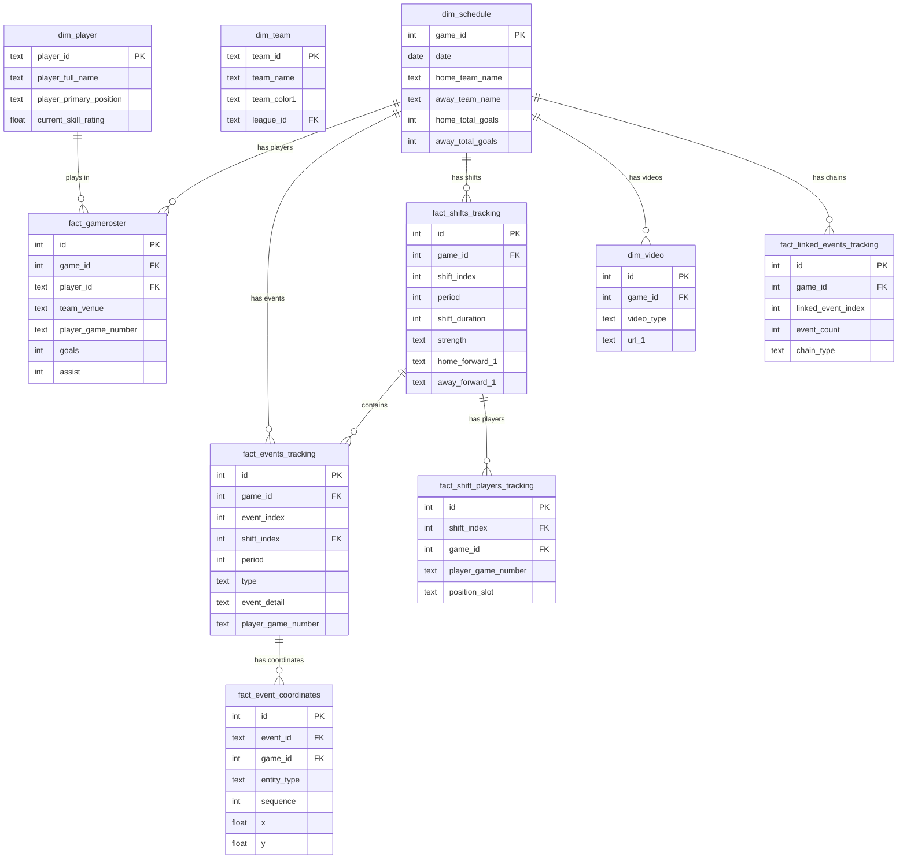
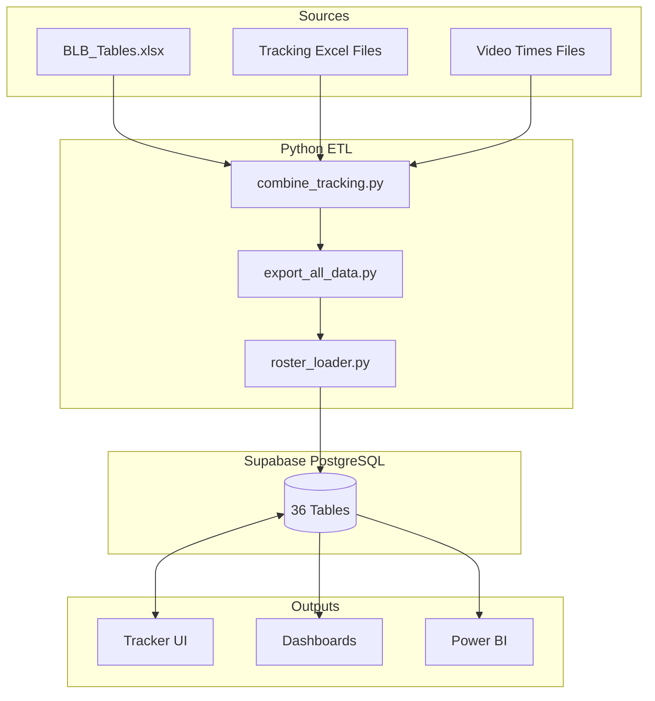
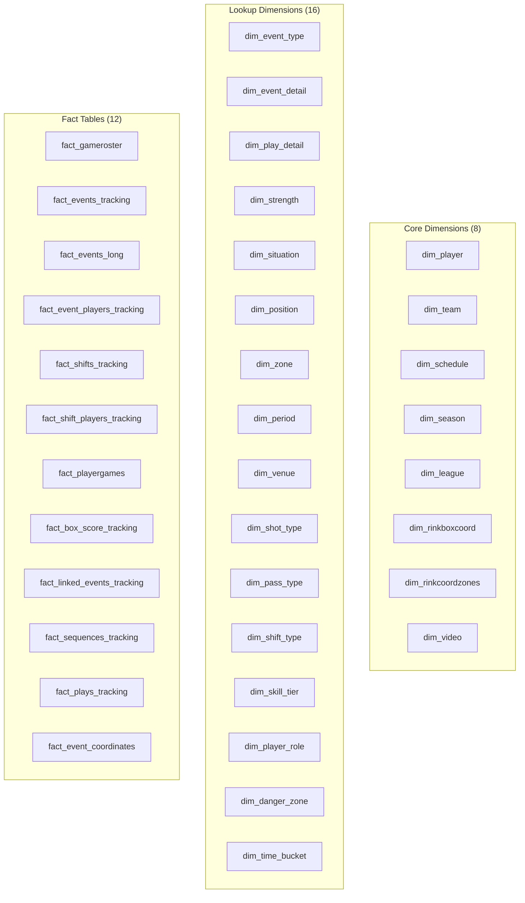
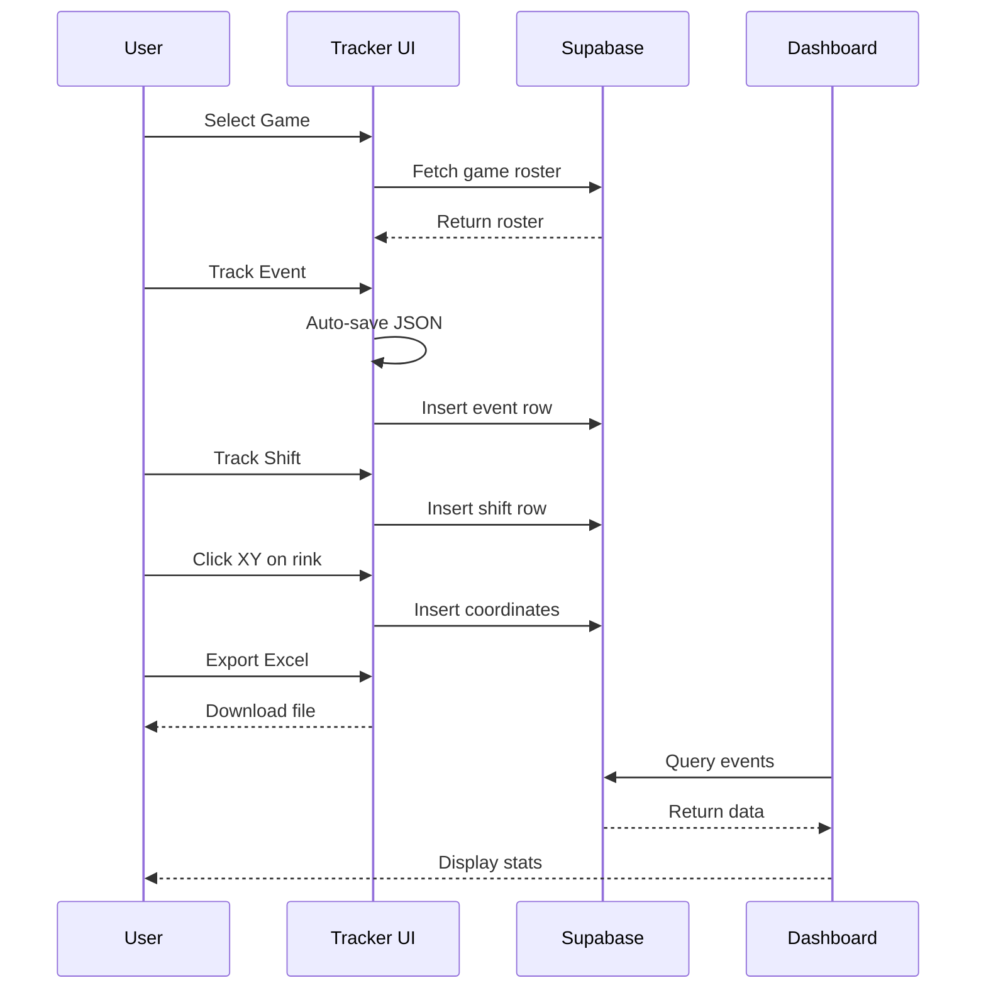

# BENCHSIGHT DATABASE SCHEMA

## Entity Relationship Diagram

```mermaid
erDiagram
    dim_player {
        text player_id PK
        text player_full_name
        text player_primary_position
        float current_skill_rating
    }
    
    dim_team {
        text team_id PK
        text team_name
        text team_color1
        text league_id FK
    }
    
    dim_schedule {
        int game_id PK
        date date
        text home_team_name
        text away_team_name
        int home_total_goals
        int away_total_goals
    }
    
    dim_video {
        int id PK
        int game_id FK
        text video_type
        text url_1
    }
    
    fact_gameroster {
        int id PK
        int game_id FK
        text player_id FK
        text team_venue
        text player_game_number
        int goals
        int assist
    }
    
    fact_events_tracking {
        int id PK
        int game_id FK
        int event_index
        int shift_index FK
        int period
        text type
        text event_detail
        text player_game_number
    }
    
    fact_shifts_tracking {
        int id PK
        int game_id FK
        int shift_index
        int period
        int shift_duration
        text strength
        text home_forward_1
        text away_forward_1
    }
    
    fact_shift_players_tracking {
        int id PK
        int shift_index FK
        int game_id FK
        text player_game_number
        text position_slot
    }
    
    fact_event_coordinates {
        int id PK
        text event_id FK
        int game_id FK
        text entity_type
        int sequence
        float x
        float y
    }
    
    fact_linked_events_tracking {
        int id PK
        int game_id FK
        int linked_event_index
        int event_count
        text chain_type
    }

    dim_schedule ||--o{ fact_gameroster : "has players"
    dim_schedule ||--o{ fact_events_tracking : "has events"
    dim_schedule ||--o{ fact_shifts_tracking : "has shifts"
    dim_schedule ||--o{ dim_video : "has videos"
    dim_schedule ||--o{ fact_linked_events_tracking : "has chains"
    
    dim_player ||--o{ fact_gameroster : "plays in"
    
    fact_shifts_tracking ||--o{ fact_events_tracking : "contains"
    fact_shifts_tracking ||--o{ fact_shift_players_tracking : "has players"
    
    fact_events_tracking ||--o{ fact_event_coordinates : "has coordinates"
```

## Data Flow Diagram

```mermaid
flowchart TD
    subgraph Sources
        A[BLB_Tables.xlsx]
        B[Tracking Excel Files]
        C[Video Times Files]
    end
    
    subgraph ETL["Python ETL"]
        D[combine_tracking.py]
        E[export_all_data.py]
        F[roster_loader.py]
    end
    
    subgraph Supabase["Supabase PostgreSQL"]
        G[(36 Tables)]
    end
    
    subgraph Outputs
        H[Tracker UI]
        I[Dashboards]
        J[Power BI]
    end
    
    A --> D
    B --> D
    C --> D
    D --> E
    E --> F
    F --> G
    
    G <--> H
    G --> I
    G --> J
```

## Table Categories

```mermaid
graph TB
    subgraph CoreDim["Core Dimensions (8)"]
        P[dim_player]
        T[dim_team]
        S[dim_schedule]
        SE[dim_season]
        L[dim_league]
        R[dim_rinkboxcoord]
        RZ[dim_rinkcoordzones]
        V[dim_video]
    end
    
    subgraph LookupDim["Lookup Dimensions (16)"]
        ET[dim_event_type]
        ED[dim_event_detail]
        PD[dim_play_detail]
        ST[dim_strength]
        SI[dim_situation]
        PO[dim_position]
        Z[dim_zone]
        PE[dim_period]
        VE[dim_venue]
        SHT[dim_shot_type]
        PT[dim_pass_type]
        SFT[dim_shift_type]
        SK[dim_skill_tier]
        PR[dim_player_role]
        DZ[dim_danger_zone]
        TB[dim_time_bucket]
    end
    
    subgraph Facts["Fact Tables (12)"]
        GR[fact_gameroster]
        EV[fact_events_tracking]
        EVL[fact_events_long]
        EP[fact_event_players_tracking]
        SH[fact_shifts_tracking]
        SP[fact_shift_players_tracking]
        PG[fact_playergames]
        BS[fact_box_score_tracking]
        LE[fact_linked_events_tracking]
        SEQ[fact_sequences_tracking]
        PL[fact_plays_tracking]
        CO[fact_event_coordinates]
    end
```

## Tracker Data Flow

```mermaid
sequenceDiagram
    participant U as User
    participant T as Tracker UI
    participant S as Supabase
    participant D as Dashboard
    
    U->>T: Select Game
    T->>S: Fetch game roster
    S-->>T: Return roster
    
    U->>T: Track Event
    T->>T: Auto-save JSON
    T->>S: Insert event row
    
    U->>T: Track Shift
    T->>S: Insert shift row
    
    U->>T: Click XY on rink
    T->>S: Insert coordinates
    
    U->>T: Export Excel
    T-->>U: Download file
    
    D->>S: Query events
    S-->>D: Return data
    D-->>U: Display stats
```
