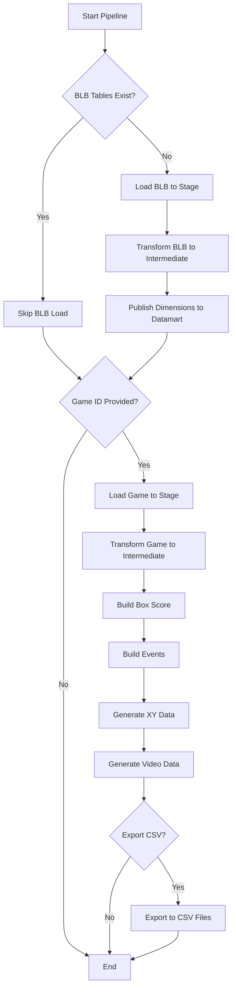
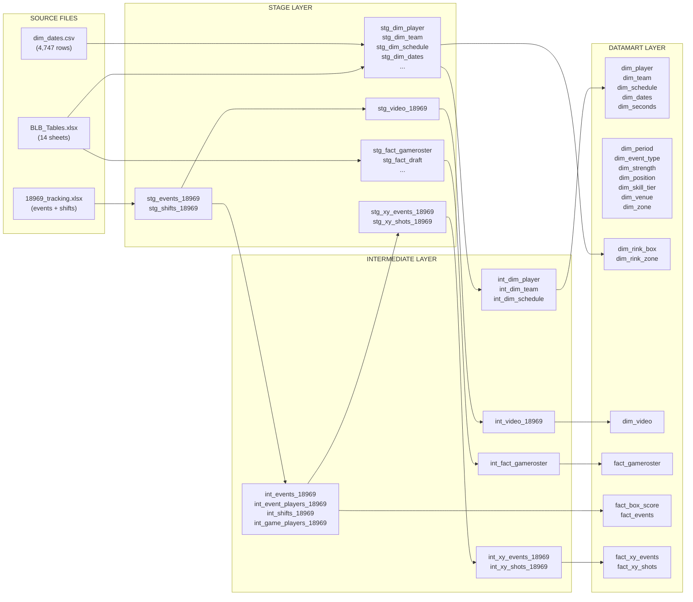

# Hockey Analytics ETL System - Complete Documentation

## Table of Contents
1. [System Overview](#system-overview)
2. [Architecture Diagram](#architecture-diagram)
3. [Key Standardization](#key-standardization)
4. [Module Execution Flow](#module-execution-flow)
5. [Data Pipeline Flowchart](#data-pipeline-flowchart)
6. [Complete Schema (56 Tables)](#complete-schema)
7. [Data Dictionary](#data-dictionary)
8. [Power BI Integration](#power-bi-integration)
9. [Code Module Reference](#code-module-reference)

---

## System Overview

The Hockey Analytics ETL system processes game tracking data through a **3-layer architecture**:

```
┌─────────────────────────────────────────────────────────────────────────────┐
│                           ETL ARCHITECTURE                                   │
├─────────────────────────────────────────────────────────────────────────────┤
│                                                                              │
│   ┌─────────────┐    ┌──────────────────┐    ┌─────────────────┐            │
│   │   SOURCE    │ -> │      STAGE       │ -> │  INTERMEDIATE   │            │
│   │    FILES    │    │    (stg_*)       │    │     (int_*)     │            │
│   └─────────────┘    └──────────────────┘    └────────┬────────┘            │
│         │                    │                        │                      │
│         │            Raw data loading          Transformations              │
│         │            Minimal changes           Cleaning, joins              │
│         │                                      Key generation               │
│         │                                             │                      │
│         │                                             ▼                      │
│         │                                    ┌─────────────────┐            │
│         │                                    │    DATAMART     │            │
│         │                                    │   (dim_, fact_) │            │
│         │                                    └────────┬────────┘            │
│         │                                             │                      │
│         │                                      Final tables                  │
│         │                                      Star schema                   │
│         │                                             │                      │
│         │                                             ▼                      │
│   ┌─────┴─────────────────────────────────────────────────────┐             │
│   │                      POWER BI / CSV                        │             │
│   └────────────────────────────────────────────────────────────┘             │
│                                                                              │
└─────────────────────────────────────────────────────────────────────────────┘
```

### Key Features
- **Standardized Keys**: All keys follow format `{PREFIX}{GAME_ID:05d}{INDEX:05d}`
- **Foreign Key Relationships**: Dimension tables linked to fact tables
- **XY Coordinate Integration**: Shot charts with rink zone lookups
- **Video Reference Linking**: Videos linked to events and goals

---

## Architecture Diagram

```mermaid
graph TB
    subgraph "SOURCE FILES"
        BLB[BLB_Tables.xlsx]
        DATES[dim_dates.csv]
        GAME[{game_id}_tracking.xlsx]
    end
    
    subgraph "STAGE LAYER (21 tables)"
        STG_DIM[stg_dim_*<br/>14 tables]
        STG_FACT[stg_fact_*<br/>4 tables]
        STG_GAME[stg_events/shifts_{game_id}<br/>3 tables per game]
    end
    
    subgraph "INTERMEDIATE LAYER (13 tables)"
        INT_DIM[int_dim_*<br/>5 tables]
        INT_FACT[int_fact_gameroster]
        INT_GAME[int_events/shifts_{game_id}<br/>6 tables per game]
    end
    
    subgraph "DATAMART LAYER (20 tables)"
        DIM[dim_*<br/>15 dimensions]
        FACT[fact_*<br/>5 facts]
    end
    
    BLB --> STG_DIM
    BLB --> STG_FACT
    DATES --> STG_DIM
    GAME --> STG_GAME
    
    STG_DIM --> INT_DIM
    STG_FACT --> INT_FACT
    STG_GAME --> INT_GAME
    
    INT_DIM --> DIM
    INT_FACT --> FACT
    INT_GAME --> FACT
    
    DIM --> POWERBI[Power BI]
    FACT --> POWERBI
```

---

## Key Standardization

### Key Format
All keys follow the pattern: `{PREFIX}{GAME_ID:05d}{INDEX:05d}`

**Total Length**: 12 characters
- 2 character prefix
- 5 digit game ID (zero-padded)
- 5 digit index (zero-padded)

### Prefix Codes

| Prefix | Entity | Example | Description |
|--------|--------|---------|-------------|
| **EV** | Event | `EV1896901000` | Game events (shots, passes, etc.) |
| **SH** | Shift | `SH1896900001` | Line changes/shifts |
| **EP** | Event Player | `EP1896900001` | Player involvement in event |
| **GP** | Game Player | `GP1896900021` | Player in specific game |
| **SQ** | Sequence | `SQ1896905001` | Play sequences |
| **PL** | Play | `PL1896906001` | Individual plays |
| **LK** | Linked Event | `LK1896909001` | Linked/related events |
| **BS** | Box Score | `BS1896900001` | Player game statistics |
| **XY** | XY Event | `XY1896900000` | Event coordinate location |
| **XS** | XY Shot | `XS1896900000` | Shot coordinate location |
| **VD** | Video | `VD1896900000` | Video references |

### Key Examples

```
Game 18969, Event 1000:
  event_key:     EV1896901000
  shift_key:     SH1896900001
  sequence_key:  SQ1896905001
  play_key:      PL1896906001
  xy_event_key:  XY1896900000
  
For linked events (same location on ice):
  event 1005 links to event 9001
  linked_event_key: LK1896909001
```

---

## Module Execution Flow

### Main Entry Point: `main.py`

```
┌──────────────────────────────────────────────────────────────────────────────┐
│                              main.py                                          │
│                         (Entry Point)                                         │
├──────────────────────────────────────────────────────────────────────────────┤
│                                                                               │
│   Command Line Arguments:                                                     │
│   ┌─────────────────────────────────────────────────────────────────────┐    │
│   │ --game 18969           Process single game                          │    │
│   │ --games 18969,18970    Process multiple games                       │    │
│   │ --reload-blb           Force reload BLB tables                      │    │
│   │ --status               Show pipeline status                         │    │
│   │ --export               Export to CSV                                │    │
│   │ --overwrite 18969      Overwrite existing game (needs --confirm)    │    │
│   └─────────────────────────────────────────────────────────────────────┘    │
│                                     │                                         │
│                                     ▼                                         │
│                          ┌──────────────────┐                                 │
│                          │ PipelineOrchestrator │                             │
│                          └──────────────────┘                                 │
│                                                                               │
└──────────────────────────────────────────────────────────────────────────────┘
```

### Pipeline Orchestrator Flow



### Detailed Module Sequence

```
┌────────────────────────────────────────────────────────────────────────────────┐
│                        FULL PIPELINE EXECUTION SEQUENCE                         │
├────────────────────────────────────────────────────────────────────────────────┤
│                                                                                 │
│  1. BLB PROCESSING                                                              │
│  ═══════════════════                                                            │
│     ┌─────────────────────────────────────────────────────────────────────┐    │
│     │ load_blb_tables.py                                                   │    │
│     │   ├── Read BLB_Tables.xlsx                                           │    │
│     │   ├── Read dim_dates.csv                                             │    │
│     │   └── Create 18 stg_* tables                                         │    │
│     └─────────────────────────────────────────────────────────────────────┘    │
│                              │                                                  │
│                              ▼                                                  │
│     ┌─────────────────────────────────────────────────────────────────────┐    │
│     │ transform_blb.py                                                     │    │
│     │   ├── Execute src/sql/intermediate/transform_blb.sql                 │    │
│     │   ├── Create int_dim_player (335 rows)                               │    │
│     │   ├── Create int_dim_team (26 rows)                                  │    │
│     │   ├── Create int_dim_schedule (552 rows)                             │    │
│     │   └── Create int_fact_gameroster (13,960 rows)                       │    │
│     └─────────────────────────────────────────────────────────────────────┘    │
│                              │                                                  │
│                              ▼                                                  │
│     ┌─────────────────────────────────────────────────────────────────────┐    │
│     │ publish_dimensions.py                                                │    │
│     │   ├── publish_blb_to_datamart()                                      │    │
│     │   │     ├── dim_player, dim_team, dim_schedule                       │    │
│     │   │     ├── dim_dates, dim_seconds                                   │    │
│     │   │     └── fact_gameroster                                          │    │
│     │   └── publish_static_dimensions()                                    │    │
│     │         ├── dim_period (5 rows)                                      │    │
│     │         ├── dim_event_type (7 rows)                                  │    │
│     │         ├── dim_strength (9 rows)                                    │    │
│     │         ├── dim_position (8 rows)                                    │    │
│     │         ├── dim_skill_tier (5 rows)                                  │    │
│     │         ├── dim_venue (2 rows)                                       │    │
│     │         └── dim_zone (3 rows)                                        │    │
│     └─────────────────────────────────────────────────────────────────────┘    │
│                                                                                 │
│  2. GAME PROCESSING (per game)                                                  │
│  ══════════════════════════════                                                 │
│     ┌─────────────────────────────────────────────────────────────────────┐    │
│     │ load_game_tracking.py                                                │    │
│     │   ├── Read {game_id}_tracking.xlsx                                   │    │
│     │   ├── Create stg_events_{game_id} (~3,596 rows)                      │    │
│     │   └── Create stg_shifts_{game_id} (~98 rows)                         │    │
│     └─────────────────────────────────────────────────────────────────────┘    │
│                              │                                                  │
│                              ▼                                                  │
│     ┌─────────────────────────────────────────────────────────────────────┐    │
│     │ transform_game.py                                                    │    │
│     │   ├── Execute src/sql/intermediate/transform_game.sql                │    │
│     │   ├── STANDARDIZED KEY GENERATION                                    │    │
│     │   │     ├── EV{game_id:05d}{index:05d} for events                    │    │
│     │   │     ├── SH{game_id:05d}{index:05d} for shifts                    │    │
│     │   │     ├── EP{game_id:05d}{index:05d} for event_players             │    │
│     │   │     ├── GP{game_id:05d}{index:05d} for game_players              │    │
│     │   │     ├── SQ{game_id:05d}{index:05d} for sequences                 │    │
│     │   │     ├── PL{game_id:05d}{index:05d} for plays                     │    │
│     │   │     └── LK{game_id:05d}{index:05d} for linked events             │    │
│     │   ├── Create int_events_{game_id} (1,594 rows)                       │    │
│     │   ├── Create int_event_players_{game_id} (3,139 rows)                │    │
│     │   ├── Create int_shifts_{game_id} (98 rows)                          │    │
│     │   └── Create int_game_players_{game_id} (27 rows)                    │    │
│     └─────────────────────────────────────────────────────────────────────┘    │
│                              │                                                  │
│                              ▼                                                  │
│     ┌─────────────────────────────────────────────────────────────────────┐    │
│     │ build_box_score.py                                                   │    │
│     │   ├── Aggregate player stats from int_events_{game_id}               │    │
│     │   ├── Join with int_game_players_{game_id}                           │    │
│     │   ├── Calculate TOI from int_shifts_{game_id}                        │    │
│     │   ├── Compute per-60 stats                                           │    │
│     │   └── Insert into fact_box_score (27 rows per game)                  │    │
│     └─────────────────────────────────────────────────────────────────────┘    │
│                              │                                                  │
│                              ▼                                                  │
│     ┌─────────────────────────────────────────────────────────────────────┐    │
│     │ build_events.py                                                      │    │
│     │   └── Copy int_events_{game_id} to fact_events (1,594 rows)          │    │
│     └─────────────────────────────────────────────────────────────────────┘    │
│                              │                                                  │
│                              ▼                                                  │
│     ┌─────────────────────────────────────────────────────────────────────┐    │
│     │ build_enhanced_data.py                                               │    │
│     │   ├── publish_rink_dimensions()                                      │    │
│     │   │     ├── dim_rink_box (50 rows)                                   │    │
│     │   │     └── dim_rink_zone (297 rows)                                 │    │
│     │   ├── generate_xy_data_for_game()                                    │    │
│     │   │     ├── Create stg_xy_events_{game_id} (1,594 rows)              │    │
│     │   │     ├── Create stg_xy_shots_{game_id} (181 rows)                 │    │
│     │   │     ├── Transform to int_xy_events/shots                         │    │
│     │   │     ├── Lookup rink_box_id from dim_rink_box                     │    │
│     │   │     ├── Lookup rink_zone_id from dim_rink_zone                   │    │
│     │   │     ├── Insert into fact_xy_events (1,594 rows)                  │    │
│     │   │     └── Insert into fact_xy_shots (181 rows)                     │    │
│     │   └── generate_video_data_for_game()                                 │    │
│     │         ├── Create video records for full game                       │    │
│     │         ├── Create video records for each period                     │    │
│     │         ├── Create video records for each goal                       │    │
│     │         └── Insert into dim_video (11 rows per game)                 │    │
│     └─────────────────────────────────────────────────────────────────────┘    │
│                                                                                 │
│  3. EXPORT (optional)                                                           │
│  ════════════════════                                                           │
│     ┌─────────────────────────────────────────────────────────────────────┐    │
│     │ export_to_csv.py                                                     │    │
│     │   ├── Export all dim_* tables to CSV                                 │    │
│     │   ├── Export all fact_* tables to CSV                                │    │
│     │   └── Save to data/output/                                           │    │
│     └─────────────────────────────────────────────────────────────────────┘    │
│                                                                                 │
└────────────────────────────────────────────────────────────────────────────────┘
```

---

## Data Pipeline Flowchart



---

## Complete Schema

### Summary (56 Tables)

| Layer | Count | Description |
|-------|-------|-------------|
| Stage | 21 | Raw data from source files |
| Intermediate | 13 | Transformed with standardized keys |
| Datamart | 20 | Final analytical tables |
| Metadata | 2 | ETL tracking |

### Stage Layer (21 Tables)

| Table | Rows | Description |
|-------|------|-------------|
| stg_dim_dates | 4,747 | Date dimension from CSV |
| stg_dim_league | 2 | League reference |
| stg_dim_player | 335 | Player master data |
| stg_dim_playerurlref | 543 | Player URL references |
| stg_dim_randomnames | 486 | Anonymization names |
| stg_dim_rinkboxcoord | 50 | Rink box coordinates |
| stg_dim_rinkcoordzones | 297 | Rink zone coordinates |
| stg_dim_schedule | 552 | Game schedule |
| stg_dim_season | 9 | Season reference |
| stg_dim_seconds | 4,800 | Time dimension |
| stg_dim_team | 26 | Team master data |
| stg_events_{game_id} | ~3,596 | Raw game events |
| stg_shifts_{game_id} | ~98 | Raw shifts |
| stg_xy_events_{game_id} | ~1,594 | XY coordinates for events |
| stg_xy_shots_{game_id} | ~181 | XY coordinates for shots |
| stg_video_{game_id} | ~11 | Video references |
| stg_fact_draft | 160 | Draft picks |
| stg_fact_gameroster | 14,239 | Player game appearances |
| stg_fact_leadership | 28 | Team leadership |
| stg_fact_playergames | 3,010 | Historical player games |
| stg_fact_registration | 191 | Season registrations |

### Intermediate Layer (13 Tables)

| Table | Rows | Key Column | Description |
|-------|------|------------|-------------|
| int_dim_dates | 4,747 | date_key | Cleaned date dimension |
| int_dim_player | 335 | player_id | Player with display_name |
| int_dim_schedule | 552 | game_id | Schedule with winner |
| int_dim_seconds | 4,800 | time_key | Time dimension |
| int_dim_team | 26 | team_id | Team with abbreviation |
| int_events_{game_id} | 1,594 | event_key (EV) | Events with standardized keys |
| int_event_players_{game_id} | 3,139 | event_player_key (EP) | Player-event associations |
| int_game_players_{game_id} | 27 | player_game_key (GP) | Players in game |
| int_shifts_{game_id} | 98 | shift_key (SH) | Shifts with standardized keys |
| int_xy_events_{game_id} | 1,594 | xy_event_key (XY) | XY with FK lookups |
| int_xy_shots_{game_id} | 181 | xy_shot_key (XS) | Shots with metrics |
| int_video_{game_id} | 11 | video_key (VD) | Video with event links |
| int_fact_gameroster | 13,960 | player_game_key | Deduplicated roster |

### Datamart Layer (20 Tables)

#### Dimension Tables (15)

| Table | Rows | Primary Key | Foreign Keys |
|-------|------|-------------|--------------|
| dim_dates | 4,747 | date_key | - |
| dim_event_type | 7 | event_type | - |
| dim_period | 5 | period_id | - |
| dim_player | 335 | player_id | - |
| dim_position | 8 | position_code | - |
| dim_rink_box | 50 | box_id | - |
| dim_rink_zone | 297 | box_id | - |
| dim_schedule | 552 | game_id | home_team_id → dim_team, away_team_id → dim_team |
| dim_seconds | 4,800 | time_key | - |
| dim_skill_tier | 5 | tier_id | - |
| dim_strength | 9 | strength | - |
| dim_team | 26 | team_id | - |
| dim_venue | 2 | venue_code | - |
| dim_video | 11+ | video_key | game_id → dim_schedule, event_key → fact_events |
| dim_zone | 3 | zone_code | - |

#### Fact Tables (5)

| Table | Rows | Primary Key | Foreign Keys |
|-------|------|-------------|--------------|
| fact_box_score | 27+ | player_game_key | game_id → dim_schedule, player_id → dim_player |
| fact_events | 1,594+ | event_key | game_id → dim_schedule, period → dim_period |
| fact_gameroster | 13,960 | player_game_key | game_id → dim_schedule, player_id → dim_player |
| fact_xy_events | 1,594+ | xy_event_key | game_id → dim_schedule, rink_box_id → dim_rink_box, rink_zone_id → dim_rink_zone |
| fact_xy_shots | 181+ | xy_shot_key | game_id → dim_schedule, rink_box_id → dim_rink_box |

---

## Data Dictionary

### Key Tables

#### fact_events
| Column | Type | Key | Description |
|--------|------|-----|-------------|
| event_key | TEXT | PK | EV{game_id:05d}{index:05d} |
| event_index | INTEGER | | Original event index |
| shift_key | TEXT | FK→int_shifts | SH{game_id:05d}{index:05d} |
| linked_event_key | TEXT | FK→fact_events | LK{game_id:05d}{index:05d} for related events |
| sequence_key | TEXT | | SQ{game_id:05d}{index:05d} for play sequences |
| play_key | TEXT | | PL{game_id:05d}{index:05d} for individual plays |
| event_type | TEXT | FK→dim_event_type | shot, pass, goal, etc. |
| event_detail | TEXT | | Additional event info |
| period | INTEGER | FK→dim_period | 1, 2, 3, 4 (OT) |
| time_total_seconds | INTEGER | FK→dim_seconds | Game time in seconds |
| event_team_zone | TEXT | FK→dim_zone | O, D, N |
| game_id | INTEGER | FK→dim_schedule | Game identifier |

#### fact_xy_events
| Column | Type | Key | Description |
|--------|------|-----|-------------|
| xy_event_key | TEXT | PK | XY{game_id:05d}{index:05d} |
| event_key | TEXT | FK→fact_events | EV{game_id:05d}{index:05d} |
| linked_event_key | TEXT | FK→fact_events | For events at same location |
| x_coord | REAL | | -100 to 100 (center ice = 0) |
| y_coord | REAL | | -42.5 to 42.5 (center ice = 0) |
| rink_box_id | TEXT | FK→dim_rink_box | Box coordinate ID |
| rink_zone_id | TEXT | FK→dim_rink_zone | Zone coordinate ID |
| danger | TEXT | | HIGH, MEDIUM, LOW |
| game_id | INTEGER | FK→dim_schedule | Game identifier |

#### fact_xy_shots
| Column | Type | Key | Description |
|--------|------|-----|-------------|
| xy_shot_key | TEXT | PK | XS{game_id:05d}{index:05d} |
| event_key | TEXT | FK→fact_events | EV{game_id:05d}{index:05d} |
| x_coord | REAL | | Shot X position |
| y_coord | REAL | | Shot Y position |
| shot_distance | REAL | | Distance to goal in feet |
| shot_angle | REAL | | Angle to goal in degrees |
| is_goal | INTEGER | | 1 if goal, 0 otherwise |
| rink_box_id | TEXT | FK→dim_rink_box | Box coordinate ID |
| danger | TEXT | | HIGH, MEDIUM, LOW |

#### dim_video
| Column | Type | Key | Description |
|--------|------|-----|-------------|
| video_key | TEXT | PK | VD{game_id:05d}{index:05d} |
| video_type | TEXT | | full_game, period, highlight |
| video_category | TEXT | | main, period_1, goal, etc. |
| url_primary | TEXT | | Primary video URL |
| url_embed | TEXT | | Embed URL |
| duration_seconds | INTEGER | | Video duration |
| event_key | TEXT | FK→fact_events | For goal highlights |
| game_id | INTEGER | FK→dim_schedule | Game identifier |

---

## Power BI Integration

### Star Schema Relationships

```
                    ┌─────────────┐
                    │  dim_dates  │
                    └──────┬──────┘
                           │
                    ┌──────┴──────┐
                    │dim_schedule │──────┐
                    └──────┬──────┘      │
                           │             │
         ┌─────────────────┼─────────────┼─────────────────┐
         │                 │             │                 │
    ┌────┴────┐     ┌──────┴──────┐   ┌──┴───┐      ┌─────┴─────┐
    │dim_team │     │fact_gameroster│ │dim_player│  │fact_box_score│
    └─────────┘     └──────┬──────┘   └──────┘      └─────┬─────┘
                           │                               │
                    ┌──────┴──────┐                 ┌──────┴──────┐
                    │ fact_events │                 │fact_xy_events│
                    └──────┬──────┘                 └──────┬──────┘
                           │                               │
                    ┌──────┴──────┐                 ┌──────┴──────┐
                    │ dim_period  │                 │dim_rink_box │
                    └─────────────┘                 └─────────────┘
```

### Recommended Relationships in Power BI

1. **dim_schedule[game_id]** → **fact_box_score[game_id]** (1:*)
2. **dim_schedule[game_id]** → **fact_events[game_id]** (1:*)
3. **dim_schedule[game_id]** → **fact_xy_events[game_id]** (1:*)
4. **dim_player[player_id]** → **fact_box_score[player_id]** (1:*)
5. **dim_period[period_id]** → **fact_events[period]** (1:*)
6. **dim_rink_box[box_id]** → **fact_xy_events[rink_box_id]** (1:*)
7. **dim_rink_zone[box_id]** → **fact_xy_events[rink_zone_id]** (1:*)
8. **fact_events[event_key]** → **fact_xy_events[event_key]** (1:1)
9. **fact_events[event_key]** → **dim_video[event_key]** (1:*)

---

## Code Module Reference

### Directory Structure

```
hockey_analytics_project/
├── main.py                          # Entry point, CLI, interactive menu
├── config/
│   ├── settings.py                  # Configuration management
│   └── config.ini                   # Environment settings
├── src/
│   ├── database/
│   │   ├── connection.py            # Database connection management
│   │   └── table_operations.py      # CRUD operations, utilities
│   ├── pipeline/
│   │   ├── orchestrator.py          # Pipeline coordination
│   │   ├── game_management.py       # Overwrite/delete with safeguards
│   │   ├── stage/
│   │   │   ├── load_blb_tables.py   # Load BLB Excel file
│   │   │   ├── load_game_tracking.py# Load game tracking Excel
│   │   │   └── load_video_times.py  # Load video data
│   │   ├── intermediate/
│   │   │   ├── transform_blb.py     # BLB transformations
│   │   │   └── transform_game.py    # Game transformations
│   │   └── datamart/
│   │       ├── publish_dimensions.py# Dimension publishing
│   │       ├── build_box_score.py   # Box score fact table
│   │       ├── build_events.py      # Events fact table
│   │       ├── build_enhanced_data.py # XY and video data
│   │       └── export_to_csv.py     # CSV export
│   ├── sql/
│   │   └── intermediate/
│   │       ├── transform_blb.sql    # BLB SQL transformations
│   │       └── transform_game.sql   # Game SQL with key generation
│   └── utils/
│       └── logger.py                # Logging configuration
├── data/
│   ├── raw/                         # Source files
│   │   ├── BLB_Tables.xlsx
│   │   ├── dim_dates.csv
│   │   └── games/{game_id}/
│   ├── hockey_analytics.db          # SQLite database
│   └── output/                      # CSV exports
└── docs/                            # Documentation
```

### Module Dependencies

```
main.py
    └── orchestrator.py
            ├── load_blb_tables.py
            │       └── table_operations.py
            ├── transform_blb.py
            │       └── sql/intermediate/transform_blb.sql
            ├── publish_dimensions.py
            ├── load_game_tracking.py
            ├── transform_game.py
            │       └── sql/intermediate/transform_game.sql
            ├── build_box_score.py
            ├── build_events.py
            └── build_enhanced_data.py
                    ├── XY coordinate generation
                    ├── Rink dimension lookup
                    └── Video data generation
```

---

## Appendix: Key Generation Code

```python
# From src/pipeline/datamart/build_enhanced_data.py

KEY_PREFIX = {
    'event': 'EV',
    'shift': 'SH',
    'event_player': 'EP',
    'game_player': 'GP',
    'sequence': 'SQ',
    'play': 'PL',
    'linked': 'LK',
    'box_score': 'BS',
    'xy_event': 'XY',
    'xy_shot': 'XS',
    'video': 'VD',
}

def generate_key(prefix: str, game_id: int, index: int) -> str:
    """
    Generate standardized key.
    
    Format: {PREFIX:2}{GAME_ID:05d}{INDEX:05d}
    Total: 12 characters
    
    Examples:
        generate_key('EV', 18969, 1000) -> 'EV1896901000'
        generate_key('XY', 18969, 0) -> 'XY1896900000'
    """
    return f"{prefix}{game_id:05d}{index:05d}"
```

---

*Generated: 2025-12-20*
*Version: 2.0 with Standardized Keys, XY Data, and Video Integration*
