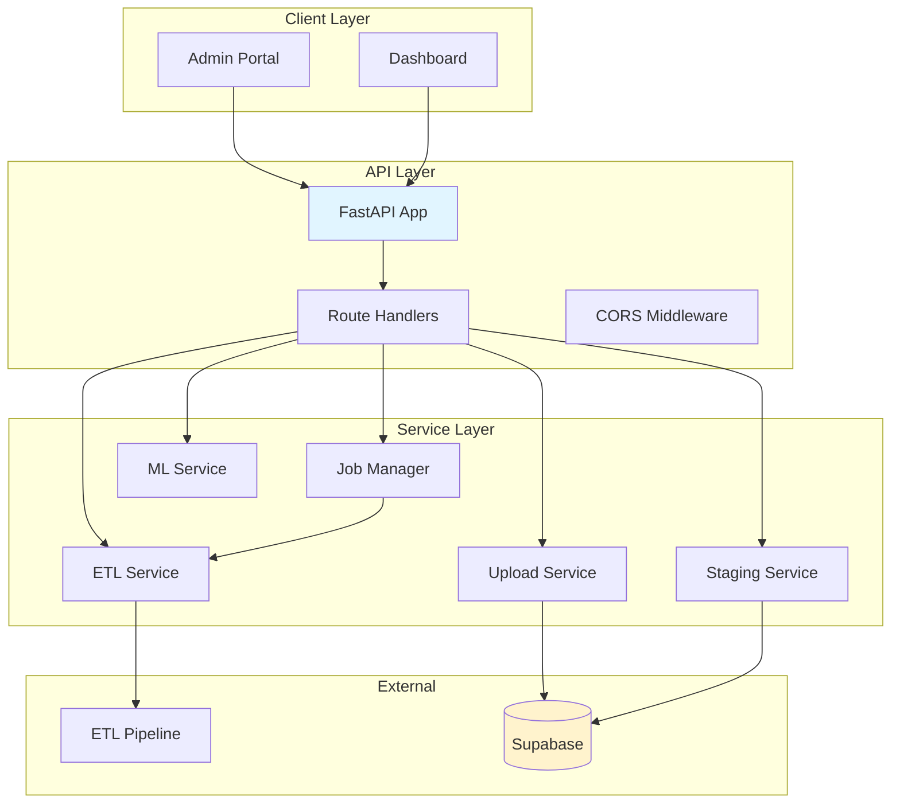

# BenchSight API Reference

**Complete API architecture, integration, and endpoint documentation**

Last Updated: 2026-01-21
Version: 2.00

---

## Overview

The BenchSight API is a FastAPI application that provides REST endpoints for ETL job management, data upload, staging, and ML predictions.

**Framework:** FastAPI  
**Language:** Python 3.11+  
**Server:** Uvicorn (ASGI)  
**Base URL:** `http://localhost:8000` (development)  
**API Prefix:** `/api`  
**Documentation:** `/docs` (Swagger UI), `/redoc` (ReDoc)  
**Deployment:** Railway/Render (planned)

**Related Documentation:**
- [API_ARCHITECTURE_DIAGRAMS.md](API_ARCHITECTURE_DIAGRAMS.md) - **NEW** Visual API architecture diagrams (endpoints, job processing, integration)

---

## Table of Contents

1. [Architecture](#architecture)
2. [Project Structure](#project-structure)
3. [Endpoints](#endpoints)
4. [Integration](#integration)
5. [Models](#models)
6. [Services](#services)
7. [Deployment](#deployment)

---

## Architecture

### High-Level Architecture



### Component Architecture

**FastAPI Application (`main.py`):**
- FastAPI app initialization
- CORS middleware configuration
- Router registration
- Global exception handling
- Startup/shutdown events

**Route Handlers (`routes/`):**
- HTTP endpoint handlers
- Request validation
- Response formatting
- Error handling

**Service Layer (`services/`):**
- Business logic
- External integrations
- Job management
- Background processing

---

## Project Structure

```
api/
├── main.py                 # FastAPI app entry point
├── config.py               # Configuration
├── requirements.txt        # Dependencies
├── routes/                 # Route handlers
│   ├── __init__.py
│   ├── health.py           # Health endpoints
│   ├── etl.py              # ETL endpoints
│   ├── upload.py           # Upload endpoints
│   ├── staging.py          # Staging endpoints
│   └── ml.py               # ML endpoints
├── services/               # Service layer
│   ├── __init__.py
│   ├── etl_service.py      # ETL service
│   ├── upload_service.py   # Upload service
│   ├── staging_service.py # Staging service
│   ├── job_manager.py     # Job tracking
│   └── ml_service.py      # ML service
├── models/                 # Data models
│   ├── __init__.py
│   ├── job.py             # Job models
│   ├── ml.py              # ML models
│   ├── staging.py         # Staging models
│   └── upload.py          # Upload models
└── utils/                  # Utilities
    ├── __init__.py
    └── logger.py          # Logging
```

---

## Endpoints

### Health & Status

#### `GET /api/health`

Simple health check endpoint.

**Response:**
```json
{
  "status": "healthy",
  "version": "1.0.0",
  "timestamp": "2026-01-15T10:00:00Z"
}
```

#### `GET /api/status`

Detailed system status.

**Response:**
```json
{
  "status": "healthy",
  "version": "1.0.0",
  "environment": "development",
  "etl_available": true,
  "supabase_connected": true,
  "timestamp": "2026-01-15T10:00:00Z"
}
```

---

### ETL Jobs

#### `POST /api/etl/trigger`

Trigger an ETL job.

**Request Body:**
```json
{
  "mode": "full",
  "game_ids": [18969, 18977],
  "source": "excel",
  "exclude_game_ids": [18965],
  "options": {
    "wipe": false,
    "upload_to_supabase": true
  }
}
```

**Modes:**
- `full`: Run full ETL (all games)
- `incremental`: Run incremental ETL (new games only - not yet implemented)
- `single`: Run ETL for specific game IDs
- `test`: Test mode (validation only)

**Response:**
```json
{
  "job_id": "abc123",
  "status": "running",
  "mode": "full",
  "created_at": "2026-01-15T10:00:00Z",
  "progress": 0,
  "current_step": "Starting ETL..."
}
```

#### `GET /api/etl/status/{job_id}`

Get status of an ETL job.

**Response:**
```json
{
  "job_id": "abc123",
  "status": "completed",
  "mode": "full",
  "created_at": "2026-01-15T10:00:00Z",
  "completed_at": "2026-01-15T10:01:20Z",
  "progress": 100,
  "current_step": "ETL complete",
  "result": {
    "tables_created": 139,
    "duration_seconds": 80
  }
}
```

#### `GET /api/etl/history`

Get ETL job history.

**Query Parameters:**
- `limit` (optional): Maximum number of jobs to return (default: 10)
- `status` (optional): Filter by status (`pending`, `running`, `completed`, `failed`, `cancelled`)

**Response:**
```json
[
  {
    "job_id": "abc123",
    "status": "completed",
    "mode": "full",
    "created_at": "2026-01-15T10:00:00Z"
  }
]
```

#### `POST /api/etl/cancel/{job_id}`

Cancel a running ETL job.

**Response:**
```json
{
  "job_id": "abc123",
  "status": "cancelled",
  "cancelled_at": "2026-01-15T10:00:30Z"
}
```

---

### Upload Endpoints

#### `POST /api/upload/to-supabase`

Upload tables to Supabase.

**Request Body:**
```json
{
  "tables": ["fact_events", "dim_player"],
  "mode": "all",
  "options": {
    "replace": false,
    "batch_size": 1000
  }
}
```

**Modes:**
- `all`: Upload all tables (default)
- `dims`: Upload dimension tables only (`dim_*`)
- `facts`: Upload fact tables only (`fact_*`)
- `qa`: Upload QA/lookup tables only (`qa_*`, `lookup_*`)
- `basic`: Upload basic stats tables only (`*_basic`)
- `tracking`: Upload tracking-derived tables

**Response:**
```json
{
  "job_id": "upload123",
  "status": "running",
  "mode": "all",
  "created_at": "2026-01-15T10:00:00Z"
}
```

#### `POST /api/upload/generate-schema`

Generate Supabase schema SQL.

Creates/updates `sql/reset_supabase.sql` with DROP and CREATE TABLE statements.

**Request Body:**
```json
{
  "options": {}
}
```

**Response:**
```json
{
  "job_id": "schema123",
  "status": "completed",
  "result": {
    "schema_file": "sql/reset_supabase.sql",
    "tables_generated": 139
  }
}
```

#### `GET /api/upload/status/{job_id}`

Get status of an upload job.

**Response:**
```json
{
  "job_id": "upload123",
  "status": "completed",
  "progress": 100,
  "tables_uploaded": 139,
  "rows_uploaded": 50000
}
```

---

### Staging Endpoints

#### `POST /api/staging/blb-tables/upload`

Upload BLB table data to staging.

**Request Body:**
```json
{
  "table_name": "dim_player",
  "data": [
    {"player_id": "P001", "first_name": "John", "last_name": "Doe"},
    {"player_id": "P002", "first_name": "Jane", "last_name": "Smith"}
  ],
  "replace": false
}
```

**Response:**
```json
{
  "table_name": "dim_player",
  "rows_inserted": 2,
  "rows_updated": 0,
  "errors": []
}
```

#### `PUT /api/staging/blb-tables/update`

Update rows in BLB staging table.

**Request Body:**
```json
{
  "table_name": "dim_player",
  "filter_column": "player_id",
  "filter_value": "P001",
  "updates": {"first_name": "Johnny", "current_skill_rating": 85}
}
```

**Response:**
```json
{
  "table_name": "dim_player",
  "rows_updated": 1
}
```

#### `GET /api/staging/blb-tables/list`

Get list of valid BLB table names.

**Response:**
```json
[
  "dim_player",
  "dim_team",
  "dim_schedule",
  ...
]
```

#### `POST /api/staging/tracking/upload`

Upload tracking data (events/shifts) to staging.

**Request Body:**
```json
{
  "game_id": 18969,
  "events": [
    {"tracking_event_index": "1", "period": "1", "Type": "Shot"}
  ],
  "shifts": [
    {"shift_index": "1", "Period": "1", "shift_start_type": "Faceoff"}
  ]
}
```

**Response:**
```json
{
  "game_id": 18969,
  "events_inserted": 1,
  "shifts_inserted": 1,
  "errors": []
}
```

#### `DELETE /api/staging/blb-tables/{table_name}`

Clear all data from a BLB staging table.

**Query Parameters:**
- `confirm` (required): Must be `true` to confirm deletion

**Response:**
```json
{
  "table_name": "dim_player",
  "rows_deleted": 337,
  "status": "cleared"
}
```

---

### ML Endpoints

#### `POST /api/ml/predict/player-stats`

Predict player statistics.

**Request Body:**
```json
{
  "player_id": "P100001",
  "season_id": "2024-25",
  "games_remaining": 10
}
```

**Response:**
```json
{
  "player_id": "P100001",
  "predicted_stats": {
    "goals": 25,
    "assists": 30,
    "points": 55
  },
  "confidence": 0.85
}
```

#### `POST /api/ml/predict/game-outcome`

Predict game outcome.

**Request Body:**
```json
{
  "game_id": 18969,
  "home_team": "Team A",
  "away_team": "Team B"
}
```

**Response:**
```json
{
  "game_id": 18969,
  "predicted_winner": "Team A",
  "predicted_score": {
    "home": 4,
    "away": 2
  },
  "win_probability": 0.72
}
```

#### `POST /api/ml/find/similar-players`

Find similar players.

**Request Body:**
```json
{
  "player_id": "P100001",
  "limit": 5
}
```

**Response:**
```json
{
  "player_id": "P100001",
  "similar_players": [
    {
      "player_id": "P100002",
      "similarity_score": 0.92,
      "similar_attributes": ["position", "playing_style"]
    }
  ]
}
```

#### `POST /api/ml/predict/line-chemistry`

Predict line chemistry.

**Request Body:**
```json
{
  "player_ids": ["P100001", "P100002", "P100003"],
  "team_id": "T001"
}
```

**Response:**
```json
{
  "line_chemistry_score": 0.88,
  "predicted_performance": {
    "goals_per_game": 2.5,
    "corsi_pct": 55.2
  }
}
```

#### `GET /api/ml/predict/playoff-probability`

Get playoff probability for teams.

**Query Parameters:**
- `team_id` (optional): Filter by team
- `season_id` (optional): Filter by season

**Response:**
```json
[
  {
    "team_id": "T001",
    "team_name": "Team A",
    "playoff_probability": 0.85,
    "current_standing": 2
  }
]
```

#### `GET /api/ml/detect/breakout-players`

Detect breakout players.

**Query Parameters:**
- `season_id` (optional): Filter by season
- `limit` (optional): Maximum results (default: 10)

**Response:**
```json
[
  {
    "player_id": "P100001",
    "player_name": "John Doe",
    "breakout_score": 0.92,
    "improvement_pct": 45.2
  }
]
```

#### `GET /api/ml/assess/injury-risk`

Assess injury risk for players.

**Query Parameters:**
- `player_id` (optional): Filter by player
- `season_id` (optional): Filter by season

**Response:**
```json
[
  {
    "player_id": "P100001",
    "player_name": "John Doe",
    "injury_risk_score": 0.25,
    "risk_factors": ["high_minutes", "recent_injury"]
  }
]
```

**Additional ML Endpoints:**
- `POST /api/ml/predict/player-next-game` - Predict next game performance
- `POST /api/ml/predict/real-time-win-probability` - Real-time win probability
- `POST /api/ml/predict/next-goal-scorer` - Predict next goal scorer
- `GET /api/ml/compare/player-value` - Compare player value
- `POST /api/ml/optimize/lineup` - Optimize lineup
- `POST /api/ml/predict/goalie-stats` - Predict goalie stats
- `GET /api/ml/health` - ML service health check

---

## Integration

### ETL Integration

**How API Triggers ETL:**

1. Admin Portal calls `POST /api/etl/trigger`
2. API creates job and starts ETL in background thread
3. ETL runs `run_etl.py` via subprocess
4. ETL generates CSV files in `data/output/`
5. Job status updated as ETL progresses
6. Client polls `GET /api/etl/status/{job_id}` for updates

**Implementation:**
```python
# api/services/etl_service.py
def run_etl_async(self, job_id: str, mode: str, ...):
    # Update job status to running
    job_manager.update_job(job_id, status=JobStatus.RUNNING)
    
    # Run ETL in background thread
    thread = threading.Thread(
        target=self._run_etl_sync,
        args=(job_id, mode, ...),
        daemon=True
    )
    thread.start()

def _run_etl_sync(self, job_id: str, mode: str, ...):
    # Build command
    cmd = ['python', 'run_etl.py']
    if mode == 'single' and game_ids:
        cmd.extend(['--games'] + [str(g) for g in game_ids])
    
    # Run ETL
    result = subprocess.run(cmd, capture_output=True, text=True)
    
    # Update job status
    if result.returncode == 0:
        job_manager.update_job(job_id, status=JobStatus.COMPLETED)
    else:
        job_manager.update_job(job_id, status=JobStatus.FAILED, error=result.stderr)
```

**ETL Options:**
- `wipe`: Delete all output before running
- `upload_to_supabase`: Auto-upload after ETL completes
- `source`: Data source (`excel` or `supabase`)
- `exclude_game_ids`: Games to exclude

### Supabase Integration

**Upload Integration:**

1. Client calls `POST /api/upload/to-supabase`
2. API creates upload job
3. Upload service reads CSV files from `data/output/`
4. Upload service uploads to Supabase using Supabase client
5. Job status updated with progress
6. Client polls for completion

**Implementation:**
```python
# api/services/upload_service.py
def upload_tables(self, tables: List[str], mode: str):
    # Get Supabase client
    supabase = get_supabase_client()
    
    # Determine tables to upload
    if mode == 'all':
        tables = get_all_tables()
    elif mode == 'dims':
        tables = get_dimension_tables()
    # ... etc
    
    # Upload each table
    for table in tables:
        csv_path = OUTPUT_DIR / f"{table}.csv"
        df = pd.read_csv(csv_path)
        
        # Upload to Supabase
        supabase.table(table).upsert(df.to_dict('records'))
        
        # Update progress
        update_upload_progress(table, len(df))
```

**Schema Generation:**

1. Client calls `POST /api/upload/generate-schema`
2. API reads table definitions from CSV files
3. API generates SQL CREATE TABLE statements
4. API writes to `sql/reset_supabase.sql`
5. Returns schema file location

### Admin Portal Integration

**ETL Trigger:**
```javascript
// ui/portal/index.html (or React component)
async function triggerETL() {
  const response = await fetch('http://localhost:8000/api/etl/trigger', {
    method: 'POST',
    headers: { 'Content-Type': 'application/json' },
    body: JSON.stringify({
      mode: 'full',
      options: {
        wipe: false,
        upload_to_supabase: true
      }
    })
  })
  
  const job = await response.json()
  console.log('Job ID:', job.job_id)
  
  // Poll for status
  pollJobStatus(job.job_id)
}

async function pollJobStatus(jobId) {
  const response = await fetch(`http://localhost:8000/api/etl/status/${jobId}`)
  const job = await response.json()
  
  if (job.status === 'running') {
    // Update UI with progress
    updateProgress(job.progress, job.current_step)
    // Poll again
    setTimeout(() => pollJobStatus(jobId), 1000)
  } else if (job.status === 'completed') {
    // Show success
    showSuccess('ETL completed successfully!')
  }
}
```

**Upload Trigger:**
```javascript
async function uploadToSupabase() {
  const response = await fetch('http://localhost:8000/api/upload/to-supabase', {
    method: 'POST',
    headers: { 'Content-Type': 'application/json' },
    body: JSON.stringify({
      mode: 'all',
      options: {
        replace: false,
        batch_size: 1000
      }
    })
  })
  
  const job = await response.json()
  pollUploadStatus(job.job_id)
}
```

---

## Models

### Job Models

```python
# api/models/job.py
from enum import Enum
from pydantic import BaseModel
from datetime import datetime
from typing import Optional, Dict, Any

class JobStatus(str, Enum):
    PENDING = "pending"
    RUNNING = "running"
    COMPLETED = "completed"
    FAILED = "failed"
    CANCELLED = "cancelled"

class JobResponse(BaseModel):
    job_id: str
    status: JobStatus
    mode: Optional[str] = None
    created_at: datetime
    completed_at: Optional[datetime] = None
    progress: int = 0
    current_step: Optional[str] = None
    result: Optional[Dict[str, Any]] = None
    error: Optional[str] = None

class TriggerETLRequest(BaseModel):
    mode: str  # full, incremental, single, test
    game_ids: Optional[list[int]] = None
    source: Optional[str] = None  # excel, supabase
    exclude_game_ids: Optional[list[int]] = None
    options: Optional[Dict[str, Any]] = None
```

### Upload Models

```python
# api/models/upload.py
from pydantic import BaseModel
from typing import Optional, List, Dict, Any

class UploadRequest(BaseModel):
    tables: Optional[List[str]] = None
    mode: str = "all"  # all, dims, facts, qa, basic, tracking
    options: Optional[Dict[str, Any]] = None

class GenerateSchemaRequest(BaseModel):
    options: Optional[Dict[str, Any]] = None
```

### Staging Models

```python
# api/models/staging.py
from pydantic import BaseModel
from typing import List, Dict, Any, Optional

class UploadBLBTableRequest(BaseModel):
    table_name: str
    data: List[Dict[str, Any]]
    replace: bool = False

class UpdateBLBTableRequest(BaseModel):
    table_name: str
    filter_column: str
    filter_value: Any
    updates: Dict[str, Any]

class UploadTrackingRequest(BaseModel):
    game_id: int
    events: Optional[List[Dict[str, Any]]] = None
    shifts: Optional[List[Dict[str, Any]]] = None
```

### ML Models

```python
# api/models/ml.py
from pydantic import BaseModel
from typing import Optional, List, Dict, Any

class PredictPlayerStatsRequest(BaseModel):
    player_id: str
    season_id: Optional[str] = None
    games_remaining: Optional[int] = None

class PredictPlayerStatsResponse(BaseModel):
    player_id: str
    predicted_stats: Dict[str, Any]
    confidence: float

class PredictGameOutcomeRequest(BaseModel):
    game_id: int
    home_team: str
    away_team: str

class PredictGameOutcomeResponse(BaseModel):
    game_id: int
    predicted_winner: str
    predicted_score: Dict[str, int]
    win_probability: float

class FindSimilarPlayersRequest(BaseModel):
    player_id: str
    limit: int = 5

class FindSimilarPlayersResponse(BaseModel):
    player_id: str
    similar_players: List[Dict[str, Any]]
```

---

## Services

### ETL Service

**Purpose:** Wraps ETL pipeline execution

**Key Functions:**
- `run_etl_async()` - Run ETL in background thread
- `_run_etl_sync()` - Synchronous ETL execution

**Implementation:**
```python
class ETLService:
    def run_etl_async(self, job_id: str, mode: str, ...):
        # Update job status
        # Run ETL in background thread
        thread = threading.Thread(target=self._run_etl_sync, ...)
        thread.start()
    
    def _run_etl_sync(self, job_id: str, mode: str, ...):
        # Run ETL via subprocess
        subprocess.run(['python', 'run_etl.py', ...])
        # Update job status
```

### Upload Service

**Purpose:** Handles Supabase uploads

**Key Functions:**
- `upload_tables()` - Upload tables to Supabase
- `generate_schema()` - Generate SQL schema

### Staging Service

**Purpose:** Manages staging data

**Key Functions:**
- `upload_blb_table()` - Upload BLB table data
- `update_blb_table()` - Update BLB table rows
- `upload_tracking()` - Upload tracking data

### Job Manager

**Purpose:** Tracks job status and history

**Key Functions:**
- `create_job()` - Create new job
- `update_job()` - Update job status
- `get_job()` - Get job by ID
- `get_job_history()` - Get job history

**Current Implementation:** In-memory (MVP)  
**Future:** Redis + Celery for production

### ML Service

**Purpose:** ML prediction services

**Key Functions:**
- `predict_player_stats()` - Predict player statistics
- `predict_game_outcome()` - Predict game outcome
- `find_similar_players()` - Find similar players
- `predict_line_chemistry()` - Predict line chemistry

---

## Configuration

### Environment Variables

```bash
# API Configuration
ENVIRONMENT=development  # or production
CORS_ORIGINS=http://localhost:3000,http://localhost:8080

# Supabase (optional)
SUPABASE_URL=https://your-project.supabase.co
SUPABASE_SERVICE_KEY=your_service_key
```

### API Configuration (`api/config.py`)

```python
API_VERSION = "1.0.0"
API_TITLE = "BenchSight ETL API"
API_DESCRIPTION = "REST API for triggering ETL jobs"

# CORS Configuration
CORS_ORIGINS = [
    "http://localhost:3000",  # Dashboard (dev)
    "http://localhost:8080",  # Portal (dev)
]

# Job Configuration
MAX_CONCURRENT_JOBS = 1  # Only one ETL job at a time
JOB_TIMEOUT_SECONDS = 3600  # 1 hour timeout
```

---

## Quick Start

### 1. Install Dependencies

```bash
pip install -r api/requirements.txt
```

### 2. Run the API

```bash
# From project root
cd api
python main.py

# Or using uvicorn directly
uvicorn api.main:app --reload --port 8000
```

### 3. Test the API

Visit http://localhost:8000/docs for interactive API documentation (Swagger UI).

Or test with curl:

```bash
# Health check
curl http://localhost:8000/api/health

# Trigger ETL
curl -X POST http://localhost:8000/api/etl/trigger \
  -H "Content-Type: application/json" \
  -d '{"mode": "full"}'
```

---

## Development

### Running in Development

```bash
# Auto-reload on changes
uvicorn api.main:app --reload --port 8000

# Or use the main.py script
python api/main.py
```

### Project Structure

```
api/
├── main.py              # FastAPI app entry point
├── config.py            # Configuration
├── requirements.txt     # Dependencies
├── routes/
│   ├── health.py       # Health endpoints
│   ├── etl.py          # ETL endpoints
│   ├── upload.py       # Upload endpoints
│   ├── staging.py      # Staging endpoints
│   └── ml.py           # ML endpoints
├── services/
│   ├── job_manager.py  # Job tracking (in-memory MVP)
│   ├── etl_service.py # ETL wrapper
│   ├── upload_service.py # Upload service
│   ├── staging_service.py # Staging service
│   └── ml_service.py   # ML service
├── models/
│   ├── job.py          # Job models
│   ├── ml.py           # ML models
│   ├── staging.py      # Staging models
│   └── upload.py       # Upload models
└── utils/
    └── logger.py       # Logging utilities
```

---

## Deployment

### Recommended Platforms

- **Railway** - Easy Python deployment
- **Render** - Free tier available
- **Fly.io** - Good performance

### Production Considerations

**Current MVP Implementation:**
- In-memory job tracking
- Subprocess ETL execution
- No authentication

**Future Enhancements:**
- Redis + Celery for job queue
- Database for job persistence
- WebSocket for real-time updates
- API key authentication
- Direct Python function calls (no subprocess)
- Better progress tracking
- Streaming logs

### Environment Variables

```bash
ENVIRONMENT=production
CORS_ORIGINS=https://your-dashboard.vercel.app,https://your-portal.vercel.app
SUPABASE_URL=https://your-project.supabase.co
SUPABASE_SERVICE_KEY=your_service_key
```

---

## Authentication

Currently, the API does not require authentication (development mode). Future versions will implement API key authentication.

---

## Error Handling

### Standard Error Response

```json
{
  "detail": "Error message here"
}
```

### HTTP Status Codes

- `200` - Success
- `202` - Accepted (job created)
- `400` - Bad Request
- `404` - Not Found
- `500` - Internal Server Error

---

## Related Documentation

- [ETL.md](../etl/ETL.md) - ETL process documentation
- [Portal.md](../portal/PORTAL.md) - Admin portal documentation
- [DASHBOARD_ARCHITECTURE.md](../dashboard/DASHBOARD_ARCHITECTURE.md) - Dashboard documentation

---

*Last Updated: 2026-01-15*
