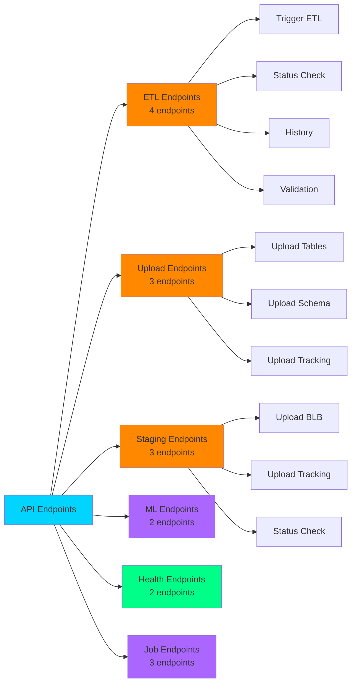
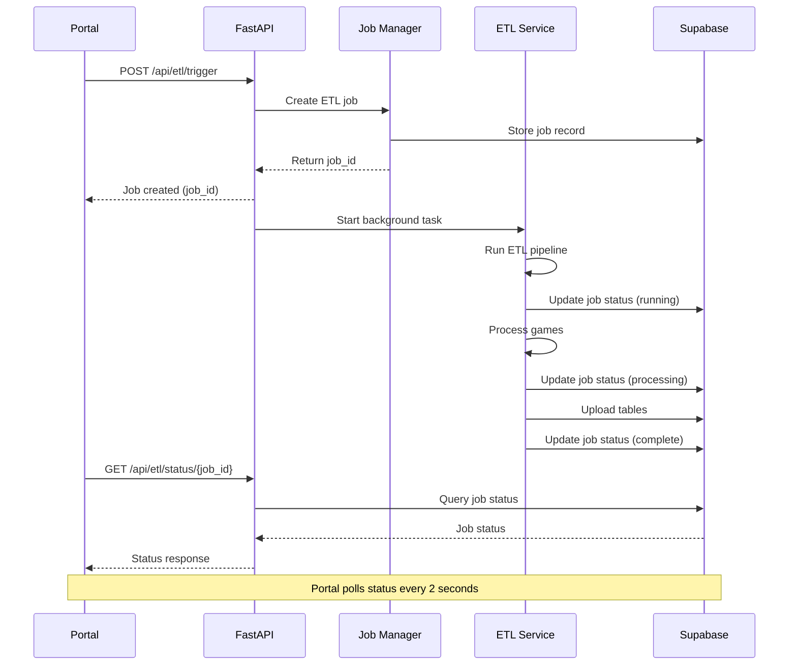
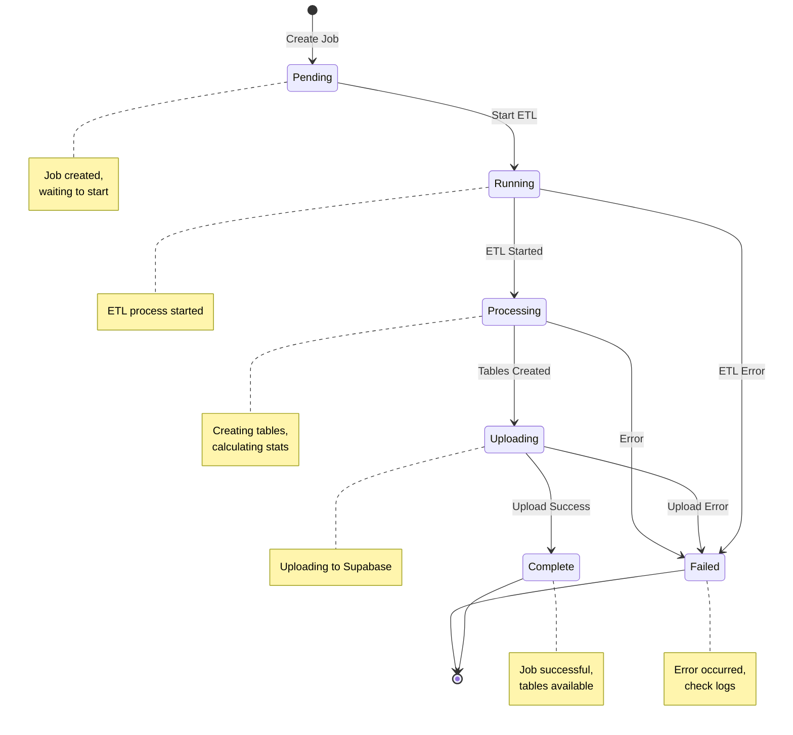
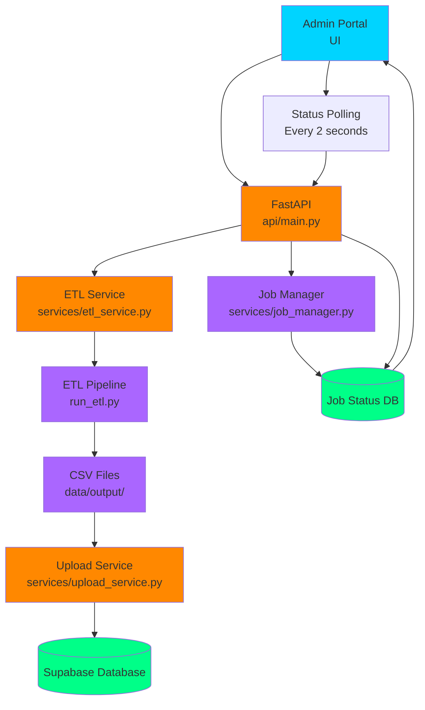
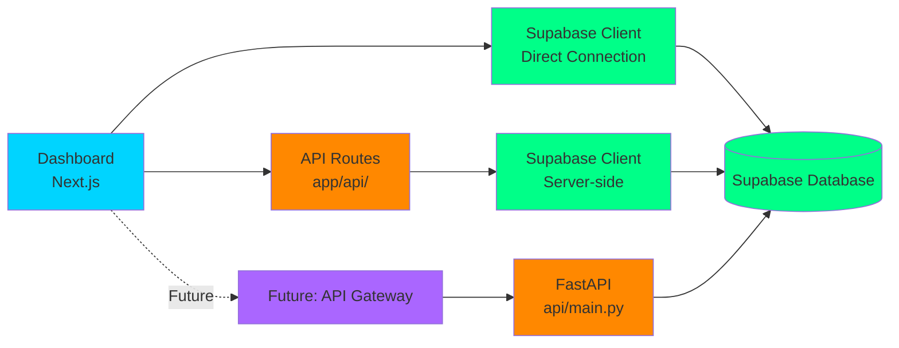
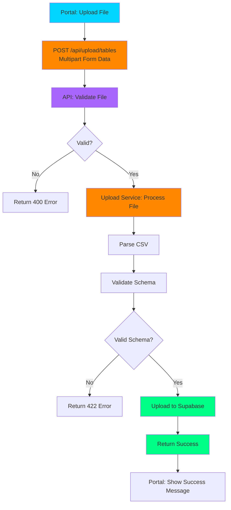
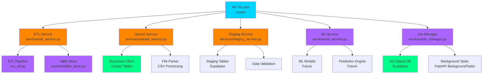
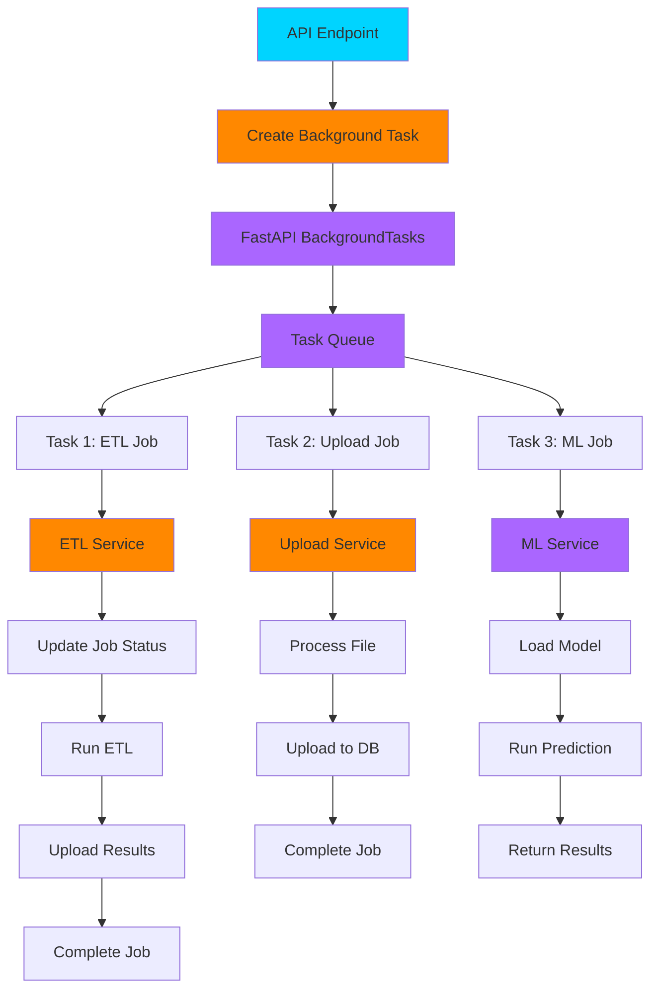
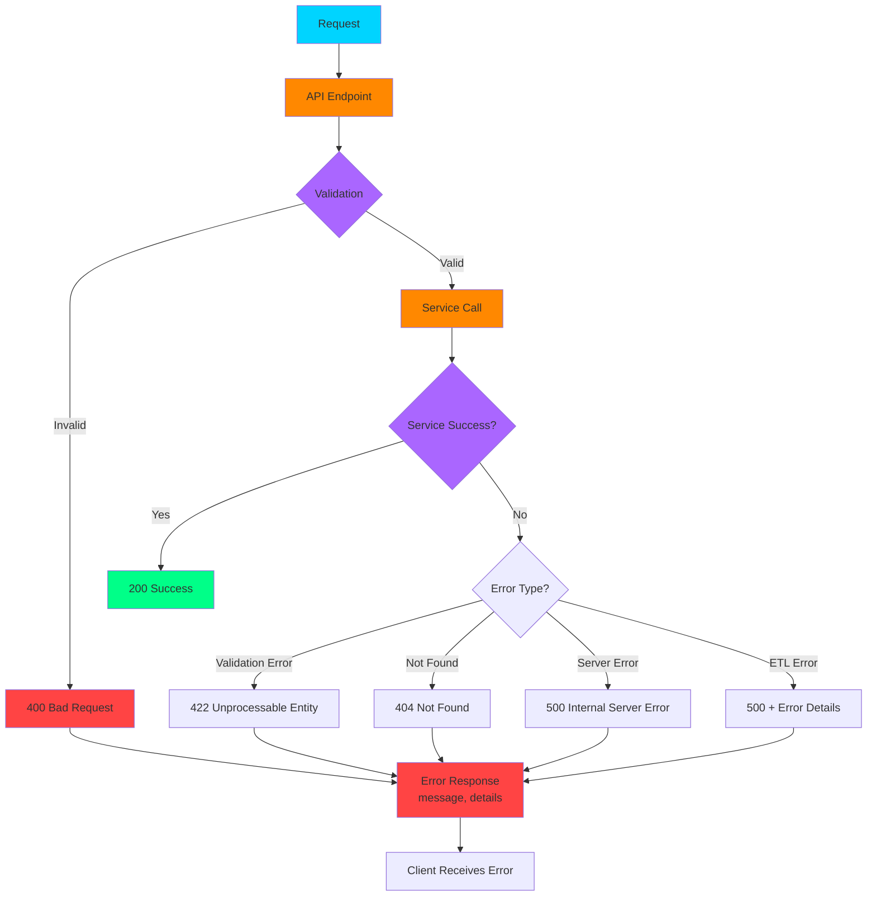
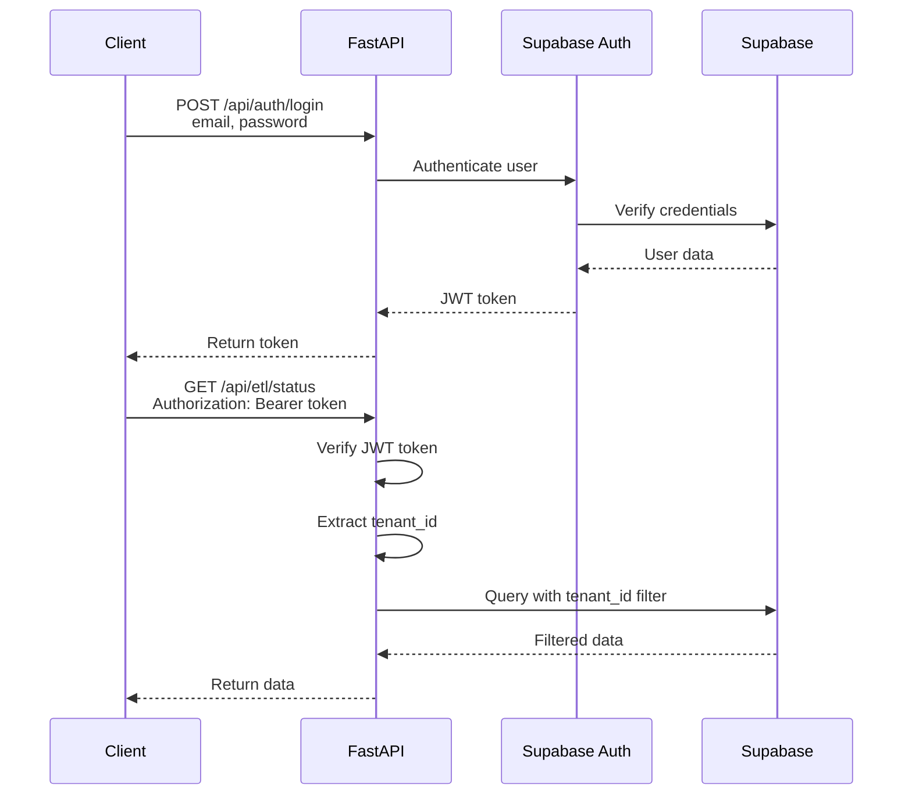

# BenchSight API Architecture Diagrams

**Visual representation of API architecture, endpoints, and integration flows**

Last Updated: 2026-01-15  
Version: 1.0

---

## Overview

This document provides visual diagrams of the BenchSight API architecture, including endpoint maps, job processing flows, and integration patterns.

**Tech Stack:** FastAPI, Python 3.11+, Supabase, Background Tasks

---

## API Endpoint Map

### Complete Endpoint Structure

```mermaid
graph TD
    A[FastAPI Application<br/>api/main.py] --> B[ETL Routes<br/>/api/etl/]
    A --> C[Upload Routes<br/>/api/upload/]
    A --> D[Staging Routes<br/>/api/staging/]
    A --> E[ML Routes<br/>/api/ml/]
    A --> F[Health Routes<br/>/api/health/]
    A --> G[Job Routes<br/>/api/jobs/]
    
    B --> B1[POST /api/etl/trigger<br/>Trigger ETL job]
    B --> B2[GET /api/etl/status<br/>Get ETL status]
    B --> B3[GET /api/etl/history<br/>Get ETL history]
    B --> B4[POST /api/etl/validate<br/>Validate ETL]
    
    C --> C1[POST /api/upload/tables<br/>Upload CSV tables]
    C --> C2[POST /api/upload/schema<br/>Upload schema]
    C --> C3[POST /api/upload/tracking<br/>Upload tracking file]
    
    D --> D1[POST /api/staging/blb<br/>Upload BLB data]
    D --> D2[POST /api/staging/tracking<br/>Upload tracking data]
    D --> D3[GET /api/staging/status<br/>Get staging status]
    
    E --> E1[POST /api/ml/predict<br/>ML predictions]
    E --> E2[GET /api/ml/models<br/>List models]
    
    F --> F1[GET /api/health<br/>Health check]
    F --> F2[GET /api/health/db<br/>Database health]
    
    G --> G1[GET /api/jobs/{job_id}<br/>Get job status]
    G --> G2[GET /api/jobs<br/>List jobs]
    G --> G3[DELETE /api/jobs/{job_id}<br/>Cancel job]
    
    style A fill:#00d4ff
    style B fill:#ff8800
    style C fill:#ff8800
    style D fill:#ff8800
    style E fill:#ff8800
    style F fill:#00ff88
    style G fill:#aa66ff
```

### Endpoint Categories



---

## Job Processing Flow

### ETL Job Processing



### Job State Machine



---

## Integration Architecture

### Portal → API → ETL Flow



### Dashboard → API → Supabase Flow



---

## Request/Response Flow

### ETL Trigger Request Flow

```mermaid
graph TD
    A[Portal: Click Trigger ETL] --> B[POST /api/etl/trigger<br/>Request Body: game_ids]
    
    B --> C[API: Validate Request]
    C --> D{Valid?}
    D -->|No| E[Return 400 Error]
    D -->|Yes| F[Create Job Record]
    
    F --> G[Start Background Task]
    G --> H[Return job_id]
    H --> I[Portal: Store job_id]
    
    G --> J[ETL Service: Run Pipeline]
    J --> K[Update Job Status: Running]
    K --> L[Process Games]
    L --> M[Update Job Status: Processing]
    M --> N[Create Tables]
    N --> O[Update Job Status: Uploading]
    O --> P[Upload to Supabase]
    P --> Q[Update Job Status: Complete]
    
    I --> R[Portal: Poll Status]
    R --> S[GET /api/etl/status/{job_id}]
    S --> T[Return Current Status]
    T --> R
    
    style A fill:#00d4ff
    style B fill:#ff8800
    style C fill:#aa66ff
    style F fill:#aa66ff
    style G fill:#ff8800
    style J fill:#aa66ff
    style Q fill:#00ff88
    style R fill:#00d4ff
```

### Upload Request Flow



---

## Service Architecture

### Service Layer Structure



### Background Task Processing



---

## Error Handling Flow

### Error Response Flow



---

## Authentication Flow (Future)

### JWT Authentication Flow



---

## Related Documentation

- [API.md](API.md) - Complete API documentation
- [ETL.md](../etl/ETL.md) - ETL process documentation
- [PORTAL.md](../portal/PORTAL.md) - Portal documentation

---

*Last Updated: 2026-01-15*
