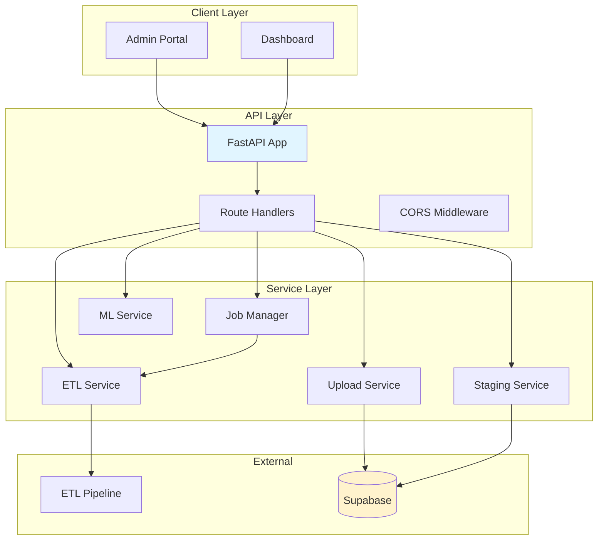

# BenchSight API Architecture

**Complete architecture overview of the FastAPI application**

Last Updated: 2026-01-21
Version: 2.00

---

## Overview

The BenchSight API is a FastAPI application that provides REST endpoints for ETL job management, data upload, staging, and ML predictions.

**Framework:** FastAPI  
**Language:** Python 3.11+  
**Server:** Uvicorn (ASGI)  
**Deployment:** Railway/Render (planned)

---

## Architecture Diagram



---

## Project Structure

```
api/
├── main.py                 # FastAPI app entry point
├── config.py               # Configuration
├── requirements.txt        # Dependencies
├── routes/                 # Route handlers
│   ├── __init__.py
│   ├── health.py           # Health endpoints
│   ├── etl.py              # ETL endpoints
│   ├── upload.py           # Upload endpoints
│   ├── staging.py         # Staging endpoints
│   └── ml.py              # ML endpoints
├── services/               # Service layer
│   ├── __init__.py
│   ├── etl_service.py     # ETL service
│   ├── upload_service.py  # Upload service
│   ├── staging_service.py # Staging service
│   ├── job_manager.py     # Job tracking
│   └── ml_service.py      # ML service
├── models/                 # Data models
│   ├── __init__.py
│   └── job.py             # Job models
└── utils/                  # Utilities
    ├── __init__.py
    └── logger.py          # Logging
```

---

## Component Architecture

### FastAPI Application (`main.py`)

**Purpose:** Main application entry point

**Key Features:**
- FastAPI app initialization
- CORS middleware configuration
- Router registration
- Global exception handling
- Startup/shutdown events

**Code:**
```python
app = FastAPI(
    title=API_TITLE,
    version=API_VERSION,
    description=API_DESCRIPTION,
    docs_url="/docs",
    redoc_url="/redoc",
)

app.add_middleware(
    CORSMiddleware,
    allow_origins=CORS_ORIGINS,
    allow_credentials=True,
    allow_methods=["*"],
    allow_headers=["*"],
)

app.include_router(health_router)
app.include_router(etl_router)
app.include_router(upload_router)
app.include_router(staging_router)
app.include_router(ml_router)
```

---

### Route Handlers (`routes/`)

**Purpose:** HTTP endpoint handlers

#### Health Routes (`routes/health.py`)

- `GET /api/health` - Simple health check
- `GET /api/status` - Detailed status

#### ETL Routes (`routes/etl.py`)

- `POST /api/etl/trigger` - Trigger ETL job
- `GET /api/etl/status/{job_id}` - Get job status
- `GET /api/etl/history` - Get job history
- `POST /api/etl/cancel/{job_id}` - Cancel job

#### Upload Routes (`routes/upload.py`)

- `POST /api/upload/to-supabase` - Upload tables
- `POST /api/upload/generate-schema` - Generate schema
- `GET /api/upload/status/{job_id}` - Get upload status

#### Staging Routes (`routes/staging.py`)

- `POST /api/staging/blb-tables/upload` - Upload BLB data
- `PUT /api/staging/blb-tables/update` - Update BLB data
- `GET /api/staging/blb-tables/list` - List BLB tables
- `POST /api/staging/tracking/upload` - Upload tracking data
- `DELETE /api/staging/blb-tables/{table_name}` - Clear table

#### ML Routes (`routes/ml.py`)

- `POST /api/ml/predict` - Get ML predictions (future)

---

### Service Layer (`services/`)

**Purpose:** Business logic and external integrations

#### ETL Service (`services/etl_service.py`)

**Purpose:** Wraps ETL pipeline execution

**Key Functions:**
- `run_etl_async()` - Run ETL in background thread
- `_run_etl_sync()` - Synchronous ETL execution

**Implementation:**
```python
class ETLService:
    def run_etl_async(self, job_id: str, mode: str, ...):
        # Update job status
        # Run ETL in background thread
        thread = threading.Thread(target=self._run_etl_sync, ...)
        thread.start()
    
    def _run_etl_sync(self, job_id: str, mode: str, ...):
        # Run ETL via subprocess
        subprocess.run(['python', 'run_etl.py', ...])
        # Update job status
```

#### Upload Service (`services/upload_service.py`)

**Purpose:** Handles Supabase uploads

**Key Functions:**
- `upload_tables()` - Upload tables to Supabase
- `generate_schema()` - Generate SQL schema

#### Staging Service (`services/staging_service.py`)

**Purpose:** Handles staging table operations

**Key Functions:**
- `upload_blb_table()` - Upload BLB table data
- `update_blb_table()` - Update BLB table rows
- `upload_tracking_data()` - Upload tracking data

#### Job Manager (`services/job_manager.py`)

**Purpose:** Tracks job status and history

**Key Functions:**
- `create_job()` - Create new job
- `get_job()` - Get job by ID
- `update_job()` - Update job status
- `list_jobs()` - List jobs with filters

**Implementation:**
```python
class JobManager:
    def __init__(self):
        self.jobs: Dict[str, Job] = {}  # In-memory (MVP)
    
    def create_job(self, mode: str, ...) -> str:
        job_id = generate_job_id()
        job = Job(job_id=job_id, mode=mode, ...)
        self.jobs[job_id] = job
        return job_id
```

**Note:** Currently uses in-memory storage. Future: Redis or database.

---

### Data Models (`models/`)

#### Job Model (`models/job.py`)

```python
class JobStatus(str, Enum):
    PENDING = "pending"
    RUNNING = "running"
    COMPLETED = "completed"
    FAILED = "failed"
    CANCELLED = "cancelled"

class Job(BaseModel):
    job_id: str
    status: JobStatus
    mode: str
    game_ids: Optional[List[int]] = None
    options: Optional[Dict[str, Any]] = None
    created_at: datetime
    completed_at: Optional[datetime] = None
    progress: int = 0
    current_step: Optional[str] = None
    result: Optional[Dict[str, Any]] = None
    error: Optional[str] = None

class TriggerETLRequest(BaseModel):
    mode: str
    game_ids: Optional[List[int]] = None
    source: Optional[str] = None
    exclude_game_ids: Optional[List[int]] = None
    options: Optional[Dict[str, Any]] = None
```

---

## Request/Response Flow

### ETL Trigger Flow

```
Client → POST /api/etl/trigger
    ↓
Route Handler (routes/etl.py)
    ↓
Job Manager (create job)
    ↓
ETL Service (run_etl_async)
    ↓
Background Thread (run ETL)
    ↓
Update Job Status
    ↓
Return Job Response
```

### Upload Flow

```
Client → POST /api/upload/to-supabase
    ↓
Route Handler (routes/upload.py)
    ↓
Upload Service (upload_tables)
    ↓
Supabase Client (upload data)
    ↓
Update Job Status
    ↓
Return Job Response
```

---

## Error Handling

### Global Exception Handler

```python
@app.exception_handler(Exception)
async def global_exception_handler(request, exc):
    logger.error(f"Unhandled exception: {exc}", exc_info=True)
    return JSONResponse(
        status_code=500,
        content={"detail": "Internal server error"}
    )
```

### Route-Level Error Handling

```python
@router.post("/trigger")
async def trigger_etl(request: TriggerETLRequest):
    try:
        # Validate request
        if request.mode not in ["full", "incremental", "single"]:
            raise HTTPException(status_code=400, detail="Invalid mode")
        
        # Process request
        job = create_job(...)
        return job
    except Exception as e:
        logger.error(f"Error triggering ETL: {e}")
        raise HTTPException(status_code=500, detail=str(e))
```

---

## Configuration

### Environment Variables

```python
# api/config.py
ENVIRONMENT = os.getenv("ENVIRONMENT", "development")
CORS_ORIGINS = os.getenv("CORS_ORIGINS", "http://localhost:3000").split(",")
API_VERSION = "1.0.0"
API_TITLE = "BenchSight ETL API"
```

### CORS Configuration

```python
app.add_middleware(
    CORSMiddleware,
    allow_origins=CORS_ORIGINS,  # From environment
    allow_credentials=True,
    allow_methods=["*"],
    allow_headers=["*"],
)
```

---

## Deployment

### Development

```bash
cd api
python main.py
# Or
uvicorn api.main:app --reload --port 8000
```

### Production (Railway)

**Configuration:**
- `railway.json` - Railway deployment config
- `Procfile` - Process file for Railway
- `runtime.txt` - Python version

**Environment Variables:**
- `ENVIRONMENT=production`
- `CORS_ORIGINS=https://your-dashboard.vercel.app`

---

## Future Enhancements

### Authentication

- API key authentication
- JWT tokens
- Role-based access control

### Job Queue

- Replace in-memory job manager with Redis
- Use Celery for job queue
- WebSocket for real-time updates

### Performance

- Add caching (Redis)
- Optimize database queries
- Add rate limiting

---

## Related Documentation

- [API_REFERENCE.md](API_REFERENCE.md) - Endpoint reference
- [API_INTEGRATION.md](API_INTEGRATION.md) - Integration guide

---

*Last Updated: 2026-01-15*
