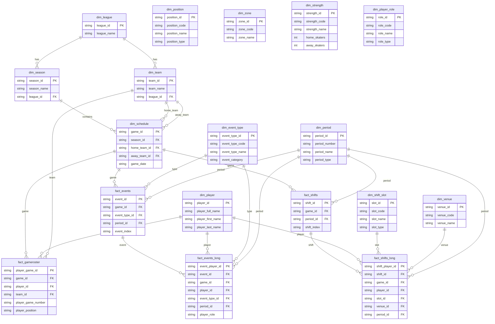
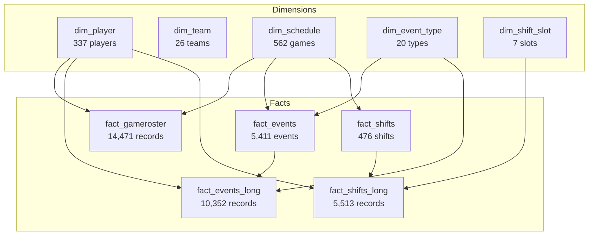

# BenchSight v5.0.0 - Data Schema

## Table Overview

### Dimension vs Fact Tables

**Dimension Tables (dim_)**: Reference data that describes the "what/who/where/when"
- Slowly changing or static
- Used for filtering, grouping, labeling
- Primary keys for joining to facts

**Fact Tables (fact_)**: Transactional data that measures the "how much/how many"
- Event-driven, grows over time
- Contains foreign keys to dimensions
- Contains measures (counts, durations, etc.)

---

## Table Relationships

### Wide vs Long Format

| Wide Table | Long Table | Relationship |
|------------|------------|--------------|
| fact_events | fact_events_long | 1 event → N player-event records |
| fact_shifts | fact_shifts_long | 1 shift → N player-shift records |

**Wide Format**: One row per event/shift with player info in columns
- Good for: Quick lookups, shift composition views
- Example: fact_shifts has home_forward_1, home_forward_2, etc.

**Long Format**: One row per player involvement
- Good for: Player-level analysis, aggregations, joins
- Example: fact_shifts_long has one row per player per shift

### Tracking Tables

| Table | Purpose |
|-------|---------|
| fact_events_tracking | Raw event data from Excel (all columns) |
| fact_events | Cleaned/normalized unique events |
| fact_events_long | Player-level event participation |

The _tracking tables preserve the original data. The derived tables are optimized for analysis.

---

## Entity Relationship Diagram

---

## Simplified View

---

## Table Descriptions

### Dimension Tables (17 tables)

| Table | Rows | PK | Description |
|-------|------|-----|-------------|
| dim_player | 337 | player_id | All registered players |
| dim_team | 26 | team_id | All teams in league |
| dim_league | 2 | league_id | NORAD, CSAH |
| dim_season | 9 | season_id | Season definitions |
| dim_schedule | 562 | game_id | All scheduled games |
| dim_period | 5 | period_id | Game periods (1,2,3,OT,SO) |
| dim_position | 7 | position_id | Player positions (C,LW,RW,F,D,G,X) |
| dim_shift_slot | 7 | slot_id | Shift assignments (F1,F2,F3,D1,D2,G,X) |
| dim_zone | 3 | zone_id | Rink zones (O,D,N) |
| dim_venue | 2 | venue_id | Home/Away |
| dim_event_type | 20 | event_type_id | Event types from tracking |
| dim_strength | 10 | strength_id | Game situations (5v5, PP, PK, etc.) |
| dim_player_role | 14 | role_id | Player roles in events |
| dim_playerurlref | 548 | - | Player URL references |
| dim_rinkboxcoord | 50 | box_id | Rink coordinates |
| dim_rinkcoordzones | 198 | box_id | Rink zone mappings |
| dim_randomnames | 486 | - | Anonymization names |

### Fact Tables (11 tables)

| Table | Rows | PK | Description |
|-------|------|-----|-------------|
| fact_gameroster | 14,471 | player_game_id | Player-game assignments |
| fact_events | 5,411 | event_id | Unique events (wide) |
| fact_events_long | 10,352 | event_player_id | Player-event records |
| fact_events_tracking | 11,918 | event_id | Raw tracking data |
| fact_shifts | 476 | shift_id | Unique shifts (wide) |
| fact_shifts_long | 5,513 | shift_player_id | Player-shift records |
| fact_shifts_tracking | 476 | shift_id | Raw shift data |
| fact_playergames | 3,010 | player_game_id | Player game stats |
| fact_draft | 160 | player_draft_id | Draft history |
| fact_registration | 190 | player_season_registration_id | Season registrations |
| fact_leadership | 28 | - | Team leadership |

---

## Foreign Key Reference

### fact_events_long
- `game_id` → dim_schedule.game_id
- `player_id` → dim_player.player_id
- `event_type_id` → dim_event_type.event_type_id
- `period_id` → dim_period.period_id
- `event_id` → fact_events.event_id

### fact_shifts_long
- `game_id` → dim_schedule.game_id
- `player_id` → dim_player.player_id
- `slot_id` → dim_shift_slot.slot_id
- `venue_id` → dim_venue.venue_id
- `period_id` → dim_period.period_id
- `shift_id` → fact_shifts.shift_id

### fact_gameroster
- `game_id` → dim_schedule.game_id
- `player_id` → dim_player.player_id
- `team_id` → dim_team.team_id

