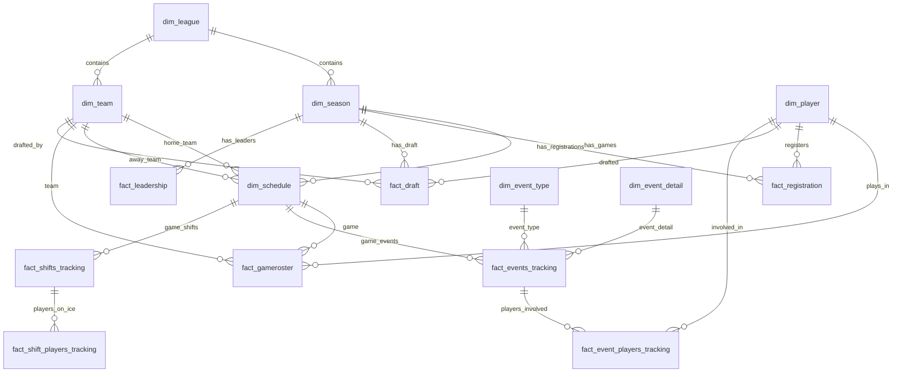

# BenchSight Database Schema

## Entity Relationship Diagram



## Table Categories

### Core Dimensions
```
dim_league ─────► dim_season ─────► dim_schedule
     │                │
     └────► dim_team ─┘
              │
         dim_player
```

### Event Tracking
```
dim_event_type ──┐
                 ├──► fact_events_tracking ──► fact_event_players_tracking
dim_event_detail ┘           │
                             └──► fact_linked_events_tracking
                             └──► fact_sequences_tracking
                             └──► fact_plays_tracking
```

### Shift Tracking
```
fact_shifts_tracking ──► fact_shift_players_tracking
         │
    dim_strength
    dim_situation
```

### Rink Coordinates
```
dim_rinkboxcoord ──► dim_rinkcoordzones
         │
dim_danger_zone ────► fact_event_coordinates
```

### Stats Reference
```
dim_stat ──────► (calculated stats)
dim_shot_type
dim_pass_type
dim_turnover_type
dim_play_detail
dim_net_location
```

## Table Counts

| Category | Count |
|----------|-------|
| Dimension Tables | 30 |
| Fact Tables | 21 |
| **Total** | **51** |

## Data Volumes

| Table | Est. Rows |
|-------|-----------|
| fact_events_tracking | 24,089 |
| fact_events_long | 22,333 |
| fact_gameroster | 14,473 |
| fact_playergames | 3,010 |
| fact_event_players_tracking | 3,132 |
| fact_shift_players_tracking | 1,136 |
| fact_shifts_tracking | 770 |
| dim_schedule | 562 |
| dim_playerurlref | 548 |
| dim_randomnames | 486 |
| dim_player | 337 |
| dim_rinkcoordzones | 202 |
| fact_draft | 160 |
| fact_registration | 191 |
| Other tables | <100 each |
