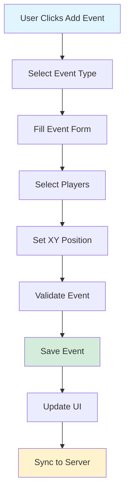

# Tracker Event Flow

**Complete workflow for event creation, editing, and management**

Last Updated: 2026-01-15  
Version: 23.5

---

## Overview

This document details the complete workflow for event creation, editing, deletion, and management in the tracker.

**Event Types:** 15+ event types (Faceoff, Shot, Pass, Goal, Turnover, etc.)  
**Event Fields:** 20+ fields per event  
**Event Storage:** Array in state object (`S.events`)

---

## Event Creation Workflow

### Step-by-Step Flow



### Detailed Steps

1. **User Initiates Event Creation**
   - User clicks "Add Event" button
   - Event type dropdown appears
   - Form is cleared and prepared

2. **Select Event Type**
   - User selects event type (Faceoff, Shot, Pass, Goal, etc.)
   - Form fields update based on event type
   - Required fields are highlighted

3. **Fill Event Form**
   - User fills in event details:
     - Event type (already selected)
     - Event detail (subtype)
     - Play detail (context)
     - Period
     - Time
     - Team (home/away)

4. **Select Players**
   - User selects players involved:
     - `event_player_1` (primary actor: shooter, passer, etc.)
     - `event_player_2` (secondary: assist, faceoff opponent, etc.)
     - `event_player_3` (tertiary: second assist, etc.)

5. **Set XY Position**
   - User clicks on rink to set position
   - XY coordinates captured
   - Zone determined from XY

6. **Validate Event**
   - Check required fields
   - Validate time (within period)
   - Validate players (on roster)
   - Validate XY (within rink bounds)

7. **Save Event**
   - Add to `S.events` array
   - Generate event ID
   - Update `S.evtIdx`
   - Save state

8. **Update UI**
   - Add event to event list
   - Update event count
   - Refresh display

9. **Sync to Server** (if enabled)
   - Save to Supabase
   - Update last save time

---

## Event Editing Workflow

### Step-by-Step Flow

```
User Clicks Edit on Event
    ↓
Load Event into Form
    ↓
Populate Form Fields
    ↓
User Modifies Fields
    ↓
Validate Changes
    ↓
Update Event in Array
    ↓
Save State
    ↓
Update UI
    ↓
Sync to Server
```

### Implementation

```typescript
function editEvent(eventIdx: number) {
  // Load event
  const event = S.events[eventIdx]
  
  // Set editing state
  S.editingEvtIdx = eventIdx
  
  // Populate form
  populateEventForm(event)
  
  // Show form
  showEventForm()
}

function saveEditedEvent() {
  if (S.editingEvtIdx === null) return
  
  // Get form data
  const eventData = getEventFormData()
  
  // Validate
  if (!validateEvent(eventData)) {
    showError('Invalid event data')
    return
  }
  
  // Update event
  S.events[S.editingEvtIdx] = {
    ...S.events[S.editingEvtIdx],
    ...eventData
  }
  
  // Clear editing state
  S.editingEvtIdx = null
  
  // Save
  saveState()
  updateUI()
}
```

---

## Event Deletion Workflow

### Step-by-Step Flow

```
User Clicks Delete on Event
    ↓
Confirm Deletion
    ↓
Remove from Array
    ↓
Update Indices
    ↓
Save State
    ↓
Update UI
    ↓
Sync to Server
```

### Implementation

```typescript
function deleteEvent(eventIdx: number) {
  // Confirm
  if (!confirm('Delete this event?')) return
  
  // Remove from array
  S.events.splice(eventIdx, 1)
  
  // Update indices
  if (S.evtIdx >= eventIdx) {
    S.evtIdx = Math.max(0, S.evtIdx - 1)
  }
  
  // Clear editing if deleted
  if (S.editingEvtIdx === eventIdx) {
    S.editingEvtIdx = null
  }
  
  // Save
  saveState()
  updateUI()
}
```

---

## Event Validation

### Required Fields

**All Events:**
- `event_type` (required)
- `period` (required)
- `time` (required)
- `team` (required)

**Event-Specific:**
- **Shot/Goal:** `event_player_1` (shooter)
- **Pass:** `event_player_1` (passer), `event_player_2` (receiver)
- **Faceoff:** `event_player_1` (winner), `event_player_2` (loser)
- **Goal:** `event_detail` must be 'Goal_Scored'

### Validation Rules

```typescript
function validateEvent(event: Event): boolean {
  // Required fields
  if (!event.event_type) return false
  if (!event.period) return false
  if (!event.time) return false
  if (!event.team) return false
  
  // Event-specific validation
  if (event.event_type === 'Shot' || event.event_type === 'Goal') {
    if (!event.event_player_1) return false
  }
  
  if (event.event_type === 'Pass') {
    if (!event.event_player_1 || !event.event_player_2) return false
  }
  
  if (event.event_type === 'Faceoff') {
    if (!event.event_player_1 || !event.event_player_2) return false
  }
  
  // Time validation
  if (!validateEventTime(event.period, event.time)) return false
  
  // XY validation (if set)
  if (event.puckXY && !validateXYPosition(event.puckXY)) return false
  
  return true
}
```

---

## Event Types and Fields

### Event Type: Shot

**Required Fields:**
- `event_type`: 'Shot'
- `event_player_1`: Shooter
- `event_detail_2`: Shot type (Wrist_Shot, Slap_Shot, etc.)
- `period`, `time`, `team`

**Optional Fields:**
- `event_player_2`: Goalie (if save)
- `puckXY`: Shot location
- `play_detail`: Shot context

### Event Type: Goal

**Required Fields:**
- `event_type`: 'Goal'
- `event_detail`: 'Goal_Scored' (CRITICAL)
- `event_player_1`: Scorer
- `period`, `time`, `team`

**Optional Fields:**
- `event_player_2`: Primary assist
- `event_player_3`: Secondary assist
- `puckXY`: Goal location
- `play_detail`: Goal context

### Event Type: Pass

**Required Fields:**
- `event_type`: 'Pass'
- `event_player_1`: Passer
- `event_player_2`: Receiver
- `period`, `time`, `team`

**Optional Fields:**
- `event_detail_2`: Pass type
- `play_detail`: Pass context
- `puckXY`: Pass location

---

## Event Storage Format

### Event Object Structure

```typescript
interface Event {
  // Identification
  event_id: string
  event_index: number
  
  // Core fields
  event_type: string
  event_detail: string
  event_detail_2: string
  play_detail: string
  play_detail_2: string
  
  // Time/Period
  period: number
  time: string
  time_start_total_seconds: number
  
  // Team
  team: 'home' | 'away'
  team_venue: 'Home' | 'Away'
  
  // Players
  event_player_1: string | null  // Primary actor
  event_player_2: string | null  // Secondary
  event_player_3: string | null  // Tertiary
  
  // Position
  puckXY: [number, number] | null
  netXY: [number, number] | null
  zone: string | null
  
  // Context
  strength: string
  situation: string
  linked_event_id: string | null
  
  // Metadata
  created_at: Date
  updated_at: Date
}
```

---

## Event Queries

### Get Events by Type

```typescript
function getEventsByType(eventType: string): Event[] {
  return S.events.filter(e => e.event_type === eventType)
}
```

### Get Events by Player

```typescript
function getEventsByPlayer(playerId: string): Event[] {
  return S.events.filter(e => 
    e.event_player_1 === playerId ||
    e.event_player_2 === playerId ||
    e.event_player_3 === playerId
  )
}
```

### Get Events by Period

```typescript
function getEventsByPeriod(period: number): Event[] {
  return S.events.filter(e => e.period === period)
}
```

### Get Goals

```typescript
function getGoals(): Event[] {
  return S.events.filter(e => 
    e.event_type === 'Goal' && 
    e.event_detail === 'Goal_Scored'
  )
}
```

---

## Related Documentation

- [TRACKER_COMPLETE_LOGIC.md](TRACKER_COMPLETE_LOGIC.md) - Function reference
- [TRACKER_STATE_MANAGEMENT.md](TRACKER_STATE_MANAGEMENT.md) - State management
- [TRACKER_VIDEO_INTEGRATION.md](TRACKER_VIDEO_INTEGRATION.md) - Video integration
- [TRACKER_XY_POSITIONING.md](TRACKER_XY_POSITIONING.md) - XY positioning

---

*Last Updated: 2026-01-15*
