# BenchSight Commercial Roadmap Visuals

**Visual diagrams for market positioning, revenue projections, and feature comparison**

Last Updated: 2026-01-21
Version: 2.00

---

## Market Positioning Map

### Price vs Features Positioning

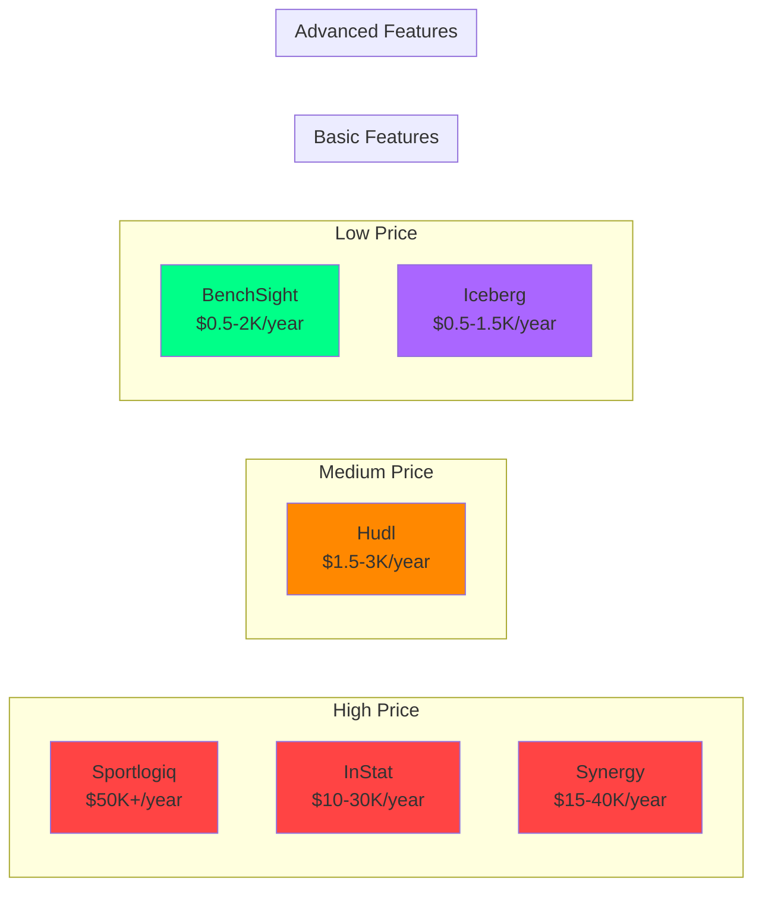

**Positioning:**
- **BenchSight:** Advanced features at low price (sweet spot)
- **Professional platforms:** Advanced features at high price
- **Youth platforms:** Basic features at medium price

---

## Revenue Projection Chart

### Revenue Growth Timeline

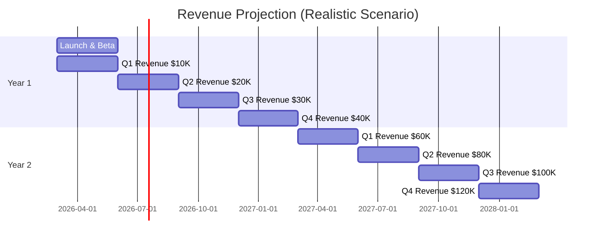

### Customer Growth Projection

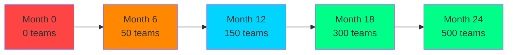

### MRR Growth Projection

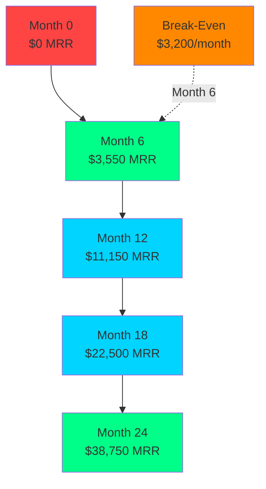

---

## Feature Comparison Matrix

### Us vs Competitors

```mermaid
graph TB
    subgraph Features["Feature Comparison"]
        BS[BenchSight]
        SP[Sportlogiq]
        IN[InStat]
        SY[Synergy]
        HU[Hudl]
    end
    
    subgraph Advanced["Advanced Analytics"]
        BS -->|[YES] xG, WAR/GAR| ADV1
        SP -->|[YES] xG, WAR/GAR| ADV1
        IN -->|[PARTIAL] Limited| ADV2
        SY -->|[YES] xG, WAR/GAR| ADV1
        HU -->|[NO] Basic only| ADV3
    end
    
    subgraph Pricing["Pricing"]
        BS -->|[YES] $0.5-2K/year| PRICE1
        SP -->|[NO] $50K+/year| PRICE3
        IN -->|[NO] $10-30K/year| PRICE3
        SY -->|[NO] $15-40K/year| PRICE3
        HU -->|[PARTIAL] $1.5-3K/year| PRICE2
    end
    
    subgraph Market["Target Market"]
        BS -->|[YES] Youth/Junior| MKT1
        SP -->|[NO] Professional| MKT3
        IN -->|[NO] Professional| MKT3
        SY -->|[NO] College/Pro| MKT2
        HU -->|[YES] Youth/HS| MKT1
    end
    
    style BS fill:#00ff88
    style SP fill:#ff4444
    style IN fill:#ff4444
    style SY fill:#ff4444
    style HU fill:#ff8800
```

### Feature Parity Analysis

| Feature Category | BenchSight | Sportlogiq | InStat | Synergy | Hudl | Gap |
|-----------------|------------|-----------|--------|---------|------|-----|
| **Core Analytics** | [YES] | [YES] | [YES] | [YES] | [YES] | None |
| **Advanced Metrics** | [YES] | [YES] | [PARTIAL] | [YES] | [NO] | Advantage |
| **ML/CV Automation** | [PLANNED] | [YES] | [PARTIAL] | [YES] | [NO] | **Gap** |
| **Video Storage** | [PLANNED] | [YES] | [YES] | [YES] | [YES] | **Gap** |
| **Mobile Apps** | [PLANNED] | [YES] | [YES] | [YES] | [YES] | **Gap** |
| **Ease of Use** | [YES] | [NO] | [NO] | [NO] | [YES] | Advantage |
| **Pricing** | [YES] | [NO] | [NO] | [NO] | [PARTIAL] | Advantage |
| **Youth Focus** | [YES] | [NO] | [NO] | [NO] | [YES] | Advantage |

**Key Insights:**
- **Advantages:** Advanced analytics, pricing, ease of use, youth focus
- **Gaps:** ML/CV automation, video storage, mobile apps (acceptable for MVP)

---

## Competitive Positioning

### Value Proposition Map

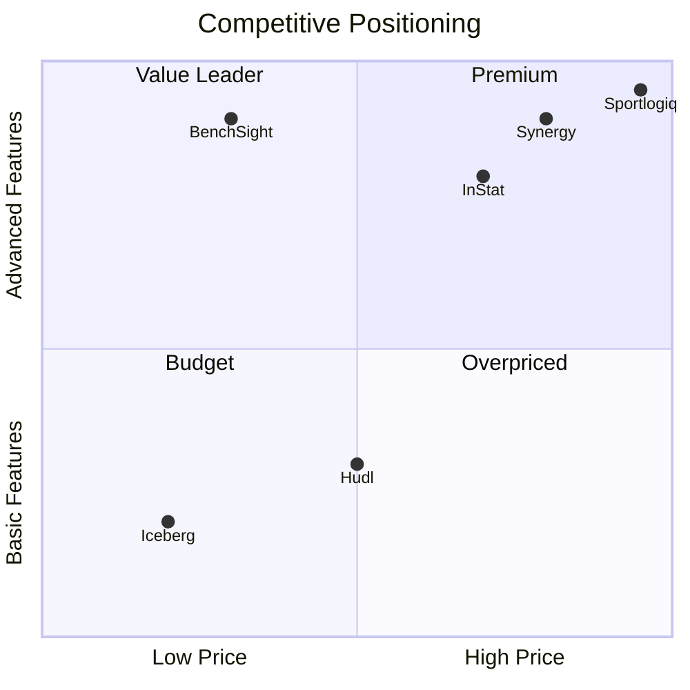

**Positioning:**
- **BenchSight:** Value Leader (advanced features, low price)
- **Professional platforms:** Premium (advanced features, high price)
- **Hudl:** Budget (basic features, medium price)
- **Iceberg:** Budget (basic features, low price)

---

## Revenue Model Visualization

### Revenue Streams

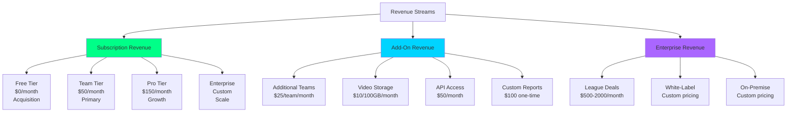

### Customer Lifetime Value Flow

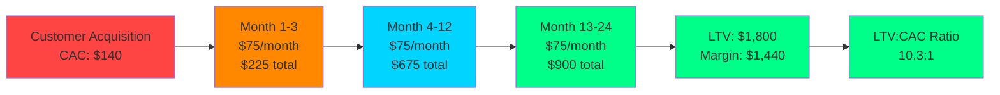

---

## Go-to-Market Timeline

### Marketing & Sales Funnel

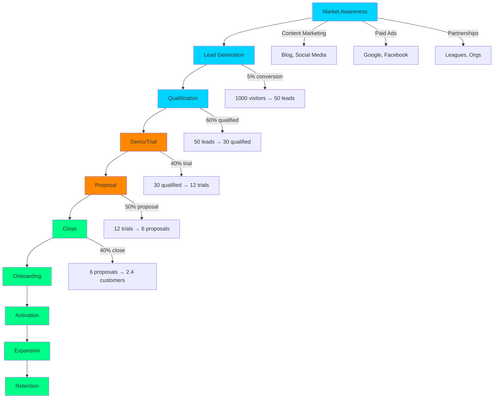

### Customer Acquisition Channels

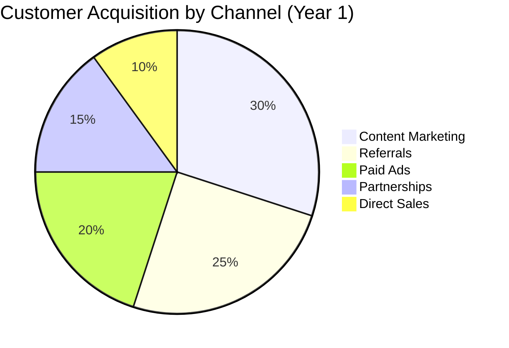

---

## Pricing Tiers Comparison

### Feature Matrix by Tier

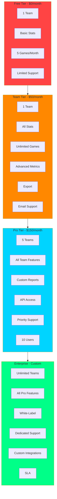

---

## Break-Even Analysis

### Revenue vs Costs Timeline

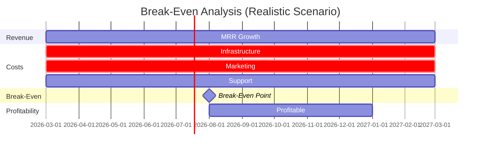

### Monthly Revenue vs Costs

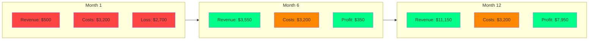

---

## Market Opportunity

### Total Addressable Market (TAM)

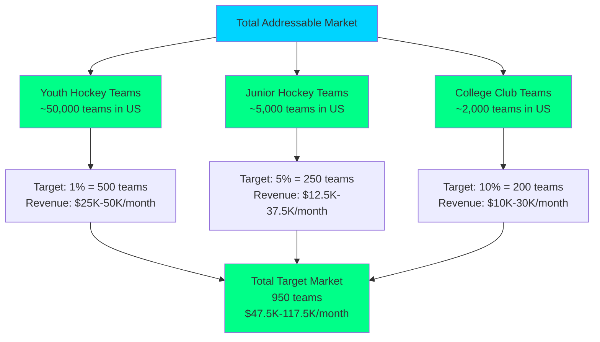

### Market Penetration Strategy

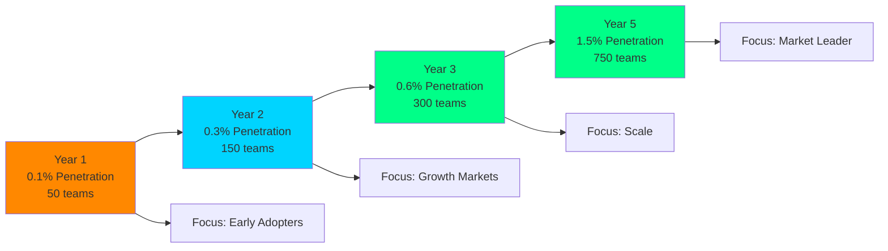

---

## Related Documentation

- [COMPETITOR_ANALYSIS.md](COMPETITOR_ANALYSIS.md) - Detailed competitor analysis
- [MONETIZATION_STRATEGY.md](MONETIZATION_STRATEGY.md) - Complete monetization strategy
- [GAP_ANALYSIS.md](GAP_ANALYSIS.md) - Gap analysis and priorities

---

*Last Updated: 2026-01-15*
