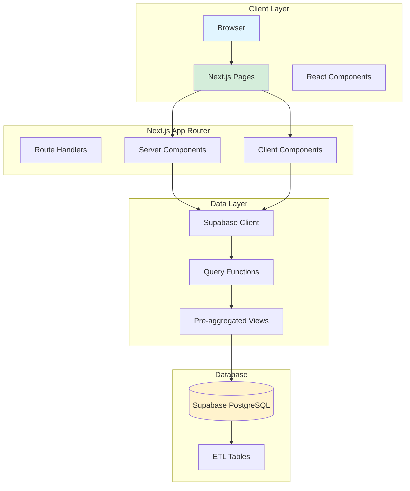

# BenchSight Dashboard Architecture

**Complete architecture overview of the Next.js dashboard application**

Last Updated: 2026-01-15  
Version: 29.0

---

## Overview

The BenchSight dashboard is a Next.js 14 application using the App Router, TypeScript, Tailwind CSS, and Supabase. It provides a comprehensive analytics interface for the NORAD recreational hockey league.

**Tech Stack:**
- **Framework:** Next.js 14 (App Router)
- **Language:** TypeScript
- **Styling:** Tailwind CSS
- **Database:** Supabase (PostgreSQL)
- **UI Components:** shadcn/ui
- **Charts:** Recharts
- **Deployment:** Vercel

**Related Documentation:**
- [DASHBOARD_ARCHITECTURE_DIAGRAMS.md](DASHBOARD_ARCHITECTURE_DIAGRAMS.md) - **NEW** Visual dashboard architecture diagrams (components, data flow, user journey)

---

## Architecture Diagram



---

## Project Structure

```
ui/dashboard/
├── src/
│   ├── app/                    # Next.js App Router pages
│   │   ├── (dashboard)/       # Route group
│   │   ├── norad/              # Main dashboard routes
│   │   │   ├── players/        # Player pages
│   │   │   ├── goalies/        # Goalie pages
│   │   │   ├── teams/          # Team pages
│   │   │   ├── games/          # Game pages
│   │   │   ├── analytics/     # Analytics pages
│   │   │   ├── standings/     # Standings page
│   │   │   ├── leaders/        # Leaders page
│   │   │   ├── schedule/      # Schedule page
│   │   │   ├── tracker/       # Tracker pages
│   │   │   └── admin/         # Admin portal
│   │   ├── api/               # API routes
│   │   ├── auth/              # Auth callbacks
│   │   ├── login/             # Login page
│   │   ├── layout.tsx         # Root layout
│   │   └── page.tsx           # Home page
│   │
│   ├── components/            # React components
│   │   ├── layout/           # Layout components
│   │   ├── players/          # Player components
│   │   ├── goalies/          # Goalie components
│   │   ├── teams/            # Team components
│   │   ├── games/            # Game components
│   │   ├── charts/           # Chart components
│   │   ├── ui/               # shadcn/ui components
│   │   └── common/            # Common components
│   │
│   ├── lib/                  # Utilities and helpers
│   │   ├── supabase/         # Supabase client and queries
│   │   ├── utils/            # Utility functions
│   │   ├── stats/            # Stat definitions
│   │   └── export/           # Export utilities
│   │
│   └── types/                # TypeScript types
│       └── database.ts       # Database types (generated)
│
├── public/                   # Static assets
├── package.json              # Dependencies
├── tailwind.config.ts        # Tailwind configuration
├── tsconfig.json             # TypeScript configuration
└── next.config.js            # Next.js configuration
```

---

## Routing Architecture

### Route Structure

The dashboard uses Next.js App Router with route groups and dynamic routes:

```
/norad                          # Main dashboard (route group)
├── /players                    # Player directory
│   ├── /[playerId]            # Player profile
│   │   ├── /games             # Player games
│   │   │   └── /[gameId]      # Player game detail
│   │   └── /trends            # Player trends
│   ├── /compare               # Player comparison
│   └── /matchups              # Player matchups
│
├── /goalies                    # Goalie directory
│   ├── /[goalieId]           # Goalie profile
│   └── /compare               # Goalie comparison
│
├── /teams                      # Team directory
│   ├── /[teamId]             # Team profile
│   ├── /compare               # Team comparison
│   └── /free-agents          # Free agents
│
├── /games                      # Game directory
│   ├── /[gameId]             # Game detail
│   └── /shots                # Shot analysis
│
├── /analytics                  # Analytics hub
│   ├── /overview             # Analytics overview
│   ├── /statistics           # Statistics
│   ├── /trends               # Trends
│   ├── /xg                   # xG analysis
│   ├── /war                  # WAR analysis
│   ├── /zone                 # Zone analytics
│   ├── /rushes               # Rush analysis
│   ├── /shot-chains          # Shot chains
│   ├── /shifts               # Shift analysis
│   ├── /lines                # Line combinations
│   ├── /faceoffs             # Faceoff analysis
│   └── /micro-stats          # Micro stats
│
├── /standings                  # League standings
├── /leaders                    # Scoring leaders
├── /schedule                   # Game schedule
└── /tracker                    # Game tracker
    ├── /[gameId]             # Tracker for specific game
    └── /videos                # Video management
```

### Route Groups

- **`(dashboard)`:** Route group for dashboard pages (doesn't affect URL)
- **`norad`:** Main dashboard prefix (all routes under `/norad/*`)

---

## Component Architecture

### Component Hierarchy

```
RootLayout
├── Sidebar (Navigation)
├── Topbar (User menu, search)
└── Page Content
    ├── Server Components (Data fetching)
    └── Client Components (Interactivity)
        ├── Charts
        ├── Tables
        ├── Forms
        └── UI Components
```

### Component Categories

#### Layout Components (`components/layout/`)
- `sidebar.tsx` - Main navigation sidebar
- `topbar.tsx` - Top navigation bar with user menu

#### Page Components (`components/*/`)
- **Players:** Player profile, player table, player cards
- **Goalies:** Goalie profile, goalie table, goalie cards
- **Teams:** Team profile, team table, team cards
- **Games:** Game summary, box score, play-by-play
- **Charts:** Various chart components (Recharts)

#### UI Components (`components/ui/`)
- shadcn/ui components (button, tooltip, etc.)

#### Common Components (`components/common/`)
- `sortable-table.tsx` - Sortable data table
- `searchable-select.tsx` - Searchable dropdown
- `collapsible-section.tsx` - Collapsible content

---

## Data Flow Architecture

### Server Components (Default)

```typescript
// app/norad/players/[playerId]/page.tsx
export default async function PlayerPage({ params }: { params: { playerId: string } }) {
  // Server component - runs on server
  const player = await getPlayer(params.playerId)
  const stats = await getPlayerStats(params.playerId)
  
  return (
    <PlayerProfile player={player} stats={stats} />
  )
}
```

**Benefits:**
- Data fetching on server (faster)
- No client-side JavaScript for data fetching
- Better SEO

### Client Components (Interactive)

```typescript
'use client'

// components/charts/trend-line-chart.tsx
export function TrendLineChart({ data }: { data: TrendData[] }) {
  // Client component - runs on client
  const [selectedMetric, setSelectedMetric] = useState('goals')
  
  return (
    <LineChart data={data}>
      {/* Interactive chart */}
    </LineChart>
  )
}
```

**Benefits:**
- Interactive features (hover, click, etc.)
- Client-side state management
- Real-time updates

### Data Fetching Pattern

```typescript
// lib/supabase/queries/players.ts
export async function getPlayer(playerId: string) {
  const supabase = createServerClient()
  const { data, error } = await supabase
    .from('v_player_season_stats')
    .select('*')
    .eq('player_id', playerId)
    .single()
  
  if (error) throw error
  return data
}
```

**Pattern:**
1. Server component calls query function
2. Query function uses Supabase client
3. Data fetched from Supabase views (pre-aggregated)
4. Data passed to components as props

---

## Supabase Integration

### Client Setup

```typescript
// lib/supabase/client.ts
export function createClient() {
  return createBrowserClient<Database>(
    process.env.NEXT_PUBLIC_SUPABASE_URL!,
    process.env.NEXT_PUBLIC_SUPABASE_ANON_KEY!
  )
}
```

### Server Client Setup

```typescript
// lib/supabase/server.ts
export function createServerClient() {
  return createServerClient<Database>(
    // Server-side client with cookies
  )
}
```

### Query Functions

Query functions are organized by domain:

- `lib/supabase/queries/players.ts` - Player queries
- `lib/supabase/queries/goalies.ts` - Goalie queries
- `lib/supabase/queries/teams.ts` - Team queries
- `lib/supabase/queries/games.ts` - Game queries
- `lib/supabase/queries/league.ts` - League queries

### Views Usage

The dashboard primarily uses Supabase views (pre-aggregated):

- `v_player_season_stats` - Player season stats
- `v_standings` - League standings
- `v_leaderboard_points` - Points leaders
- `v_leaderboard_goals` - Goals leaders
- etc.

**Benefits:**
- Pre-aggregated data (faster queries)
- Consistent calculations
- Simplified queries

---

## State Management

### Server State
- Managed by Next.js (Server Components)
- Data fetched on each request
- No client-side state for server data

### Client State
- React `useState` for component state
- React `useEffect` for side effects
- No global state management (Redux, Zustand, etc.)

### Form State
- React Hook Form (if needed)
- Controlled components

---

## Styling Architecture

### Tailwind CSS

**Configuration:** `tailwind.config.ts`

**Design System:**
- Colors: Defined in Tailwind config
- Typography: Custom fonts (Inter, Rajdhani, JetBrains Mono)
- Spacing: Tailwind default scale
- Components: shadcn/ui components

### Component Styling

```typescript
// Using Tailwind classes
<div className="flex items-center gap-4 p-4 bg-background">
  <h1 className="text-2xl font-bold text-foreground">Title</h1>
</div>
```

### Dark Mode

- Default: Dark mode (`className="dark"` in root layout)
- Uses Tailwind dark mode classes

---

## Authentication

### Supabase Auth

**Setup:**
- Supabase Auth enabled
- Email/password authentication
- Protected routes via middleware

**Middleware:**
```typescript
// middleware.ts
export function middleware(request: NextRequest) {
  // Check authentication
  // Redirect to login if not authenticated
}
```

**Protected Routes:**
- `/norad/admin/*` - Admin only
- `/norad/tracker/*` - Authenticated users

---

## Performance Optimizations

### Server Components
- Default: All components are server components
- Reduces client-side JavaScript
- Faster initial page load

### Data Fetching
- Uses Supabase views (pre-aggregated)
- Parallel data fetching where possible
- Caching via Next.js

### Code Splitting
- Automatic code splitting by route
- Dynamic imports for heavy components

### Image Optimization
- Next.js Image component
- Automatic optimization

---

## Deployment Architecture

### Vercel Deployment

**Build Process:**
1. `npm run build` - Build Next.js app
2. Vercel optimizes and deploys
3. Environment variables from Vercel dashboard

**Environment Variables:**
- `NEXT_PUBLIC_SUPABASE_URL`
- `NEXT_PUBLIC_SUPABASE_ANON_KEY`
- `NEXT_PUBLIC_API_URL` (optional)

**Deployment Flow:**
```
GitHub → Vercel → Build → Deploy → Live
```

---

## Related Documentation

- [DASHBOARD_COMPONENT_CATALOG.md](DASHBOARD_COMPONENT_CATALOG.md) - Component reference
- [DASHBOARD_DATA_FLOW.md](DASHBOARD_DATA_FLOW.md) - Data flow details
- [DASHBOARD_ROADMAP.md](DASHBOARD_ROADMAP.md) - Development roadmap
- [DASHBOARD_PAGES_INVENTORY.md](DASHBOARD_PAGES_INVENTORY.md) - Pages inventory

---

*Last Updated: 2026-01-15*
