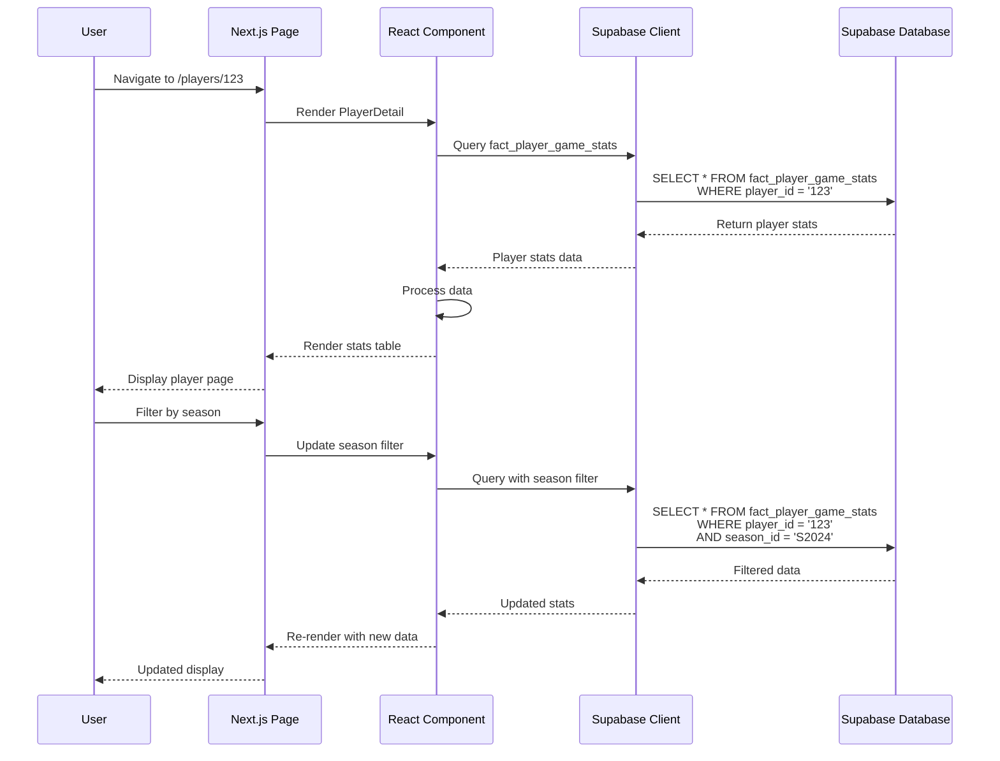
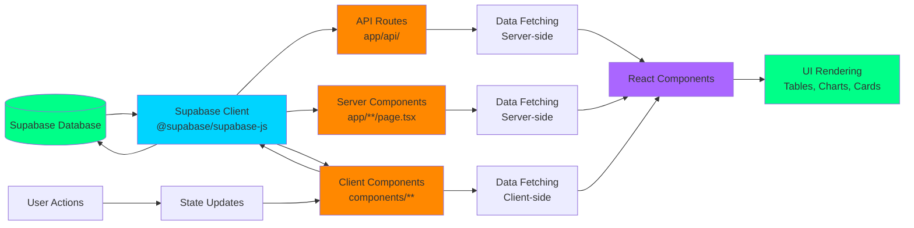
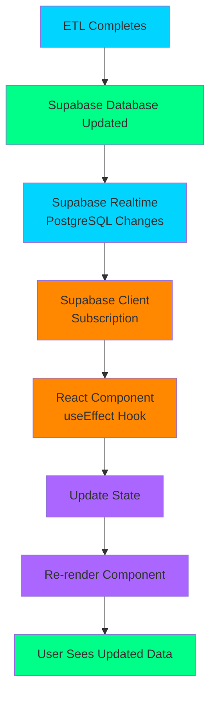
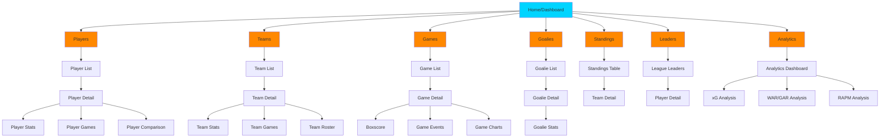
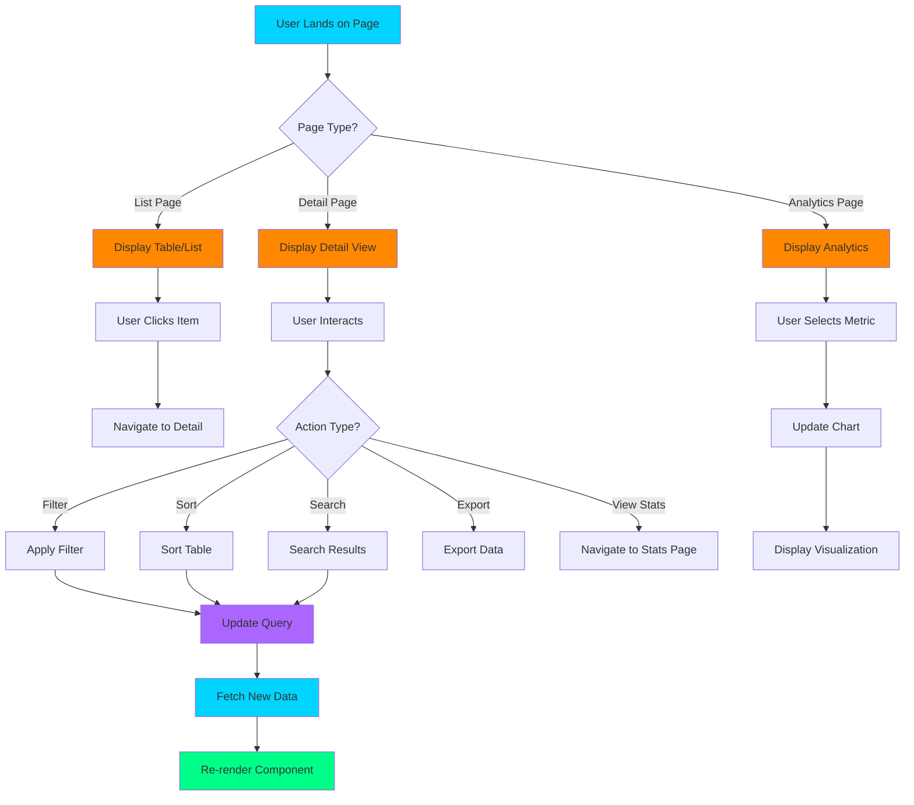
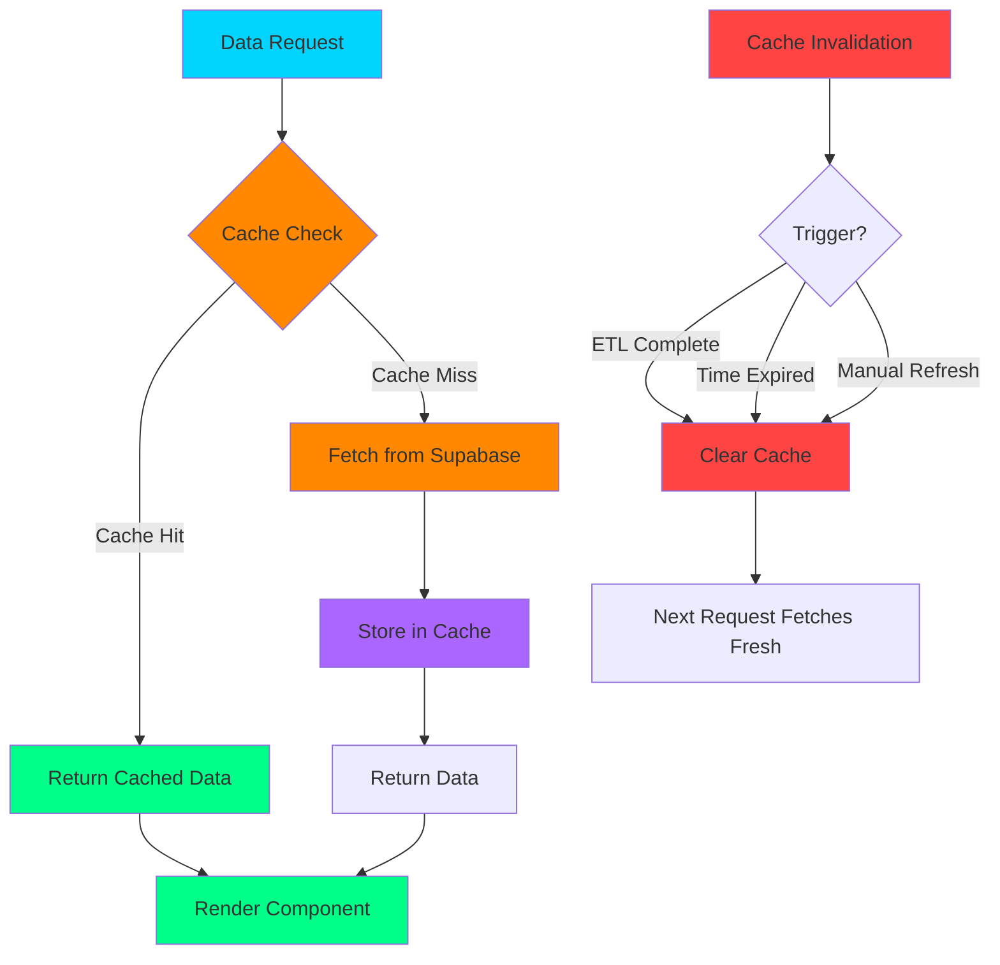
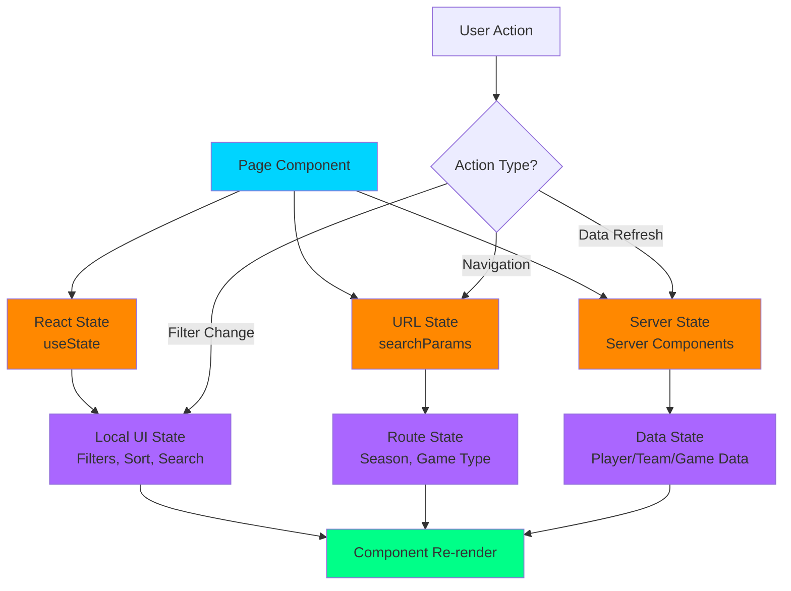

# BenchSight Dashboard Architecture Diagrams

**Visual representation of dashboard architecture, component structure, and data flow**

Last Updated: 2026-01-15  
Version: 1.0

---

## Overview

This document provides visual diagrams of the BenchSight Dashboard architecture, including component structure, data flow, and user journey flows.

**Tech Stack:** Next.js 14, TypeScript, Tailwind CSS, shadcn/ui, Recharts, Supabase

---

## Component Architecture

### Page Structure

```mermaid
graph TD
    A[Dashboard Root<br/>app/] --> B[Players Pages]
    A --> C[Teams Pages]
    A --> D[Games Pages]
    A --> E[Goalies Pages]
    A --> F[Standings Pages]
    A --> G[Leaders Pages]
    A --> H[Analytics Pages]
    
    B --> B1[app/players/page.tsx<br/>Player List]
    B --> B2[app/players/[id]/page.tsx<br/>Player Detail]
    B --> B3[app/players/[id]/stats/page.tsx<br/>Player Stats]
    B --> B4[app/players/[id]/games/page.tsx<br/>Player Games]
    
    C --> C1[app/teams/page.tsx<br/>Team List]
    C --> C2[app/teams/[id]/page.tsx<br/>Team Detail]
    C --> C3[app/teams/[id]/stats/page.tsx<br/>Team Stats]
    C --> C4[app/teams/[id]/games/page.tsx<br/>Team Games]
    
    D --> D1[app/games/page.tsx<br/>Game List]
    D --> D2[app/games/[id]/page.tsx<br/>Game Detail]
    D --> D3[app/games/[id]/boxscore/page.tsx<br/>Boxscore]
    
    E --> E1[app/goalies/page.tsx<br/>Goalie List]
    E --> E2[app/goalies/[id]/page.tsx<br/>Goalie Detail]
    
    F --> F1[app/standings/page.tsx<br/>Standings Table]
    
    G --> G1[app/leaders/page.tsx<br/>League Leaders]
    
    H --> H1[app/analytics/page.tsx<br/>Analytics Dashboard]
    H --> H2[app/analytics/xg/page.tsx<br/>xG Analysis]
    H --> H3[app/analytics/war/page.tsx<br/>WAR/GAR Analysis]
    
    style A fill:#00d4ff
    style B fill:#ff8800
    style C fill:#ff8800
    style D fill:#ff8800
    style E fill:#ff8800
    style F fill:#ff8800
    style G fill:#ff8800
    style H fill:#ff8800
```

### Component Hierarchy

```mermaid
graph TD
    A[Page Component<br/>app/players/[id]/page.tsx] --> B[Layout Component<br/>components/layout/]
    A --> C[Player Detail Component<br/>components/players/PlayerDetail.tsx]
    
    B --> B1[Header<br/>components/layout/Header.tsx]
    B --> B2[Navigation<br/>components/layout/Navigation.tsx]
    B --> B3[Footer<br/>components/layout/Footer.tsx]
    
    C --> C1[Player Stats Table<br/>components/tables/StatsTable.tsx]
    C --> C2[Player Charts<br/>components/charts/PlayerCharts.tsx]
    C --> C3[Player Info Card<br/>components/cards/PlayerInfo.tsx]
    
    C1 --> D1[Data Table<br/>components/ui/data-table.tsx]
    C2 --> D2[Recharts Components<br/>components/charts/]
    C3 --> D3[Card Component<br/>components/ui/card.tsx]
    
    style A fill:#00d4ff
    style B fill:#ff8800
    style C fill:#ff8800
    style D1 fill:#aa66ff
    style D2 fill:#aa66ff
    style D3 fill:#aa66ff
```

---

## Data Flow Diagram

### Supabase → Dashboard Flow



### Data Flow Architecture



### Real-Time Update Flow (Future)



---

## User Journey Flow

### Navigation Paths



### Feature Access Flow



---

## Component Data Flow

### Player Detail Page Flow

```mermaid
graph TD
    A[Player Detail Page<br/>app/players/[id]/page.tsx] --> B[Fetch Player Data]
    
    B --> B1[Supabase Query<br/>fact_player_game_stats<br/>WHERE player_id = id]
    B --> B2[Supabase Query<br/>dim_player<br/>WHERE player_id = id]
    B --> B3[Supabase Query<br/>fact_player_season_stats<br/>WHERE player_id = id]
    
    B1 --> C[Process Data]
    B2 --> C
    B3 --> C
    
    C --> D[Player Detail Component]
    D --> D1[Player Info Card<br/>Name, Team, Position]
    D --> D2[Player Stats Table<br/>Game-by-game stats]
    D --> D3[Player Charts<br/>Trends, comparisons]
    D --> D4[Season Summary<br/>Season totals]
    
    D1 --> E[Render UI]
    D2 --> E
    D3 --> E
    D4 --> E
    
    E --> F[User Sees Player Page]
    
    F --> G{User Action?}
    G -->|Filter Season| H[Update Query]
    G -->|Sort Stats| I[Sort Data]
    G -->|Export| J[Export CSV]
    G -->|View Game| K[Navigate to Game]
    
    H --> B1
    I --> D2
    J --> L[Download CSV]
    K --> M[Game Detail Page]
    
    style A fill:#00d4ff
    style B fill:#ff8800
    style C fill:#aa66ff
    style D fill:#ff8800
    style E fill:#00ff88
    style F fill:#00ff88
```

### Caching Strategy



---

## Component Library Structure

### Reusable Components

```mermaid
graph TD
    A[Component Library<br/>components/] --> B[UI Components<br/>components/ui/]
    A --> C[Feature Components<br/>components/players/]
    A --> D[Layout Components<br/>components/layout/]
    A --> E[Chart Components<br/>components/charts/]
    A --> F[Table Components<br/>components/tables/]
    
    B --> B1[Button<br/>components/ui/button.tsx]
    B --> B2[Card<br/>components/ui/card.tsx]
    B --> B3[Input<br/>components/ui/input.tsx]
    B --> B4[Select<br/>components/ui/select.tsx]
    B --> B5[Data Table<br/>components/ui/data-table.tsx]
    
    C --> C1[PlayerDetail<br/>components/players/PlayerDetail.tsx]
    C --> C2[PlayerStats<br/>components/players/PlayerStats.tsx]
    C --> C3[PlayerCharts<br/>components/players/PlayerCharts.tsx]
    
    D --> D1[Header<br/>components/layout/Header.tsx]
    D --> D2[Navigation<br/>components/layout/Navigation.tsx]
    D --> D3[Footer<br/>components/layout/Footer.tsx]
    
    E --> E1[LineChart<br/>components/charts/LineChart.tsx]
    E --> E2[BarChart<br/>components/charts/BarChart.tsx]
    E --> E3[ShotMap<br/>components/charts/ShotMap.tsx]
    
    F --> F1[StatsTable<br/>components/tables/StatsTable.tsx]
    F --> F2[StandingsTable<br/>components/tables/StandingsTable.tsx]
    
    style A fill:#00d4ff
    style B fill:#aa66ff
    style C fill:#ff8800
    style D fill:#ff8800
    style E fill:#ff8800
    style F fill:#ff8800
```



---

## State Management Flow

### Client-Side State



---

## Related Documentation

- [DASHBOARD_ROADMAP.md](DASHBOARD_ROADMAP.md) - Dashboard roadmap
- [API.md](../api/API.md) - API documentation
- [DATA_DICTIONARY.md](../data/DATA_DICTIONARY.md) - Data dictionary

---

*Last Updated: 2026-01-15*
