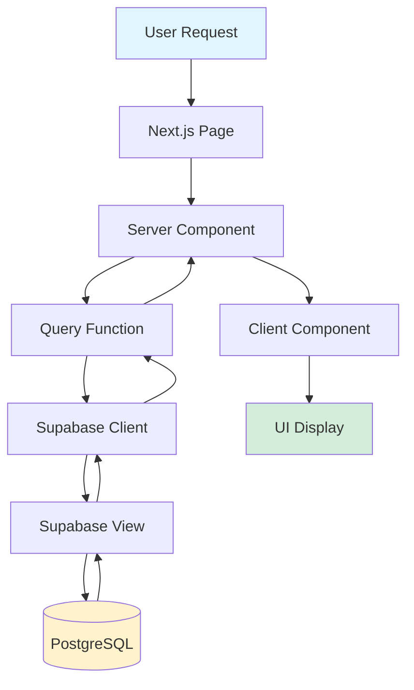

# BenchSight Dashboard Data Flow

**Complete data flow from Supabase to UI components**

Last Updated: 2026-01-21
Version: 2.00

---

## Overview

This document traces how data flows from Supabase through the Next.js dashboard to the UI components.

**Data Source:** Supabase (PostgreSQL)  
**Data Format:** Pre-aggregated views + ETL tables  
**Fetching:** Server Components (default)  
**Display:** React components

---

## Data Flow Diagram



---

## Data Flow Patterns

### Pattern 1: Server Component Data Fetching

**Flow:**
1. User navigates to page
2. Next.js renders server component
3. Server component calls query function
4. Query function fetches from Supabase
5. Data passed to components as props

**Example:**
```tsx
// app/norad/players/[playerId]/page.tsx
export default async function PlayerPage({ params }: { params: { playerId: string } }) {
  // Server component - runs on server
  const player = await getPlayer(params.playerId)
  const stats = await getPlayerStats(params.playerId)
  
  return (
    <PlayerProfile player={player} stats={stats} />
  )
}
```

### Pattern 2: Client Component Data Fetching

**Flow:**
1. Client component mounts
2. `useEffect` triggers data fetch
3. Query function called from client
4. Data fetched from Supabase
5. State updated, component re-renders

**Example:**
```tsx
'use client'

export function PlayerTrends({ playerId }: { playerId: string }) {
  const [data, setData] = useState<TrendData[]>([])
  
  useEffect(() => {
    async function fetchData() {
      const trends = await getPlayerTrends(playerId)
      setData(trends)
    }
    fetchData()
  }, [playerId])
  
  return <TrendChart data={data} />
}
```

---

## Query Functions

### Location: `lib/supabase/queries/`

Query functions are organized by domain:

#### Players (`queries/players.ts`)

```typescript
export async function getPlayer(playerId: string): Promise<Player> {
  const supabase = createServerClient()
  const { data, error } = await supabase
    .from('v_player_season_stats')
    .select('*')
    .eq('player_id', playerId)
    .single()
  
  if (error) throw error
  return data
}

export async function getPlayerStats(playerId: string): Promise<PlayerStats> {
  const supabase = createServerClient()
  const { data, error } = await supabase
    .from('fact_player_game_stats')
    .select('*')
    .eq('player_id', playerId)
  
  if (error) throw error
  return data
}
```

#### Goalies (`queries/goalies.ts`)

```typescript
export async function getGoalie(goalieId: string): Promise<Goalie> {
  const supabase = createServerClient()
  const { data, error } = await supabase
    .from('v_goalie_season_stats')
    .select('*')
    .eq('goalie_id', goalieId)
    .single()
  
  if (error) throw error
  return data
}
```

#### Teams (`queries/teams.ts`)

```typescript
export async function getTeam(teamId: string): Promise<Team> {
  const supabase = createServerClient()
  const { data, error } = await supabase
    .from('v_team_season_stats')
    .select('*')
    .eq('team_id', teamId)
    .single()
  
  if (error) throw error
  return data
}
```

#### Games (`queries/games.ts`)

```typescript
export async function getGame(gameId: string): Promise<Game> {
  const supabase = createServerClient()
  const { data, error } = await supabase
    .from('dim_schedule')
    .select('*')
    .eq('game_id', gameId)
    .single()
  
  if (error) throw error
  return data
}
```

---

## Supabase Views

### View Usage Pattern

The dashboard primarily uses Supabase views (pre-aggregated):

**Benefits:**
- Pre-aggregated data (faster queries)
- Consistent calculations
- Simplified queries

**Views Used:**
- `v_player_season_stats` - Player season stats
- `v_goalie_season_stats` - Goalie season stats
- `v_team_season_stats` - Team season stats
- `v_standings` - League standings
- `v_leaderboard_points` - Points leaders
- `v_leaderboard_goals` - Goals leaders
- `v_leaderboard_assists` - Assists leaders

### View Query Example

```typescript
// Query from view
const { data } = await supabase
  .from('v_player_season_stats')
  .select('*')
  .eq('season_id', 'N20232024F')
  .order('points', { ascending: false })
  .limit(10)
```

---

## Data Transformation

### Server-Side Transformation

```typescript
// Transform data in query function
export async function getPlayerTrends(playerId: string): Promise<TrendData[]> {
  const stats = await getPlayerStats(playerId)
  
  // Transform to trend format
  return stats.map(stat => ({
    gameId: stat.game_id,
    date: stat.date,
    goals: stat.goals,
    assists: stat.assists,
    points: stat.points,
    // Calculate rolling averages
    goalsPerGame5Game: calculateRollingAverage(stats, 'goals', 5),
    goalsPerGame10Game: calculateRollingAverage(stats, 'goals', 10),
  }))
}
```

### Client-Side Transformation

```typescript
'use client'

export function PlayerChart({ stats }: { stats: PlayerStats[] }) {
  // Transform data for chart
  const chartData = useMemo(() => {
    return stats.map(stat => ({
      date: stat.date,
      goals: stat.goals,
      assists: stat.assists,
      points: stat.points,
    }))
  }, [stats])
  
  return <LineChart data={chartData} />
}
```

---

## Caching Strategy

### Next.js Caching

**Server Components:**
- Data fetched on each request (no caching by default)
- Can use `revalidate` for ISR (Incremental Static Regeneration)

**Example:**
```typescript
export const revalidate = 3600 // Revalidate every hour

export default async function PlayerPage({ params }: { params: { playerId: string } }) {
  const player = await getPlayer(params.playerId)
  return <PlayerProfile player={player} />
}
```

### Supabase Caching

**Views:**
- Views are computed on-the-fly from ETL tables
- No explicit caching (PostgreSQL handles query optimization)

---

## Error Handling

### Query Error Handling

```typescript
export async function getPlayer(playerId: string): Promise<Player | null> {
  try {
    const supabase = createServerClient()
    const { data, error } = await supabase
      .from('v_player_season_stats')
      .select('*')
      .eq('player_id', playerId)
      .single()
    
    if (error) {
      console.error('Error fetching player:', error)
      return null
    }
    
    return data
  } catch (error) {
    console.error('Unexpected error:', error)
    return null
  }
}
```

### Component Error Handling

```tsx
export default async function PlayerPage({ params }: { params: { playerId: string } }) {
  const player = await getPlayer(params.playerId)
  
  if (!player) {
    return <NotFound />
  }
  
  return <PlayerProfile player={player} />
}
```

---

## Data Flow Examples

### Example 1: Player Profile Page

```
User navigates to /norad/players/P100001
    ↓
Next.js renders PlayerPage (server component)
    ↓
PlayerPage calls getPlayer('P100001')
    ↓
getPlayer() queries Supabase:
    SELECT * FROM v_player_season_stats 
    WHERE player_id = 'P100001'
    ↓
Supabase returns player data
    ↓
PlayerPage calls getPlayerStats('P100001')
    ↓
getPlayerStats() queries Supabase:
    SELECT * FROM fact_player_game_stats 
    WHERE player_id = 'P100001'
    ↓
Supabase returns stats data
    ↓
PlayerPage renders <PlayerProfileTabs player={player} stats={stats} />
    ↓
PlayerProfileTabs renders tabs with data
    ↓
User sees player profile
```

### Example 2: Standings Page

```
User navigates to /norad/standings
    ↓
Next.js renders StandingsPage (server component)
    ↓
StandingsPage calls getStandings()
    ↓
getStandings() queries Supabase:
    SELECT * FROM v_standings 
    ORDER BY points DESC
    ↓
Supabase returns standings data
    ↓
StandingsPage renders <StandingsTable standings={standings} />
    ↓
User sees standings table
```

---

## Performance Considerations

### Query Optimization

1. **Use Views:** Pre-aggregated views are faster than raw table queries
2. **Limit Results:** Use `.limit()` for large datasets
3. **Select Specific Columns:** Use `.select('column1, column2')` instead of `*`
4. **Index Usage:** Ensure Supabase views use indexed columns

### Data Fetching Optimization

1. **Parallel Fetching:** Fetch multiple queries in parallel
2. **Server Components:** Use server components for data fetching (faster)
3. **Streaming:** Use React Suspense for streaming data

---

## Related Documentation

- [DASHBOARD_ARCHITECTURE.md](DASHBOARD_ARCHITECTURE.md) - Architecture overview
- [DASHBOARD_COMPONENT_CATALOG.md](DASHBOARD_COMPONENT_CATALOG.md) - Component reference
- [DASHBOARD_ROADMAP.md](DASHBOARD_ROADMAP.md) - Development roadmap
- [DASHBOARD_PAGES_INVENTORY.md](DASHBOARD_PAGES_INVENTORY.md) - Pages inventory

---

*Last Updated: 2026-01-15*
