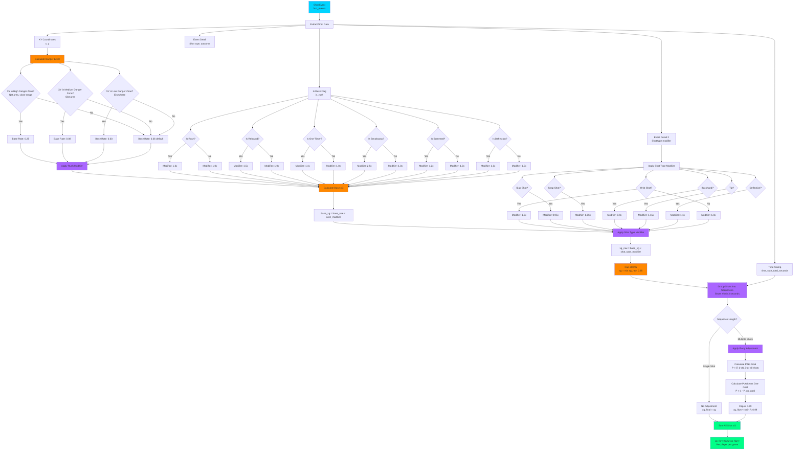
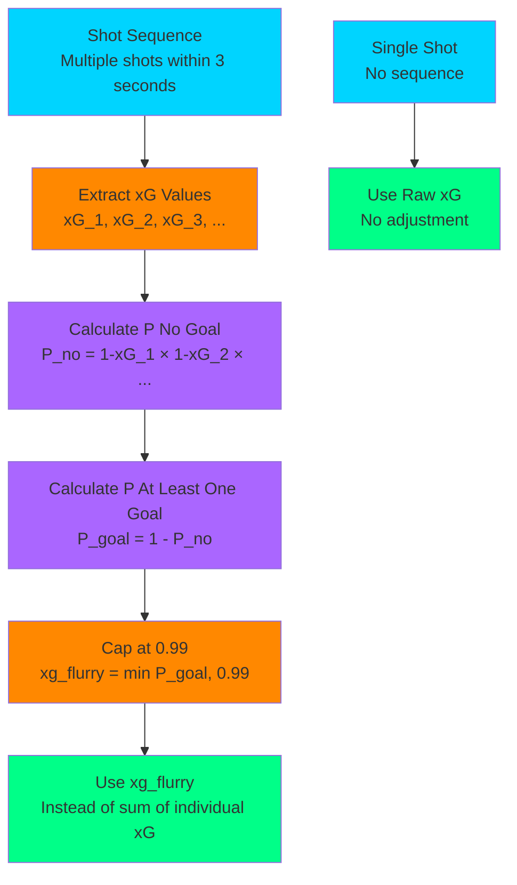
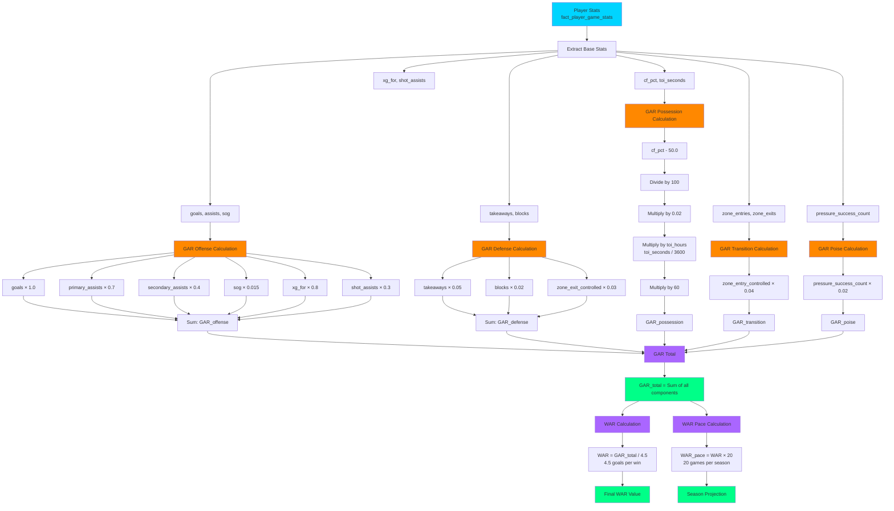
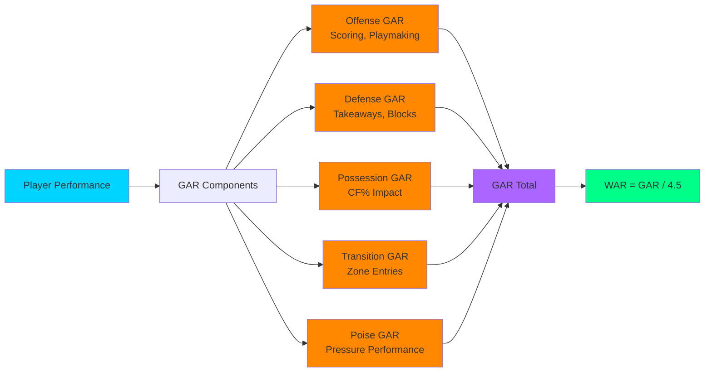
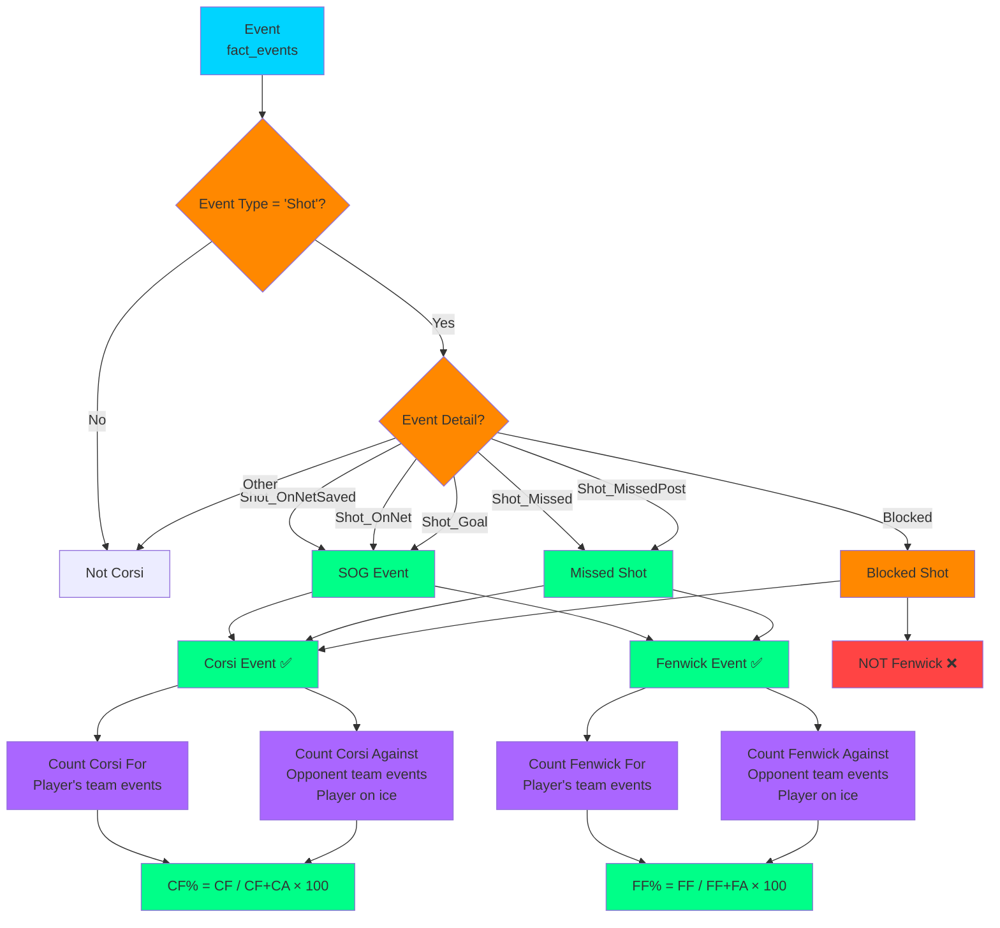
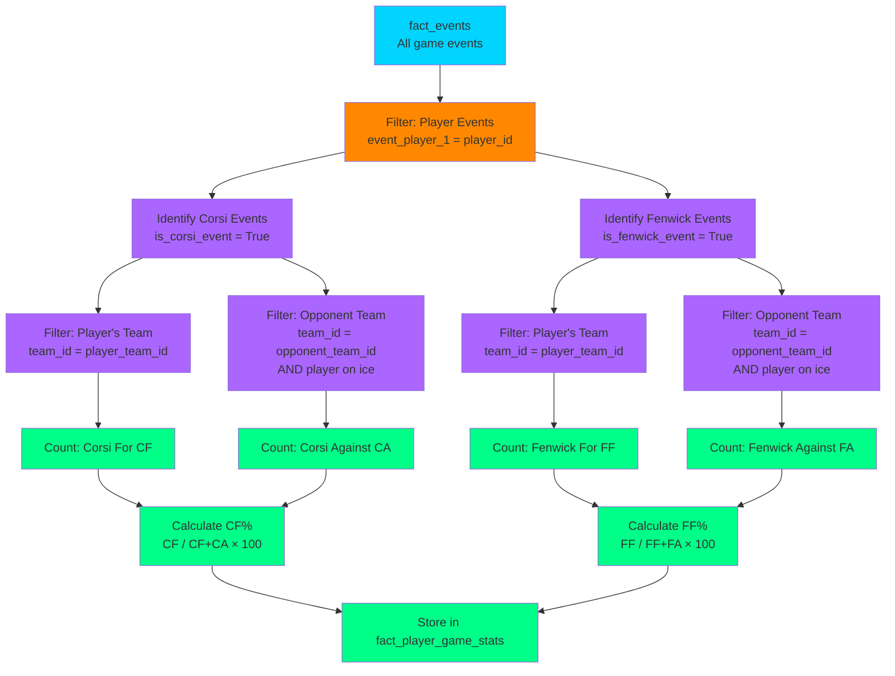
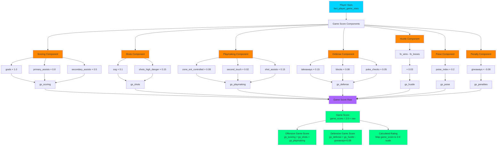
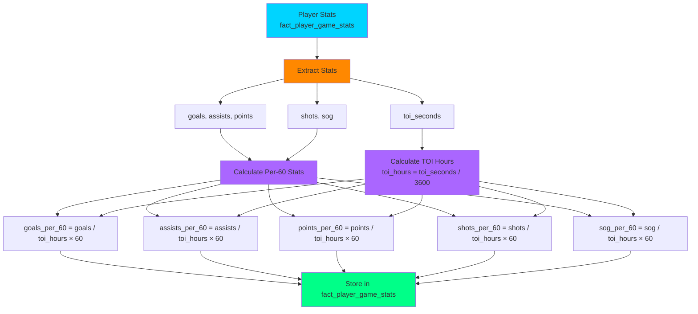

# BenchSight Calculation Flow Diagrams

**Visual representation of calculation processes for xG, WAR/GAR, Corsi, Fenwick, and other metrics**

Last Updated: 2026-01-21
Version: 2.00

---

## Overview

This document provides visual flow diagrams for all major calculation processes in BenchSight, showing how raw data flows through transformations to produce final metrics.

---

## xG (Expected Goals) Calculation Flow

### Complete xG Calculation Process

### Flurry Adjustment Detail

---

## WAR/GAR Calculation Flow

### Complete WAR/GAR Calculation Process

### GAR Component Breakdown

---

## Corsi/Fenwick Calculation Flow

### Corsi Event Identification

### Corsi/Fenwick Aggregation

---

## Game Score Calculation Flow

### Game Score Components

---

## Rate Stats Calculation Flow

### Per-60 Statistics

---

## Related Documentation

- [DATA_DICTIONARY.md](DATA_DICTIONARY.md) - Complete data dictionary with formulas
- [ETL_FLOW_DIAGRAMS.md](../etl/ETL_FLOW_DIAGRAMS.md) - ETL process diagrams
- [ETL.md](../etl/ETL.md) - ETL documentation

---

*Last Updated: 2026-01-15*
