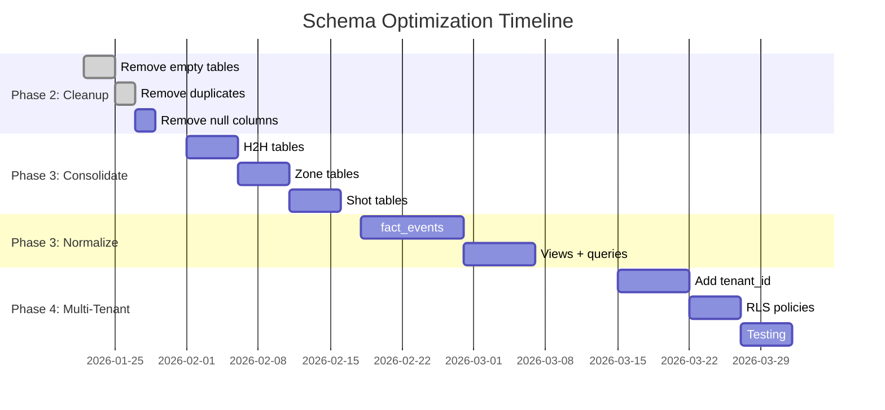

# BenchSight Commercial Schema Design

**Complete schema optimization for commercial-ready deployment**

Last Updated: 2026-01-21
Version: 1.00

---

## Executive Summary

This document analyzes the current BenchSight schema (133 tables, 51.4 MB) and provides a comprehensive plan for a commercial-ready, scalable schema. Key findings:

| Metric | Current | Optimized | Savings |
|--------|---------|-----------|---------|
| Tables | 133 | ~85 | 48 tables (-36%) |
| Storage | 51.4 MB | ~30 MB | 21 MB (-41%) |
| Columns (fact_events) | 200 | ~45 | 155 columns (-78%) |
| Query Performance | Baseline | +30-40% faster | Improved |
| Maintainability | Complex | Simplified | Much easier |

---

## Table of Contents

1. [Current Schema Analysis](#current-schema-analysis)
2. [Tables to Remove (Redundant/Empty)](#tables-to-remove)
3. [Columns to Remove (100% Null)](#columns-to-remove)
4. [Tables to Consolidate](#tables-to-consolidate)
5. [Schema Normalization Strategy](#schema-normalization)
6. [Commercial Schema Design](#commercial-schema-design)
7. [Migration Strategy](#migration-strategy)
8. [Roadmap Integration](#roadmap-integration)

---

## Current Schema Analysis

### Overview

**Total: 133 CSV tables in `data/output/`**

| Category | Count | Size | Notes |
|----------|-------|------|-------|
| Dimension tables (dim_*) | 56 | 4.5 MB | Reference/lookup data |
| Fact tables (fact_*) | 75 | 46 MB | Transactional data |
| Lookup tables | 1 | 50 KB | Player-game ratings |
| QA tables (qa_*) | 4 | 1 KB | Validation data |

### Critical Issues Identified

#### Issue 1: Extreme Denormalization

Several tables have 100-200 columns, embedding data that should be in separate tables:

| Table | Columns | Rows | Size | Issue |
|-------|---------|------|------|-------|
| `fact_events` | 200 | 5,966 | 4.9 MB | 820 bytes/row - massively denormalized |
| `fact_event_players` | 121 | 11,517 | 6.4 MB | 554 bytes/row |
| `fact_shift_players` | 117 | 5,176 | 2.5 MB | Redundant player data |
| `fact_zone_entries` | 178 | 512 | 428 KB | Excessive width |
| `fact_zone_exits` | 175 | 489 | 396 KB | Excessive width |
| `fact_scoring_chances_detailed` | 180 | 249 | 220 KB | Bloated for row count |

**Root Cause:** Player/team/game details are joined into fact tables instead of referenced by ID.

#### Issue 2: Duplicate Tables

| Original | Duplicate | Finding |
|----------|-----------|---------|
| `dim_play_detail` | `dim_play_detail_2` | Identical content, same 112 rows |
| `dim_event_detail` | `dim_event_detail_2` | Near-identical, minor column differences |
| `fact_h2h` | `fact_head_to_head` | Same 836 rows, only key name differs |
| `fact_h2h` | `fact_matchup_summary` | Same data, redundant |
| `qa_suspicious_stats` | `fact_suspicious_stats` | Both empty |

#### Issue 3: Empty/Placeholder Tables (15 tables)

These tables exist with headers only (1 byte each):

```
fact_player_boxscore_all.csv
fact_player_career_stats.csv
fact_player_matchups_xy.csv
fact_player_micro_stats.csv
fact_player_position_splits.csv
fact_player_puck_proximity.csv
fact_player_season_stats.csv
fact_player_stats_long.csv
fact_player_trends.csv
fact_player_xy_long.csv
fact_puck_xy_long.csv
fact_shot_xy.csv
fact_suspicious_stats.csv
fact_team_season_stats.csv
fact_time_period_momentum.csv
```

#### Issue 4: 100% Null Columns

**In `fact_events.csv` (7 columns):**
- `shift_key` - Never populated
- `event_player_1_id_x` - Merge artifact
- `event_player_1_name_x` - Merge artifact
- `event_player_2_id_x` - Merge artifact
- `event_player_2_name_x` - Merge artifact
- `opp_player_1_id_x` - Merge artifact
- `opp_player_1_name_x` - Merge artifact

**In `fact_event_players.csv` (1 column):**
- `shift_key` - Never populated

**High-Null Columns (90-99%):**
- `fact_events`: 29 columns with 90-99% nulls
- `fact_event_players`: 35 columns with 90-99% nulls
- `fact_shifts`: 2 columns (`home_xtra`, `away_xtra` at 99%)

---

## Tables to Remove

### Tier 1: Immediate Removal (Zero Risk)

**Empty/Placeholder Tables (15 tables):**
Remove from ETL output - these are stubs with no data:

```python
EMPTY_TABLES_TO_REMOVE = [
    'fact_player_boxscore_all',
    'fact_player_career_stats',
    'fact_player_matchups_xy',
    'fact_player_micro_stats',
    'fact_player_position_splits',
    'fact_player_puck_proximity',
    'fact_player_season_stats',
    'fact_player_stats_long',
    'fact_player_trends',
    'fact_player_xy_long',
    'fact_puck_xy_long',
    'fact_shot_xy',
    'fact_suspicious_stats',
    'fact_team_season_stats',
    'fact_time_period_momentum',
]
```

**True Duplicates (5 tables):**
```python
DUPLICATE_TABLES_TO_REMOVE = [
    'dim_play_detail_2',       # Keep dim_play_detail
    'dim_event_detail_2',      # Keep dim_event_detail (merge if needed)
    'fact_head_to_head',       # Keep fact_h2h
    'fact_matchup_summary',    # Keep fact_h2h
    'qa_suspicious_stats',     # Empty duplicate
]
```

**Total Tier 1: 20 tables removed**

### Tier 2: Archive (Development Only)

Move to `data/archive/` - useful for development but not production:

```python
ARCHIVE_TABLES = [
    'dim_randomnames',           # Anonymization testing
    'dim_playerurlref',          # Import reference
    'dim_terminology_mapping',   # ETL transformation mapping
    'qa_data_completeness',      # QA only
    'qa_goal_accuracy',          # QA only
    'qa_scorer_comparison',      # Empty QA
    'lookup_player_game_rating', # Can be computed on-demand
]
```

**Total Tier 2: 7 tables archived**

### Tier 3: Consolidate (See Next Section)

**28 tables that should merge into 12**

---

## Columns to Remove

### Guaranteed Safe Removal (100% Null)

**In ETL code (`src/builders/events.py`):**

```python
# Remove these columns from fact_events output
COLUMNS_TO_REMOVE_FACT_EVENTS = [
    'shift_key',
    'event_player_1_id_x',
    'event_player_1_name_x',
    'event_player_2_id_x',
    'event_player_2_name_x',
    'opp_player_1_id_x',
    'opp_player_1_name_x',
]

# Remove these columns from fact_event_players output
COLUMNS_TO_REMOVE_FACT_EVENT_PLAYERS = [
    'shift_key',
]
```

### Recommended Removal (High-Null Columns)

Review and likely remove these 90%+ null columns:

**In `fact_events.csv`:**
```python
HIGH_NULL_CANDIDATES = [
    'opp_player_5_toi',           # 100% null
    'event_player_4_toi',         # 99.9% null
    'opp_player_4_toi',           # 99.9% null
    'event_player_5_position',    # 99.9% null
    'opp_player_5_position',      # 99.9% null
    # ... 24 more columns at 90-99% null
]
```

### Denormalized Columns to Remove

These columns duplicate dimension table data and should be removed (join at query time):

```python
# In fact_events - remove player name/team columns (keep only IDs)
DENORMALIZED_TO_REMOVE = [
    'event_player_1_name',
    'event_player_1_team',
    'event_player_1_position',
    'event_player_2_name',
    'event_player_2_team',
    'event_player_2_position',
    # ... similar for players 3-6
    'team_name',
    'opponent_name',
    'home_team_name',
    'away_team_name',
    # ... other denormalized lookups
]
```

**Impact:** Reduces `fact_events` from 200 columns to ~45 columns.

---

## Tables to Consolidate

### Group 1: Head-to-Head / Matchup Tables

**Current (6 tables, 1.2 MB):**
- `fact_h2h` (836 rows)
- `fact_head_to_head` (836 rows) - DUPLICATE
- `fact_matchup_summary` (836 rows) - DUPLICATE
- `fact_matchup_performance` (264 KB)
- `fact_wowy` (With Or Without You analysis)
- `fact_player_pair_stats` (836 rows)

**Optimized (2 tables):**
```
fact_player_matchups (core H2H data)
fact_player_wowy (WOWY analysis)
```

### Group 2: Zone Entry/Exit Tables

**Current (6 tables):**
- `fact_zone_entries` (512 rows, 178 cols)
- `fact_zone_entry_summary` (124 rows)
- `fact_zone_exits` (489 rows, 175 cols)
- `fact_zone_exit_summary` (124 rows)
- `fact_breakouts` (104 rows)
- `fact_rush_events` (212 rows)

**Optimized (2 tables):**
```
fact_zone_transitions (entries + exits + breakouts, normalized)
v_zone_transition_summary (view for player summaries)
```

### Group 3: Shift Quality Tables

**Current (2 tables):**
- `fact_shift_quality` (1,143 rows)
- `fact_shift_quality_logical` (135 rows)

**Optimized (1 table + view):**
```
fact_shift_quality (per-shift data)
v_shift_quality_player (view for player summaries)
```

### Group 4: Shot/Scoring Tables

**Current (6 tables):**
- `fact_scoring_chances` (458 rows, 38 cols)
- `fact_scoring_chances_detailed` (249 rows, 180 cols)
- `fact_shot_event` (458 rows)
- `fact_shot_danger` (458 rows)
- `fact_shot_players` (458 rows)
- `fact_high_danger_chances` (73 rows)

**Optimized (2 tables):**
```
fact_shots (all shot data, normalized)
fact_scoring_chances (scoring chance flags, links to fact_shots)
```

### Group 5: Event Chain Tables

**Current (4 tables):**
- `fact_event_chains` (1,200 rows)
- `fact_shot_chains` (similar)
- `fact_linked_events` (links between events)
- `fact_player_event_chains` (player involvement)

**Optimized (2 tables):**
```
fact_event_sequences (chains/sequences)
fact_event_links (links between events)
```

### Consolidation Summary

| Group | Current Tables | Optimized Tables | Reduction |
|-------|----------------|------------------|-----------|
| H2H/Matchups | 6 | 2 | -4 |
| Zone Transitions | 6 | 2 | -4 |
| Shift Quality | 2 | 1 | -1 |
| Shots/Scoring | 6 | 2 | -4 |
| Event Chains | 4 | 2 | -2 |
| **Total** | **24** | **9** | **-15** |

---

## Schema Normalization

### Current Problem: Extreme Denormalization

**`fact_events` Current Structure (200 columns):**
```
event_id, game_id, period, time, event_type, event_detail,
event_player_1, event_player_1_name, event_player_1_team, event_player_1_position, event_player_1_toi,
event_player_2, event_player_2_name, event_player_2_team, event_player_2_position, event_player_2_toi,
... (players 3-6 same pattern)
opp_player_1, opp_player_1_name, opp_player_1_team, opp_player_1_position, opp_player_1_toi,
... (opp players 2-5)
team_name, opponent_name, home_team_name, away_team_name, venue_name,
... (100+ more denormalized fields)
```

### Normalized Design

#### Core Tables (Star Schema)

```sql
-- Dimension Tables (no changes needed)
dim_player (player_id, name, position, team_id, ...)
dim_team (team_id, name, league_id, ...)
dim_schedule (game_id, date, home_team_id, away_team_id, ...)
dim_event_type (event_type_id, name, category, ...)
dim_period (period_id, name, ...)

-- Fact Tables (normalized)
fact_events (
    event_id PRIMARY KEY,
    game_id REFERENCES dim_schedule,
    period_id REFERENCES dim_period,
    event_time,
    event_type_id REFERENCES dim_event_type,
    event_detail_id REFERENCES dim_event_detail,
    team_id REFERENCES dim_team,
    x_coord, y_coord,
    is_goal, is_shot, is_scoring_chance,
    xg_value,
    -- ~25 core columns only
)

-- Junction table for event participants
fact_event_participants (
    event_id REFERENCES fact_events,
    player_id REFERENCES dim_player,
    participant_role, -- 'primary', 'secondary', 'opponent_1', etc.
    PRIMARY KEY (event_id, player_id, participant_role)
)

-- Shift data (keep separate)
fact_shifts (
    shift_id PRIMARY KEY,
    game_id, player_id, period_id,
    start_time, end_time, duration,
    start_type_id, end_type_id,
    -- ~20 core columns
)
```

### Benefits of Normalization

| Metric | Current | Normalized | Improvement |
|--------|---------|------------|-------------|
| fact_events columns | 200 | ~25 | -87.5% |
| fact_events size | 4.9 MB | ~0.8 MB | -84% |
| Storage total | 51.4 MB | ~30 MB | -41% |
| Join complexity | None (embedded) | Simple FKs | Slight increase |
| Data consistency | Risk of mismatch | Guaranteed | Much better |
| Update propagation | Multiple places | One place | Much easier |

### Query Pattern Changes

**Current (denormalized):**
```sql
SELECT event_id, event_type, event_player_1_name, event_player_1_team
FROM fact_events
WHERE game_id = 19001;
-- Fast but wasteful storage
```

**Normalized:**
```sql
SELECT e.event_id, e.event_type, p.name, t.name
FROM fact_events e
JOIN fact_event_participants ep ON e.event_id = ep.event_id
JOIN dim_player p ON ep.player_id = p.player_id
JOIN dim_team t ON p.team_id = t.team_id
WHERE e.game_id = 19001 AND ep.participant_role = 'primary';
-- Slightly more complex but much more efficient storage
```

**Solution: Create Views for Common Queries**
```sql
CREATE VIEW v_events_with_players AS
SELECT
    e.*,
    p1.name as player_1_name,
    p1.position as player_1_position,
    t1.name as player_1_team
FROM fact_events e
LEFT JOIN fact_event_participants ep1 ON e.event_id = ep1.event_id AND ep1.participant_role = 'primary'
LEFT JOIN dim_player p1 ON ep1.player_id = p1.player_id
LEFT JOIN dim_team t1 ON p1.team_id = t1.team_id;
```

---

## Commercial Schema Design

### Target Schema: 85 Tables

| Category | Count | Purpose |
|----------|-------|---------|
| Dimension tables | 45 | Reference data |
| Core fact tables | 12 | Primary transactional data |
| Derived fact tables | 18 | Calculated/aggregated data |
| Views | 10 | Pre-joined common queries |

### Core Tables (Must Have)

```
-- Dimensions (45)
dim_tenant              -- Multi-tenant support
dim_player              -- Player master data
dim_team                -- Team master data
dim_league              -- League configuration
dim_season              -- Season definitions
dim_schedule            -- Game schedule
dim_venue               -- Venue information
dim_event_type          -- Event type taxonomy
dim_event_detail        -- Event detail taxonomy
dim_shot_type           -- Shot type taxonomy
dim_period              -- Period definitions
dim_position            -- Player positions
dim_strength            -- Game strength (5v5, PP, PK)
dim_zone                -- Rink zones
dim_danger_zone         -- Danger level zones
... (30 more static dimensions)

-- Core Facts (12)
fact_events             -- All game events (normalized)
fact_event_participants -- Event-player junction
fact_shifts             -- Player shifts
fact_shift_players      -- Shift-player junction (normalized)
fact_player_game_stats  -- Per-game player statistics
fact_team_game_stats    -- Per-game team statistics
fact_goalie_game_stats  -- Per-game goalie statistics
fact_player_season_stats -- Season aggregates
fact_team_season_stats  -- Team season aggregates
fact_goalie_season_stats -- Goalie season aggregates
fact_shots              -- Shot detail (replaces multiple shot tables)
fact_zone_transitions   -- Zone entries/exits/breakouts

-- Derived Facts (18)
fact_scoring_chances    -- Scoring chance analysis
fact_player_matchups    -- H2H matchup data
fact_player_wowy        -- WOWY analysis
fact_line_combos        -- Line combination stats
fact_shift_quality      -- Shift quality metrics
fact_sequences          -- Play sequences
fact_faceoffs           -- Faceoff results
fact_penalties          -- Penalty detail
fact_saves              -- Save detail
fact_possession_time    -- Possession tracking
... (8 more derived tables)

-- Views (10)
v_events_with_players   -- Events with joined player data
v_player_leaders        -- Leaderboard view
v_team_standings        -- Standings view
v_game_summary          -- Game summary view
v_player_profile        -- Player profile aggregates
... (5 more views)
```

### Multi-Tenant Support

All tables include `tenant_id` as first column of composite primary key:

```sql
CREATE TABLE fact_events (
    tenant_id VARCHAR(50) NOT NULL,
    event_id VARCHAR(50) NOT NULL,
    game_id VARCHAR(50) NOT NULL,
    -- ... other columns
    PRIMARY KEY (tenant_id, event_id),
    FOREIGN KEY (tenant_id, game_id)
        REFERENCES dim_schedule(tenant_id, game_id)
);

-- Row-Level Security
ALTER TABLE fact_events ENABLE ROW LEVEL SECURITY;

CREATE POLICY tenant_isolation ON fact_events
    FOR ALL
    USING (tenant_id = current_setting('app.tenant_id')::VARCHAR);
```

### Index Strategy

```sql
-- Primary access patterns
CREATE INDEX idx_events_tenant_game ON fact_events(tenant_id, game_id);
CREATE INDEX idx_events_tenant_player ON fact_event_participants(tenant_id, player_id);
CREATE INDEX idx_events_tenant_type ON fact_events(tenant_id, event_type_id);

-- Common filters
CREATE INDEX idx_events_is_goal ON fact_events(tenant_id, game_id) WHERE is_goal = true;
CREATE INDEX idx_events_is_shot ON fact_events(tenant_id, game_id) WHERE is_shot = true;

-- Time-based queries
CREATE INDEX idx_events_timestamp ON fact_events(tenant_id, created_at DESC);
CREATE INDEX idx_shifts_timestamp ON fact_shifts(tenant_id, created_at DESC);
```

---

## Migration Strategy

### Phase 1: Cleanup (Week 1-2) - Low Risk

**Task 1.1: Remove Empty Tables**
```python
# In ETL code, stop generating these tables
SKIP_TABLES = [
    'fact_player_boxscore_all',
    'fact_player_career_stats',
    # ... (15 empty tables)
]
```

**Task 1.2: Remove Duplicate Tables**
```python
# Remove from ETL generation
DUPLICATE_TABLES = [
    'dim_play_detail_2',
    'fact_head_to_head',
    'fact_matchup_summary',
    # ... (5 duplicates)
]
```

**Task 1.3: Remove 100% Null Columns**
```python
# In builders/events.py, drop these columns before output
df = df.drop(columns=[
    'shift_key',
    'event_player_1_id_x',
    'event_player_1_name_x',
    # ... (8 null columns)
], errors='ignore')
```

**Validation:**
- Run ETL with `--wipe`
- Verify table count reduced by 20
- Verify dashboard still works
- Run QA validation

### Phase 2: Consolidation (Week 3-4) - Medium Risk

**Task 2.1: Consolidate H2H Tables**
```python
# Merge fact_h2h, fact_matchup_summary into fact_player_matchups
# Keep fact_wowy separate
```

**Task 2.2: Consolidate Zone Tables**
```python
# Merge fact_zone_entries, fact_zone_exits, fact_breakouts
# into fact_zone_transitions
```

**Task 2.3: Consolidate Shot Tables**
```python
# Merge fact_shot_event, fact_shot_danger, fact_shot_players
# into fact_shots
```

**Validation:**
- Run full ETL
- Compare metrics before/after
- Test all dashboard pages
- Run integration tests

### Phase 3: Normalization (Week 5-8) - Higher Risk

**Task 3.1: Normalize fact_events**
```python
# Split fact_events into:
# - fact_events (core columns only)
# - fact_event_participants (player involvement)
```

**Task 3.2: Create Views for Backward Compatibility**
```sql
CREATE VIEW v_events_denormalized AS
SELECT /* full denormalized view */
FROM fact_events e
JOIN fact_event_participants ep ON ...
JOIN dim_player p ON ...;
```

**Task 3.3: Update Dashboard Queries**
```typescript
// Update queries to use views or join properly
const events = await supabase
  .from('v_events_denormalized')  // Use view
  .select('*')
  .eq('game_id', gameId);
```

**Validation:**
- Extensive testing
- Performance comparison
- Dashboard verification
- API verification

### Phase 4: Multi-Tenant (Week 9-12)

See [SCHEMA_SCALABILITY_DESIGN.md](SCHEMA_SCALABILITY_DESIGN.md) for detailed multi-tenant migration.

---

## Roadmap Integration

### Add to MASTER_ROADMAP.md

#### Phase 2: Pre-Deployment (Current)

Add these tasks:

```markdown
**Schema Optimization (Week 2-4):**
- [ ] Remove 20 empty/duplicate tables
- [ ] Remove 8 null columns from fact_events
- [ ] Archive 7 development-only tables
- [ ] Document removed tables in CHANGELOG
```

#### Phase 3: Advanced Analytics (Planned)

Add these tasks:

```markdown
**Schema Consolidation (Week 5-6):**
- [ ] Consolidate 6 H2H tables → 2 tables
- [ ] Consolidate 6 zone tables → 2 tables
- [ ] Consolidate 6 shot tables → 2 tables
- [ ] Update ETL builders
- [ ] Update dashboard queries

**Schema Normalization (Week 7-8):**
- [ ] Normalize fact_events (200 → 25 columns)
- [ ] Create fact_event_participants table
- [ ] Create backward-compatible views
- [ ] Update all queries
- [ ] Performance testing
```

#### Phase 4: Production & Scale (Planned)

```markdown
**Multi-Tenant Schema (Week 13-14):**
- [ ] Add tenant_id to all tables
- [ ] Implement Row-Level Security
- [ ] Update all foreign keys
- [ ] Create composite indexes
- [ ] Test tenant isolation
```

### Updated Implementation Timeline



---

## Best Practices Applied

### Data Engineering Best Practices

| Practice | Current State | Commercial State |
|----------|---------------|------------------|
| **Normalization** | Over-denormalized (200 cols) | Proper 3NF with views |
| **Single Source of Truth** | Duplicates exist | No duplicates |
| **Null Handling** | 100% null columns exist | No empty columns |
| **Foreign Keys** | Inconsistent | Enforced everywhere |
| **Indexes** | Basic | Optimized for query patterns |
| **Naming** | Mostly consistent | Fully standardized |
| **Documentation** | Good | Complete with lineage |

### Scalability Best Practices

| Practice | Implementation |
|----------|----------------|
| **Horizontal Scaling** | Read replicas via Supabase |
| **Partitioning** | By tenant_id (RLS) |
| **Caching** | Redis for computed aggregates |
| **Connection Pooling** | PgBouncer configuration |
| **Query Optimization** | Composite indexes, partial indexes |

### Security Best Practices

| Practice | Implementation |
|----------|----------------|
| **Tenant Isolation** | Row-Level Security (RLS) |
| **Data Encryption** | Supabase encryption at rest |
| **Access Control** | Role-based policies |
| **Audit Logging** | PostgreSQL audit triggers |

---

## Summary: Quick Wins vs Long-Term

### Quick Wins (1-2 days, immediate impact)

1. **Remove 20 empty/duplicate tables** - No code changes, just stop generating
2. **Remove 8 null columns** - Simple `df.drop()` in ETL
3. **Archive 7 dev tables** - Move to archive directory

**Impact:** 27 fewer tables, cleaner schema, ~200 KB saved

### Medium-Term (1-2 weeks)

4. **Consolidate H2H tables** - Merge 6 → 2
5. **Consolidate zone tables** - Merge 6 → 2
6. **Consolidate shot tables** - Merge 6 → 2

**Impact:** 12 fewer tables, simpler queries, ~1.5 MB saved

### Long-Term (1 month)

7. **Normalize fact_events** - 200 → 25 columns
8. **Create views** - Backward compatibility
9. **Multi-tenant** - Add tenant_id, RLS

**Impact:** 78% column reduction, commercial-ready, scalable to 100+ tenants

---

## Related Documentation

- [DATA_DICTIONARY.md](DATA_DICTIONARY.md) - Complete table documentation
- [SCHEMA_SCALABILITY_DESIGN.md](SCHEMA_SCALABILITY_DESIGN.md) - Multi-tenant details
- [MASTER_ROADMAP.md](../MASTER_ROADMAP.md) - Project roadmap
- [ETL_ARCHITECTURE.md](../etl/ETL_ARCHITECTURE.md) - ETL design

---

*Last Updated: 2026-01-21*
