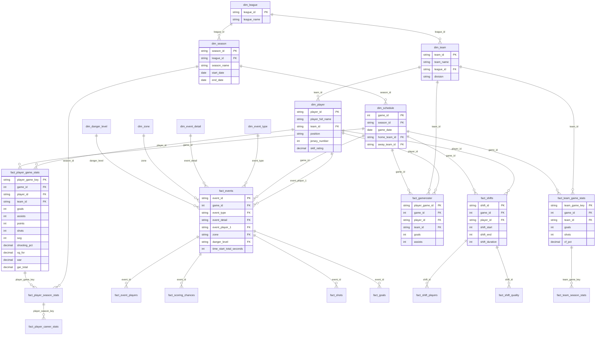
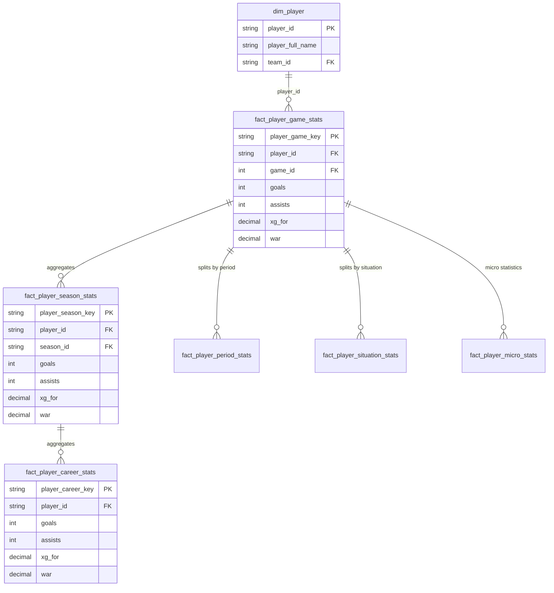
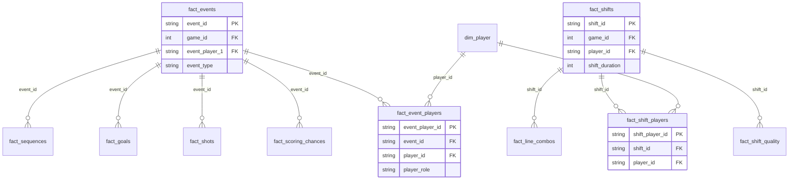
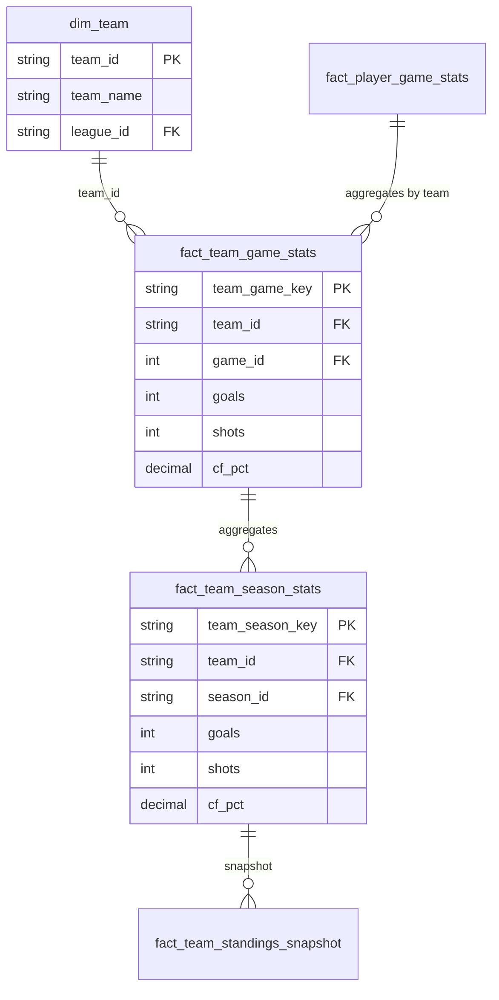
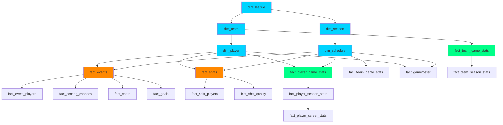
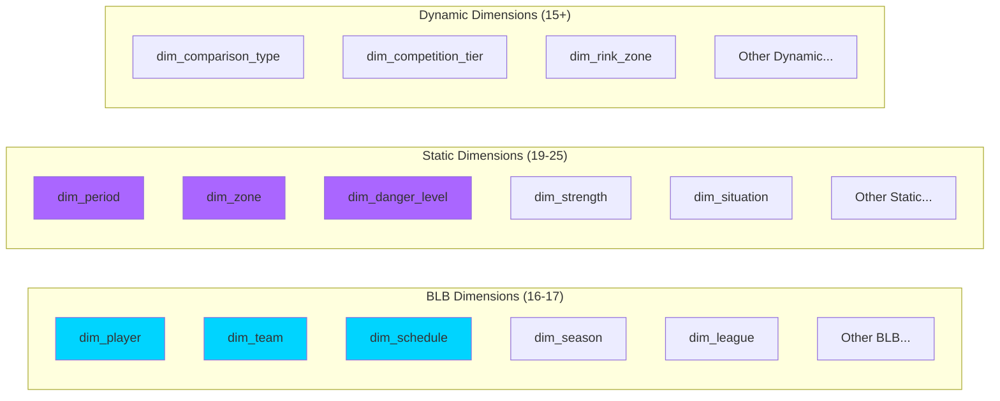
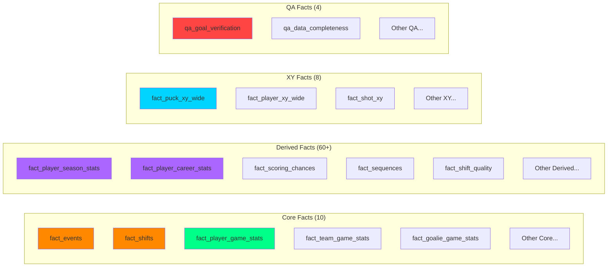
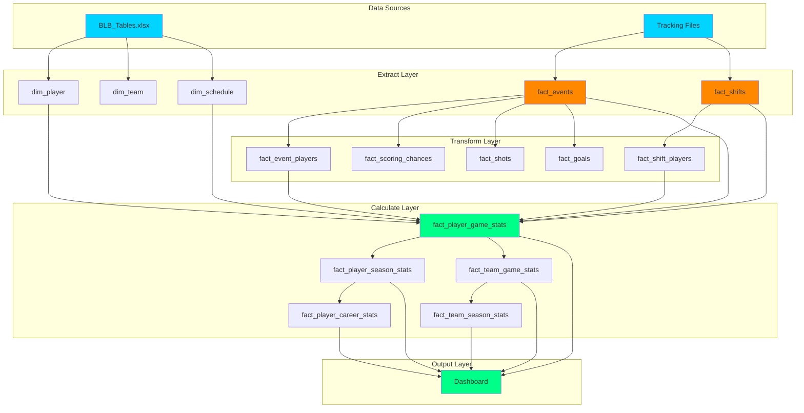
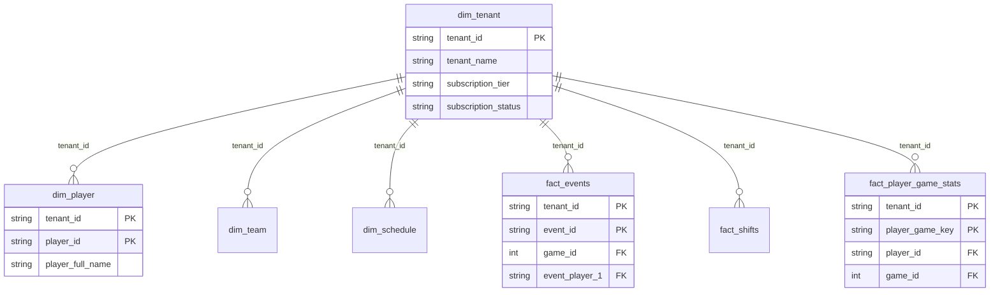

# BenchSight Database Schema ERD

**Entity-Relationship Diagrams for all tables and relationships**

Last Updated: 2026-01-21
Version: 2.00

---

## Overview

This document provides Entity-Relationship Diagrams (ERDs) for the BenchSight database schema, showing table relationships, primary keys, and foreign keys.

**Total Tables:** 132-139 tables  
**Core Tables:** ~20 essential tables  
**Derived Tables:** ~100+ calculated/aggregated tables

---

## Core Schema ERD

### Essential Tables and Relationships

---

## Complete Schema ERD (Simplified)

### All Table Categories

```mermaid
graph TB
    subgraph Dimensions["Dimension Tables (50 tables)"]
        D1[dim_player]
        D2[dim_team]
        D3[dim_schedule]
        D4[dim_season]
        D5[dim_league]
        D6[dim_event_type]
        D7[dim_event_detail]
        D8[dim_zone]
        D9[dim_danger_level]
        D10[dim_period]
        D11[dim_strength]
        D12[dim_situation]
        D13[Other Dimensions...]
    end
    
    subgraph CoreFacts["Core Fact Tables (10 tables)"]
        F1[fact_events]
        F2[fact_shifts]
        F3[fact_event_players]
        F4[fact_shift_players]
        F5[fact_gameroster]
        F6[fact_player_game_stats]
        F7[fact_team_game_stats]
        F8[fact_goalie_game_stats]
        F9[fact_tracking]
        F10[fact_registration]
    end
    
    subgraph DerivedFacts["Derived Fact Tables (70+ tables)"]
        DF1[fact_player_season_stats]
        DF2[fact_player_career_stats]
        DF3[fact_scoring_chances]
        DF4[fact_shots]
        DF5[fact_goals]
        DF6[fact_sequences]
        DF7[fact_plays]
        DF8[fact_shift_quality]
        DF9[fact_line_combos]
        DF10[Other Derived...]
    end
    
    subgraph XY["XY/Spatial Tables (8 tables)"]
        XY1[fact_puck_xy_wide]
        XY2[fact_puck_xy_long]
        XY3[fact_player_xy_wide]
        XY4[fact_player_xy_long]
        XY5[fact_shot_xy]
        XY6[Other XY...]
    end
    
    subgraph QA["QA Tables (4 tables)"]
        QA1[qa_goal_verification]
        QA2[qa_data_completeness]
        QA3[qa_suspicious_stats]
        QA4[Other QA...]
    end
    
    D1 --> F1
    D1 --> F2
    D1 --> F6
    D2 --> F6
    D2 --> F7
    D3 --> F1
    D3 --> F2
    D3 --> F6
    D3 --> F7
    
    F1 --> F6
    F2 --> F6
    F6 --> DF1
    DF1 --> DF2
    F6 --> F7
    
    F1 --> DF3
    F1 --> DF4
    F1 --> DF5
    F1 --> DF6
    F1 --> XY1
    F1 --> XY3
    
    F6 --> QA1
    
    style D1 fill:#00d4ff
    style D2 fill:#00d4ff
    style D3 fill:#00d4ff
    style F1 fill:#ff8800
    style F2 fill:#ff8800
    style F6 fill:#00ff88
    style F7 fill:#00ff88
    style DF1 fill:#aa66ff
    style DF2 fill:#aa66ff
    style QA1 fill:#ff4444
```

---

## Detailed Table Relationships

### Player Statistics Hierarchy

### Event and Shift Relationships

### Team Statistics Hierarchy

---

## Foreign Key Relationships

### Primary Foreign Key Paths

---

## Table Categories Overview

### Dimension Tables (50 tables)

### Fact Tables (81 tables)

---

## Data Lineage Diagram

### Source to Final Output

---

## Multi-Tenant Schema ERD (Future)

### With Tenant Isolation

**Note:** In multi-tenant schema, all primary keys become composite (tenant_id, original_key) and all foreign keys include tenant_id.

---

## Related Documentation

- [DATA_DICTIONARY.md](DATA_DICTIONARY.md) - Complete table and column documentation
- [SCHEMA_SCALABILITY_DESIGN.md](SCHEMA_SCALABILITY_DESIGN.md) - Multi-tenant schema design
- [ETL_FLOW_DIAGRAMS.md](../etl/ETL_FLOW_DIAGRAMS.md) - ETL process diagrams

---

*Last Updated: 2026-01-15*
