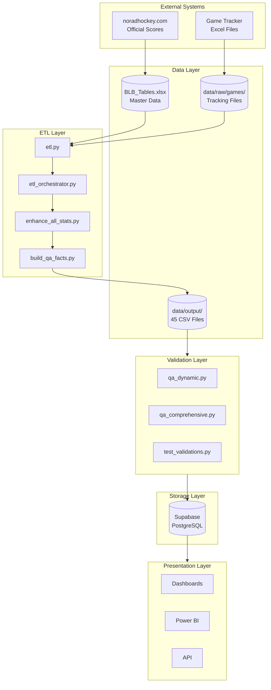

# BenchSight Architecture Overview

## System Architecture



## Component Descriptions

### Data Sources
| Source | Type | Purpose | Update Frequency |
|--------|------|---------|------------------|
| BLB_Tables.xlsx | Excel | Master data (players, teams, schedule) | Weekly |
| {game_id}_tracking.xlsx | Excel | Game events and shifts | Per game |
| noradhockey.com | Web | Official scores for verification | After each game |

### ETL Components
| Component | Purpose | Input | Output |
|-----------|---------|-------|--------|
| etl.py | Load dims, base facts | BLB_Tables.xlsx | 25 dim tables |
| etl_orchestrator.py | Build advanced facts | Tracking files | 16 fact tables |
| enhance_all_stats.py | Add 317 stat columns | fact_player_game_stats | Enhanced stats |
| build_qa_facts.py | Create monitoring tables | All tables | 3 QA tables |

### Validation Components
| Component | Tests | Focus |
|-----------|-------|-------|
| qa_dynamic.py | 17 | Goal verification, outliers, aggregations |
| qa_comprehensive.py | 52 | Math, FKs, ranges, uniqueness |
| test_validations.py | 54 | Core stat validation |
| enhanced_validations.py | 8 | Advanced stat logic |

## Data Flow

### Dimension Tables (Master Data)
```
BLB_Tables.xlsx
    ├── dim_player (sheet) → dim_player.csv
    ├── dim_team (sheet) → dim_team.csv
    ├── dim_schedule (sheet) → dim_schedule.csv
    └── ... (25 total)
```

### Fact Tables (Transactional)
```
{game_id}_tracking.xlsx
    ├── events (sheet) → fact_events_player.csv
    │                  → fact_events.csv
    ├── shifts (sheet) → fact_shifts_player.csv
    └── game_rosters (sheet) → fact_gameroster.csv

Post-processing:
    fact_events_player + fact_shifts_player 
        → fact_player_game_stats.csv (317 columns)
        → fact_h2h.csv
        → fact_wowy.csv
        → fact_line_combos.csv
```

### QA Tables (Monitoring)
```
All tables → qa_dynamic.py
          → qa_comprehensive.py
          → build_qa_facts.py
              → fact_game_status.csv
              → fact_suspicious_stats.csv
              → fact_player_game_position.csv
```

## Technology Stack

| Layer | Technology | Purpose |
|-------|------------|---------|
| Language | Python 3.12 | ETL logic |
| Data Processing | pandas, numpy | DataFrame operations |
| Excel Reading | openpyxl, xlrd | Read .xlsx files |
| Database | Supabase (PostgreSQL) | Production storage |
| Dashboards | HTML/JS, Power BI | Visualization |
| Testing | pytest, custom validators | Quality assurance |

## File Organization

```
benchsight_combined 6/
├── etl.py                      # Entry point
├── src/                        # Core modules
│   ├── etl_orchestrator.py     # Fact builder
│   ├── enhance_all_stats.py    # Stat enhancement
│   ├── populate_all_fks_v2.py  # FK population
│   └── ...
├── scripts/                    # Utilities
│   ├── qa_dynamic.py           # Dynamic QA
│   ├── qa_comprehensive.py     # Static QA
│   ├── build_qa_facts.py       # QA tables
│   └── verify_delivery.py      # Package check
├── data/
│   ├── BLB_Tables.xlsx         # Master data
│   ├── raw/games/              # Per-game tracking
│   └── output/                 # CSV outputs
├── sql/                        # DDL
├── docs/                       # Documentation
├── config/                     # Settings
├── dashboard/                  # Web UIs
└── tests/                      # Unit tests
```

## Key Design Decisions

### 1. 12-Character Primary Keys
All keys follow consistent format for join reliability:
- `E{game:05d}{event:06d}` for events
- `S{game:05d}{shift:06d}` for shifts
- `{game_id}{player_id}` for player-game

### 2. Drop Underscore Columns
Columns ending in `_` are staging/formula columns:
```python
clean_cols = [c for c in df.columns if not c.endswith('_')]
```

### 3. External Verification
Goals verified against noradhockey.com via dim_schedule:
```python
official = schedule.home_total_goals + schedule.away_total_goals
our_count = player_game_stats.goals.sum()
assert official == our_count
```

### 4. Position-Aware Thresholds
Goalies can play full game (60 min), skaters can't:
```python
toi_max = 3600 if is_goalie else 2400
```

### 5. Dynamic Position Assignment
Position derived from shift data, not static master:
```python
dominant_position = shift_counts.idxmax()
```

## Deployment Architecture

### Current (Local)
```
Local Machine
    └── Python ETL
        └── CSV Files
            └── Manual Analysis
```

### Target (Production)
```
Local Machine                    Supabase Cloud
    └── Python ETL ──────────────→ PostgreSQL
                                      │
                    ┌─────────────────┼─────────────────┐
                    │                 │                 │
                    ▼                 ▼                 ▼
              Power BI           Web Dashboard       API Access
```

## Security Considerations

| Aspect | Current | Recommended |
|--------|---------|-------------|
| Data Storage | Local CSV | Supabase with RLS |
| API Access | None | Row-Level Security |
| PII | Player names | Consider anonymization |
| Backups | Manual | Supabase automated |

## Scalability Considerations

| Aspect | Current | At Scale | Mitigation |
|--------|---------|----------|------------|
| ETL Time | ~43s/4 games | ~15 min/200 games | Incremental loading |
| Memory | ~500MB | ~2GB | Chunked processing |
| Storage | ~50MB CSV | ~500MB | Database indices |
