# BenchSight ETL Flow Diagram

## High-Level Data Flow

```mermaid
flowchart TB
    subgraph Sources["📥 SOURCE DATA"]
        BLB[("BLB_Tables.xlsx<br/>Master Data")]
        TRACK[("Game Tracking<br/>{game_id}_tracking.xlsx")]
        NORAD[("noradhockey.com<br/>Official Scores")]
    end

    subgraph ETL["⚙️ ETL PIPELINE"]
        direction TB
        E1["1. etl.py<br/>Load Dims & Base Facts"]
        E2["2. etl_orchestrator.py<br/>Build Advanced Facts"]
        E3["3. enhance_all_stats.py<br/>Add 317 Stat Columns"]
        E4["4. build_qa_facts.py<br/>QA & Monitoring"]
        
        E1 --> E2 --> E3 --> E4
    end

    subgraph Output["📤 OUTPUT"]
        DIM[("Dimension Tables<br/>25 tables")]
        FACT[("Fact Tables<br/>20 tables")]
        QA[("QA Tables<br/>3 tables")]
    end

    subgraph Validate["✅ VALIDATION"]
        V1["qa_dynamic.py<br/>17 tests"]
        V2["qa_comprehensive.py<br/>52 tests"]
        V3["test_validations.py<br/>54 tests"]
        V4["enhanced_validations.py<br/>8 tests"]
    end

    BLB --> E1
    TRACK --> E1
    NORAD -.->|"Verify Goals"| V1
    
    E4 --> DIM
    E4 --> FACT
    E4 --> QA
    
    DIM --> Validate
    FACT --> Validate
    QA --> Validate
```



## Detailed ETL Steps


## Data Transformation Flow


## Validation Flow

```mermaid
flowchart LR
    subgraph Input["INPUT"]
        I1["fact_player_game_stats"]
        I2["dim_schedule"]
        I3["fact_events_player"]
    end

    subgraph Checks["VALIDATION CHECKS"]
        C1["Goal Verification<br/>vs noradhockey.com"]
        C2["Math Consistency<br/>Points = G + A"]
        C3["FK Integrity<br/>All IDs exist"]
        C4["Outlier Detection<br/>Z-score > 3"]
        C5["Aggregation<br/>Player sum = Game total"]
    end

    subgraph Output["OUTPUT"]
        O1["✅ 131 Tests Pass"]
        O2["📋 fact_suspicious_stats"]
        O3["📊 fact_game_status"]
    end

    I1 --> C1
    I2 --> C1
    I1 --> C2
    I1 --> C4
    I3 --> C3
    I1 --> C5

    C1 --> O1
    C2 --> O1
    C3 --> O1
    C4 --> O2
    C5 --> O3
```



## File Dependencies


## Command Sequence

```bash
# FULL ETL PIPELINE (run in order)

# Step 1: Load dims and base facts from BLB_Tables.xlsx
python etl.py

# Step 2: Build advanced fact tables from tracking data  
python src/etl_orchestrator.py --all

# Step 3: Enhance with 317 stat columns
python src/enhance_all_stats.py

# Step 4: Build QA monitoring tables
python scripts/build_qa_facts.py

# Step 5: Run all validations (131 tests)
python scripts/qa_dynamic.py
python scripts/qa_comprehensive.py
python scripts/test_validations.py
python scripts/enhanced_validations.py
```

## Runtime Performance

| Step | Script | Time | Output |
|------|--------|------|--------|
| 1 | etl.py | ~8s | 25 dim tables |
| 2 | etl_orchestrator.py | ~15s | 16 fact tables |
| 3 | enhance_all_stats.py | ~5s | 317 columns |
| 4 | build_qa_facts.py | ~10s | 3 QA tables |
| 5 | All validations | ~5s | 131 tests |
| **Total** | | **~43s** | **45 tables** |
