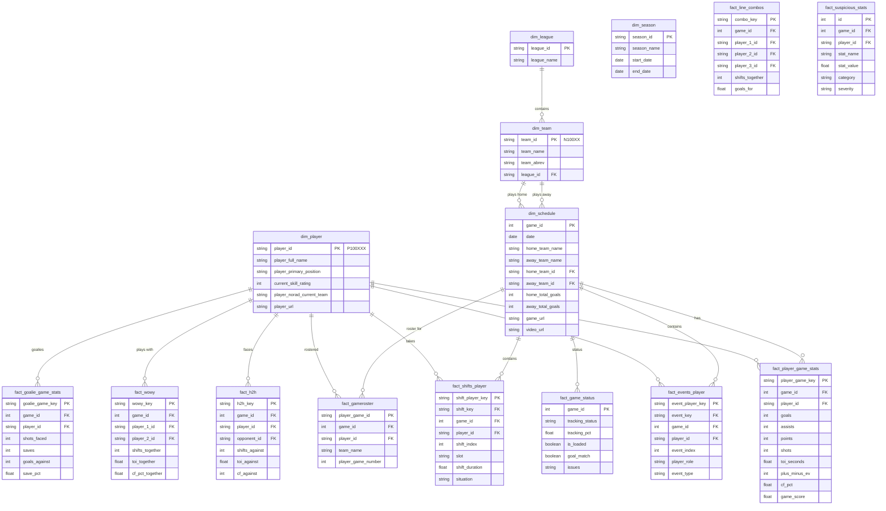

# BenchSight Database Schema Diagram

## Entity Relationship Diagram (Mermaid)



## Table Categories

### Dimension Tables (Master Data)
| Table | Records | Purpose |
|-------|---------|---------|
| dim_player | 298 | Player master data |
| dim_team | 15 | Team information |
| dim_schedule | 562 | Game schedule with official scores |
| dim_league | 2 | League definitions |
| dim_season | 8 | Season periods |
| dim_position | 5 | Position types |
| dim_venue | 2 | Home/Away |
| dim_period | 4 | Game periods |
| dim_player_role | 6 | Event roles |
| dim_composite_rating | 10 | Rating categories |

### Fact Tables (Transactional)
| Table | Records | Grain |
|-------|---------|-------|
| fact_player_game_stats | 107 | One row per player per game |
| fact_events_player | 11,635 | One row per player per event |
| fact_shifts_player | 4,626 | One row per player per shift |
| fact_gameroster | 107 | One row per player per game |
| fact_events | 4,388 | One row per event |
| fact_h2h | 684 | Player vs opponent matchups |
| fact_wowy | 641 | Player pair analysis |
| fact_line_combos | 332 | 3-player combinations |
| fact_goalie_game_stats | 8 | Goalie stats per game |
| fact_team_game_stats | 8 | Team totals per game |

### QA Tables (Monitoring)
| Table | Records | Purpose |
|-------|---------|---------|
| fact_game_status | 562 | Game completeness tracking |
| fact_suspicious_stats | 18 | Flagged outliers |
| fact_player_game_position | 105 | Dynamic positions |

## Primary Key Structure

All keys follow 12-character format for consistency:

```
Player ID:        P100XXX (7 chars)
Team ID:          N100XX (6 chars)  
Game ID:          5 digits
Event Key:        E{game:05d}{event:06d} = 12 chars
Shift Key:        S{game:05d}{shift:06d} = 12 chars
Player-Game Key:  {game_id}{player_id} = 12 chars
```

## Foreign Key Relationships

```
fact_player_game_stats.player_id → dim_player.player_id
fact_player_game_stats.game_id → dim_schedule.game_id
fact_events_player.player_id → dim_player.player_id
fact_events_player.game_id → dim_schedule.game_id
fact_shifts_player.player_id → dim_player.player_id
fact_shifts_player.game_id → dim_schedule.game_id
fact_gameroster.player_id → dim_player.player_id
fact_gameroster.game_id → dim_schedule.game_id
dim_team.league_id → dim_league.league_id
```
