# BenchSight System Diagrams
## Mermaid Source Files

---

## 1. ETL Pipeline Flow

```mermaid
flowchart LR
    subgraph Sources["📁 Source Files"]
        TRACK[/"18969_tracking.xlsx"/]
        VIDEO[/"18969_video_times.xlsx"/]
        BLB[/"BLB_Tables.xlsx"/]
        ROSTER[/"roster.json"/]
    end
    
    subgraph ETL["🔄 ETL Pipeline"]
        ORCH[["etl_orchestrator.py"]]
        LOAD["Load Stage"]
        TRANS["Transform"]
        FK["FK Population"]
        VAL["Validation"]
    end
    
    subgraph Output["📊 Output"]
        DIM[("40 Dim Tables")]
        FACT[("37 Fact Tables")]
    end
    
    subgraph Target["☁️ Target"]
        SUPA[(Supabase)]
        PBI["Power BI"]
    end
    
    TRACK --> LOAD
    VIDEO --> LOAD
    BLB --> LOAD
    ROSTER --> LOAD
    
    LOAD --> ORCH
    ORCH --> TRANS
    TRANS --> FK
    FK --> VAL
    
    VAL --> DIM
    VAL --> FACT
    
    DIM --> SUPA
    FACT --> SUPA
    SUPA --> PBI
```



---

## 2. Data Model (Star Schema)


---

## 3. Fact Table Relationships


---

## 4. FK Population Flow


---

## 5. Validation Pipeline

```mermaid
flowchart TB
    subgraph Tests["54 Validation Tests"]
        G["Goal Verification (8)"]
        T["TOI Calculations (6)"]
        P["Plus/Minus (4)"]
        F["FK Integrity (10)"]
        D["Data Quality (12)"]
        A["Aggregations (8)"]
        X["Cross-Table (6)"]
    end
    
    subgraph Sources["Validation Sources"]
        CSV["CSV Files"]
        NORAD["NORAD Official"]
        CALC["Calculations"]
    end
    
    subgraph Results["Results"]
        PASS["✅ PASS"]
        FAIL["❌ FAIL"]
        WARN["⚠️ WARNING"]
    end
    
    CSV --> G
    CSV --> T
    CSV --> P
    CSV --> F
    CSV --> D
    CSV --> A
    CSV --> X
    
    NORAD --> G
    CALC --> T
    CALC --> P
    
    G --> PASS
    T --> PASS
    P --> PASS
    F --> PASS
    D --> PASS
    A --> PASS
    X --> PASS
    
    G -.-> WARN
```



---

## 6. Implementation Phases


---

## 7. System Architecture


---

## Usage

### View in Browser
Save each mermaid block as a `.mermaid` file and open in:
- Mermaid Live Editor: https://mermaid.live
- VS Code with Mermaid extension
- GitHub (renders automatically in markdown)

### Generate PNG
```bash
# Using mermaid-cli
npm install -g @mermaid-js/mermaid-cli
mmdc -i diagram.mermaid -o diagram.png

# Or use online tool
# https://mermaid.live → Export as PNG
```

---

*Generated: December 29, 2024*
