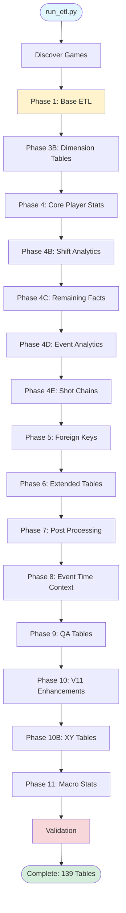
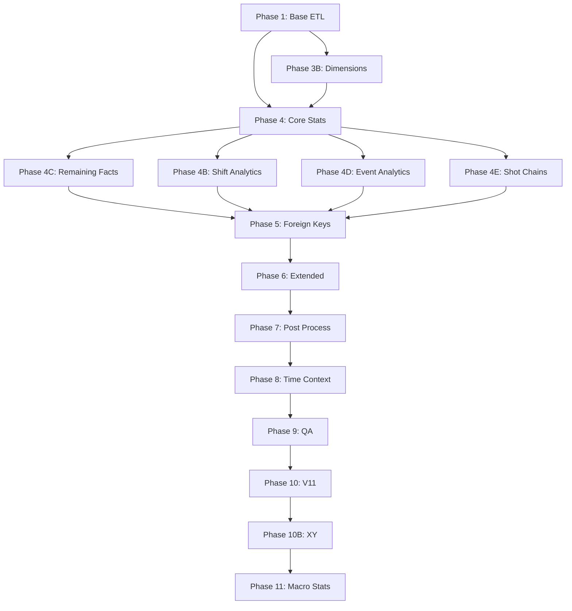

# BenchSight ETL Code Flow

**Complete execution flow documentation for the ETL pipeline**

Last Updated: 2026-01-15  
Version: 29.0

---

## Overview

The BenchSight ETL pipeline transforms raw Excel data into 139 structured CSV tables ready for Supabase. The pipeline executes in 11 main phases, orchestrated by `run_etl.py`.

**Entry Point:** `run_etl.py`  
**Main ETL Logic:** `src/core/base_etl.py` (4,400+ lines)  
**Output:** `data/output/*.csv` (139 tables)

---

## Execution Flow Diagram



---

## Phase-by-Phase Breakdown

### Phase 1: Base ETL (BLB + Tracking + Derived Tables)

**Module:** `src/core/base_etl.py::main()`  
**Tables Created:** ~52 core tables  
**Duration:** ~40-50 seconds

#### Step 1.1: Discover Games
```python
VALID_TRACKING_GAMES, EXCLUDED_GAMES = discover_games()
```
- Scans `data/raw/games/` for game directories
- Validates each game has complete tracking data
- Checks for `{game_id}_tracking.xlsx` files
- Reads excluded games from `config/excluded_games.txt`
- **Output:** Lists of valid and excluded game IDs

#### Step 1.2: Load BLB Tables
```python
loaded = load_blb_tables()
```
- Reads `data/raw/BLB_Tables.xlsx`
- Loads master dimension data:
  - Teams, Players, Seasons, Leagues
  - Event Types, Event Details, Play Details
  - Shot Types, Zones, Positions
- Creates initial dimension tables (`dim_*`)
- **Output:** Dictionary of loaded DataFrames

#### Step 1.3: Build Player Lookup
```python
player_lookup = build_player_lookup(loaded['fact_gameroster'])
```
- Creates player lookup mapping from game roster
- Handles duplicate jersey numbers using `(game_id, team, player_number)`
- Maps player names to player_ids
- **Output:** Dictionary mapping `(game_id, team, jersey)` → `player_id`

#### Step 1.4: Load Tracking Data
```python
tracking_data = load_tracking_data(player_lookup)
```
- For each valid game, loads `{game_id}_tracking.xlsx`
- Reads `events` and `shifts` sheets
- Standardizes play details using `standardize_tracking_data()`
- Maps players using `player_lookup`
- Creates `fact_events` and `fact_shifts` tables
- **Output:** Dictionary with events and shifts DataFrames

#### Step 1.5: Create Reference Tables
```python
create_reference_tables()
```
- Creates dynamic dimension tables from tracking data:
  - `dim_event_type`, `dim_event_detail`, `dim_play_detail`
  - `dim_shot_type`, `dim_zone`, `dim_strength`
- These are discovered from actual data, not predefined
- **Output:** ~25 dimension tables

#### Step 1.6: Create Derived Tables
```python
create_derived_tables(tracking_data, player_lookup)
```
- Creates fact tables from events and shifts:
  - `fact_event_players` (player-event relationships)
  - `fact_shift_players` (player-shift relationships)
  - `fact_gameroster` (enhanced with positions)
- **Output:** ~15 core fact tables

#### Step 1.7: Enhance Event Tables
```python
enhance_event_tables()
```
- Adds foreign key columns to `fact_events` and `fact_event_players`:
  - `shift_id` (matches events to shifts)
  - `player_name`, `season_id`, `position_id`
  - `shot_type_id`, `zone_entry_type_id`, `zone_exit_type_id`
  - `pass_type_id`, `stoppage_type_id`, etc.
- **Output:** Enhanced event tables with FKs

#### Step 1.8: Enhance Events with Flags
```python
enhance_events_with_flags()
```
- Adds boolean flags to events:
  - `is_goal`, `is_sog` (shot on goal), `is_corsi`, `is_fenwick`
  - `is_rush`, `is_set_play`, `is_power_play`, etc.
- These flags are used by subsequent phases
- **Output:** Events with calculation flags

#### Step 1.9: Create Sequences and Plays
```python
create_fact_sequences()
create_fact_plays()
```
- `fact_sequences`: Groups events into possession sequences
- `fact_plays`: Groups sequences into plays (ending in shots/goals)
- Uses `is_goal` flag to identify play endings
- **Output:** 2 sequence/play tables

#### Step 1.10: Enhance Shift Tables
```python
enhance_shift_tables()
enhance_shift_players()
```
- Adds calculated columns to shifts:
  - Time calculations, strength, zone time
  - Player counts, line combinations
- **Output:** Enhanced shift tables

#### Step 1.11: Update Roster Positions
```python
update_roster_positions_from_shifts()
```
- Updates player positions in roster based on actual shift data
- **Output:** Updated `fact_gameroster`

#### Step 1.12: Validation
```python
validate_all()
```
- Validates goal counts match source data
- Checks foreign key integrity
- Verifies required columns exist
- **Output:** Validation report

---

### Phase 3B: Static Dimension Tables

**Module:** `src/tables/dimension_tables.py::create_all_dimension_tables()`  
**Tables Created:** ~25 dimension tables  
**Duration:** ~2 seconds

Creates static dimension tables that don't depend on tracking data:
- `dim_season`, `dim_league`, `dim_venue`
- `dim_strength`, `dim_zone`, `dim_position`
- Lookup tables for codes and mappings

---

### Phase 4: Core Player Stats

**Module:** `src/tables/core_facts.py::create_all_core_facts()`  
**Tables Created:** 3 core fact tables  
**Duration:** ~5 seconds

Creates core player statistics tables:
- `fact_player_game_stats` (317 columns per player per game)
- `fact_team_game_stats` (team-level aggregations)
- `fact_goalie_game_stats` (128 columns for goalies)

---

### Phase 4B: Shift Analytics

**Module:** `src/tables/shift_analytics.py::create_all_shift_analytics()`  
**Tables Created:** 5 shift analytics tables  
**Duration:** ~8 seconds

Creates shift-based analytics:
- `fact_h2h_matchups` (head-to-head player matchups)
- `fact_wowy_stats` (with/without you analysis)
- `fact_line_combinations` (line combo effectiveness)
- `fact_shift_quality` (shift quality metrics)

---

### Phase 4C: Remaining Fact Tables

**Module:** `src/tables/remaining_facts.py::build_remaining_tables()`  
**Tables Created:** ~34 fact tables  
**Duration:** ~10 seconds

Creates remaining fact tables:
- Event-specific tables (shots, goals, passes, faceoffs, penalties)
- Zone analysis tables (entries, exits, time)
- Rush analysis tables
- Possession tables

---

### Phase 4D: Event Analytics

**Module:** `src/tables/event_analytics.py::create_all_event_analytics()`  
**Tables Created:** 5 event analytics tables  
**Duration:** ~3 seconds

Creates event-based analytics:
- `fact_rush_events` (rush event analysis)
- `fact_shot_chains` (shot sequence chains)
- `fact_linked_events` (event relationships)

---

### Phase 4E: Shot Chains

**Module:** `src/chains/shot_chain_builder.py::build_shot_chains()`  
**Tables Created:** 2 chain tables  
**Duration:** ~2 seconds

Builds shot chain analysis:
- `fact_shot_chain_events` (events in shot chains)
- `fact_shot_chains` (complete chains)

---

### Phase 5: Foreign Keys & Additional Tables

**Module:** `src/core/add_all_fkeys.py::main()`  
**Tables Created:** Adds FK columns to existing tables  
**Duration:** ~3 seconds

Adds foreign key columns to fact tables:
- Links to dimension tables
- Ensures referential integrity
- Creates lookup relationships

---

### Phase 6: Extended Tables

**Module:** `src/advanced/extended_tables.py::create_extended_tables()`  
**Tables Created:** ~10 extended tables  
**Duration:** ~5 seconds

Creates extended analytics tables:
- Advanced player metrics
- Team analytics
- Game context tables

---

### Phase 7: Post Processing

**Module:** `src/etl/post_etl_processor.py::main()`  
**Tables Created:** Post-processing enhancements  
**Duration:** ~2 seconds

Post-processing tasks:
- Propagates columns to related tables
- Fills missing values
- Standardizes formats

---

### Phase 8: Event Time Context

**Module:** `src/advanced/event_time_context.py::enhance_event_tables()`  
**Tables Created:** Context columns added  
**Duration:** ~2 seconds

Adds time context to events:
- Time since last event
- Time remaining in period
- Game situation context

---

### Phase 9: QA Tables

**Module:** `src/qa/build_qa_facts.py::main()`  
**Tables Created:** 4 QA tables  
**Duration:** ~1 second

Creates quality assurance tables:
- `qa_data_completeness` (data quality checks)
- `qa_goal_accuracy` (goal counting verification)
- `qa_scorer_comparison` (scorer validation)
- `qa_suspicious_stats` (anomaly detection)

---

### Phase 10: V11 Enhancements

**Module:** `src/advanced/v11_enhancements.py::run_all_enhancements()`  
**Tables Created:** ~30 enhancement tables  
**Duration:** ~8 seconds

V11-specific enhancements:
- Advanced goalie metrics
- Enhanced player stats
- Team analytics

---

### Phase 10B: XY Tables & Spatial Analytics

**Module:** `src/xy/xy_table_builder.py::build_all_xy_tables()`  
**Tables Created:** 8 XY/spatial tables  
**Duration:** ~3 seconds

Creates spatial analytics tables:
- XY coordinate tables for events
- Shot location analysis
- Zone time XY breakdowns

---

### Phase 11: Macro Stats (Season/Career Aggregations)

**Module:** `src/tables/macro_stats.py::create_all_macro_stats()`  
**Tables Created:** ~15 macro stat tables  
**Duration:** ~5 seconds

Creates season and career aggregations:
- `fact_player_season_stats` (season totals)
- `fact_player_career_stats` (career totals)
- `fact_team_season_stats` (team season stats)
- Basic and advanced stat splits

---

## Data Flow Summary

```
Raw Data Sources
├── BLB_Tables.xlsx (Master dimensions)
└── data/raw/games/{game_id}/{game_id}_tracking.xlsx (Game data)
    ├── events sheet → fact_events
    └── shifts sheet → fact_shifts

Phase 1: Base ETL
├── Load BLB → dim_* tables
├── Load tracking → fact_events, fact_shifts
├── Build player lookup
├── Create reference dims from tracking
└── Create derived fact tables

Phase 3B-11: Additional Tables
├── Static dimensions
├── Player/team/goalie stats
├── Shift analytics
├── Event analytics
├── Shot chains
├── Foreign keys
├── Extended tables
├── Post processing
├── QA tables
├── V11 enhancements
├── XY tables
└── Macro stats

Output: 132-139 CSV tables in data/output/ (varies by ETL version and data availability)
**Current Count:** 132 tables (verified 2026-01-15)
**Expected Minimum:** 138 tables
```

---

## Key Functions Reference

### Entry Point Functions

| Function | Location | Purpose |
|----------|----------|---------|
| `run_full_etl()` | `run_etl.py` | Main orchestrator, calls all phases |
| `main()` | `src/core/base_etl.py` | Phase 1 base ETL execution |
| `discover_games()` | `src/core/base_etl.py` | Discovers and validates games |

### Data Loading Functions

| Function | Location | Purpose |
|----------|----------|---------|
| `load_blb_tables()` | `src/core/base_etl.py` | Loads master dimension data |
| `build_player_lookup()` | `src/core/base_etl.py` | Creates player mapping |
| `load_tracking_data()` | `src/core/base_etl.py` | Loads game tracking files |

### Table Creation Functions

| Function | Location | Purpose |
|----------|----------|---------|
| `create_reference_tables()` | `src/core/base_etl.py` | Creates dynamic dimensions |
| `create_derived_tables()` | `src/core/base_etl.py` | Creates core fact tables |
| `enhance_event_tables()` | `src/core/base_etl.py` | Adds FKs to events |
| `create_fact_sequences()` | `src/core/base_etl.py` | Creates sequence tables |
| `create_fact_plays()` | `src/core/base_etl.py` | Creates play tables |

### Enhancement Functions

| Function | Location | Purpose |
|----------|----------|---------|
| `enhance_events_with_flags()` | `src/core/base_etl.py` | Adds calculation flags |
| `enhance_shift_tables()` | `src/core/base_etl.py` | Enhances shift data |
| `enhance_shift_players()` | `src/core/base_etl.py` | Enhances shift player data |

---

## Error Handling

The ETL pipeline uses try-catch blocks around each phase:
- **Critical phases** (Phase 1): Failure stops execution
- **Non-critical phases**: Failures are logged but don't stop execution
- All errors are collected and reported at the end
- Validation failures are reported but don't prevent table creation

---

## Performance Characteristics

- **Total Duration:** ~80-90 seconds for 4 games
- **Phase 1 (Base ETL):** ~40-50 seconds (50% of total time)
- **Phase 4C (Remaining Facts):** ~10 seconds
- **Phase 4B (Shift Analytics):** ~8 seconds
- **Other phases:** 1-5 seconds each

**Bottlenecks:**
- Loading and processing tracking data (Phase 1)
- Building shift analytics (Phase 4B)
- Creating remaining fact tables (Phase 4C)

**Optimization Opportunities:**
- Vectorize pandas operations (currently uses `iterrows()` and `apply()`)
- Parallelize game processing
- Cache intermediate results

---

## Dependencies Between Phases



---

## Validation Points

1. **After Phase 1:** Goal count verification
2. **After Phase 5:** Foreign key integrity checks
3. **After Phase 9:** QA table validation
4. **Final:** Table count verification (must be 139+)

---

## Next Steps

- See [ETL_ARCHITECTURE.md](ETL_ARCHITECTURE.md) for module structure
- See [ETL_TABLE_DEPENDENCIES.md](ETL_TABLE_DEPENDENCIES.md) for table relationships
- See [ETL_CALCULATIONS_REFERENCE.md](ETL_CALCULATIONS_REFERENCE.md) for stat formulas
- See [ETL_DATA_FLOW.md](ETL_DATA_FLOW.md) for data transformation details

---

*Last Updated: 2026-01-15*
