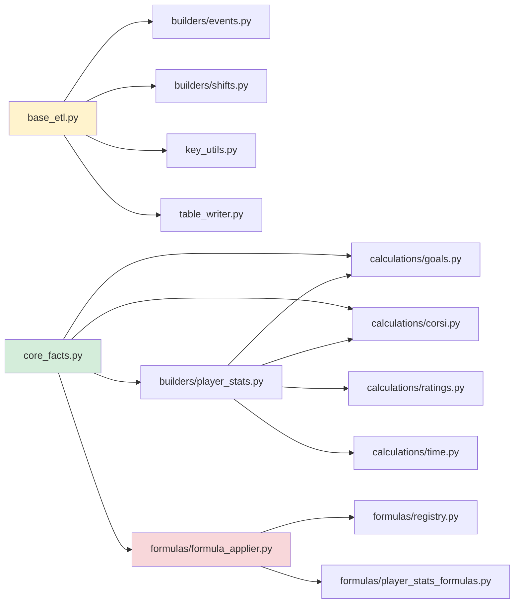

# BenchSight ETL Architecture

**Complete architecture overview with module relationships and design patterns**

Last Updated: 2026-01-21
Version: 2.00

---

## Overview

The BenchSight ETL pipeline follows a modular, phase-based architecture that transforms raw Excel data into 139 structured CSV tables. The architecture emphasizes separation of concerns, reusability, and maintainability.

**Key Design Principles:**
- **Modularity:** Each module has a single, clear responsibility
- **Reusability:** Calculation functions are pure and reusable
- **Testability:** Functions can be tested in isolation
- **Extensibility:** Easy to add new tables, stats, and calculations

---

## Architecture Diagram

```mermaid
graph TB
    subgraph "Entry Point"
        EP[run_etl.py]
    end
    
    subgraph "Core ETL Engine"
        BE[base_etl.py<br/>Main Orchestrator]
        KU[key_utils.py<br/>Key Generation]
        TW[table_writer.py<br/>Output Management]
        FK[add_all_fkeys.py<br/>Foreign Keys]
    end
    
    subgraph "Data Loading"
        BLB[load_blb_tables<br/>Master Dimensions]
        TRK[load_tracking_data<br/>Game Data]
        PL[build_player_lookup<br/>Player Mapping]
    end
    
    subgraph "Table Builders"
        CF[core_facts.py<br/>Player/Team/Goalie Stats]
        DT[dimension_tables.py<br/>Dimension Tables]
        RF[remaining_facts.py<br/>Additional Facts]
        SA[shift_analytics.py<br/>Shift Analytics]
        EA[event_analytics.py<br/>Event Analytics]
        MS[macro_stats.py<br/>Season/Career Stats]
    end
    
    subgraph "Builders"
        EVB[events.py<br/>Event Builder]
        SHB[shifts.py<br/>Shift Builder]
        PSB[player_stats.py<br/>Player Stats Builder]
        TSB[team_stats.py<br/>Team Stats Builder]
        GSB[goalie_stats.py<br/>Goalie Stats Builder]
    end
    
    subgraph "Calculations"
        GOALS[goals.py<br/>Goal Calculations]
        CORSI[corsi.py<br/>Corsi/Fenwick]
        RATINGS[ratings.py<br/>Ratings]
        TIME[time.py<br/>Time Calculations]
    end
    
    subgraph "Formulas"
        FA[formula_applier.py<br/>Formula Engine]
        REG[registry.py<br/>Formula Registry]
        PSF[player_stats_formulas.py<br/>Player Formulas]
    end
    
    subgraph "Advanced Features"
        V11[v11_enhancements.py<br/>V11 Features]
        ET[extended_tables.py<br/>Extended Tables]
        ETC[event_time_context.py<br/>Time Context]
        SCB[shot_chain_builder.py<br/>Shot Chains]
        XY[xy_table_builder.py<br/>Spatial Analytics]
    end
    
    subgraph "Support Modules"
        STD[standardize_play_details.py<br/>Data Standardization]
        QA[build_qa_facts.py<br/>Quality Assurance]
        PEP[post_etl_processor.py<br/>Post Processing]
        KP[key_parser.py<br/>Key Parsing]
    end
    
    EP --> BE
    BE --> BLB
    BE --> TRK
    BE --> PL
    BE --> EVB
    BE --> SHB
    BE --> KU
    BE --> TW
    
    BE --> CF
    BE --> DT
    BE --> RF
    
    CF --> PSB
    CF --> TSB
    CF --> GSB
    CF --> GOALS
    CF --> CORSI
    CF --> RATINGS
    CF --> TIME
    CF --> FA
    
    FA --> REG
    FA --> PSF
    
    SA --> GOALS
    SA --> CORSI
    EA --> GOALS
    EA --> CORSI
    
    BE --> FK
    BE --> V11
    BE --> ET
    BE --> ETC
    BE --> SCB
    BE --> XY
    
    TRK --> STD
    BE --> QA
    BE --> PEP
    
    style EP fill:#e1f5ff
    style BE fill:#fff3cd
    style CF fill:#d4edda
    style FA fill:#f8d7da
```



---

## Module Hierarchy

### Layer 1: Entry Point
- **`run_etl.py`** - Orchestrates all phases, handles command-line arguments

### Layer 2: Core ETL Engine
- **`src/core/base_etl.py`** - Main ETL orchestrator (4,400+ lines)
  - Loads raw data
  - Creates core tables
  - Manages pipeline execution
- **`src/core/key_utils.py`** - Key generation utilities
- **`src/core/table_writer.py`** - Table output management (CSV + Supabase)
- **`src/core/add_all_fkeys.py`** - Foreign key management

### Layer 3: Data Loading
- **`load_blb_tables()`** - Loads master dimension data from BLB_Tables.xlsx
- **`load_tracking_data()`** - Loads game tracking files
- **`build_player_lookup()`** - Creates player mapping

### Layer 4: Table Builders
- **`src/tables/core_facts.py`** - Core player/team/goalie stats
- **`src/tables/dimension_tables.py`** - Dimension tables
- **`src/tables/remaining_facts.py`** - Additional fact tables
- **`src/tables/shift_analytics.py`** - Shift analytics
- **`src/tables/event_analytics.py`** - Event analytics
- **`src/tables/macro_stats.py`** - Season/career aggregations

### Layer 5: Modular Builders
- **`src/builders/events.py`** - Event table builder
- **`src/builders/shifts.py`** - Shift table builder
- **`src/builders/player_stats.py`** - Player stats builder
- **`src/builders/team_stats.py`** - Team stats builder
- **`src/builders/goalie_stats.py`** - Goalie stats builder

### Layer 6: Calculations
- **`src/calculations/goals.py`** - Goal counting
- **`src/calculations/corsi.py`** - Corsi/Fenwick calculations
- **`src/calculations/ratings.py`** - Player/team ratings
- **`src/calculations/time.py`** - Time calculations

### Layer 7: Formulas
- **`src/formulas/formula_applier.py`** - Formula engine
- **`src/formulas/registry.py`** - Formula registry
- **`src/formulas/player_stats_formulas.py`** - Player stats formulas
- **`config/formulas.json`** - Formula definitions

### Layer 8: Advanced Features
- **`src/advanced/v11_enhancements.py`** - V11 features
- **`src/advanced/extended_tables.py`** - Extended tables
- **`src/advanced/event_time_context.py`** - Time context
- **`src/chains/shot_chain_builder.py`** - Shot chains
- **`src/xy/xy_table_builder.py`** - Spatial analytics

### Layer 9: Support Modules
- **`src/transformation/standardize_play_details.py`** - Data standardization
- **`src/qa/build_qa_facts.py`** - Quality assurance
- **`src/etl/post_etl_processor.py`** - Post-processing
- **`src/utils/key_parser.py`** - Key parsing

---

## Module Relationships

### Core Dependencies



### Data Flow Between Modules

```
run_etl.py
    ↓
base_etl.py::main()
    ├── load_blb_tables() → dim_* tables
    ├── load_tracking_data() → fact_events, fact_shifts
    │   └── Uses: builders/events.py, builders/shifts.py
    ├── create_derived_tables() → fact_event_players, etc.
    └── enhance_events_with_flags() → Adds flags
    ↓
tables/core_facts.py::create_fact_player_game_stats()
    ├── Uses: builders/player_stats.py
    ├── Uses: calculations/*.py
    └── Uses: formulas/formula_applier.py
    ↓
fact_player_game_stats (444 columns)
```

---

## Design Patterns

### 1. Builder Pattern

**Used in:** `src/builders/`

Table builders follow the builder pattern:
- Each builder has a single `build_*()` function
- Builders are pure functions (no side effects)
- Builders can be tested independently

**Example:**
```python
# src/builders/events.py
def build_fact_events(tracking_data, player_lookup):
    """Builds fact_events table from tracking data."""
    # Pure function - no side effects
    return events_df

# Used in base_etl.py
events_df = build_fact_events(tracking_data, player_lookup)
save_table(events_df, 'fact_events')
```

### 2. Strategy Pattern

**Used in:** `src/formulas/`

Formula system uses strategy pattern:
- Formulas are defined in JSON (`config/formulas.json`)
- Formula applier applies formulas based on strategy
- Easy to add new formulas without code changes

**Example:**
```json
{
  "name": "goals_per_60",
  "formula": "goals / toi_minutes * 60",
  "group": "core_formulas"
}
```

### 3. Factory Pattern

**Used in:** `src/tables/`

Table creation uses factory pattern:
- Each table type has a factory function
- Factory functions are called by orchestrator
- Easy to add new table types

**Example:**
```python
# src/tables/core_facts.py
def create_fact_player_game_stats():
    """Factory function for player game stats."""
    # Creates and returns table
    return stats_df

# Called in run_etl.py
create_fact_player_game_stats()
```

### 4. Template Method Pattern

**Used in:** `src/core/base_etl.py`

ETL phases follow template method pattern:
- Each phase has a standard structure
- Phases can be extended without modifying base
- Consistent error handling

**Example:**
```python
def run_full_etl():
    # Template method
    try:
        phase_1()
    except Exception as e:
        handle_error(e)
    
    try:
        phase_2()
    except Exception as e:
        handle_error(e)
```

---

## Key Architectural Decisions

### 1. Monolithic vs Modular

**Decision:** Hybrid approach
- **Core ETL (`base_etl.py`):** Monolithic (4,400 lines) - needs refactoring
- **Table Builders:** Modular (separate files)
- **Calculations:** Modular (separate modules)

**Rationale:**
- Core ETL has tight coupling, easier to keep together initially
- Table builders are independent, benefit from modularity
- Calculations are reusable, must be modular

**Future:** Refactor `base_etl.py` into smaller modules

### 2. CSV vs Database

**Decision:** CSV-first, optional Supabase upload
- All tables written to CSV first
- Optional direct Supabase upload via `table_writer.py`
- CSV serves as backup and validation

**Rationale:**
- CSV is human-readable and debuggable
- CSV allows offline validation
- Supabase upload can be enabled/disabled

### 3. Formula System

**Decision:** JSON-based formula system
- Formulas defined in `config/formulas.json`
- Applied via `formula_applier.py`
- No code changes needed for new formulas

**Rationale:**
- Non-developers can add formulas
- Formulas are version-controlled
- Easy to test and validate

### 4. Key Generation

**Decision:** Centralized key utilities
- All key generation in `src/core/key_utils.py`
- Consistent key formats across tables
- Key parsing utilities separate

**Rationale:**
- Ensures consistency
- Single source of truth for key formats
- Easy to change key format globally

---

## Module Responsibilities

### Core Modules

| Module | Responsibility | Dependencies |
|--------|---------------|--------------|
| `base_etl.py` | Orchestrates ETL pipeline | All other modules |
| `key_utils.py` | Key generation | None |
| `table_writer.py` | Table output | Supabase client (optional) |
| `add_all_fkeys.py` | Foreign key management | Dimension tables |

### Table Builders

| Module | Responsibility | Dependencies |
|--------|---------------|--------------|
| `core_facts.py` | Core stats tables | Builders, calculations, formulas |
| `dimension_tables.py` | Dimension tables | None |
| `remaining_facts.py` | Additional fact tables | Core facts |
| `shift_analytics.py` | Shift analytics | Core facts, calculations |
| `event_analytics.py` | Event analytics | Core facts, calculations |
| `macro_stats.py` | Season/career stats | Core facts |

### Builders

| Module | Responsibility | Dependencies |
|--------|---------------|--------------|
| `events.py` | Event table builder | Key utils |
| `shifts.py` | Shift table builder | Key utils |
| `player_stats.py` | Player stats builder | Calculations |
| `team_stats.py` | Team stats builder | Calculations |
| `goalie_stats.py` | Goalie stats builder | Calculations |

### Calculations

| Module | Responsibility | Dependencies |
|--------|---------------|--------------|
| `goals.py` | Goal counting | None |
| `corsi.py` | Corsi/Fenwick | None |
| `ratings.py` | Player/team ratings | None |
| `time.py` | Time calculations | None |

### Formulas

| Module | Responsibility | Dependencies |
|--------|---------------|--------------|
| `formula_applier.py` | Applies formulas | Registry |
| `registry.py` | Formula registry | JSON config |
| `player_stats_formulas.py` | Player formulas | Registry |

---

## Data Flow Architecture

### Input → Processing → Output

```
Raw Data Sources
├── BLB_Tables.xlsx (Master dimensions)
└── data/raw/games/{game_id}/{game_id}_tracking.xlsx
    ├── events sheet
    └── shifts sheet
        ↓
Data Loading Layer
├── load_blb_tables() → dim_* tables
└── load_tracking_data() → fact_events, fact_shifts
        ↓
Core Processing Layer
├── build_player_lookup() → Player mapping
├── create_reference_tables() → Dynamic dims
├── create_derived_tables() → Core fact tables
└── enhance_events_with_flags() → Event flags
        ↓
Stats Calculation Layer
├── core_facts.py → Player/team/goalie stats
├── shift_analytics.py → Shift analytics
├── event_analytics.py → Event analytics
└── macro_stats.py → Season/career stats
        ↓
Enhancement Layer
├── add_all_fkeys.py → Foreign keys
├── v11_enhancements.py → V11 features
├── extended_tables.py → Extended tables
└── post_etl_processor.py → Post-processing
        ↓
Output Layer
├── table_writer.py → CSV files
└── upload.py → Supabase (optional)
        ↓
data/output/*.csv (139 tables)
```

---

## Extension Points

### Adding a New Statistic

1. **If it's a calculation:**
   - Add function to `src/calculations/` (appropriate module)
   - Function should be pure (no side effects)
   - Add test to `tests/test_calculations.py`

2. **If it's a formula:**
   - Add to `config/formulas.json`
   - Formula will be auto-applied via `formula_applier.py`

3. **If it's a new column:**
   - Add calculation in table builder
   - Or add formula to `config/formulas.json`

### Adding a New Table

1. **Create builder function:**
   - Add `create_fact_*()` or `create_dim_*()` function
   - Place in appropriate `src/tables/` module

2. **Add to ETL flow:**
   - Add call in appropriate phase in `run_etl.py`
   - Or add to module's `create_all_*()` function

3. **Update documentation:**
   - Add to `docs/DATA_DICTIONARY.md`
   - Update table manifest

### Adding a New Phase

1. **Create phase module:**
   - Create new file in appropriate directory
   - Follow existing phase patterns

2. **Add to run_etl.py:**
   - Add phase call in `run_full_etl()`
   - Add error handling

3. **Update documentation:**
   - Add to `docs/CODE_FLOW_ETL.md`
   - Update architecture diagrams

---

## Performance Considerations

### Current Bottlenecks

1. **`base_etl.py` (4,400 lines):**
   - Large file, harder to optimize
   - Uses `iterrows()` and `apply()` (slow)
   - **Solution:** Refactor into smaller modules, vectorize operations

2. **Game Processing:**
   - Processes games sequentially
   - **Solution:** Parallelize game processing

3. **Table Creation:**
   - Some tables use nested loops
   - **Solution:** Vectorize operations, use pandas groupby

### Optimization Opportunities

1. **Vectorization:**
   - Replace `iterrows()` with vectorized operations
   - Use pandas groupby instead of loops
   - Use numpy operations where possible

2. **Caching:**
   - Cache intermediate results
   - Cache dimension lookups

3. **Parallelization:**
   - Process games in parallel
   - Process tables in parallel (where independent)

---

## Testing Architecture

### Unit Tests

- **Location:** `tests/test_*.py`
- **Focus:** Calculation functions, pure functions
- **Coverage:** Goal counting, Corsi, ratings, time calculations

### Integration Tests

- **Location:** `tests/test_etl.py`
- **Focus:** End-to-end ETL execution
- **Coverage:** Table creation, data validation

### Validation Tests

- **Location:** `validate.py`
- **Focus:** Data quality, goal counting, foreign keys
- **Coverage:** All 139 tables

---

## Future Architecture Improvements

### 1. Refactor `base_etl.py`

**Current:** 4,400 lines, monolithic
**Target:** Split into smaller modules:
- `data_loader.py` - Data loading
- `table_creator.py` - Table creation
- `enhancement_engine.py` - Enhancements
- `validation_engine.py` - Validation

### 2. Add Dependency Injection

**Current:** Direct imports
**Target:** Use dependency injection for:
- Table writers
- Calculation functions
- Formula appliers

### 3. Add Plugin System

**Current:** Hard-coded phases
**Target:** Plugin-based phase system:
- Phases register themselves
- Easy to add/remove phases
- Dynamic phase execution

### 4. Add Configuration System

**Current:** Hard-coded paths and settings
**Target:** Configuration file:
- Paths configurable
- Phase enable/disable
- Performance tuning

---

## Related Documentation

- [CODE_FLOW_ETL.md](CODE_FLOW_ETL.md) - Execution flow
- [ETL_TABLE_DEPENDENCIES.md](ETL_TABLE_DEPENDENCIES.md) - Table dependencies
- [ETL_CALCULATIONS_REFERENCE.md](ETL_CALCULATIONS_REFERENCE.md) - Calculation formulas
- [ETL_DATA_FLOW.md](ETL_DATA_FLOW.md) - Data transformations
- [SRC_MODULES_GUIDE.md](SRC_MODULES_GUIDE.md) - Module reference

---

*Last Updated: 2026-01-15*
