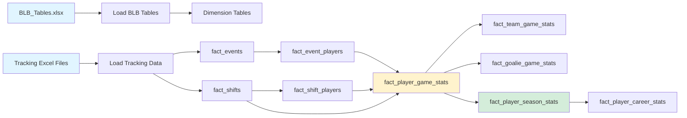

# BenchSight ETL Data Flow

**Complete data transformation flow from raw files to final tables**

Last Updated: 2026-01-21
Version: 2.00

---

## Overview

This document traces the complete data flow through the BenchSight ETL pipeline, showing how raw Excel data is transformed into 139 structured CSV tables.

**Data Sources:**
- `BLB_Tables.xlsx` - Master dimension data
- `data/raw/games/{game_id}/{game_id}_tracking.xlsx` - Game tracking data

**Output:**
- `data/output/*.csv` - 139 tables

---

## High-Level Data Flow



---

## Phase-by-Phase Data Transformations

### Phase 1: Data Loading

#### BLB_Tables.xlsx → Dimension Tables

**Input:** `data/raw/BLB_Tables.xlsx` (Excel file with multiple sheets)

**Process:**
1. Read each sheet using `pd.read_excel()`
2. Clean data:
   - Drop index columns
   - Drop columns ending in `_` (formula columns)
   - Deduplicate on primary key
3. Enhance `fact_gameroster`:
   - Add `season_id` FK from `dim_schedule`
   - Add `venue_id` FK
   - Add `position_id` FK
   - Calculate `points = goals + assists`

**Output:** ~17 dimension tables + `fact_gameroster`

**Example Transformation:**
```
BLB_Tables.xlsx → dim_player sheet
    ↓
pd.read_excel('BLB_Tables.xlsx', sheet_name='dim_player')
    ↓
Clean (drop index, drop _ columns)
    ↓
dim_player.csv (337 rows, 28 columns)
```

#### Tracking Excel Files → fact_events, fact_shifts

**Input:** `data/raw/games/{game_id}/{game_id}_tracking.xlsx`

**Process:**
1. For each game:
   - Read `events` sheet → `fact_events`
   - Read `shifts` sheet → `fact_shifts`
2. Standardize play details using `standardize_tracking_data()`
3. Map players using `player_lookup` (from `fact_gameroster`)
4. Generate keys using `generate_event_id()`, `generate_shift_id()`

**Output:** `fact_events`, `fact_shifts`

**Example Transformation:**
```
{game_id}_tracking.xlsx → events sheet
    ↓
pd.read_excel('{game_id}_tracking.xlsx', sheet_name='events')
    ↓
standardize_tracking_data() → Standardize play detail codes
    ↓
Map players using player_lookup
    ↓
Generate event_id keys
    ↓
fact_events.csv (per game, then combined)
```

---

### Phase 2: Player Lookup Creation

**Input:** `fact_gameroster` (from Phase 1)

**Process:**
1. Extract `(game_id, team_name, player_number)` → `player_id` mappings
2. Handle duplicate jersey numbers (same number, different teams in same game)
3. Create lookup dictionary

**Output:** `player_lookup` dictionary

**Usage:** Used to map players in tracking data

---

### Phase 3: Reference Table Creation

**Input:** `fact_events`, `fact_shifts` (from Phase 1)

**Process:**
1. Extract unique values from tracking data:
   - Event types → `dim_event_type`
   - Event details → `dim_event_detail`
   - Play details → `dim_play_detail`
   - Zone entry types → `dim_zone_entry_type`
   - Zone exit types → `dim_zone_exit_type`
   - Stoppage types → `dim_stoppage_type`
   - Giveaway types → `dim_giveaway_type`
   - Takeaway types → `dim_takeaway_type`
2. Create dimension tables with IDs and codes

**Output:** ~25 dynamic dimension tables

**Example Transformation:**
```
fact_events['event_detail_2'].unique()
    ↓
Extract zone entry types (e.g., 'ZoneEntry_Carried', 'ZoneEntry_Dumped')
    ↓
Create dim_zone_entry_type:
    - zone_entry_type_id: 'ZE001', 'ZE002', ...
    - zone_entry_type_code: 'Carried', 'Dumped', ...
    - zone_entry_type_name: 'Carried Entry', 'Dumped Entry', ...
```

---

### Phase 4: Derived Table Creation

**Input:** `fact_events`, `fact_shifts`, dimension tables

**Process:**
1. Create `fact_event_players`:
   - Expand `fact_events` to one row per player involved
   - Add player role (shooter, passer, etc.)
2. Create `fact_shift_players`:
   - Expand `fact_shifts` to one row per player
   - Add shift statistics
3. Enhance event tables:
   - Add foreign keys (`shift_id`, `player_name`, `season_id`, etc.)
   - Add flags (`is_goal`, `is_sog`, `is_corsi`, etc.)

**Output:** Enhanced fact tables with FKs and flags

**Example Transformation:**
```
fact_events (1 row per event)
    ↓
Expand to fact_event_players (1 row per event-player combo)
    ↓
Add player role (event_player_1 = shooter, event_player_2 = passer, etc.)
    ↓
Add foreign keys (shift_id, player_name, season_id, etc.)
    ↓
Add flags (is_goal, is_sog, is_corsi, etc.)
    ↓
fact_event_players.csv
```

---

### Phase 5: Core Stats Calculation

**Input:** `fact_event_players`, `fact_shifts`, `fact_shift_players`

**Process:**
1. Group by `(game_id, player_id)`
2. Calculate stats:
   - Goals, assists, points
   - Shots, SOG, shooting %
   - Corsi (CF, CA, CF%)
   - Fenwick (FF, FA, FF%)
   - Time on ice
   - Per-60 rates
   - Advanced metrics
3. Apply formulas from `config/formulas.json`

**Output:** `fact_player_game_stats` (444 columns)

**Example Transformation:**
```
fact_event_players + fact_shifts + fact_shift_players
    ↓
Group by (game_id, player_id)
    ↓
Calculate:
    - goals = count(is_goal == True)
    - assists = sum(primary_assists + secondary_assists)
    - points = goals + assists
    - sog = count(is_sog == True)
    - cf = count(is_corsi == True AND team == player_team)
    - ca = count(is_corsi == True AND team != player_team)
    - toi_minutes = sum(shift_duration) / 60
    ↓
Apply formulas:
    - shooting_pct = goals / sog * 100
    - cf_pct = cf / (cf + ca) * 100
    - goals_per_60 = goals / toi_minutes * 60
    ↓
fact_player_game_stats.csv (444 columns)
```

---

### Phase 6: Analytics Tables

**Input:** `fact_player_game_stats`, `fact_shifts`, `fact_events`

**Process:**
1. **Shift Analytics:**
   - H2H matchups: Compare players head-to-head
   - WOWY stats: With/without you analysis
   - Line combinations: Line effectiveness
2. **Event Analytics:**
   - Rush events: Rush analysis
   - Shot chains: Shot sequence chains
   - Linked events: Event relationships

**Output:** Analytics tables

**Example Transformation:**
```
fact_shifts + fact_shift_players
    ↓
Group by line combination (F1, F2, F3, D1, D2)
    ↓
Calculate line stats:
    - CF%, GF%, xGF%
    - Time together
    - Goals for/against
    ↓
fact_line_combinations.csv
```

---

### Phase 7: Aggregations

**Input:** `fact_player_game_stats`, `fact_team_game_stats`

**Process:**
1. Group by `(season_id, player_id)` for season stats
2. Group by `player_id` for career stats
3. Aggregate:
   - Sum totals
   - Calculate averages
   - Calculate rates

**Output:** Season and career stat tables

**Example Transformation:**
```
fact_player_game_stats (game-level)
    ↓
Group by (season_id, player_id)
    ↓
Aggregate:
    - goals = sum(goals)
    - assists = sum(assists)
    - points = sum(points)
    - games_played = count(game_id)
    - toi_minutes = sum(toi_minutes)
    ↓
Calculate rates:
    - goals_per_game = goals / games_played
    - points_per_60 = points / toi_minutes * 60
    ↓
fact_player_season_stats.csv
```

---

## Data Transformation Patterns

### Pattern 1: Direct Load

**Input:** Excel sheet  
**Output:** CSV table  
**Transformation:** Minimal (cleaning only)

```
Excel Sheet → Read → Clean → CSV
```

### Pattern 2: Filter and Expand

**Input:** `fact_events`  
**Output:** `fact_shots`, `fact_goals`  
**Transformation:** Filter by event type

```
fact_events
    ↓
Filter: event_type == 'Shot'
    ↓
fact_shots.csv
```

### Pattern 3: Group and Aggregate

**Input:** `fact_event_players`  
**Output:** `fact_player_game_stats`  
**Transformation:** Group by player-game, aggregate stats

```
fact_event_players
    ↓
Group by (game_id, player_id)
    ↓
Aggregate: sum(goals), count(shots), etc.
    ↓
fact_player_game_stats.csv
```

### Pattern 4: Join and Enhance

**Input:** `fact_events`, `dim_player`  
**Output:** Enhanced `fact_events`  
**Transformation:** Add foreign keys

```
fact_events + dim_player
    ↓
Join on player_id
    ↓
Add: player_name, player_position, etc.
    ↓
Enhanced fact_events.csv
```

### Pattern 5: Calculate and Apply Formulas

**Input:** Raw stats  
**Output:** Stats with calculated columns  
**Transformation:** Apply formulas

```
Raw stats (goals, assists, toi_minutes)
    ↓
Calculate: points = goals + assists
    ↓
Apply formula: points_per_60 = points / toi_minutes * 60
    ↓
Stats with formulas.csv
```

---

## Key Data Transformations

### Player Lookup Creation

```
fact_gameroster
    ↓
Extract: (game_id, team_name, player_number) → player_id
    ↓
Handle duplicates: Use (game_id, team, number) as key
    ↓
player_lookup dictionary
```

### Event Standardization

```
Raw tracking data (various play detail formats)
    ↓
standardize_tracking_data()
    ↓
Standardized play detail codes
    ↓
Consistent event_detail, play_detail values
```

### Goal Counting

```
fact_events
    ↓
Filter: event_type == 'Goal' AND event_detail == 'Goal_Scored'
    ↓
fact_goals.csv
```

### Corsi Calculation

```
fact_events
    ↓
Filter: is_corsi == True
    ↓
Group by team
    ↓
Count: CF (for), CA (against)
    ↓
Calculate: CF% = CF / (CF + CA) * 100
```

### Per-60 Rate Calculation

```
Raw stat (e.g., goals = 5)
    ↓
Divide by TOI (e.g., toi_minutes = 20)
    ↓
Multiply by 60
    ↓
Rate (e.g., goals_per_60 = 15.0)
```

---

## Data Quality Transformations

### Cleaning

1. **Drop formula columns:** Columns ending in `_`
2. **Deduplicate:** Remove duplicate rows
3. **Validate keys:** Ensure primary keys are unique and non-null
4. **Type conversion:** Convert strings to appropriate types

### Standardization

1. **Play details:** Standardize play detail codes
2. **Player names:** Normalize player name formats
3. **Team names:** Standardize team name formats
4. **Time formats:** Convert time to consistent format

### Enhancement

1. **Foreign keys:** Add FK columns for relationships
2. **Flags:** Add boolean flags (is_goal, is_sog, etc.)
3. **Calculated columns:** Add calculated stats
4. **Formulas:** Apply formulas from JSON

---

## Data Flow Summary

```
Raw Data Sources
├── BLB_Tables.xlsx
│   └── Multiple sheets → Dimension tables
└── Tracking Excel Files
    └── events + shifts sheets → fact_events, fact_shifts

Phase 1: Load
├── BLB → dim_* tables
└── Tracking → fact_events, fact_shifts

Phase 2: Lookup
└── fact_gameroster → player_lookup

Phase 3: Reference
└── fact_events → Dynamic dim_* tables

Phase 4: Derived
├── fact_events → fact_event_players
├── fact_shifts → fact_shift_players
└── Enhance with FKs and flags

Phase 5: Core Stats
├── fact_event_players + fact_shifts → fact_player_game_stats
├── fact_player_game_stats → fact_team_game_stats
└── fact_events + fact_shifts → fact_goalie_game_stats

Phase 6: Analytics
├── fact_shifts → Shift analytics
└── fact_events → Event analytics

Phase 7: Aggregations
└── fact_player_game_stats → Season/career stats

Output: 139 CSV tables
```

---

## Related Documentation

- [CODE_FLOW_ETL.md](CODE_FLOW_ETL.md) - Execution flow
- [ETL_ARCHITECTURE.md](ETL_ARCHITECTURE.md) - Module architecture
- [ETL_TABLE_DEPENDENCIES.md](ETL_TABLE_DEPENDENCIES.md) - Table dependencies
- [ETL_CALCULATIONS_REFERENCE.md](ETL_CALCULATIONS_REFERENCE.md) - Calculation formulas
- [DATA.md](../data/DATA.md) - Data lineage and table reference

---

*Last Updated: 2026-01-15*
