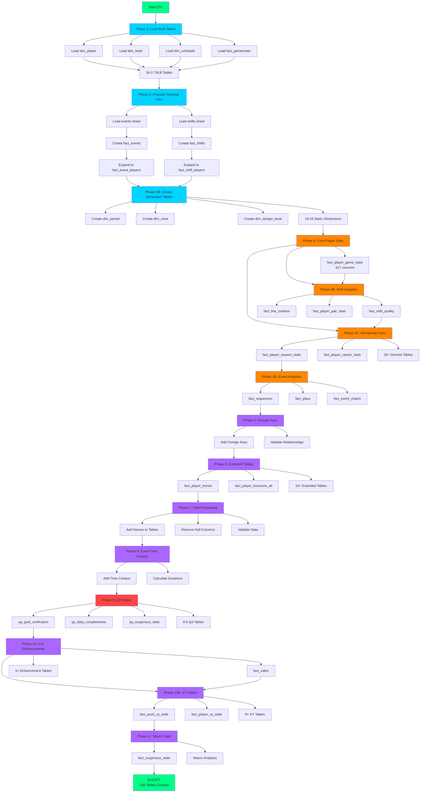
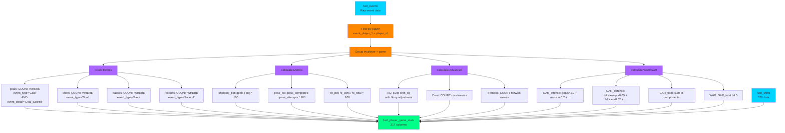
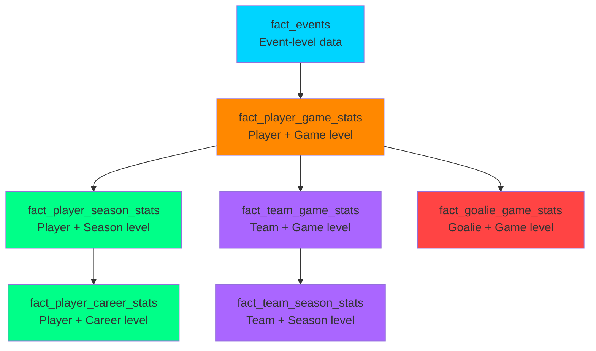
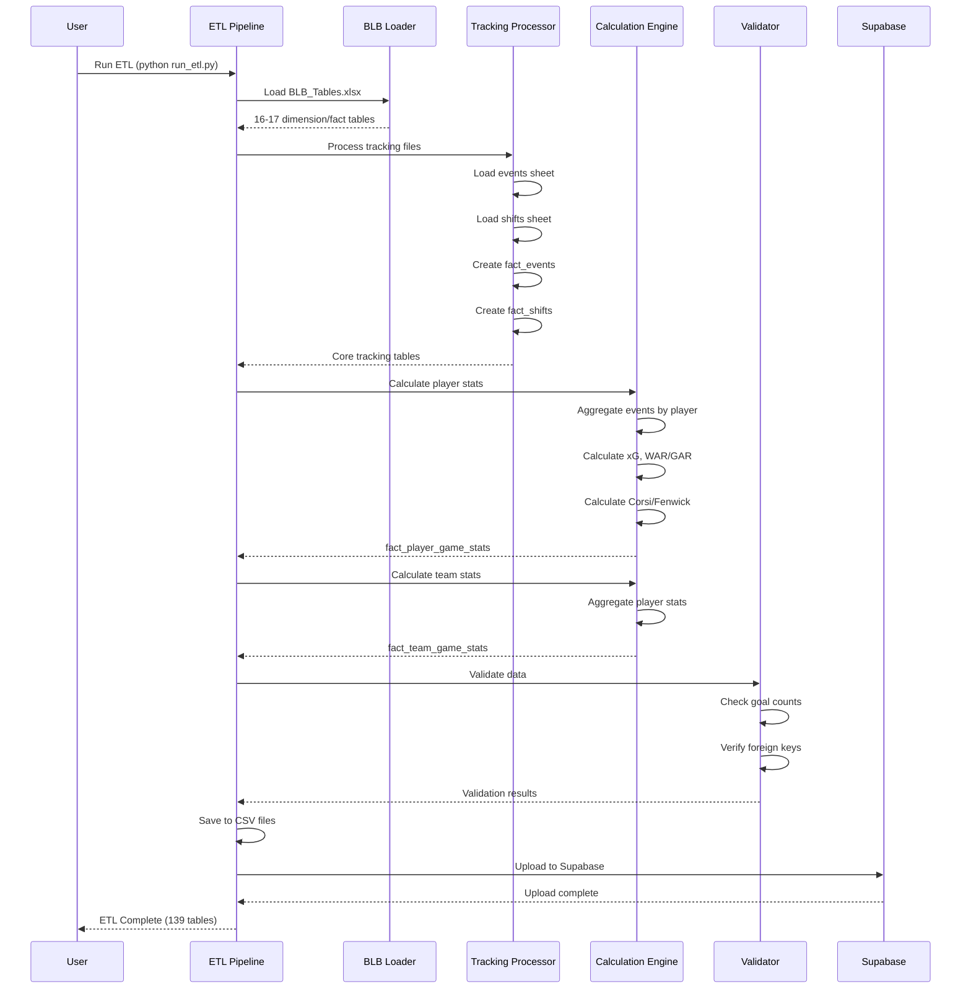
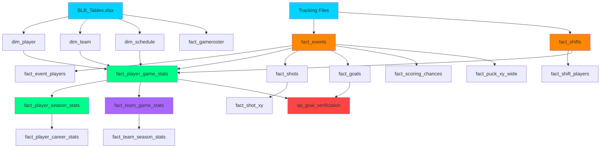
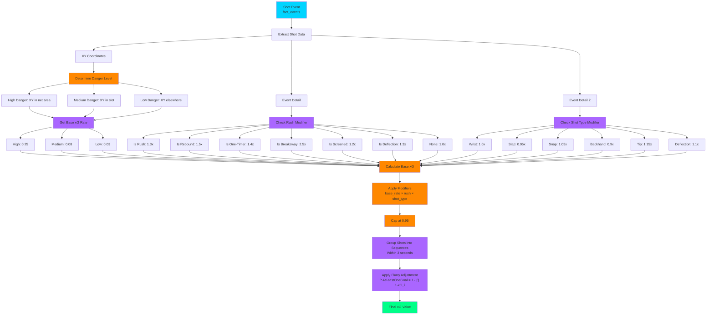
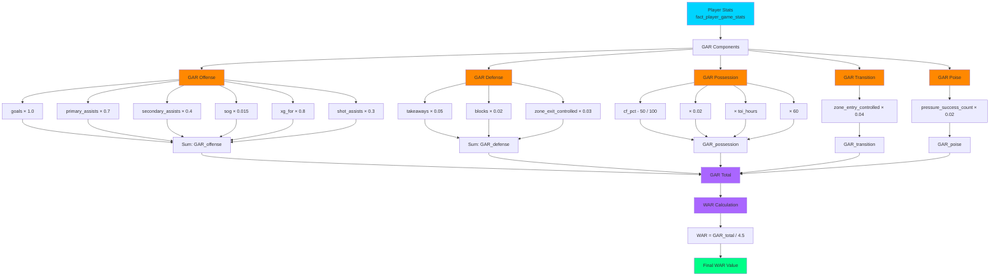
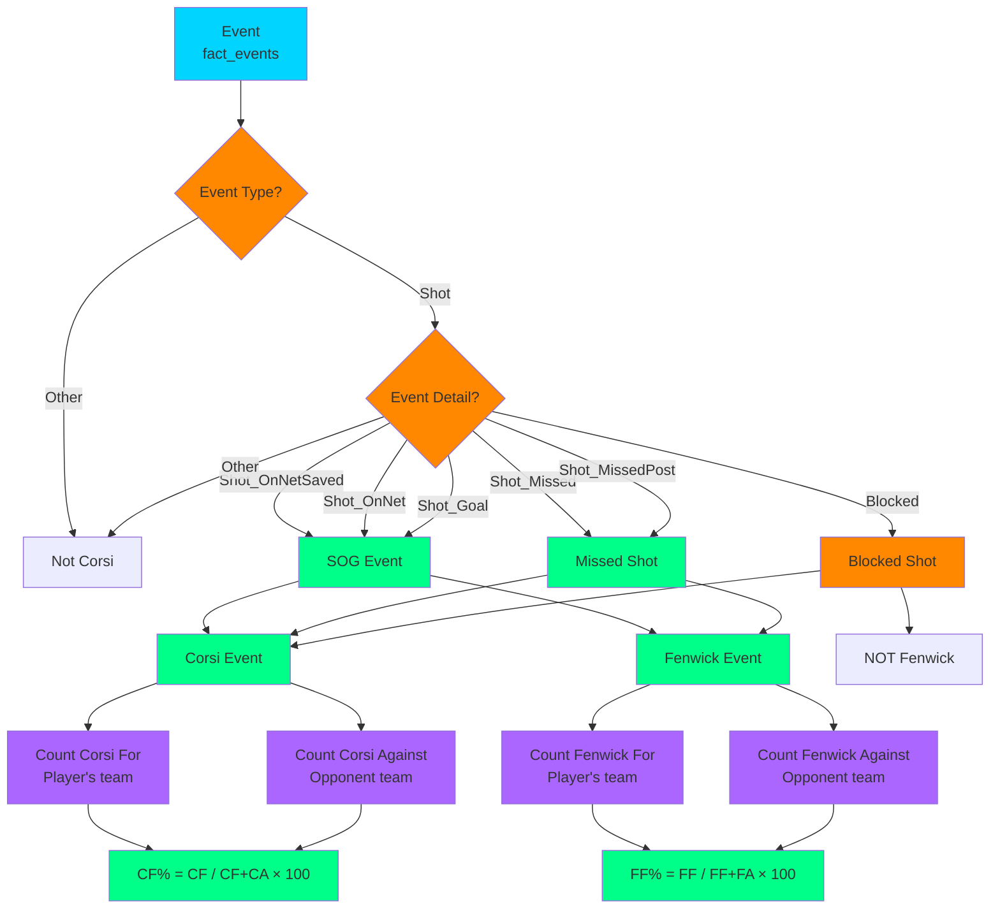

# BenchSight ETL Flow Diagrams

**Visual representation of ETL phases, data flow, and calculation processes**

Last Updated: 2026-01-21
Version: 2.00

---

## Overview

This document provides visual diagrams of the ETL pipeline, including phase flow, data transformations, and calculation processes.

---

## ETL Phase Flow

### Complete Phase Flowchart



---

## Data Source to Output Flow

### Source Data Flow

```mermaid
graph LR
    subgraph Sources["Data Sources"]
        BLB[BLB_Tables.xlsx<br/>16-17 sheets]
        TRK[Tracking Files<br/>{game_id}_tracking.xlsx]
    end
    
    subgraph Phase1["Phase 1: Extract"]
        BLB --> DIM1[dim_player<br/>dim_team<br/>dim_schedule<br/>...]
        BLB --> FACT1[fact_gameroster<br/>fact_leadership<br/>...]
    end
    
    subgraph Phase2["Phase 2-3: Transform"]
        TRK --> EVENTS[fact_events<br/>~5,800 rows]
        TRK --> SHIFTS[fact_shifts<br/>~400 rows]
        EVENTS --> EVPLAYERS[fact_event_players<br/>~11,000 rows]
        SHIFTS --> SHIFTPLAYERS[fact_shift_players<br/>~2,000 rows]
    end
    
    subgraph Phase3["Phase 3B: Dimensions"]
        STATIC[Static Constants] --> DIM2[dim_period<br/>dim_zone<br/>dim_danger_level<br/>...]
    end
    
    subgraph Phase4["Phase 4: Calculate"]
        EVENTS --> CALC1[fact_player_game_stats<br/>317 columns]
        SHIFTS --> CALC1
        CALC1 --> CALC2[fact_player_season_stats]
        CALC1 --> CALC3[fact_team_game_stats]
        CALC2 --> CALC4[fact_player_career_stats]
    end
    
    subgraph Output["Output"]
        DIM1 --> CSV[CSV Files<br/>data/output/]
        FACT1 --> CSV
        EVENTS --> CSV
        SHIFTS --> CSV
        DIM2 --> CSV
        CALC1 --> CSV
        CALC2 --> CSV
        CALC3 --> CSV
        CALC4 --> CSV
        CSV --> DB[(Supabase Database)]
    end
    
    style BLB fill:#00d4ff
    style TRK fill:#00d4ff
    style EVENTS fill:#ff8800
    style SHIFTS fill:#ff8800
    style CALC1 fill:#00ff88
    style CSV fill:#aa66ff
    style DB fill:#00ff88
```

---

## Calculation Flow

### fact_events → fact_player_game_stats



### Aggregation Hierarchy



---

## ETL Execution Flow

### Step-by-Step Execution



---

## Table Dependency Graph

### Core Dependencies



---

## Calculation Process Flow

### xG Calculation Flow



### WAR/GAR Calculation Flow



### Corsi/Fenwick Calculation Flow



---

## Data Transformation Pipeline

### End-to-End Data Flow

```mermaid
graph LR
    subgraph Input["Input Sources"]
        I1[BLB_Tables.xlsx<br/>Master Data]
        I2[Tracking Files<br/>Game Events]
    end
    
    subgraph Extract["Extract Phase"]
        I1 --> E1[Load Excel Sheets]
        I2 --> E2[Load Events/Shifts]
        E1 --> E3[16-17 BLB Tables]
        E2 --> E4[5 Tracking Tables]
    end
    
    subgraph Transform["Transform Phase"]
        E3 --> T1[Clean Data]
        E4 --> T2[Standardize Events]
        T1 --> T3[Calculate Derived Columns]
        T2 --> T3
        T3 --> T4[Create Dimensions]
        T4 --> T5[Create Core Facts]
    end
    
    subgraph Calculate["Calculate Phase"]
        T5 --> C1[Aggregate Player Stats]
        T5 --> C2[Calculate Advanced Metrics]
        C1 --> C3[317 Columns per Player]
        C2 --> C3
        C3 --> C4[Calculate Team Stats]
        C4 --> C5[Calculate Season Stats]
    end
    
    subgraph Validate["Validate Phase"]
        C5 --> V1[Goal Count Verification]
        C5 --> V2[Foreign Key Checks]
        C5 --> V3[Data Completeness]
        V1 --> V4[QA Tables]
        V2 --> V4
        V3 --> V4
    end
    
    subgraph Output["Output Phase"]
        V4 --> O1[Save to CSV]
        O1 --> O2[Upload to Supabase]
        O2 --> O3[139 Tables Complete]
    end
    
    style I1 fill:#00d4ff
    style I2 fill:#00d4ff
    style E3 fill:#ff8800
    style E4 fill:#ff8800
    style T5 fill:#ff8800
    style C3 fill:#00ff88
    style V4 fill:#ff4444
    style O3 fill:#00ff88
```



---

## Related Documentation

- [ETL.md](ETL.md) - ETL process documentation
- [DATA_DICTIONARY.md](../data/DATA_DICTIONARY.md) - Complete data dictionary
- [CALCULATION_FLOWS.md](../data/CALCULATION_FLOWS.md) - Calculation flow diagrams

---

*Last Updated: 2026-01-15*
