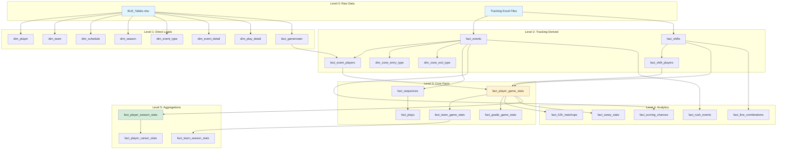

# BenchSight ETL Table Dependencies

**Complete dependency graph of all 139 tables showing creation order and relationships**

Last Updated: 2026-01-15  
Version: 29.0

---

## Overview

This document maps all table dependencies in the BenchSight ETL pipeline. Understanding dependencies is critical for:
- **Debugging:** Knowing which tables must exist before others
- **Refactoring:** Understanding impact of changes
- **Optimization:** Identifying parallelization opportunities
- **Validation:** Ensuring correct creation order

**Total Tables:** 139  
**Dependency Levels:** 5 levels (from raw data to final aggregations)

---

## Dependency Levels

### Level 0: Raw Data Sources
- `BLB_Tables.xlsx` (Excel file)
- `data/raw/games/{game_id}/{game_id}_tracking.xlsx` (Excel files)

### Level 1: Direct Loads (No Dependencies)
- Tables loaded directly from BLB_Tables.xlsx
- Static dimension tables

### Level 2: Tracking-Derived (Depends on Level 1)
- Tables created from tracking Excel files
- Uses player lookup from Level 1

### Level 3: Core Facts (Depends on Level 2)
- Core fact tables aggregating Level 2 data
- Player/team/goalie game stats

### Level 4: Analytics (Depends on Level 3)
- Shift analytics, event analytics
- Advanced metrics

### Level 5: Aggregations (Depends on Level 4)
- Season/career stats
- Macro aggregations

---

## Complete Dependency Graph



---

## Level 1: Direct Loads (No Dependencies)

**Source:** `BLB_Tables.xlsx` or static definitions  
**ETL Phase:** Phase 1 (BLB) or Phase 3B (Static)  
**Count:** ~50 tables

### BLB_Tables.xlsx Direct Loads

| Table | Sheet | Primary Key | Dependencies |
|-------|-------|-------------|--------------|
| `dim_player` | dim_player | player_id | None |
| `dim_team` | dim_team | team_id | None |
| `dim_league` | dim_league | league_id | None |
| `dim_season` | dim_season | season_id | None |
| `dim_schedule` | dim_schedule | game_id | None |
| `dim_event_type` | dim_event_type | event_type_id | None |
| `dim_event_detail` | dim_event_detail | event_detail_id | None |
| `dim_event_detail_2` | dim_event_detail_2 | event_detail_2_id | None |
| `dim_play_detail` | dim_play_detail | play_detail_id | None |
| `dim_play_detail_2` | dim_play_detail_2 | play_detail_2_id | None |
| `fact_gameroster` | fact_gameroster | (game_id, player_id) | None (enhanced later) |
| `fact_leadership` | fact_leadership | - | None |
| `fact_registration` | fact_registration | player_season_registration_id | None |
| `fact_draft` | fact_draft | player_draft_id | None |

### Static Dimension Tables

| Table | Source | Dependencies |
|-------|--------|--------------|
| `dim_period` | Hardcoded | None |
| `dim_venue` | Hardcoded | None |
| `dim_position` | Hardcoded | None |
| `dim_zone` | Hardcoded | None |
| `dim_player_role` | Hardcoded | None |
| `dim_success` | Hardcoded | None |
| `dim_shot_type` | Hardcoded | None |
| `dim_pass_type` | Hardcoded | None |
| `dim_strength` | Hardcoded | None |
| `dim_situation` | Hardcoded | None |
| `dim_danger_level` | Hardcoded | None |
| `dim_danger_zone` | Hardcoded | None |

---

## Level 2: Tracking-Derived (Depends on Level 1)

**Source:** Tracking Excel files + Level 1 tables  
**ETL Phase:** Phase 1 (Base ETL)  
**Count:** ~25 tables

### Core Tracking Tables

| Table | Source | Dependencies | Creates FK To |
|-------|--------|-------------|---------------|
| `fact_events` | Tracking Excel | `player_lookup` (from fact_gameroster) | `dim_player`, `dim_team`, `dim_schedule` |
| `fact_shifts` | Tracking Excel | `player_lookup` | `dim_player`, `dim_team`, `dim_schedule` |
| `fact_event_players` | `fact_events` | `fact_events`, `dim_player` | `fact_events`, `dim_player` |
| `fact_shift_players` | `fact_shifts` | `fact_shifts`, `dim_player` | `fact_shifts`, `dim_player` |

### Dynamic Dimension Tables (Created from Tracking)

| Table | Source | Dependencies | Creates FK To |
|-------|--------|-------------|---------------|
| `dim_zone_entry_type` | `fact_events` | `fact_events` | None (self-referencing) |
| `dim_zone_exit_type` | `fact_events` | `fact_events` | None |
| `dim_stoppage_type` | `fact_events` | `fact_events` | None |
| `dim_giveaway_type` | `fact_events` | `fact_events` | None |
| `dim_takeaway_type` | `fact_events` | `fact_events` | None |
| `dim_shift_start_type` | `fact_shifts` | `fact_shifts` | None |
| `dim_shift_stop_type` | `fact_shifts` | `fact_shifts` | None |

### Event-Derived Tables

| Table | Source | Filter/Logic | Dependencies |
|-------|--------|--------------|--------------|
| `fact_shots` | `fact_events` | `event_type = 'Shot'` | `fact_events` |
| `fact_goals` | `fact_events` | `event_type = 'Goal' AND event_detail = 'Goal_Scored'` | `fact_events` |
| `fact_saves` | `fact_events` | `event_type = 'Shot' AND outcome = 'saved'` | `fact_events` |
| `fact_rushes` | `fact_events` | `event_type = 'Rush'` | `fact_events` |
| `fact_breakouts` | `fact_events` | `event_type = 'Breakout'` | `fact_events` |
| `fact_zone_entries` | `fact_events` | `event_type = 'Zone_Entry_Exit'` (entry) | `fact_events`, `dim_zone_entry_type` |
| `fact_zone_exits` | `fact_events` | `event_type = 'Zone_Entry_Exit'` (exit) | `fact_events`, `dim_zone_exit_type` |
| `fact_faceoffs` | `fact_events` | `event_type = 'Faceoff'` | `fact_events` |
| `fact_penalties` | `fact_events` | `event_type = 'Penalty'` | `fact_events` |
| `fact_scoring_chances` | `fact_events` | Shot/Goal with danger zones | `fact_events`, `dim_danger_level` |

---

## Level 3: Core Facts (Depends on Level 2)

**Source:** Level 2 tables + aggregations  
**ETL Phase:** Phase 4 (Core Stats)  
**Count:** ~15 tables

### Player/Team/Goalie Stats

| Table | Source Tables | Aggregation | Dependencies |
|-------|---------------|-------------|--------------|
| `fact_player_game_stats` | `fact_event_players`, `fact_shifts`, `fact_shift_players` | Per player per game | Level 2 tables |
| `fact_team_game_stats` | `fact_player_game_stats` | Team totals per game | `fact_player_game_stats` |
| `fact_goalie_game_stats` | `fact_events`, `fact_shifts` | Goalie stats per game | `fact_events`, `fact_shifts` |

### Sequence/Play Tables

| Table | Source | Logic | Dependencies |
|-------|--------|-------|--------------|
| `fact_sequences` | `fact_events` | Linked event sequences | `fact_events` (with flags) |
| `fact_plays` | `fact_sequences` | Play-level aggregations | `fact_sequences` |

### Period/Situation Stats

| Table | Source | Aggregation | Dependencies |
|-------|--------|-------------|--------------|
| `fact_player_period_stats` | `fact_events` | Per period breakdown | `fact_events` |
| `fact_player_situation_stats` | `fact_events` | By game situation (5v5, PP, PK) | `fact_events`, `dim_strength` |

---

## Level 4: Analytics (Depends on Level 3)

**Source:** Level 3 tables + advanced calculations  
**ETL Phase:** Phase 4B-4D (Analytics)  
**Count:** ~20 tables

### Shift Analytics

| Table | Source Tables | Purpose | Dependencies |
|-------|---------------|---------|--------------|
| `fact_h2h_matchups` | `fact_player_game_stats`, `fact_shifts` | Head-to-head player matchups | `fact_player_game_stats`, `fact_shifts` |
| `fact_wowy_stats` | `fact_player_game_stats`, `fact_shifts` | With/without you analysis | `fact_player_game_stats`, `fact_shifts` |
| `fact_line_combinations` | `fact_shifts`, `fact_shift_players` | Line combo effectiveness | `fact_shifts`, `fact_shift_players` |
| `fact_shift_quality` | `fact_shifts` | Shift quality metrics | `fact_shifts` |

### Event Analytics

| Table | Source | Purpose | Dependencies |
|-------|--------|---------|--------------|
| `fact_rush_events` | `fact_events` | Rush event analysis | `fact_events` |
| `fact_shot_chains` | `fact_events`, `fact_sequences` | Shot sequence chains | `fact_events`, `fact_sequences` |
| `fact_linked_events` | `fact_events` | Event relationships | `fact_events` |
| `fact_scoring_chances_detailed` | `fact_scoring_chances` | Extended scoring chance metrics | `fact_scoring_chances` |

### XY/Spatial Analytics

| Table | Source | Purpose | Dependencies |
|-------|--------|---------|--------------|
| `fact_puck_xy_wide` | `fact_events` | Puck position (wide format) | `fact_events` |
| `fact_puck_xy_long` | `fact_events` | Puck position (long format) | `fact_events` |
| `fact_player_xy_wide` | `fact_events` | Player positions (wide) | `fact_events` |
| `fact_player_xy_long` | `fact_events` | Player positions (long) | `fact_events` |

---

## Level 5: Aggregations (Depends on Level 4)

**Source:** Level 4 tables + season/career rollups  
**ETL Phase:** Phase 11 (Macro Stats)  
**Count:** ~15 tables

### Season/Career Stats

| Table | Source Tables | Aggregation | Dependencies |
|-------|---------------|-------------|--------------|
| `fact_player_season_stats_basic` | `fact_player_game_stats` | Season totals | `fact_player_game_stats` |
| `fact_player_season_stats` | `fact_player_game_stats` | Season stats (advanced) | `fact_player_game_stats` |
| `fact_player_career_stats_basic` | `fact_player_season_stats` | Career totals | `fact_player_season_stats` |
| `fact_player_career_stats` | `fact_player_season_stats` | Career stats (advanced) | `fact_player_season_stats` |
| `fact_team_season_stats_basic` | `fact_team_game_stats` | Team season totals | `fact_team_game_stats` |
| `fact_team_season_stats` | `fact_team_game_stats` | Team season stats (advanced) | `fact_team_game_stats` |
| `fact_goalie_season_stats` | `fact_goalie_game_stats` | Goalie season stats | `fact_goalie_game_stats` |

---

## Critical Dependencies

### Must Exist Before Others

1. **`dim_player`** → Required by:
   - `fact_events` (player_id FK)
   - `fact_shifts` (player_id FK)
   - `fact_player_game_stats` (player_id FK)
   - All player-related tables

2. **`dim_team`** → Required by:
   - `fact_events` (team_id FK)
   - `fact_shifts` (team_id FK)
   - `fact_team_game_stats` (team_id FK)
   - All team-related tables

3. **`dim_schedule`** → Required by:
   - `fact_events` (game_id FK)
   - `fact_shifts` (game_id FK)
   - All game-related tables

4. **`fact_events`** → Required by:
   - `fact_event_players`
   - `fact_player_game_stats`
   - `fact_sequences`
   - All event-derived tables

5. **`fact_shifts`** → Required by:
   - `fact_shift_players`
   - `fact_player_game_stats`
   - `fact_line_combinations`
   - All shift-related tables

6. **`fact_player_game_stats`** → Required by:
   - `fact_team_game_stats`
   - `fact_player_season_stats`
   - `fact_h2h_matchups`
   - `fact_wowy_stats`

---

## Creation Order by Phase

### Phase 1: Base ETL
1. Load BLB tables (Level 1)
2. Build player lookup
3. Load tracking data → `fact_events`, `fact_shifts` (Level 2)
4. Create dynamic dimensions (Level 2)
5. Create derived tables (Level 2)

### Phase 3B: Static Dimensions
1. Create static dimension tables (Level 1)

### Phase 4: Core Stats
1. `fact_player_game_stats` (Level 3)
2. `fact_team_game_stats` (Level 3)
3. `fact_goalie_game_stats` (Level 3)

### Phase 4B: Shift Analytics
1. `fact_h2h_matchups` (Level 4)
2. `fact_wowy_stats` (Level 4)
3. `fact_line_combinations` (Level 4)

### Phase 4C: Remaining Facts
1. Event-derived tables (Level 2)
2. Period/situation stats (Level 3)

### Phase 4D: Event Analytics
1. `fact_rush_events` (Level 4)
2. `fact_shot_chains` (Level 4)

### Phase 11: Macro Stats
1. `fact_player_season_stats` (Level 5)
2. `fact_player_career_stats` (Level 5)
3. `fact_team_season_stats` (Level 5)

---

## Dependency Validation

### Foreign Key Dependencies

All foreign keys must reference existing tables:

```python
# Example: fact_events depends on dim_player
fact_events.player_id → dim_player.player_id (must exist)

# Example: fact_player_game_stats depends on fact_events
fact_player_game_stats aggregates from fact_events (must exist)
```

### Data Dependencies

Tables that aggregate data must have source tables populated:

```python
# fact_player_game_stats requires fact_events to have data
if fact_events is empty:
    fact_player_game_stats will be empty
```

---

## Parallelization Opportunities

### Can Run in Parallel (No Dependencies)

1. **Static dimension tables** (Phase 3B)
   - All can be created simultaneously
   - No dependencies between them

2. **Event-derived tables** (Phase 4C)
   - `fact_shots`, `fact_goals`, `fact_saves` can run in parallel
   - All depend only on `fact_events`

3. **XY tables** (Phase 10B)
   - All XY tables can run in parallel
   - All depend only on `fact_events`

### Must Run Sequentially

1. **Level 1 → Level 2**
   - Must load BLB tables before creating tracking tables

2. **Level 2 → Level 3**
   - Must create `fact_events` before `fact_player_game_stats`

3. **Level 3 → Level 4**
   - Must create `fact_player_game_stats` before analytics

4. **Level 4 → Level 5**
   - Must create game stats before season stats

---

## Related Documentation

- [CODE_FLOW_ETL.md](CODE_FLOW_ETL.md) - Execution flow
- [ETL_ARCHITECTURE.md](ETL_ARCHITECTURE.md) - Module architecture
- [ETL_CALCULATIONS_REFERENCE.md](ETL_CALCULATIONS_REFERENCE.md) - Calculation formulas
- [ETL_DATA_FLOW.md](ETL_DATA_FLOW.md) - Data transformations
- [DATA_LINEAGE.md](DATA_LINEAGE.md) - Data lineage

---

*Last Updated: 2026-01-15*
