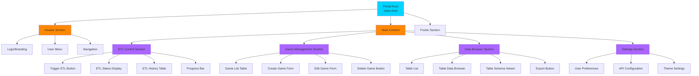
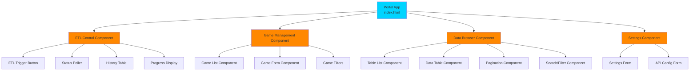
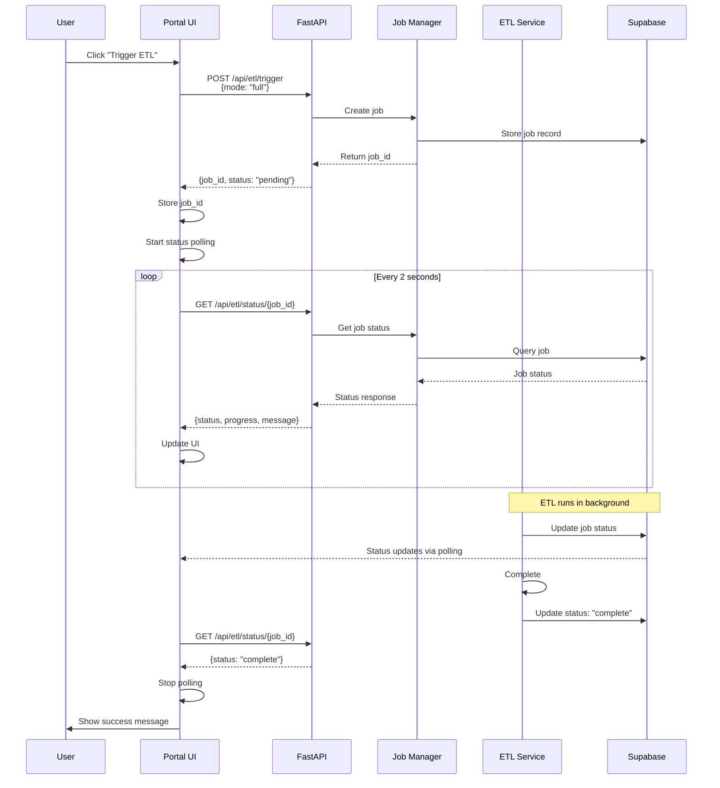
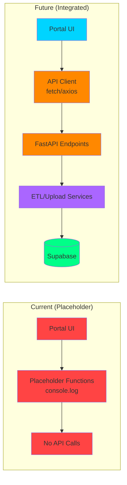
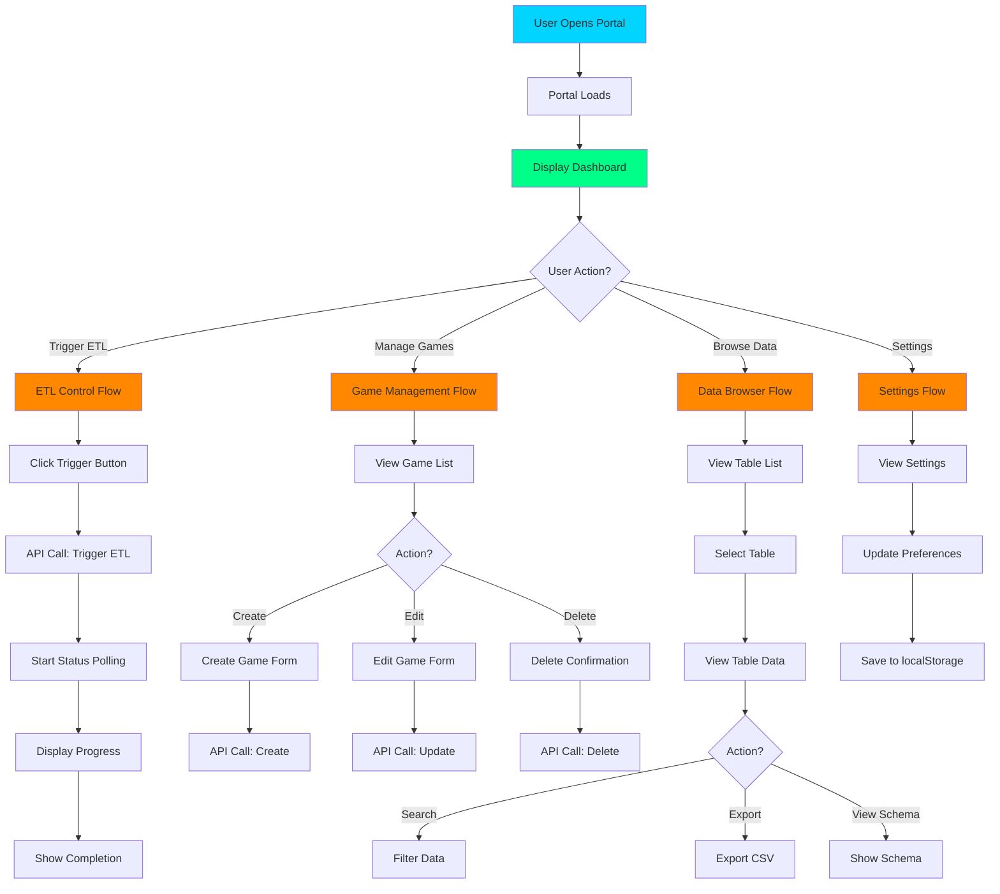

# BenchSight Portal Architecture Diagrams

**Visual representation of portal architecture, component structure, and data flow**

Last Updated: 2026-01-21
Version: 2.00

---

## Overview

This document provides visual diagrams of the BenchSight Admin Portal architecture, including component structure, data flow, and API integration patterns.

**Tech Stack:** HTML, JavaScript, FastAPI (API)

---

## Portal Component Structure

### UI Sections



### Component Hierarchy



---

## Portal Data Flow

### ETL Control Flow



### Game Management Flow

```mermaid
graph TD
    A[Portal: Game Management] --> B[Load Game List]
    B --> C[GET /api/games<br/>Fetch games from Supabase]
    C --> D[(Supabase Database)]
    D --> E[Return game list]
    E --> F[Display in table]
    
    F --> G{User Action?}
    G -->|Create Game| H[Show Create Form]
    G -->|Edit Game| I[Show Edit Form]
    G -->|Delete Game| J[Show Delete Confirmation]
    
    H --> K[POST /api/games<br/>Create game]
    K --> D
    D --> L[Return created game]
    L --> M[Update game list]
    
    I --> N[PUT /api/games/{id}<br/>Update game]
    N --> D
    D --> O[Return updated game]
    O --> M
    
    J --> P[DELETE /api/games/{id}<br/>Delete game]
    P --> D
    D --> Q[Return success]
    Q --> M
    
    M --> F
    
    style A fill:#00d4ff
    style C fill:#ff8800
    style D fill:#00ff88
    style K fill:#ff8800
    style N fill:#ff8800
    style P fill:#ff8800
```

### Data Browser Flow

```mermaid
graph TD
    A[Portal: Data Browser] --> B[Load Table List]
    B --> C[GET /api/tables<br/>List all tables]
    C --> D[(Supabase Database)]
    D --> E[Return table metadata]
    E --> F[Display table list]
    
    F --> G[User Selects Table]
    G --> H[Load Table Data]
    H --> I[GET /api/tables/{name}/data<br/>With pagination]
    I --> D
    D --> J[Return table data]
    J --> K[Display in data table]
    
    K --> L{User Action?}
    L -->|Search| M[Filter data]
    L -->|Sort| N[Sort data]
    L -->|Export| O[Export CSV]
    L -->|View Schema| P[Show schema]
    
    M --> I
    N --> I
    O --> Q[Download CSV]
    P --> R[Display schema info]
    
    style A fill:#00d4ff
    style C fill:#ff8800
    style D fill:#00ff88
    style I fill:#ff8800
    style K fill:#00ff88
```

---

## API Integration Patterns

### Current vs Future Integration



### Status Polling Pattern

```mermaid
graph TD
    A[User Triggers ETL] --> B[POST /api/etl/trigger]
    B --> C[Receive job_id]
    C --> D[Start Polling Timer]
    
    D --> E[Wait 2 seconds]
    E --> F[GET /api/etl/status/{job_id}]
    F --> G{Status?}
    
    G -->|pending/running| H[Update Progress Bar]
    G -->|processing| I[Update Status Message]
    G -->|complete| J[Stop Polling]
    G -->|failed| K[Stop Polling<br/>Show Error]
    
    H --> E
    I --> E
    J --> L[Show Success Message]
    K --> M[Show Error Message]
    
    style A fill:#00d4ff
    style B fill:#ff8800
    style C fill:#aa66ff
    style D fill:#aa66ff
    style F fill:#ff8800
    style G fill:#aa66ff
    style J fill:#00ff88
    style K fill:#ff4444
```

---

## User Interaction Flow

### Complete User Journey



---

## Related Documentation

- [PORTAL.md](PORTAL.md) - Complete portal documentation
- [API_ARCHITECTURE_DIAGRAMS.md](../api/API_ARCHITECTURE_DIAGRAMS.md) - API architecture
- [API.md](../api/API.md) - API reference

---

*Last Updated: 2026-01-15*
