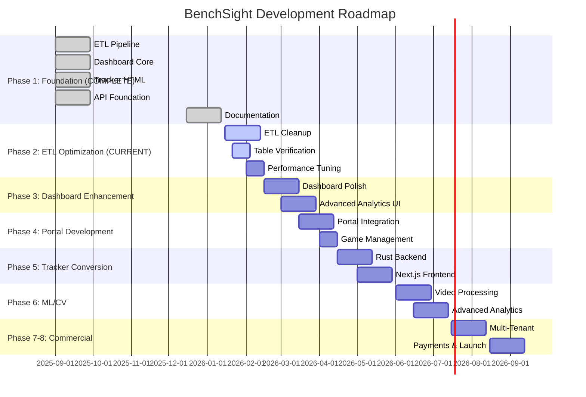
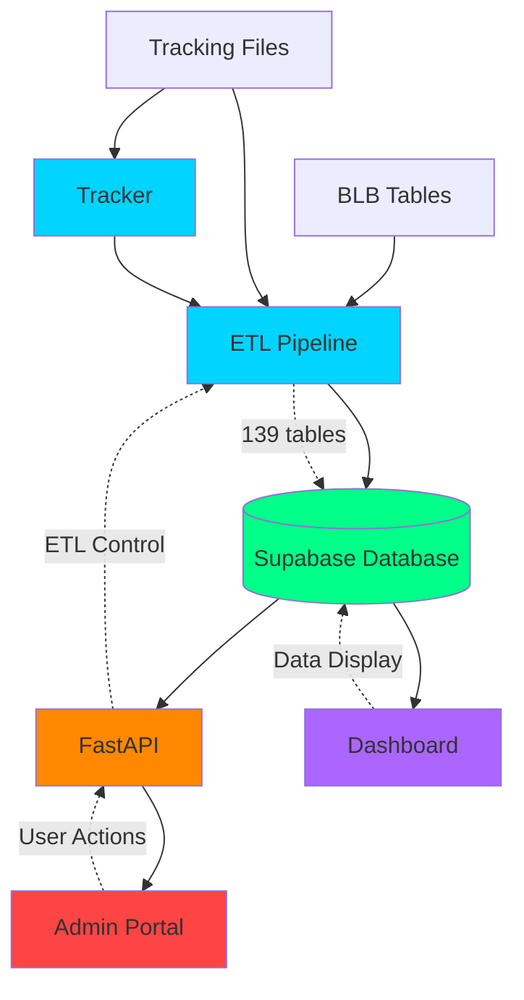
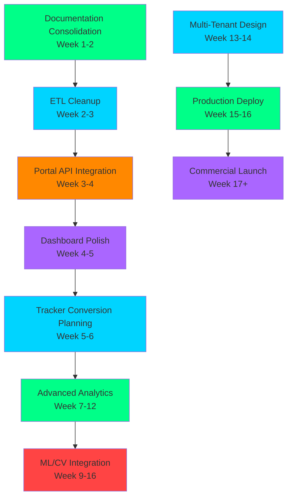
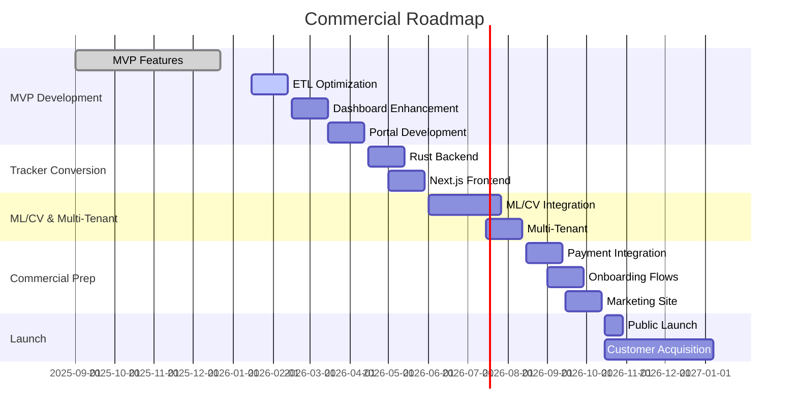

# BenchSight Roadmap Visuals

**Standalone visual reference for roadmap diagrams**

Last Updated: 2026-01-21

---

## Timeline Gantt Chart

---

## Component Dependency Graph

---

## Feature Roadmap

```mermaid
graph LR
    subgraph MVP["MVP Features (Weeks 1-16)"]
        MVP1[Core Analytics]
        MVP2[Game Tracking]
        MVP3[Multi-Tenant]
        MVP4[Authentication]
        MVP5[Payment]
    end
    
    subgraph Commercial["Commercial Features (Weeks 17-32)"]
        COM1[Mobile Optimization]
        COM2[Advanced Analytics]
        COM3[Export/Reports]
        COM4[Onboarding]
        COM5[Support System]
    end
    
    subgraph Future["Future Features (Weeks 33+)"]
        FUT1[ML/CV Integration]
        FUT2[Mobile Apps]
        FUT3[Real-time Collab]
        FUT4[Predictive Analytics]
        FUT5[Multi-League]
    end
    
    MVP --> Commercial
    Commercial --> Future
    
    style MVP fill:#00ff88
    style Commercial fill:#00d4ff
    style Future fill:#aa66ff
```

---

## Critical Path Visualization

---

## Commercial Roadmap Timeline

---

*Last Updated: 2026-01-21*
