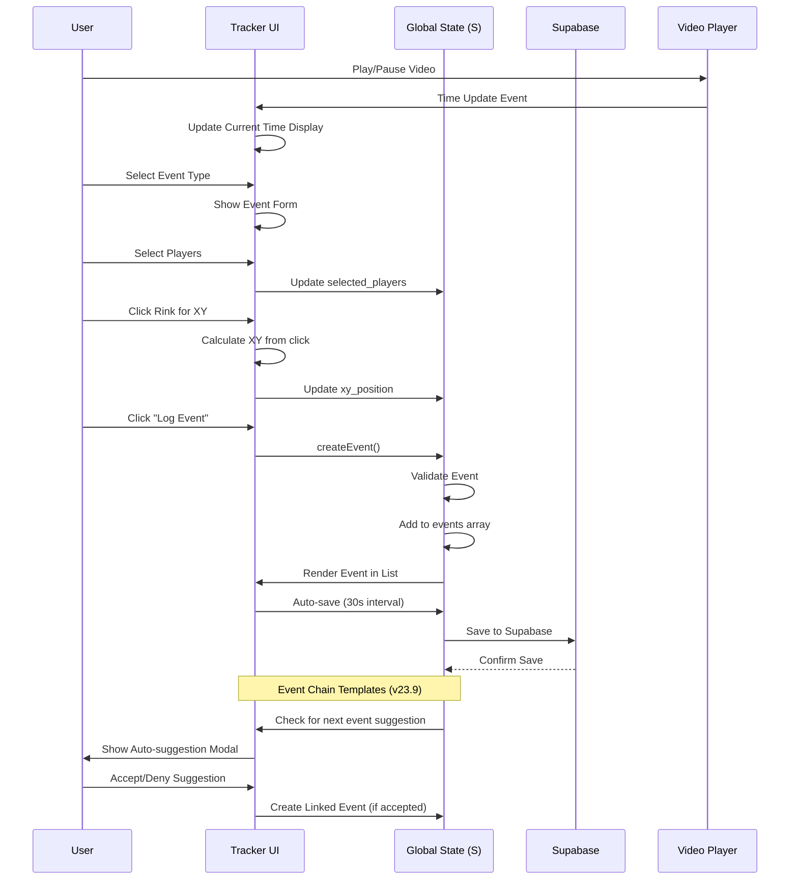
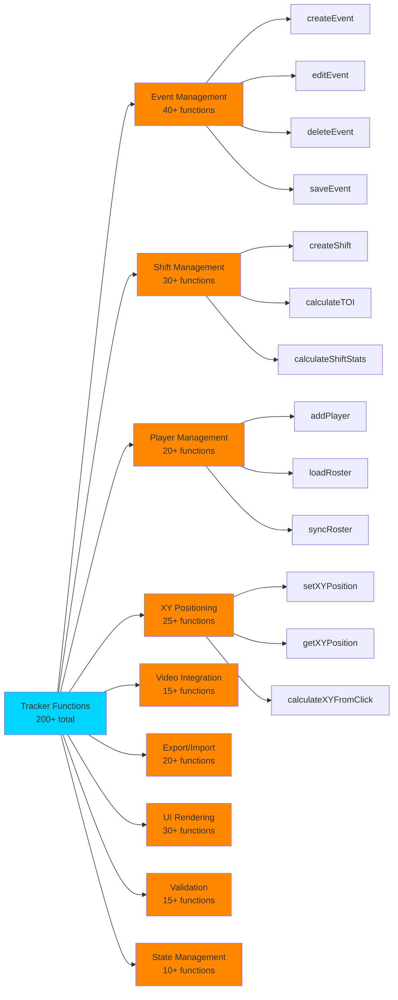
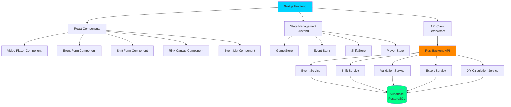
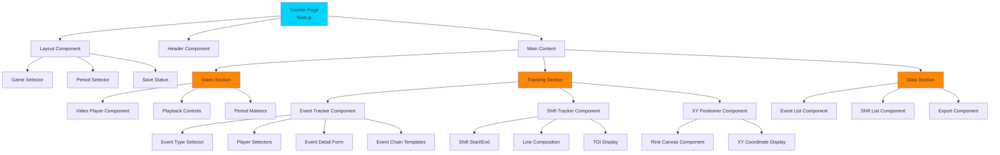
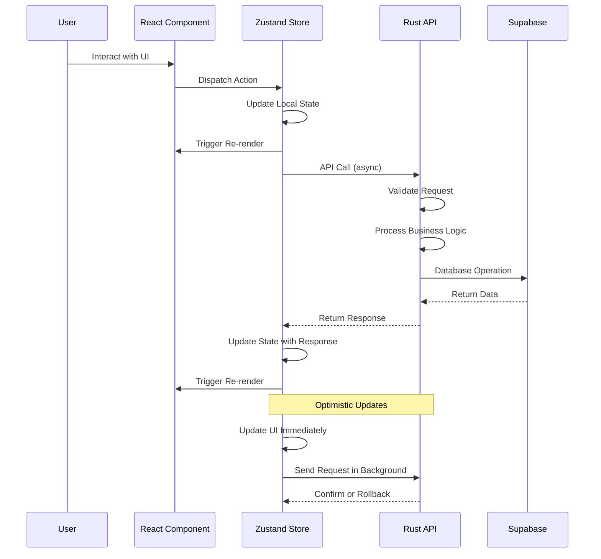
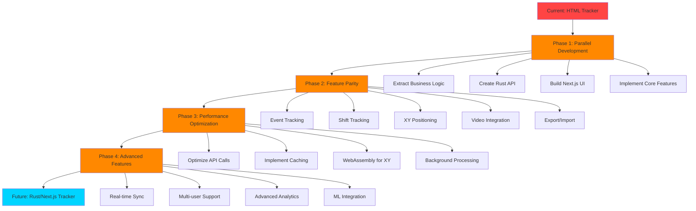
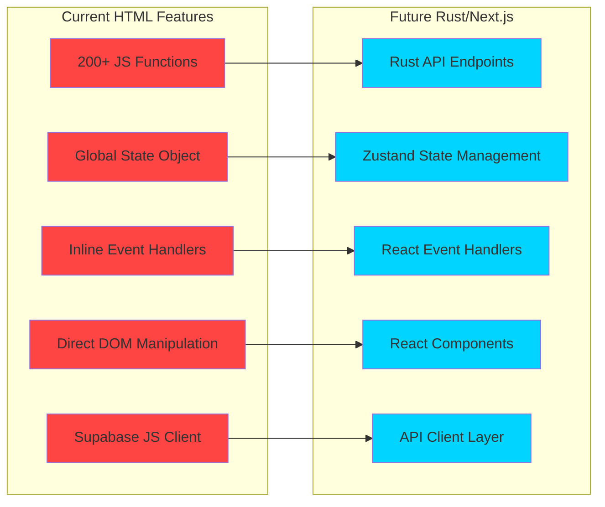
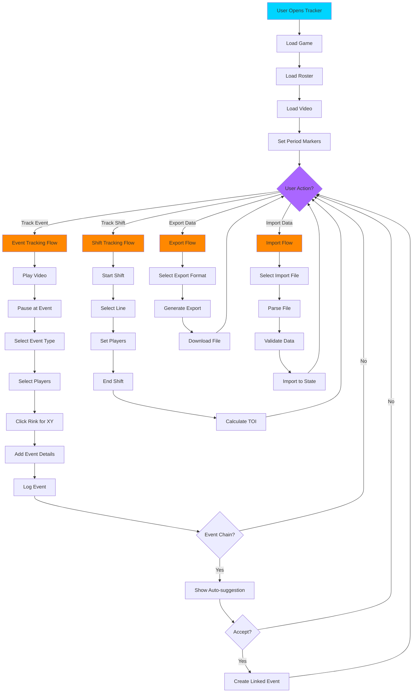

# BenchSight Tracker Architecture Diagrams

**Visual representation of tracker architecture, current HTML implementation, and future Rust/Next.js conversion**

Last Updated: 2026-01-21
Version: 2.00

---

## Overview

This document provides visual diagrams of the BenchSight Game Tracker architecture, including the current HTML implementation and the planned Rust/Next.js conversion.

**Current Stack:** HTML, JavaScript (vanilla), Supabase JS  
**Target Stack:** Rust (backend), Next.js (frontend), TypeScript, React

---

## Current Architecture (HTML Tracker)

### Component Structure

```mermaid
graph TD
    A[Tracker Root<br/>tracker_index_v23.5.html] --> B[Header Section]
    A --> C[Main Content]
    A --> D[Footer Section]
    
    B --> B1[Game Selector]
    B --> B2[Period Selector]
    B --> B3[Team Colors]
    B --> B4[Save Status]
    
    C --> E[Video Player Section]
    C --> F[Event Tracking Section]
    C --> G[Shift Tracking Section]
    C --> H[XY Positioning Section]
    
    E --> E1[Video Element]
    E --> E2[Playback Controls]
    E --> E3[Period Markers]
    E --> E4[Time Display]
    
    F --> F1[Event Type Selector]
    F --> F2[Player Selectors]
    F --> F3[Event Detail Forms]
    F --> F4[Event List Display]
    F --> F5[Event Chain Templates]
    
    G --> G1[Shift Start/End]
    G --> G2[Line Composition]
    G --> G3[Shift List Display]
    G --> G4[TOI Calculator]
    
    H --> H1[Rink Canvas]
    H --> H2[XY Coordinate Display]
    H --> H3[Position Selector]
    
    style A fill:#00d4ff
    style B fill:#ff8800
    style C fill:#ff8800
    style E fill:#aa66ff
    style F fill:#aa66ff
    style G fill:#aa66ff
    style H fill:#aa66ff
```



### State Management (Current)

```mermaid
graph TD
    A[Global State Object: S] --> B[Game State]
    A --> C[Event State]
    A --> D[Shift State]
    A --> E[Player State]
    A --> F[Video State]
    A --> G[UI State]
    
    B --> B1[game_id]
    B --> B2[game_date]
    B --> B3[home_team]
    B --> B4[away_team]
    
    C --> C1[events: Array]
    C --> C2[current_event]
    C --> C3[event_chain_templates]
    
    D --> D1[shifts: Array]
    D --> D2[current_shift]
    D --> D3[lines: Object]
    
    E --> E1[home_roster: Array]
    E --> E2[away_roster: Array]
    E --> E3[players_on_ice: Array]
    
    F --> F1[video_url]
    F --> F2[current_time]
    F --> F3[period_markers]
    
    G --> G1[active_section]
    G --> G2[selected_players]
    G --> G3[xy_position]
    
    style A fill:#00d4ff
    style B fill:#ff8800
    style C fill:#ff8800
    style D fill:#ff8800
    style E fill:#ff8800
    style F fill:#ff8800
    style G fill:#ff8800
```



### Event Flow (Current)



### Function Categories (Current)



---

## Future Architecture (Rust/Next.js)

### High-Level Architecture



### Component Hierarchy (Future)



### Data Flow (Future)



### Rust Backend Services

```mermaid
graph TD
    A[Rust API Server] --> B[Event Service]
    A --> C[Shift Service]
    A --> D[Validation Service]
    A --> E[Export Service]
    A --> F[XY Service]
    A --> G[Import Service]
    
    B --> B1[POST /api/events]
    B --> B2[GET /api/events/{id}]
    B --> B3[PUT /api/events/{id}]
    B --> B4[DELETE /api/events/{id}]
    B --> B5[GET /api/events/game/{game_id}]
    
    C --> C1[POST /api/shifts]
    C --> C2[GET /api/shifts/player/{player_id}]
    C --> C3[PUT /api/shifts/{id}]
    C --> C4[DELETE /api/shifts/{id}]
    C --> C5[GET /api/shifts/game/{game_id}]
    
    D --> D1[validate_event]
    D --> D2[validate_shift]
    D --> D3[validate_xy]
    D --> D4[validate_time]
    
    E --> E1[export_events_csv]
    E --> E2[export_shifts_csv]
    E --> E3[export_game_json]
    
    F --> F1[calculate_xy_from_click]
    F --> F2[validate_xy_bounds]
    F --> F3[convert_xy_to_zone]
    
    G --> G1[import_events_csv]
    G --> G2[import_shifts_csv]
    G --> G3[import_game_json]
    
    B --> H[(Supabase)]
    C --> H
    D --> H
    E --> H
    F --> H
    G --> H
    
    style A fill:#00d4ff
    style B fill:#ff8800
    style C fill:#ff8800
    style D fill:#ff8800
    style E fill:#ff8800
    style F fill:#ff8800
    style G fill:#ff8800
    style H fill:#00ff88
```

---

## Conversion Flow

### Migration Strategy



### Feature Mapping



---

## User Interaction Flow

### Complete Tracker Workflow



---

## Related Documentation

- [TRACKER_REFERENCE.md](TRACKER_REFERENCE.md) - Complete function reference
- [TRACKER_CONVERSION.md](TRACKER_CONVERSION.md) - Detailed conversion plan
- [API_ARCHITECTURE_DIAGRAMS.md](../api/API_ARCHITECTURE_DIAGRAMS.md) - API architecture

---

*Last Updated: 2026-01-15*
