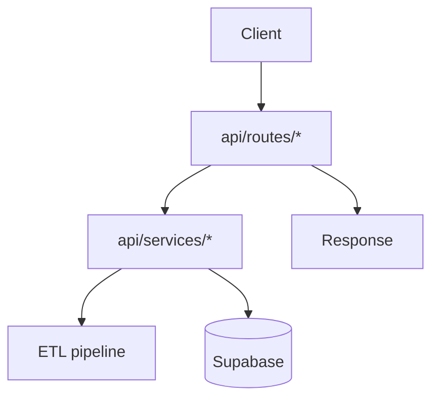

# API Walkthrough

**FastAPI control plane for ETL, uploads, and staging**

Last Updated: 2026-01-21  
Version: 2.00

---

## Folder Map
- `api/main.py` — FastAPI app init, routers, middleware
- `api/routes/` — HTTP endpoints (etl, upload, staging, health, ml)
- `api/services/` — business logic (etl_service, upload_service, job_manager)
- `api/models/` — Pydantic schemas for requests/responses
- `api/utils/logger.py` — logging helper

## Flow

## How It Works
1) `main.py` creates app, mounts routers from `routes/`.
2) Routes validate input with Pydantic models, call services.
3) Services invoke ETL triggers, uploads, staging operations, or Supabase actions.
4) Responses are serialized back to the client (Portal, CLI, etc.).

## Why Modules Exist
- `routes/*`: keep HTTP layer thin and validated.
- `services/*`: isolate business logic and external integrations.
- `models/*`: contract for requests/responses, prevents schema drift.

## Key Endpoints
- `/api/etl/trigger`, `/api/etl/status/{job_id}`, `/api/etl/history`
- `/api/upload/to-supabase`, `/api/upload/generate-schema`
- `/api/staging/*` (BLB tables, tracking uploads)
- `/api/health`

## What to Read (Order)
1) `api/main.py`
2) `api/routes/etl.py`, `upload.py`, `staging.py`, `health.py`
3) `api/services/etl_service.py`, `job_manager.py`, `upload_service.py`
4) `api/models/*` for payloads

## Assessment
- **Good:** Clear separation of routes/services/models; core ETL/upload endpoints exist.
- **Risks/Bad:** Missing game management/data browser endpoints; auth not implemented; error handling/docs could be tighter.
- **Next:** Add missing endpoints (games/tables), integrate auth, improve error handling and response contracts.

## Extending Safely
- Add new endpoints in `routes/` + schemas in `models/` + logic in `services/`.
- Keep routes minimal; push logic to services.
- Mirror any new job/status flows in the portal.
