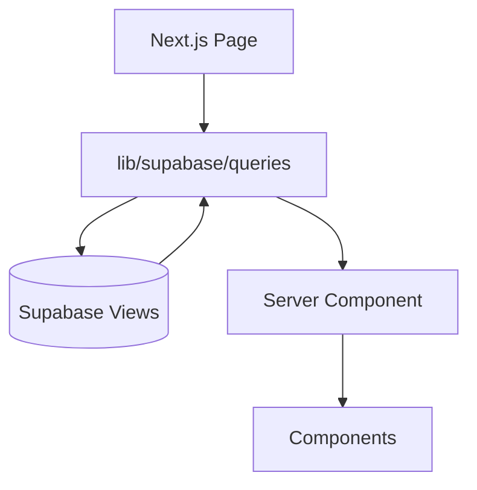

# Dashboard Walkthrough

**Next.js analytics dashboard (data from Supabase views)**

Last Updated: 2026-01-21  
Version: 2.00

---

## Folder Map
- `ui/dashboard/src/app/` — App Router pages
  - `(dashboard)/players`, `teams`, `games`, `goalies`, `standings`, etc.
- `ui/dashboard/src/lib/supabase/queries/` — server-side data access
- `ui/dashboard/src/components/` — UI, charts, tables
- Config: `next.config.js`, `tailwind.config.ts`, `tsconfig.json`

## Flow

## How It Works
1) App Router pages are server components by default.
2) Pages call query helpers in `lib/supabase/queries/`.
3) Queries fetch Supabase views (pre-aggregated by ETL + SQL).
4) Data is passed to React components for render.

## Why Modules Exist
- `queries/*`: single source of truth for data fetching; prevents duplication.
- `components/*`: shared UI to keep pages thin and consistent.
- App Router: server-side data fetching keeps secrets out of the client.

## Key Invariants
- Use Supabase views (not raw facts) for performance.
- Keep query logic centralized in `lib/supabase/queries/`.
- Avoid heavy client-side fetching unless necessary.

## What to Read (Order)
1) Pick one page (e.g., `src/app/(dashboard)/players/[id]/page.tsx`)
2) Follow its query import in `lib/supabase/queries/players.ts`
3) Open the component(s) it renders in `src/components/`
4) Skim `tailwind.config.ts` and `next.config.js` for build/runtime settings

## Extending Safely
- Add queries in `lib/supabase/queries/` and reuse in pages.
- Use shared components for tables/charts to keep UX consistent.
- Prefer server components; only use client components when needed.

## Assessment
- **Good:** Server-side fetching via Supabase views; centralized queries; wide page coverage.
- **Risks/Bad:** UX polish/mobile pending; risk of duplicated queries if helpers bypassed; auth not yet implemented.
- **Next:** Enforce query helper reuse, add auth when ready, improve mobile/UX polish, add automated smoke tests.
