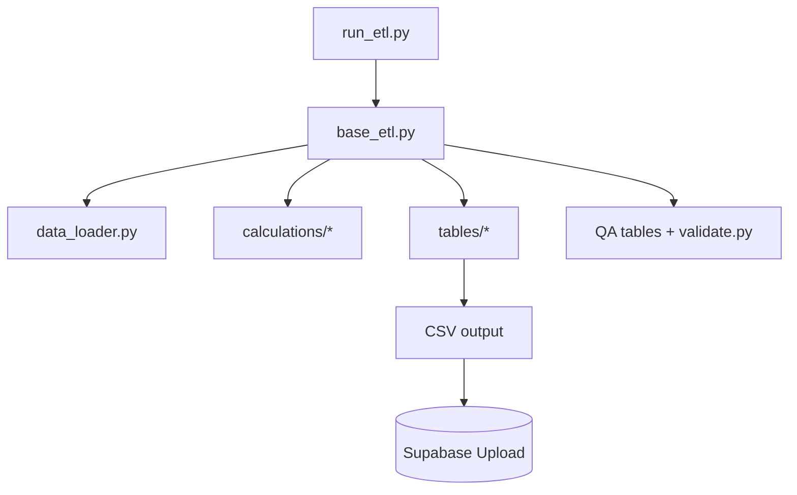

# ETL Walkthrough

**How raw tracking/BLB data becomes analytics tables**

Last Updated: 2026-01-21  
Version: 2.00

---

## Folder Map
- `run_etl.py` — CLI entry, orchestrates phases
- `src/core/base_etl.py` — main pipeline (ingest → transform → QA)
- `src/core/data_loader.py` — load BLB Excel + tracking files
- `src/calculations/` — stat formulas (goals, corsi, xG, etc.)
- `src/tables/` — build fact/dim/QA tables
- `validate.py` — validation runner
- `tests/` — pytest suite (goal counting, FKs, integrity)
- Deep dive: `walkthrough/etl/base_etl.md`
- Deep dive: `walkthrough/etl/data_loader.md`
- Deep dive: `walkthrough/etl/calculations.md`
- Deep dive: `walkthrough/etl/tables.md`
- Deep dive: `walkthrough/etl/key_utils.md`
- Deep dive: `walkthrough/etl/table_writer.md`
- Deep dive: `walkthrough/etl/safe_csv_table_store.md`
- Deep dive: `walkthrough/etl/shift_enhancer.md`

## Flow (High-Level)

## How It Works (Step by Step)
1) **run_etl.py** parses args and calls `base_etl.main()`.
2) **base_etl.py** phases:
   - Load BLB sheets + tracking files (`data_loader.py`).
   - Build core facts/dims (events, shifts, players, teams).
   - Apply calculations (corsi, xG, GAR/WAR, QoC/QoT).
   - Build QA tables and run validations.
3) **Output:** CSVs in `data/output/` and optional upload to Supabase.

## Why Functions/Modules Exist
- `data_loader.py`: single ingestion point to avoid scattered file IO.
- `calculations/*`: single source of truth for metrics (prevents logic drift).
- `tables/*`: keep table creation modular instead of monolith code.
- `validate.py` + `tests/`: catch double counting, FK issues, nulls in key fields.

## Key Invariants
- Goals counted only when `event_type == 'Goal'` AND `event_detail == 'Goal_Scored'`.
- `event_id`, `shift_id`, `player_id` uniqueness enforced.
- Aggregations built from raw facts, not from already-aggregated tables.

## Assessment
- **Good:** Mature pipeline (139 tables), clear calculations folder, strong validation/tests.
- **Risks/Bad:** `base_etl.py` is large/monolithic; pandas performance and `.iterrows()` patterns; complex to change without refactor.
- **Next:** Modularize `base_etl.py`; add more vectorization; keep validations tight; add profiling for runtime.

## What to Read (Order)
1) `run_etl.py`
2) `src/core/base_etl.py` (scan phase functions)
3) `src/core/data_loader.py`
4) `src/calculations/goals.py` (goal filter) and other calc files
5) `src/tables/` (skim major builders)
6) `validate.py`
7) `tests/test_goal_verification.py`, `tests/test_fk_relationships.py`, `tests/test_table_integrity.py`

## Extending Safely
- Add new metrics in `calculations/` and wire into `tables/`.
- Keep validations in `validate.py` and/or add tests under `tests/`.
- Avoid editing `base_etl.py` without isolating changes into helper modules.
