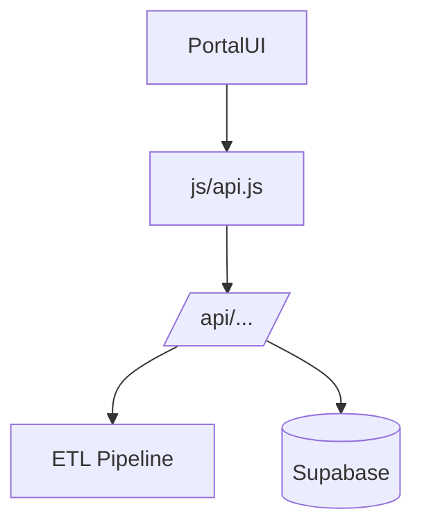

# Portal Walkthrough

**Admin UI for ETL control and data management (currently a mockup)**

Last Updated: 2026-01-21  
Version: 2.00

---

## Folder Map
- `ui/portal/` — HTML/CSS/JS mockup
  - `js/api.js` — API client wrapper
  - `js/etl.js`, `js/schema.js`, `js/sync.js` — placeholder integrations

## Flow (Intended)

## Current State
- UI present (dark/cyberpunk aesthetic)
- Partial API wiring; many buttons are placeholders
- No auth, no real Supabase reads

## What to Read (Order)
1) `docs/portal/PORTAL.md` (state and gaps)
2) `ui/portal/js/api.js` (client helper)
3) `ui/portal/js/etl.js` (ETL triggers)

## Extending Safely
- Replace placeholders with real calls to FastAPI routes (ETL, upload, staging).
- Add auth (Supabase Auth) before exposing.
- Use consistent API client patterns (`api.js`) for new endpoints.

## Assessment
- **Good:** UI scaffold exists; API client wrapper present.
- **Risks/Bad:** Mostly placeholder; no auth; no real data reads; limited error handling.
- **Next:** Wire real endpoints, add auth, add status polling/error handling, fetch real data for listings.
