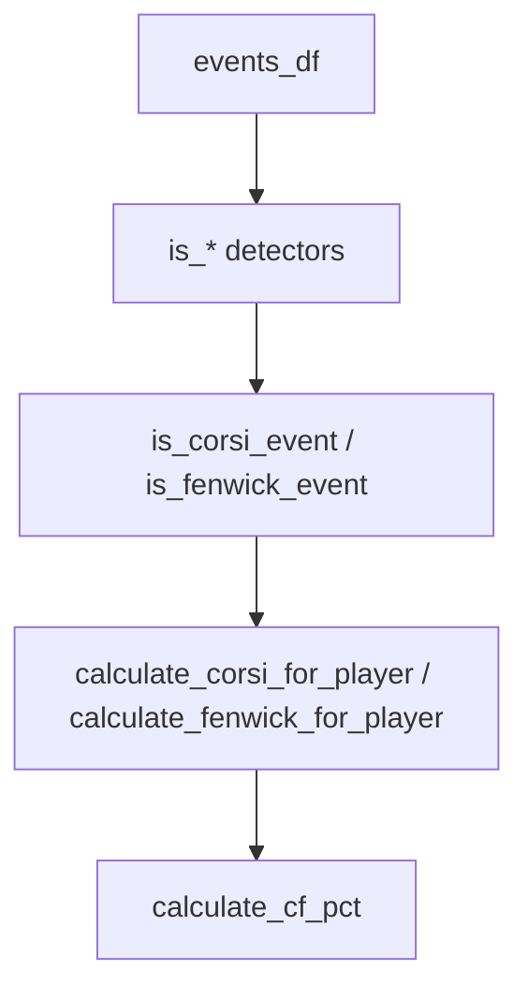

# calculations/corsi.py Deep Dive

**Corsi/Fenwick event detection and counting**

Last Updated: 2026-01-21  
Version: 2.00

---

## Purpose
Classifies events into Corsi (all shot attempts) and Fenwick (unblocked shot attempts), and provides helpers to count them per player/team.

---

## What It Does
- Event detectors:
  - `is_sog_event(event_type, event_detail)` — shot on goal (excludes Goal_Scored)
  - `is_blocked_shot(event_detail)`
  - `is_missed_shot(event_detail)`
  - `is_corsi_event(event_type, event_detail)` — SOG + blocked + missed
  - `is_fenwick_event(event_type, event_detail)` — SOG + missed (no blocked)
- Counters:
  - `calculate_corsi_for_player(...)`
  - `calculate_fenwick_for_player(...)`
- Percentage helper:
  - `calculate_cf_pct(cf, ca)`

---

## Flow

---

## Invariants
- Corsi = SOG + blocked + missed.
- Fenwick = SOG + missed (no blocked).
- `event_player_1` credited as primary actor.
- Avoid double counting goals: SOG excludes Goal_Scored (goal handled separately).

---

## Good / Risks / Next
- **Good:** Clear detection functions; separates blocked vs missed vs SOG.
- **Risks:** Uses `apply`/row-wise in counters (performance); assumes event_detail strings are consistent; bypass risk if callers reinvent logic.
- **Next:** Vectorize detection; ensure all tables use these detectors; add tests for new shot detail variants.

---

## Changing Safely
- Keep detectors the single source of truth; don’t duplicate logic elsewhere.
- Add tests when adding/changing shot detail categories.
