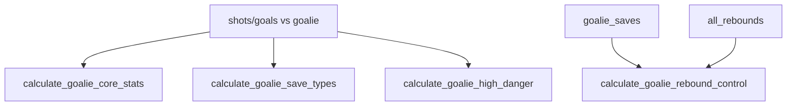

# calculations/goalie_calculations.py Deep Dive

**Goalie stats, high-danger, rebounds, and GAR weights**

Last Updated: 2026-01-21  
Version: 2.00

---

## Purpose
Extracted goalie logic from core to compute goalie-specific stats (save types, high danger, rebound control, core stats) and GAR-related components.

---

## What It Does
- Core stats: saves, goals against, shots against, save%
- Save type breakdown: butterfly/pad/glove/blocker/chest/stick/scramble
- High-danger stats: hd shots/goals/saves/save%
- Rebound control: freeze vs rebound, rebound outcomes, second-chance analysis
- Constants: league averages and GAR weights

---

## Flow

---

## Invariants
- Save% = saves / shots_against
- High danger determined by `danger_level == 'high'` (column must exist)
- Rebound linkage uses `prev_event_id` vs save `event_id` when present

---

## Good / Risks / Next
- **Good:** Consolidated goalie logic; covers advanced aspects (high danger, rebounds).
- **Risks:** Assumes columns exist (danger_level, event_detail_2, prev_event_id); GAR weights are static; some rebound logic assumes IDs are linked.
- **Next:** Add tests for high-danger and rebound scenarios; ensure danger_level is populated upstream; revisit GAR weights if league context changes.

---

## Changing Safely
- Keep column expectations documented; add fallbacks if missing.
- Add unit tests for new goalie metrics or weight changes.
