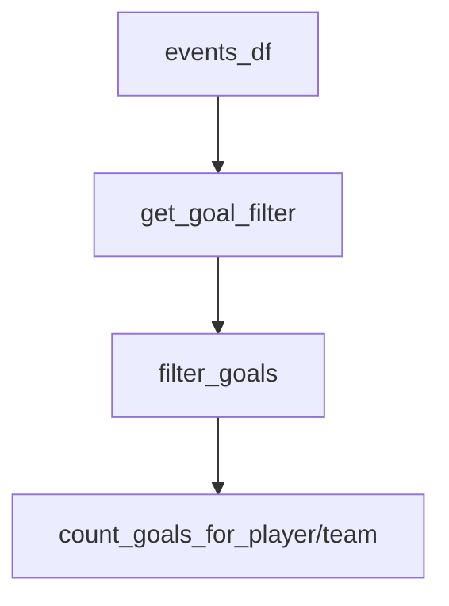

# calculations/goals.py Deep Dive

**Canonical goal logic (single source of truth)**

Last Updated: 2026-01-21  
Version: 2.00

---

## Purpose
Defines the canonical goal filter and helper functions. All goal counting must use this to avoid drift and double counting.

---

## What It Does
- `get_goal_filter(events_df)`: boolean Series for goals.
- `is_goal_scored(event_type, event_detail)`: scalar check.
- `filter_goals(events_df)`: DataFrame of goals.
- `count_goals_for_player(team)`: goal counts per player/team (uses event_player_1 as scorer).
- (Assist extraction stub present, not implemented.)

---

## Flow

---

## Invariants
- Goals only when `event_type == 'Goal'` AND `event_detail == 'Goal_Scored'`.
- `event_player_1` is the scorer.
- No goals from shot rows (Shot_Goal is a shot attempt, not the goal event).

---

## Good / Risks / Next
- **Good:** Clear, single source of truth; simple filters; prevents drift.
- **Risks:** Assist logic stub not implemented; if callers bypass this, double counting can reappear.
- **Next:** Implement assist extraction if needed; audit all goal uses to ensure they call this filter.

---

## Changing Safely
- Never alter the goal definition without updating validations/tests.
- Add unit tests if goal logic changes.
