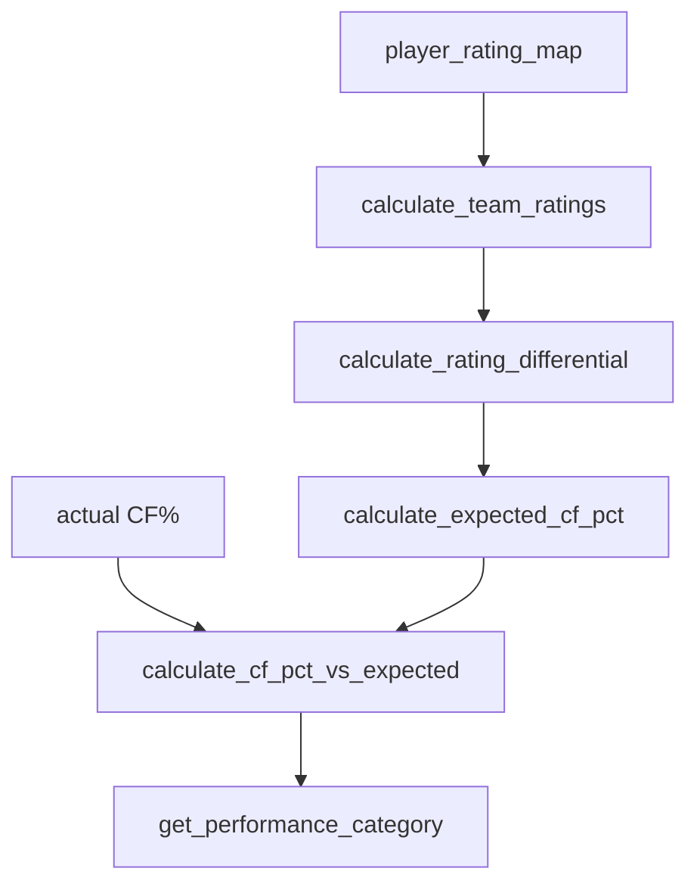

# calculations/ratings.py Deep Dive

**Player/competition ratings, QoC/QoT, and expected CF%**

Last Updated: 2026-01-21  
Version: 2.00

---

## Purpose
Handles rating-based metrics: team rating aggregates, competition tiers, rating differentials, expected CF%, and performance vs expected.

---

## What It Does
- Rating constants and thresholds (2–6 scale; tiers TI01–TI04).
- Team rating aggregation: `calculate_team_ratings(...)`.
- Rating differential: `calculate_rating_differential(...)`.
- Competition tier: `get_competition_tier(...)`.
- Expected CF%: `calculate_expected_cf_pct(...)`.
- Actual vs expected: `calculate_cf_pct_vs_expected(...)`, `get_performance_category(...)`.

---

## Flow

---

## Invariants
- Rating scale matches dim_competition_tier expectations.
- CF% expected clipped to reasonable bounds (30–70).
- QoC/QoT depend on accurate player_rating_map inputs.

---

## Good / Risks / Next
- **Good:** Centralizes rating math; clear thresholds; clipping prevents extremes.
- **Risks:** Upstream player ratings quality; assumptions about tier mapping; unused ratings can drift from actual dims if not synced.
- **Next:** Add tests for tier boundaries; ensure player ratings are populated; sync tier IDs with dim_competition_tier.

---

## Changing Safely
- Keep thresholds consistent with dim tables.
- Add tests when adjusting rating impacts or tiers.
