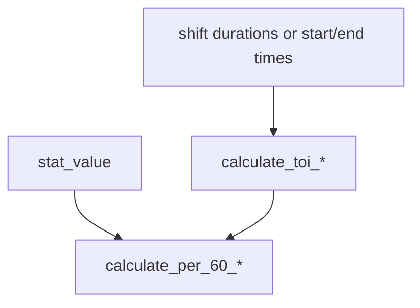

# calculations/time.py Deep Dive

**Time on ice and per-60 utilities**

Last Updated: 2026-01-21  
Version: 2.00

---

## Purpose
Utility functions for TOI/shift duration and per-60 rate calculations.

---

## What It Does
- `calculate_toi_seconds`, `calculate_toi_minutes`
- `calculate_shift_duration`
- `calculate_per_60_rate`, `calculate_per_60_from_seconds`

---

## Flow

---

## Invariants
- Shift duration = start_time - end_time (clock counts down), clipped to >= 0.
- Per-60 handles zero TOI by returning default/None.

---

## Good / Risks / Next
- **Good:** Simple, reusable utilities; handles missing/zero cases.
- **Risks:** Assumes time inputs are seconds; downstream callers must guard against NaN.
- **Next:** Add tests for edge cases (zero/NaN); ensure consistent time units across pipeline.

---

## Changing Safely
- Keep defaults explicit for zero/NaN.
- Add unit tests for any new time-based helpers.
