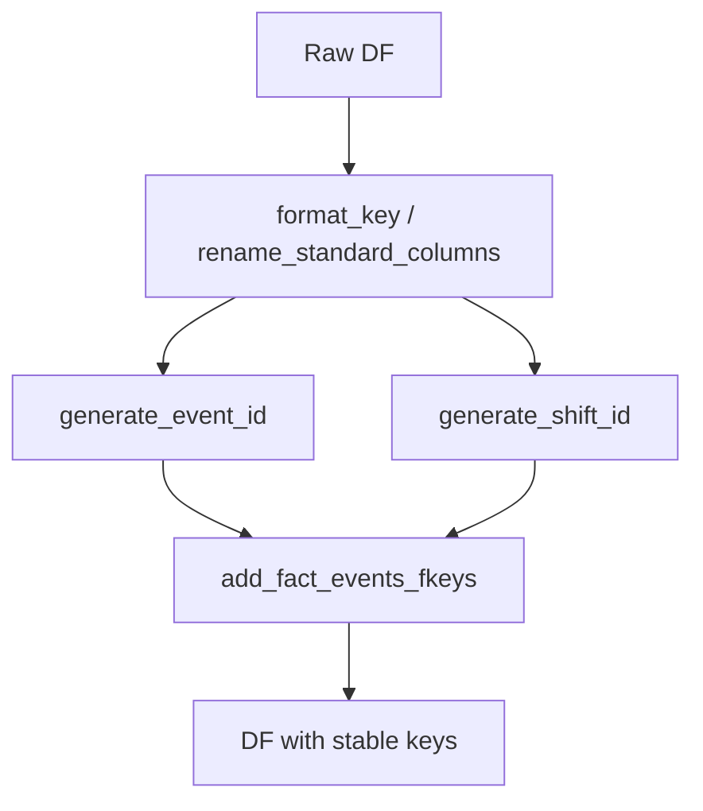

# key_utils.py Deep Dive

**Key formatting, generation, and normalization helpers**

Last Updated: 2026-01-21  
Version: 2.00

---

## Purpose
`src/core/key_utils.py` centralizes key creation/normalization (event_id, shift_id, composite keys) and code normalization. This keeps identifiers consistent across tables and phases.

---

## What It Does
- Format/generate event and shift IDs (`generate_event_id`, `generate_shift_id`).
- Normalize codes and roles (`normalize_dataframe_codes`, `normalize_player_role`).
- Add keys to DataFrames (`add_all_keys`, FK helpers).
- Create sequence/play keys (`generate_sequences_and_plays`).

---

## Flow (Conceptual)

---

## Why It Matters
- Prevents ID collisions and mismatched FKs.
- Ensures downstream tables (facts/dims/QA) share the same key semantics.

---

## Good / Risks / Next
- **Good:** Centralized key logic reduces drift; reusable across tables.
- **Risks:** If inputs aren’t normalized first, keys can mismatch; hidden assumptions about column names.
- **Next:** Keep all key creation here; add tests for new key patterns; ensure tracker/BLB schemas align with expected inputs.

---

## How to Read
1) Scan formatting/renaming helpers (inputs/outputs).
2) Review ID generators to understand required columns.
3) See FK helpers to know how relationships are enforced.

---

## Changing Safely
- Don’t duplicate key logic elsewhere; extend here.
- Add unit tests when adding/changing key formats.
- Validate uniqueness after key generation in `base_etl` or table builders.
