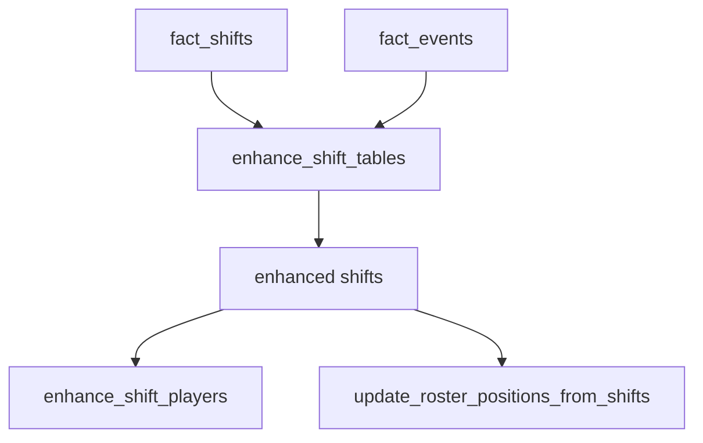

# shift_enhancer.py Deep Dive

**Enhancing shift tables and deriving shift/player stats**

Last Updated: 2026-01-21  
Version: 2.00

---

## Purpose
`src/core/shift_enhancer.py` refines shift-level data: derives start/stop types, counts skaters/strength, links events to shifts, and updates roster positions.

---

## What It Does
- `enhance_shift_tables`: enriches `fact_shifts` with derived fields (start/end zones, start/stop types, goals during shifts, strength info).
- `enhance_shift_players`: derives player-level shift stats from enriched shifts.
- `update_roster_positions_from_shifts`: backfills roster positions using shift data.

---

## Flow

---

## Why It Matters
- Shift analytics drive many downstream metrics (TOI, strength, start/stop context).
- Keeps shift-derived player positions up to date.

---

## Good / Risks / Next
- **Good:** Centralizes shift enrichment; ties events to shifts for context.
- **Risks:** Expensive joins; correctness depends on time-bounding events/shifts; schema drift if fact_shifts changes.
- **Next:** Add tests for start/stop type derivation and strength calculation; profile joins; ensure goals/penalties are correctly attributed to shifts.

---

## How to Read
1) Look at how events are linked to shifts (time windows, game/period keys).
2) Check derived columns (strength, start/stop types, goals during shift).
3) See how shift_player stats are aggregated.
4) Review roster position backfill logic.

---

## Changing Safely
- Keep time alignment logic explicit (game_id, period, timestamps).
- Add unit tests when adjusting start/stop or strength derivations.
- Verify enhanced shifts feed correctly into shift players and roster updates.
