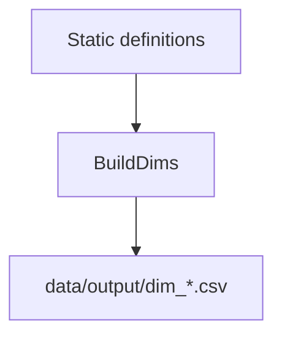

# tables/dimension_tables.py Deep Dive

**Static dimension builders for reference tables**

Last Updated: 2026-01-21  
Version: 2.00

---

## Purpose
`src/tables/dimension_tables.py` creates static reference dimensions (competition tiers, danger zones, stat definitions, strength, etc.). These do not depend on game data.

---

## What It Does
- Builds many small `dim_*` tables (comparison types, competition tiers, rating codes, danger zones, stat catalog, strength, turnover types, etc.).
- Writes them to `data/output/`.

---

## Flow (Conceptual)

---

## Key Points
- Purely static content; no game/tracking dependency.
- Used for lookup/join consistency across facts and calculations.

---

## Good / Risks / Next
- **Good:** Central, static definitions; keeps lookup values consistent.
- **Risks:** If definitions change, downstream joins may break; documentation drift vs. dim tables.
- **Next:** Version changes to dim tables; document any new dims; ensure dashboard/SQL views align with IDs/codes.

---

## Changing Safely
- Treat as source of truth for reference values.
- Coordinate changes with consumers (tables, SQL views, dashboard).
