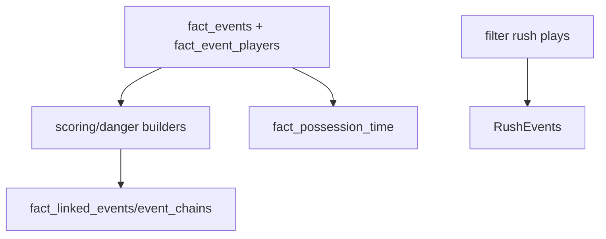

# tables/event_analytics.py Deep Dive

**Event-level analytics: scoring chances, danger, linked chains**

Last Updated: 2026-01-21  
Version: 2.00

---

## Purpose
`src/tables/event_analytics.py` builds advanced event-level analytics tables (scoring chances, shot danger, linked events, event chains, rush events, possession estimates).

---

## What It Does
- Saves outputs after dropping all-null columns.
- Loads prerequisite tables from table_store/CSV.
- Provides utilities for XY tracking checks and stop-point extraction.
- Builds:
  - `fact_scoring_chances`
  - `fact_shot_danger`
  - `fact_linked_events`
  - `fact_event_chains`
  - `fact_rush_events`
  - `fact_possession_time`

---

## Flow (Conceptual)

---

## Dependencies
- fact_events, fact_event_players (with XY data if available)
- fact_player_xy_long/wide, fact_puck_xy_long/wide (optional for XY checks)
- Uses `drop_all_null_columns` from `base_etl`

---

## Good / Risks / Next
- **Good:** Central place for event-level advanced analytics; handles XY presence checks; cleans all-null columns.
- **Risks:** Relies on presence/quality of XY data; can be heavy to compute; chaining logic can get complex; optional tables may be empty.
- **Next:** Add tests for danger/rush/chains; ensure XY data is validated; profile performance on large event sets.

---

## Changing Safely
- Keep XY detection logic consistent; document required columns.
- Add tests for new event analytics outputs.
- Validate new chains/danger definitions against known examples.
