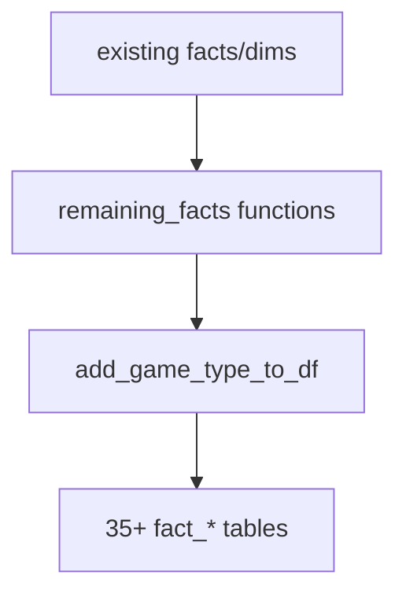

# tables/remaining_facts.py Deep Dive

**Additional fact tables to complete schema coverage**

Last Updated: 2026-01-21  
Version: 2.00

---

## Purpose
`src/tables/remaining_facts.py` builds additional fact tables (35+) to reach the full schema, using `game_type_aggregator` for consistent game type splits and adding names/cleanup.

---

## What It Does
- Loads prerequisite tables via table_store/CSV.
- Adds names to tables where player/team IDs exist.
- Removes all-null columns.
- Builds period-level and other derived fact tables (player/goalie/team splits, situational stats, etc.).
- Saves outputs and caches them in memory.

---

## Flow (Conceptual)

---

## Dependencies
- Existing fact/dim tables from earlier phases.
- `game_type_aggregator` for game-type splits.
- Optional table_store for caching.

---

## Good / Risks / Next
- **Good:** Fills schema gaps; consistent name enrichment and null cleanup.
- **Risks:** Large set of tables; dependencies must exist; potential performance hit; easy to diverge from canonical metric helpers.
- **Next:** Add tests for key derived tables; ensure alignment with dashboard/SQL views; document new tables/columns when added.

---

## Changing Safely
- Verify required inputs exist; fail fast on missing dependencies.
- Keep cleanup steps (names, drop nulls) consistent.
- Coordinate changes with downstream consumers (views/dashboard).
